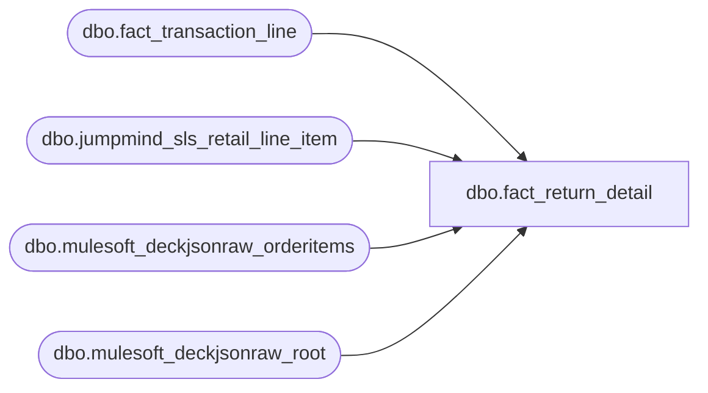

# dbo.fact_return_detail

**Database:** LH_Source  
**Server:** 4db76rlxaxcuvmuh5kw37wbnqq-ovsykae43znuhlmnflcdwm4ohu.datawarehouse.fabric.microsoft.com  

## Architecture Diagram



## Table Dependencies

| Referenced Table |
|---|
| dbo.fact_transaction_line |
| dbo.jumpmind_sls_retail_line_item |
| dbo.mulesoft_deckjsonraw_orderitems |
| dbo.mulesoft_deckjsonraw_root |

## View Code

```sql
CREATE   VIEW dbo.fact_return_detail AS WITH return_lines AS (     SELECT         l.transaction_id,         l.line_id,         l.line_object,         l.line_action,         l.upc,         l.gsr_flag,         l.return_flag,         l.source_system       FROM dbo.fact_transaction_line AS l      WHERE l.return_flag = 1         OR l.gsr_flag = 1 ), pos_returns AS (     /* Per Ryan May 6 schema dump, retail_line_item has:          - composite key (device_id, business_date, sequence_number)          - return-from fields under orig_* prefix:              orig_business_date, orig_sequence_number, orig_business_unit_id,              orig_device_id, orig_order_id, orig_username          - reason_code (not return_reason_code)          - disposition_code (not merchandise_disposition_code)          - item_returned (not is_returned)          - item_description (replaces pos_description)          - pos_item_id (replaces lookup_pos_code)         Aptos R-record fields 6, 11, 12, 13 (via_warehouse_flag,        original_salesperson, original_salesperson_2, without_receipt_flag)        are INTENTIONALLY NULL: column-usage audit (May 6) confirmed none are        consumed by any of the 19 SmartLook reports. Preserved as lineage        shape only; no downstream impact. Do NOT chase.         ⚠ ONLY OPEN FOLLOW-UP: return_reason_message (R-record field 3) is        the single column from the entire return-detail family that IS used        by a report (rpt_retail_returns Field_i + legacy Retail Returns        Report.sql). Not on retail_line_item — likely lives in a separate        JumpMind reason-code lookup table or in additional_attributes. */     SELECT         CAST(rli.device_id        AS varchar(64)) + '|' +         CAST(rli.business_date    AS varchar(8))  + '|' +         CAST(rli.sequence_number  AS varchar(20))                    AS transaction_id,         rli.line_sequence_number                                     AS line_id,         CAST(NULL AS varchar(255))                                   AS return_reason_message,    /* ⚠ ONLY OPEN FOLLOW-UP — Ryan to locate */         rli.reason_code                                              AS return_reason_code,         rli.disposition_code                                         AS merchandise_disposition_code,         CAST(NULL AS bit)                                            AS via_warehouse_flag,        /* lineage only */         rli.orig_business_unit_id                                    AS return_from_store_no,         rli.orig_device_id                                           AS return_from_register_no,         rli.orig_business_date                                       AS return_from_date,         rli.orig_sequence_number                                     AS return_from_transaction_no,         CAST(NULL AS varchar(20))                                    AS original_salesperson,      /* lineage only */         CAST(NULL AS varchar(20))                                    AS original_salesperson_2,    /* lineage only */         CAST(NULL AS bit)                                            AS without_receipt_flag,      /* lineage only */         rli.pos_item_id                                              AS lookup_pos_code,         rli.item_description                                         AS pos_description       FROM LH_Source.dbo.jumpmind_sls_retail_line_item AS rli      WHERE rli.item_returned = 1 ), oms_returns AS (     /* Schema realignment per Deck inventory (May 6):        orderitems columns renamed; many AuditWorks-equivalent fields don't        exist on the OMS side (ViaWarehouseFlag, ReturnFromStoreId, ReturnFrom*,        OriginalSalespersonId, WithoutReceiptFlag, MerchandiseDispositionCode).        NULL stubs with ⚠ TODO Brandon — most are also documented as unused        by any of the 19 SmartLook reports per column-usage audit.        Return-detection mirror-and-flag: ItemStatusCode return-coded prefix        OR CancelReasonCode IS NOT NULL OR ReturnAuthNumber assigned. */     SELECT         djr.OrderNumber                                              AS transaction_id,         oi.ID                                                        AS line_id,         oi.ReturnReasonText                                          AS return_reason_message,         CAST(oi.ReturnReasonID AS varchar(20))                       AS return_reason_code,         CAST(NULL AS int)                                            AS merchandise_disposition_code,  /* ⚠ TODO Brandon */         CAST(NULL AS bit)                                            AS via_warehouse_flag,         CAST(NULL AS varchar(10))                                    AS return_from_store_no,         /* ⚠ TODO Brandon */         CAST(NULL AS varchar(10))                                    AS return_from_register_no,         CAST(NULL AS date)                                           AS return_from_date,             /* ⚠ TODO Brandon */         CAST(NULL AS varchar(50))                                    AS return_from_transaction_no,         CAST(NULL AS int)                                            AS original_salesperson,         CAST(NULL AS int)                                            AS original_salesperson_2,         CAST(NULL AS bit)                                            AS without_receipt_flag,         CAST(NULL AS varchar(20))                                    AS lookup_pos_code,         CAST(NULL AS varchar(255))                                   AS pos_description       FROM LH_Source.dbo.mulesoft_deckjsonraw_orderitems AS oi       LEFT JOIN LH_Source.dbo.mulesoft_deckjsonraw_root AS djr         ON djr.OrderID = oi.OrderID      WHERE oi.ItemStatusCode LIKE 'R%'         OR oi.ItemStatusCode LIKE '%RETURN%'         OR oi.CancelReasonCode IS NOT NULL         OR oi.ReturnAuthNumber IS NOT NULL    /* ⚠ Brandon: confirm exact return-coded values */ ) SELECT     r.transaction_id,     r.line_id,     /* Aptos XPOLLD0013 Return Detail (15 fields) */     CAST('R' AS char(1))                                AS record_type,                    /*  1 */     r.line_id                                           AS line_id_aptos,                  /*  2 */     rd.return_reason_message                            AS return_reason_message,          /*  3 */     rd.return_reason_code                               AS return_reason_code,             /*  4 */     COALESCE(rd.merchandise_disposition_code, 1)        AS merchandise_disposition_code,   /*  5 */     COALESCE(rd.via_warehouse_flag, 0)                  AS via_warehouse_flag,             /*  6 */     rd.return_from_store_no                             AS return_from_store_no,           /*  7 */     rd.return_from_register_no                          AS return_from_register_no,        /*  8 */     rd.return_from_date                                 AS return_from_date,               /*  9 */     rd.return_from_transaction_no                       AS return_from_transaction_no,     /* 10 */     rd.original_salesperson                             AS original_salesperson,           /* 11 */     rd.original_salesperson_2                           AS original_salesperson_2,         /* 12 */     COALESCE(rd.without_receipt_flag, 0)                AS without_receipt_flag,           /* 13 */     rd.lookup_pos_code                                  AS lookup_pos_code,                /* 14 */     rd.pos_description                                  AS pos_description,                /* 15 */     /* Lineage */     r.line_object,     r.line_action,     r.upc,     r.gsr_flag,                                                                            /* 1 if Guest Satisfaction Refund */     r.source_system   FROM return_lines AS r   LEFT JOIN (SELECT * FROM pos_returns UNION ALL SELECT * FROM oms_returns) AS rd     ON  rd.transaction_id = r.transaction_id     AND rd.line_id        = r.line_id;
```

