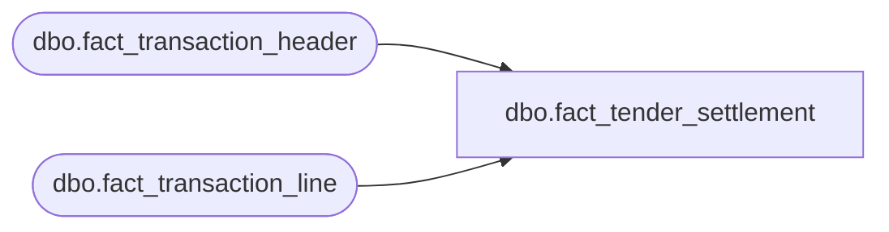

# dbo.fact_tender_settlement

**Database:** LH_Source  
**Server:** 4db76rlxaxcuvmuh5kw37wbnqq-ovsykae43znuhlmnflcdwm4ohu.datawarehouse.fabric.microsoft.com  

## Architecture Diagram



## Table Dependencies

| Referenced Table |
|---|
| dbo.fact_transaction_header |
| dbo.fact_transaction_line |

## View Code

```sql
CREATE   VIEW dbo.fact_tender_settlement AS WITH settlement_headers AS (     /* Filter to settlement / banking transactions */     SELECT         h.transaction_id,         h.store_no,         h.register_no,         h.transaction_date,         h.transaction_no,         h.transaction_series,         h.transaction_category,         h.till_no,         h.cashier_no       FROM dbo.fact_transaction_header AS h      WHERE h.source_system = 'JUMPMIND'        AND h.transaction_category IN (207, 250)              /* Banking, Media Reconciliation */ ), settlement_lines AS (     SELECT         sh.store_no,         sh.register_no,         sh.transaction_date,         sh.transaction_no,         sh.till_no,         l.line_id,         l.line_object,         l.line_action,         l.gross_line_amount                                         AS settled_amount,         l.reference_no                                              AS settlement_reference,         l.encrypted_reference_no,         l.units,         l.source_system       FROM dbo.fact_transaction_line AS l       JOIN settlement_headers       AS sh ON sh.transaction_id = l.transaction_id      WHERE l.line_action IN ('241','242','243','249')               /* Settlement-related actions */         OR l.line_object BETWEEN 600 AND 699                        /* Tender-type lines */         OR l.line_object IN (1000, 1001, 1002, 1003, 1004)          /* Drawer / store funds */ ) SELECT     s.store_no,     s.register_no,     s.transaction_date,     s.transaction_no,     s.till_no,     s.line_id,     s.line_object,     s.line_action,     s.settled_amount,     s.settlement_reference,     s.encrypted_reference_no,     s.units,     /* Tender-type classification */     CASE         WHEN s.line_object = 600                                                 THEN 'CASH'         WHEN s.line_object = 601                                                 THEN 'CHECK'         WHEN s.line_object = 603                                                 THEN 'ACH'         WHEN s.line_object IN (604,605,606,608,611,642,670,671,672,673)         THEN 'CREDIT_CARD'         WHEN s.line_object = 609                                                 THEN 'STORE_CREDIT_OR_HOUSE_ORDER'         WHEN s.line_object = 614                                                 THEN 'MAESTRO'         WHEN s.line_object IN (615,616,617,618)                                  THEN 'BNPL_OR_WALLET'         WHEN s.line_object = 619                                                 THEN 'MALL_CERTIFICATE'         WHEN s.line_object = 623                                                 THEN 'PROMO_GIFT_CERT'         WHEN s.line_object = 624                                                 THEN 'E_CERTIFICATE'         WHEN s.line_object = 626                                                 THEN 'LOCAL_TENDER'         WHEN s.line_object = 628                                                 THEN 'TRAVELERS_CHECK'         WHEN s.line_object = 640                                                 THEN 'SFS_REWARD_CERT'         WHEN s.line_object = 642                                                 THEN 'JCB'         WHEN s.line_object = 643                                                 THEN 'EURO_FOREIGN'         WHEN s.line_object = 697                                                 THEN 'AMEX_NO_REF'         WHEN s.line_object = 698                                                 THEN 'CANADIAN_CC'         WHEN s.line_object IN (1000,1001,1002,1003,1004)                          THEN 'DRAWER_OR_STORE_FUNDS'         ELSE                                                                          'OTHER'     END                                                              AS tender_type,     /* Settlement status */     CASE s.line_action         WHEN '241' THEN 'TRANSMITTED'         WHEN '242' THEN 'CONFIRMED'         WHEN '243' THEN 'QUANTITY_DEPOSITED'         WHEN '249' THEN 'DEPOSITED'         ELSE            'OTHER'     END                                                              AS settlement_status,     s.source_system   FROM settlement_lines AS s;
```

