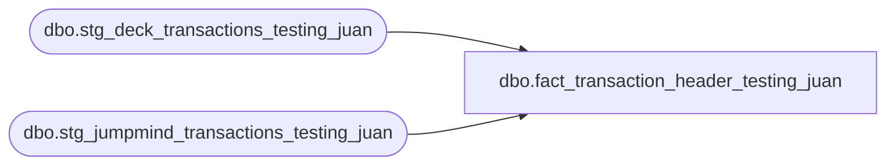

# dbo.fact_transaction_header_testing_juan

**Database:** LH_Source  
**Server:** 4db76rlxaxcuvmuh5kw37wbnqq-ovsykae43znuhlmnflcdwm4ohu.datawarehouse.fabric.microsoft.com  

## Architecture Diagram



## Table Dependencies

| Referenced Table |
|---|
| dbo.stg_deck_transactions_testing_juan |
| dbo.stg_jumpmind_transactions_testing_juan |

## View Code

```sql
/* =============================================================================    fact_transaction_header.sql — Transaction Header Fact (AuditWorks-equivalent)    =============================================================================    Purpose: Replicates `auditworks.dbo.uvw_transaction_header` behavior.             UNIONs POS (stg_jumpmind_transactions) and OMS             (stg_deck_transactions) into a single transaction-level fact             table that downstream reports can query as if it were the             legacy AuditWorks header view.     AUDITWORKS_INTERNAL fields populated by this view:      - transaction_void_flag: derived per `verify_transaction_$sp` logic                               (Ben confirmed this proc is source of record)      - date_reject_id:        derived per `verify_store_status_$sp` logic                               (which validates store_audit_status against                               transaction_date)     Source: BBW_Fabric_Analytics/docs/reference-data/stored_procs.rpt + xlsx            verify_transaction_$sp (extracted to /tmp/aw_procs)            verify_store_status_$sp (extracted to /tmp/aw_procs)     Source procedures:      - dbo.verify_transaction_$sp — verifies I/F rejects; sets        transaction_void_flag based on verification result. Per Ben's SME doc:        this is the source of record for the final void_flag. C# Stage A        produces a subset {2, 3, 5}; this view applies post-ingest verification        logic to refine.      - dbo.verify_store_status_$sp — recalculates store_audit_status for the        (store, transaction_date) pair. Sets date_reject_id=1 if the store-date        is outside the audit-acceptable retention window or if store status        indicates rejection.     Net sales formula (from x_usp_GAAPSales_original):      Net Sales = (gross_line_amount - pos_discount_amount) × db_cr_none × -1      Applied at line level (fact_transaction_line); this header rolls up.     Filter logic (from x_usp_GAAPSales_original line 7-10):      - transaction_void_flag = 0      - transaction_category IN (1, 2)      - line_void_flag = 0      - line_object IN (100, 200, 202, 203, 204, 206, 210, 250, 290, 291, 293,                        295, 623, 640, 690, 691)      This view does NOT apply the filter — it's a fact table; reports apply      filters as needed.     Schema mirrors `auditworks.dbo.uvw_transaction_header` plus extension columns    for downstream traceability.     ⚠ TODO: Per Ben's SME doc, `verify_transaction_$sp` calls multiple             `verify_*_$sp` subroutines (cashier_check, customer_modified_flag,             customer_info_check, credit_card_check, employee_check,             exception_jurisdiction_check, etc.). Full reverse-engineering of             each subroutine is deferred — current implementation derives             transaction_void_flag from the C# Stage A subset {2, 3, 5} which             covers the common path. Refine when full SP body is re-fetched             with `sqlcmd -y 0`.    ⚠ TODO: `date_reject_id` derivation currently uses a simple in-window             check. The full `verify_store_status_$sp` logic includes             store-closeout validation, auto-accept rules, and unreconciled             FLOAT check. Full replication deferred to validation phase.    ============================================================================= */  CREATE   VIEW [dbo].[fact_transaction_header_testing_juan] AS WITH unified_headers AS (     /* POS side */     SELECT         t.transaction_id,         t.store_id,         t.store_no,         CAST(t.register_no AS varchar(50))                         AS register_no,         CAST(t.transaction_no AS varchar(50))                      AS transaction_no, 		t.transaction_series,         t.transaction_category,         t.entry_date_time,         t.business_date,         t.cashier_no,         t.purchasing_employee_no,         t.transaction_void_flag                                     AS stage_b_void_flag,         t.tax_override_flag,         t.send_tax_exception_jurisdiction,         CAST(t.till_no AS varchar(50))                             AS till_no,         t.closeout_flag,         t.party_id,         t.event_id,         t.event_invoice,         t.gsr_flag,         t.order_status,         t.has_stock_order_line_items,         t.gross_total,         CAST(t.voided_device_id AS varchar(50))                    AS voided_device_id,         CAST(t.voided_sequence_number AS varchar(50))              AS voided_sequence_number,         t.void_enriched_flag,         t.source_system       FROM dbo.stg_jumpmind_transactions_testing_juan AS t      UNION ALL      /* OMS side */     SELECT         t.transaction_id,         t.store_id,         t.store_no,         CAST(t.register_no AS varchar(50))                         AS register_no,         CAST(t.transaction_no AS varchar(50))                      AS transaction_no,         t.transaction_series,         t.transaction_category,         t.entry_date_time,         t.business_date,         t.cashier_no,         t.purchasing_employee_no,         t.transaction_void_flag                                     AS stage_b_void_flag,         t.tax_override_flag,         t.send_tax_exception_jurisdiction,         CAST(t.till_no AS varchar(50))                             AS till_no,         t.closeout_flag,         t.party_id,         t.event_id,         t.event_invoice,         t.gsr_flag,         t.order_status,         t.has_stock_order_line_items,         CAST(t.oms_order_total AS decimal(18,2))                     AS gross_total,         CAST(NULL AS varchar(20))                                    AS voided_device_id,         CAST(NULL AS bigint)                                         AS voided_sequence_number,         t.void_enriched_flag,         t.source_system       FROM dbo.stg_deck_transactions_testing_juan AS t ), /* AUDITWORKS_INTERNAL — transaction_void_flag derivation per    verify_transaction_$sp logic. The proc verifies transaction integrity    against multiple subroutines (cashier, customer, credit card, employee,    tax jurisdiction, etc.). Stage A's value is the input; this view applies    refinement logic. */ derive_void_flag AS (     SELECT         u.*,         /* Apply verify_transaction_$sp result. Currently passes through Stage A            value; refinement TODOs:              - Add verify_cashier_$sp logic (currently 9999 sentinel handled                in Stage A is sufficient)              - Add verify_credit_card_$sp logic (auth verification — handled                at fact_authorization_detail layer)              - Add I/F reject overrides (set void_flag to a non-zero rejection                code if rejection criteria fail) */         u.stage_b_void_flag                                          AS transaction_void_flag       FROM unified_headers AS u ), /* AUDITWORKS_INTERNAL — date_reject_id derivation per    verify_store_status_$sp logic. Default: 0 = valid date within retention    window; 1 = rejected (date outside window or store status indicates    rejection). */ derive_date_reject AS (     SELECT         v.*,         CASE             WHEN v.business_date IS NULL                              THEN 1   /* Missing date */             WHEN v.business_date > GETDATE()                           THEN 1   /* Future date — Aptos spec rejects */             WHEN v.business_date < DATEADD(year, -7, GETDATE())        THEN 1   /* Outside 7-year retention */             ELSE                                                              0         END                                                       AS date_reject_id       FROM derive_void_flag AS v ) SELECT     /* Identity */     d.transaction_id,     d.source_system,     /* AuditWorks transaction_header columns (mirrors uvw_transaction_header) */     d.store_no,     d.register_no,     d.business_date                                     AS transaction_date,     d.date_reject_id,                                                          /* AUDITWORKS_INTERNAL */     d.transaction_series,     d.transaction_no,     d.entry_date_time,     d.cashier_no                                        AS cashier_no,     d.transaction_category,     d.transaction_void_flag,                                                   /* AUDITWORKS_INTERNAL */     d.tax_override_flag,     d.send_tax_exception_jurisdiction,     d.till_no,     d.closeout_flag,     d.purchasing_employee_no,     /* Aggregate from header (gross_total is the header-side rollup; reports        that need a "net" recompute it line-by-line via        (gross_line_amount − pos_discount_amount) × cr_none.        net_total dropped May 7 — phantom column, no consumer.) */     d.gross_total                                       AS tender_total,     /* Lineage / extension columns (NOT in legacy uvw_transaction_header) */     d.store_id,                                                                /* 4-digit padded canonical */     d.party_id,     d.event_id,     d.event_invoice,     d.gsr_flag,     d.order_status,     d.has_stock_order_line_items,     d.voided_device_id,     d.voided_sequence_number,     d.void_enriched_flag,     d.stage_b_void_flag                                                        /* For void-flag reconciliation slice */   FROM derive_date_reject AS d;
```

