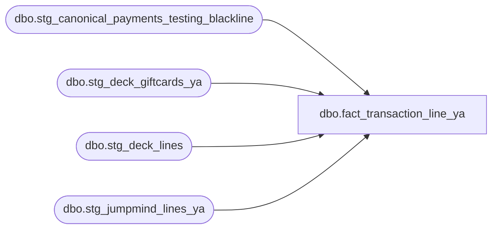

# dbo.fact_transaction_line_ya

**Database:** LH_Source  
**Server:** 4db76rlxaxcuvmuh5kw37wbnqq-ovsykae43znuhlmnflcdwm4ohu.datawarehouse.fabric.microsoft.com  

## Architecture Diagram



## Table Dependencies

| Referenced Table |
|---|
| dbo.stg_canonical_payments_testing_blackline |
| dbo.stg_deck_giftcards_ya |
| dbo.stg_deck_lines |
| dbo.stg_jumpmind_lines_ya |

## View Code

```sql
CREATE   VIEW dbo.fact_transaction_line_ya AS WITH unified_lines AS (     /* POS side — from stg_jumpmind_lines_ya (overlay) */     SELECT         l.transaction_id,         l.line_id,         l.line_sequence,         l.line_object,         l.line_action,         l.reference_no,         l.encrypted_reference_no,         l.line_amount                                                AS gross_line_amount,         l.line_amount_deduction                                      AS pos_discount_amount,         l.line_amount_multiplication_factor                          AS units,         l.voiding_reversal_flag,         l.line_void_flag                                             AS stage_b_line_void_flag,         l.upc,         l.item_type,         l.return_flag,         l.gsr_flag,         l.is_employee_discount,         l.discount_type,         l.discount_scope,         l.promo_code,         l.resolved_promo_code,         l.campaign_id,         l.discount_text,         l.discount_line_object,         l.find_a_bear_id,         l.is_stock_order_line_item,         l.house_order_flag,         l.virtual_world_code,         l.source_system       FROM dbo.stg_jumpmind_lines_ya AS l      UNION ALL      /* OMS side — from stg_deck_lines (unchanged) */     SELECT         l.transaction_id,         l.line_id,         l.line_sequence,         l.line_object,         l.line_action,         l.reference_no,         l.encrypted_reference_no,         l.line_amount                                                AS gross_line_amount,         l.line_amount_deduction                                      AS pos_discount_amount,         l.line_amount_multiplication_factor                          AS units,         l.voiding_reversal_flag,         l.line_void_flag                                             AS stage_b_line_void_flag,         l.upc,         l.item_type,         l.return_flag,         l.gsr_flag,         l.is_employee_discount,         l.discount_type,         l.discount_scope,         l.promo_code,         l.resolved_promo_code,         l.campaign_id,         l.discount_text,         l.discount_line_object,         CAST(NULL AS varchar(50))                                    AS find_a_bear_id,         l.is_stock_order_line_item,         CAST(NULL AS bit)                                            AS house_order_flag,         CAST(NULL AS varchar(50))                                    AS virtual_world_code,         l.source_system       FROM dbo.stg_deck_lines AS l      UNION ALL      /* OMS Gift Card sales — from stg_deck_giftcards_ya (iter 8).        OMS GC sales never carried ItemTypeLocalizeName='GIFTCARD' on        orderitems, so they're absent from stg_deck_lines; surfaced here        directly from mulesoft_deckjsonraw_giftcards. line_object=403        (AW BearBucks Sale — OMS). */     SELECT         g.transaction_id,         g.line_id,         g.line_sequence,         g.line_object,         g.line_action,         g.reference_no,         g.encrypted_reference_no,         g.gross_line_amount,         g.pos_discount_amount,         g.units,         g.voiding_reversal_flag,         g.stage_b_line_void_flag,         g.upc,         g.item_type,         g.return_flag,         g.gsr_flag,         g.is_employee_discount,         g.discount_type,         g.discount_scope,         g.promo_code,         g.resolved_promo_code,         g.campaign_id,         g.discount_text,         g.discount_line_object,         g.find_a_bear_id,         g.is_stock_order_line_item,         g.house_order_flag,         g.virtual_world_code,         g.source_system       FROM dbo.stg_deck_giftcards_ya AS g      UNION ALL      /* Tender / payment side — unchanged */     SELECT         p.transaction_id,         p.line_id,         p.line_sequence,         p.line_object,         p.line_action,         p.reference_no,         p.encrypted_reference_no,         p.tender_amount                                              AS gross_line_amount,         CAST(0 AS decimal(18,2))                                     AS pos_discount_amount,         CAST(NULL AS int)                                            AS units,         CAST(1 AS bit)                                               AS voiding_reversal_flag,         CAST(0 AS bit)                                               AS stage_b_line_void_flag,         CAST(NULL AS varchar(50))                                    AS upc,         CAST(NULL AS varchar(50))                                    AS item_type,         CAST(NULL AS bit)                                            AS return_flag,         p.gsr_flag,         CAST(0 AS bit)                                               AS is_employee_discount,         CAST(NULL AS varchar(50))                                    AS discount_type,         CAST(NULL AS varchar(50))                                    AS discount_scope,         CAST(NULL AS varchar(50))                                    AS promo_code,         CAST(NULL AS varchar(50))                                    AS resolved_promo_code,         CAST(NULL AS varchar(50))                                    AS campaign_id,         CAST(NULL AS varchar(200))                                   AS discount_text,         CAST(NULL AS int)                                            AS discount_line_object,         CAST(NULL AS varchar(50))                                    AS find_a_bear_id,         CAST(0 AS bit)                                               AS is_stock_order_line_item,         CAST(NULL AS bit)                                            AS house_order_flag,         CAST(NULL AS varchar(50))                                    AS virtual_world_code,         p.source_system       FROM dbo.stg_canonical_payments_testing_blackline AS p ), derive_db_cr_none AS (     SELECT         u.*,         CAST(1 AS smallint)                                        AS db_cr_none       FROM unified_lines AS u ) SELECT     n.transaction_id,     n.line_id,     n.line_sequence,     n.source_system,     n.line_object,     n.line_action,     n.reference_no,     n.encrypted_reference_no,     n.gross_line_amount,     n.pos_discount_amount,     n.db_cr_none,     n.voiding_reversal_flag,     n.stage_b_line_void_flag                            AS line_void_flag,     n.units,     n.upc,     n.item_type,     n.return_flag,     n.gsr_flag,     n.is_employee_discount,     n.discount_type,     n.discount_scope,     n.promo_code,     n.resolved_promo_code,     n.campaign_id,     n.discount_text,     n.discount_line_object,     n.find_a_bear_id,     n.is_stock_order_line_item,     n.house_order_flag,     n.virtual_world_code   FROM derive_db_cr_none AS n;
```

