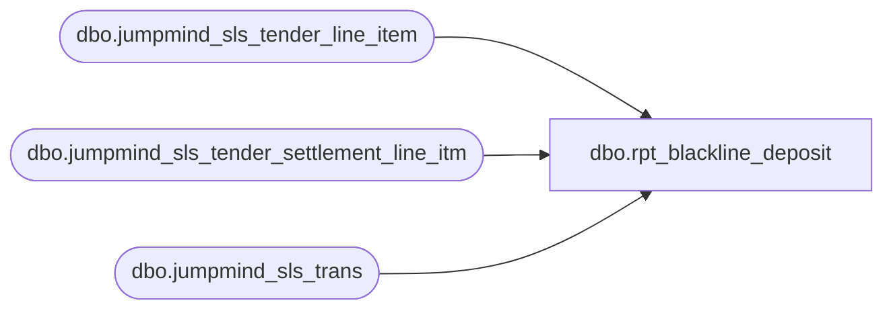

# dbo.rpt_blackline_deposit

**Database:** LH_Source  
**Server:** 4db76rlxaxcuvmuh5kw37wbnqq-ovsykae43znuhlmnflcdwm4ohu.datawarehouse.fabric.microsoft.com  

## Architecture Diagram



## Table Dependencies

| Referenced Table |
|---|
| dbo.jumpmind_sls_tender_line_item |
| dbo.jumpmind_sls_tender_settlement_line_itm |
| dbo.jumpmind_sls_trans |

## View Code

```sql
/* =============================================================================    rpt_blackline_deposit.sql  Blackline Cash Deposit Report    =============================================================================    Domain:    Reconciliation (Cash / Daily Deposit)    Audience:  Sales Audit, Finance (cash GL)    Consumer:  Blackline daily-cash workbook + Power BI "Blackline Deposit Report"     SOURCE OF TRUTH      BBW's authoritative report query (Brad Widger, 2026-03-26), which is built      entirely on LH_Source.      2026-03-25 Brad Widger: group by create_time rather than business_date.      2026-03-26 Brad Widger: GL Amount Expected uses Deposit to Bank; Total                              Register (Over)/Short = Cash + Checks.     UNIVERSE (2026-06-29 fix)      AuditWorks Blackline seeds its universe from ANY tender activity (Cash, Check,      cards, etc.), then overlays Cash/Check amounts per store-day. Store-days with      card-only activity appear with Cash=0 and Check=0. Our prior version only      emitted rows when Cash or Check tenders existed, missing ~1,685 card-only      store-days that Linda shows as zeroes.       Fix: drive from all_operating_days (COMPLETED SALE/RETURN/REDEEM/PAY_IN/PAY_OUT      store-days in jumpmind_sls_trans) and LEFT JOIN Cash/Check totals onto it.     CASH TENDER SCOPE (2026-07-16)      Cash/Check sums follow Brad's JumpMind IN-list: SALE, RETURN, REDEEM,      PAY_IN, PAY_OUT (fabric-sql-dev/sql-blackline.sql). REDEEM is cash      change/cash-out on redeem sessions. PAY_IN/PAY_OUT are petty-cash legs.      Excluding REDEEM alone left ~343 Cash diffs; adding PAY_IN/PAY_OUT fixes      327 of those (simulation Cash exact 21,815 -> 22,142 on matched keys;      0 worsened). Example store 1421 2026-02-11: SALE cash 427.02 plus      PAY_OUT -10.00 plus PAY_IN 1.70 = Linda 418.72.     VALUE RESIDUALS (still open after PAY_IN/PAY_OUT)      Deposit_to_Bank: 34 Feb-Mar store-days where CLOSE_STORE_BANK pickup is      dated by create_time after midnight while Linda/AuditWorks keep the      business_date (example store 1312 2026-03-14/15). Dating all deposits by      business_date worsens the score (34 -> 778 diffs). No safe blanket flip.      Cash: ~16 store-days remain after Brad IN-list (adjacent-day swaps and      Linda negatives with no matching JumpMind cash).     GRAIN      One row per (store, CONVERT(date, create_time)).     OUTPUT CONTRACT      store_no is emitted as int and column names keep the deployed underscore      form so the Power BI semantic model binding is unchanged. business_unit_id      is already a 4-digit store number in LH_Source, so the cast is lossless;      rows with a non-numeric / null business_unit_id are dropped.     UPSTREAM SOURCES      - LH_Source.dbo.jumpmind_sls_trans      - LH_Source.dbo.jumpmind_sls_tender_line_item      - LH_Source.dbo.jumpmind_sls_tender_settlement_line_itm    ============================================================================= */  CREATE   VIEW dbo.rpt_blackline_deposit AS WITH all_operating_days AS (     SELECT         TRY_CAST(business_unit_id AS int)  AS store_no,         CONVERT(date, create_time)         AS transaction_date       FROM LH_Source.dbo.jumpmind_sls_trans      WHERE trans_status = 'COMPLETED'        AND trans_type   IN ('SALE', 'RETURN', 'REDEEM', 'PAY_IN', 'PAY_OUT')        AND TRY_CAST(business_unit_id AS int) IS NOT NULL      GROUP BY         TRY_CAST(business_unit_id AS int),         CONVERT(date, create_time) ), tender_totals AS (     SELECT         TRY_CAST(b.business_unit_id AS int)                              AS store_no,         CONVERT(date, b.create_time)                                     AS transaction_date,         SUM(CASE WHEN a.tender_type_code = 'CASH'                  THEN CAST(a.tender_amount AS decimal(18,2)) ELSE 0 END) AS cash_total,         SUM(CASE WHEN a.tender_type_code = 'CHECK'                  THEN CAST(a.tender_amount AS decimal(18,2)) ELSE 0 END) AS check_total       FROM LH_Source.dbo.jumpmind_sls_tender_line_item AS a       JOIN LH_Source.dbo.jumpmind_sls_trans            AS b         ON a.business_date    = b.business_date        AND a.sequence_number  = b.sequence_number        AND a.device_id        = b.device_id      WHERE a.tender_type_code IN ('CASH', 'CHECK')        AND b.trans_status     = 'COMPLETED'        AND a.voided           = 0        AND b.trans_type       IN ('SALE', 'RETURN', 'REDEEM', 'PAY_IN', 'PAY_OUT')        AND TRY_CAST(b.business_unit_id AS int) IS NOT NULL      GROUP BY         TRY_CAST(b.business_unit_id AS int),         CONVERT(date, b.create_time) ), deposit_totals AS (     SELECT         TRY_CAST(b.business_unit_id AS int)                              AS store_no,         CONVERT(date, b.create_time)                                     AS transaction_date,         SUM(CAST(a.pickup_amount AS decimal(18,2)))                      AS deposit_to_bank       FROM LH_Source.dbo.jumpmind_sls_tender_settlement_line_itm AS a       JOIN LH_Source.dbo.jumpmind_sls_trans                       AS b         ON a.business_date    = b.business_date        AND a.sequence_number  = b.sequence_number        AND a.device_id        = b.device_id      WHERE a.tender_type_code = 'CASH'        AND a.from_repository  = 'STORE_BANK'        AND a.to_repository    = 'EXTERNAL_BANK'        AND a.voided           = 0        AND TRY_CAST(b.business_unit_id AS int) IS NOT NULL      GROUP BY         TRY_CAST(b.business_unit_id AS int),         CONVERT(date, b.create_time) ) SELECT     o.store_no,     o.transaction_date,     COALESCE(t.cash_total,  CAST(0 AS decimal(18,2)))               AS Cash,     COALESCE(t.check_total, CAST(0 AS decimal(18,2)))               AS Checks,     CAST(0 AS decimal(18,2))                                        AS Travelers_Checks,     CAST(0 AS decimal(18,2))                                        AS Mall_GC,     COALESCE(t.cash_total, CAST(0 AS decimal(18,2)))       + COALESCE(t.check_total, CAST(0 AS decimal(18,2)))           AS Cash_Deposit_Expected,     CAST(0 AS decimal(18,2))                                        AS Total_Register_Counts,     COALESCE(t.cash_total, CAST(0 AS decimal(18,2)))       + COALESCE(t.check_total, CAST(0 AS decimal(18,2)))           AS Total_Register_Over_Short,     COALESCE(d.deposit_to_bank, CAST(0 AS decimal(18,2)))           AS Deposit_to_Bank,     (COALESCE(t.cash_total, CAST(0 AS decimal(18,2)))        + COALESCE(t.check_total, CAST(0 AS decimal(18,2))))        - COALESCE(d.deposit_to_bank, CAST(0 AS decimal(18,2)))      AS FBR_Over_Short,     CAST(0 AS decimal(18,2))                                        AS Float_Variance,     CAST(0 AS decimal(18,2))                                        AS Foreign_Currency,     CAST(0 AS decimal(18,2))                                        AS Exchange_Amount,     CAST(0 AS decimal(18,2))                                        AS Foreign_Total,     COALESCE(d.deposit_to_bank, CAST(0 AS decimal(18,2)))           AS GL_Amount_Expected   FROM all_operating_days  AS o   LEFT JOIN tender_totals  AS t     ON t.store_no         = o.store_no    AND t.transaction_date = o.transaction_date   LEFT JOIN deposit_totals AS d     ON d.store_no         = o.store_no    AND d.transaction_date = o.transaction_date;
```

