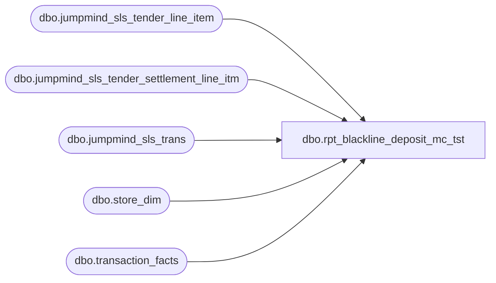

# dbo.rpt_blackline_deposit_mc_tst

**Database:** LH_Source  
**Server:** 4db76rlxaxcuvmuh5kw37wbnqq-ovsykae43znuhlmnflcdwm4ohu.datawarehouse.fabric.microsoft.com  

## Architecture Diagram



## Table Dependencies

| Referenced Table |
|---|
| dbo.jumpmind_sls_tender_line_item |
| dbo.jumpmind_sls_tender_settlement_line_itm |
| dbo.jumpmind_sls_trans |
| dbo.store_dim |
| dbo.transaction_facts |

## View Code

```sql
CREATE   VIEW dbo.rpt_blackline_deposit_mc_tst AS WITH tender_totals AS (     /* CASH and CHECK tender totals per (store, transaction_date), keyed by        business_unit_id from jumpmind_sls_trans and a -2h calendar day on        create_time. Direct port of the PBI Blackline Deposit Report query. */     SELECT         TRY_CAST(b.business_unit_id AS int)           + CASE WHEN TRY_CAST(b.business_unit_id AS int) BETWEEN 1 AND 999                  THEN 1000 ELSE 0 END                                        AS store_no,         CAST(DATEADD(hour, -2, b.create_time) AS date)                       AS transaction_date,         SUM(CASE WHEN a.tender_type_code = 'CASH'                  THEN CAST(a.tender_amount AS decimal(18,2)) ELSE 0 END)     AS cash_total,         SUM(CASE WHEN a.tender_type_code = 'CHECK'                  THEN CAST(a.tender_amount AS decimal(18,2)) ELSE 0 END)     AS check_total       FROM LH_Source.dbo.jumpmind_sls_tender_line_item AS a       JOIN LH_Source.dbo.jumpmind_sls_trans            AS b         ON a.business_date    = b.business_date        AND a.sequence_number  = b.sequence_number        AND a.device_id        = b.device_id      WHERE a.tender_type_code IN ('CASH', 'CHECK')        AND b.trans_status     = 'COMPLETED'        AND a.voided           = 0        AND b.trans_type       IN ('SALE', 'RETURN', 'REDEEM', 'PAY_IN', 'PAY_OUT')        AND TRY_CAST(b.business_unit_id AS int) IS NOT NULL      GROUP BY         TRY_CAST(b.business_unit_id AS int),         CAST(DATEADD(hour, -2, b.create_time) AS date) ), deposit_totals AS (     /* CASH deposits posted from store_bank to the external bank. Direct        port of the PBI Blackline Deposit Report deposit_totals CTE. */     SELECT         TRY_CAST(b.business_unit_id AS int)           + CASE WHEN TRY_CAST(b.business_unit_id AS int) BETWEEN 1 AND 999                  THEN 1000 ELSE 0 END                                        AS store_no,         CAST(DATEADD(hour, -2, b.create_time) AS date)                       AS transaction_date,         SUM(CAST(a.pickup_amount AS decimal(18,2)))                          AS deposit_to_bank       FROM LH_Source.dbo.jumpmind_sls_tender_settlement_line_itm AS a       JOIN LH_Source.dbo.jumpmind_sls_trans                       AS b         ON a.business_date    = b.business_date        AND a.sequence_number  = b.sequence_number        AND a.device_id        = b.device_id      WHERE a.tender_type_code = 'CASH'        AND a.from_repository  = 'STORE_BANK'        AND a.to_repository    = 'EXTERNAL_BANK'        AND a.voided           = 0        AND TRY_CAST(b.business_unit_id AS int) IS NOT NULL      GROUP BY         TRY_CAST(b.business_unit_id AS int),         CAST(DATEADD(hour, -2, b.create_time) AS date) ), audit_only_pairs AS (     /* (store, date) pairs from the canonical LH_Mart aggregate where the        store_dim entry is flagged Store_transaction_flag = 1 on that date.        Used to zero-pad OMS / fulfillment / e-commerce stores (BAB = 1013,        BABUK = 2013, fulfillment IDs 2019, 2079, 2080, 2081, 2083) that        appear in Linda's Business_Units dimension as cross-join padding. */     SELECT         CASE WHEN sd.store_id < 1000 THEN sd.store_id + 1000              ELSE sd.store_id END                                            AS store_no,         CAST(DATEADD(day, m.date_key, '1997-01-04') AS date)                 AS transaction_date       FROM LH_Mart.dbo.transaction_facts AS m       JOIN LH_Mart.dbo.store_dim         AS sd ON sd.store_key = m.store_key      WHERE sd.store_id IS NOT NULL      GROUP BY         CASE WHEN sd.store_id < 1000 THEN sd.store_id + 1000              ELSE sd.store_id END,         CAST(DATEADD(day, m.date_key, '1997-01-04') AS date)     HAVING MAX(CAST(m.Store_transaction_flag AS int)) = 1 ), universe AS (     SELECT store_no, transaction_date FROM tender_totals     UNION     SELECT store_no, transaction_date FROM deposit_totals     UNION     SELECT store_no, transaction_date FROM audit_only_pairs ) SELECT     u.store_no,     u.transaction_date,     COALESCE(t.cash_total,      CAST(0 AS decimal(18,2)))           AS Cash,     COALESCE(t.check_total,     CAST(0 AS decimal(18,2)))           AS Checks,     CAST(0 AS decimal(18,2))                                        AS Travelers_Checks,     CAST(0 AS decimal(18,2))                                        AS Mall_GC,     COALESCE(t.cash_total, CAST(0 AS decimal(18,2)))       + COALESCE(t.check_total, CAST(0 AS decimal(18,2)))           AS Cash_Deposit_Expected,     CAST(0 AS decimal(18,2))                                        AS Total_Register_Counts,     COALESCE(t.cash_total, CAST(0 AS decimal(18,2)))       + COALESCE(t.check_total, CAST(0 AS decimal(18,2)))           AS Total_Register_Over_Short,     COALESCE(d.deposit_to_bank, CAST(0 AS decimal(18,2)))           AS Deposit_to_Bank,     (COALESCE(t.cash_total, CAST(0 AS decimal(18,2)))        + COALESCE(t.check_total, CAST(0 AS decimal(18,2))))        - COALESCE(d.deposit_to_bank, CAST(0 AS decimal(18,2)))      AS FBR_Over_Short,     CAST(0 AS decimal(18,2))                                        AS Float_Variance,     CAST(0 AS decimal(18,2))                                        AS Foreign_Currency,     CAST(0 AS decimal(18,2))                                        AS Exchange_Amount,     CAST(0 AS decimal(18,2))                                        AS Foreign_Total,     CASE         WHEN COALESCE(d.deposit_to_bank, CAST(0 AS decimal(18,2))) <> 0              THEN COALESCE(d.deposit_to_bank, CAST(0 AS decimal(18,2)))         ELSE COALESCE(t.cash_total,  CAST(0 AS decimal(18,2)))              + COALESCE(t.check_total, CAST(0 AS decimal(18,2)))     END                                                             AS GL_Amount_Expected   FROM universe        AS u   LEFT JOIN tender_totals  AS t     ON t.store_no         = u.store_no    AND t.transaction_date = u.transaction_date   LEFT JOIN deposit_totals AS d     ON d.store_no         = u.store_no    AND d.transaction_date = u.transaction_date;
```

