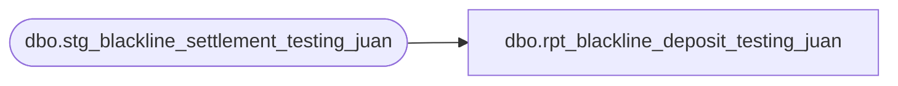

# dbo.rpt_blackline_deposit_testing_juan

**Database:** LH_Source  
**Server:** 4db76rlxaxcuvmuh5kw37wbnqq-ovsykae43znuhlmnflcdwm4ohu.datawarehouse.fabric.microsoft.com  

## Architecture Diagram



## Table Dependencies

| Referenced Table |
|---|
| dbo.stg_blackline_settlement_testing_juan |

## View Code

```sql
CREATE   VIEW dbo.rpt_blackline_deposit_testing_juan AS SELECT     s.store_no,     s.transaction_date,      /* Cash: CloseStoreBank pickup - TILL over_under */     SUM(CASE WHEN s.tender_type_code  = 'CASH'               AND s.from_repository   = 'STORE_BANK'               AND s.to_repository     = 'EXTERNAL_BANK'               AND s.reason_code       LIKE 'CloseStoreBank%'          THEN s.pickup_amount ELSE 0 END)     - SUM(CASE WHEN s.tender_type_code = 'CASH'                AND s.from_repository   = 'TILL'                AND s.to_repository     = 'STORE_BANK'                AND s.reason_code       NOT LIKE 'Open%'                AND s.reason_code       NOT LIKE 'NonCounted%'           THEN s.over_under_session_amount ELSE 0 END)           AS Cash,      /* Checks */     SUM(CASE WHEN s.tender_type_code = 'CHECK'               AND s.from_repository  = 'STORE_BANK'               AND s.to_repository    = 'EXTERNAL_BANK'               AND s.reason_code      LIKE 'CloseStoreBank%'          THEN s.pickup_amount ELSE 0 END)                        AS Checks,      /* Travelers Checks */     SUM(CASE WHEN s.tender_type_code = 'BANK_CHECK'               AND s.from_repository  = 'STORE_BANK'               AND s.to_repository    = 'EXTERNAL_BANK'               AND s.reason_code      LIKE 'CloseStoreBank%'          THEN s.pickup_amount ELSE 0 END)                        AS Travelers_Checks,      /* Mall GC */     SUM(CASE WHEN s.tender_type_code = 'MALL_CERTIFICATE'               AND s.from_repository  = 'STORE_BANK'               AND s.to_repository    = 'EXTERNAL_BANK'               AND s.reason_code      LIKE 'CloseStoreBank%'          THEN s.pickup_amount ELSE 0 END)                        AS Mall_GC,      /* Cash Deposit Expected = Cash + Checks + Travelers + Mall GC */     ( SUM(CASE WHEN s.tender_type_code  = 'CASH'                AND s.from_repository   = 'STORE_BANK'                AND s.to_repository     = 'EXTERNAL_BANK'                AND s.reason_code       LIKE 'CloseStoreBank%'           THEN s.pickup_amount ELSE 0 END)     - SUM(CASE WHEN s.tender_type_code = 'CASH'                AND s.from_repository   = 'TILL'                AND s.to_repository     = 'STORE_BANK'                AND s.reason_code       NOT LIKE 'Open%'                AND s.reason_code       NOT LIKE 'NonCounted%'           THEN s.over_under_session_amount ELSE 0 END)     + SUM(CASE WHEN s.tender_type_code IN ('CHECK','BANK_CHECK','MALL_CERTIFICATE')                AND s.from_repository  = 'STORE_BANK'                AND s.to_repository    = 'EXTERNAL_BANK'                AND s.reason_code      LIKE 'CloseStoreBank%'           THEN s.pickup_amount ELSE 0 END))                      AS Cash_Deposit_Expected,      /* Total Register Counts */     CAST(0 AS decimal(18,2))                                     AS Total_Register_Counts,      /* Total Register (Over)/Short = Cash Deposit Expected */     ( SUM(CASE WHEN s.tender_type_code  = 'CASH'                AND s.from_repository   = 'STORE_BANK'                AND s.to_repository     = 'EXTERNAL_BANK'                AND s.reason_code       LIKE 'CloseStoreBank%'           THEN s.pickup_amount ELSE 0 END)     - SUM(CASE WHEN s.tender_type_code = 'CASH'                AND s.from_repository   = 'TILL'                AND s.to_repository     = 'STORE_BANK'                AND s.reason_code       NOT LIKE 'Open%'                AND s.reason_code       NOT LIKE 'NonCounted%'           THEN s.over_under_session_amount ELSE 0 END)     + SUM(CASE WHEN s.tender_type_code IN ('CHECK','BANK_CHECK','MALL_CERTIFICATE')                AND s.from_repository  = 'STORE_BANK'                AND s.to_repository    = 'EXTERNAL_BANK'                AND s.reason_code      LIKE 'CloseStoreBank%'           THEN s.pickup_amount ELSE 0 END))                      AS Total_Register_Over_Short,      /* Deposit to Bank = all physical CloseStoreBank pickups */     SUM(CASE WHEN s.tender_type_code IN ('CASH','CHECK','BANK_CHECK','MALL_CERTIFICATE')               AND s.from_repository   = 'STORE_BANK'               AND s.to_repository     = 'EXTERNAL_BANK'               AND s.reason_code       LIKE 'CloseStoreBank%'          THEN s.pickup_amount ELSE 0 END)                        AS Deposit_to_Bank,      /* FBR (Over)/Short = TILL over_under */     SUM(CASE WHEN s.tender_type_code = 'CASH'               AND s.from_repository   = 'TILL'               AND s.to_repository     = 'STORE_BANK'               AND s.reason_code       NOT LIKE 'Open%'               AND s.reason_code       NOT LIKE 'NonCounted%'          THEN s.over_under_session_amount ELSE 0 END)            AS FBR_Over_Short,      /* Float Variance */     CAST(0 AS decimal(18,2))                                     AS Float_Variance,      /* Foreign Currency = non-USD cash CloseStoreBank (GBP/EUR stores) */     SUM(CASE WHEN s.tender_type_code  = 'CASH'               AND s.iso_currency_code <> 'USD'               AND s.from_repository   = 'STORE_BANK'               AND s.to_repository     = 'EXTERNAL_BANK'               AND s.reason_code       LIKE 'CloseStoreBank%'          THEN s.pickup_amount ELSE 0 END)                        AS Foreign_Currency,      /* Exchange Amount */     CAST(0 AS decimal(18,2))                                     AS Exchange_Amount,      /* Foreign Total = Foreign Currency */     SUM(CASE WHEN s.tender_type_code  = 'CASH'               AND s.iso_currency_code <> 'USD'               AND s.from_repository   = 'STORE_BANK'               AND s.to_repository     = 'EXTERNAL_BANK'               AND s.reason_code       LIKE 'CloseStoreBank%'          THEN s.pickup_amount ELSE 0 END)                        AS Foreign_Total,      /* GL Amount Expected = all physical tenders (all currencies) */     SUM(CASE WHEN s.tender_type_code IN ('CASH','CHECK','BANK_CHECK','MALL_CERTIFICATE')               AND s.from_repository   = 'STORE_BANK'               AND s.to_repository     = 'EXTERNAL_BANK'               AND s.reason_code       LIKE 'CloseStoreBank%'          THEN s.pickup_amount ELSE 0 END)                        AS GL_Amount_Expected  FROM dbo.stg_blackline_settlement_testing_juan AS s GROUP BY s.store_no, s.transaction_date
```

