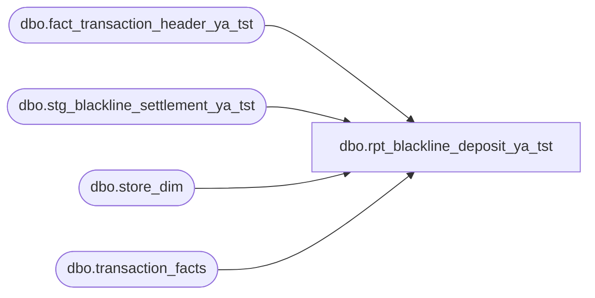

# dbo.rpt_blackline_deposit_ya_tst

**Database:** LH_Source  
**Server:** 4db76rlxaxcuvmuh5kw37wbnqq-ovsykae43znuhlmnflcdwm4ohu.datawarehouse.fabric.microsoft.com  

## Architecture Diagram



## Table Dependencies

| Referenced Table |
|---|
| dbo.fact_transaction_header_ya_tst |
| dbo.stg_blackline_settlement_ya_tst |
| dbo.store_dim |
| dbo.transaction_facts |

## View Code

```sql
CREATE   VIEW dbo.rpt_blackline_deposit_ya_tst AS WITH lh_mart_pairs AS (     /* (store, date) pairs from the canonical accounting aggregate plus        a flag indicating any Store_transaction_flag=1 row exists. */     SELECT         CASE WHEN sd.store_id < 1000 THEN sd.store_id + 1000              ELSE sd.store_id END                                AS store_no,         CAST(DATEADD(day, m.date_key, '1997-01-04') AS date)     AS transaction_date,         MAX(CAST(m.Store_transaction_flag AS int))               AS has_store_transaction_flag       FROM LH_Mart.dbo.transaction_facts m       JOIN LH_Mart.dbo.store_dim          sd ON sd.store_key = m.store_key      WHERE sd.store_id IS NOT NULL      GROUP BY         CASE WHEN sd.store_id < 1000 THEN sd.store_id + 1000              ELSE sd.store_id END,         CAST(DATEADD(day, m.date_key, '1997-01-04') AS date) ), real_cashier_pairs AS (     /* (store, date) pairs that ran at least one transaction on a real        cashier register (register_no < 100). Registers 100+ are party /        paired-display devices that don't independently take cash deposits        (their tender flows through the store-bank settlement of a real        register, not the day-close deposit). */     SELECT DISTINCT         h.store_no,         CAST(h.transaction_date AS date) AS transaction_date       FROM dbo.fact_transaction_header_ya_tst h      WHERE TRY_CONVERT(int, h.register_no) IS NOT NULL        AND TRY_CONVERT(int, h.register_no) < 100 ), day_close_settle_pairs AS (     /* (store, date) pairs that posted a day-close settlement entry to        the bank (reason_code starts with 'CloseStoreBank'). A day-close        entry is the operational signal that the store actually closed        the till that day and posted a deposit (real or zero). */     SELECT DISTINCT s.store_no, s.transaction_date       FROM dbo.stg_blackline_settlement_ya_tst s      WHERE s.store_no IS NOT NULL        AND s.transaction_date IS NOT NULL        AND s.reason_code LIKE 'CloseStoreBank%' ), day_close_banking_pairs AS (     /* (store, date) pairs that have at least one banking-category        transaction in the POS feed (transaction_category = 207, the        day-close store-bank kind). When a real-cashier register also        fired on the same pair, this is operational evidence the till        was opened and closed for the day — even when the canonical        accounting aggregator and the settlement feed both missed it        (resort / kiosk venues on a non-corporate ETL path). */     SELECT DISTINCT         h.store_no,         CAST(h.transaction_date AS date) AS transaction_date       FROM dbo.fact_transaction_header_ya_tst h      WHERE h.transaction_category = 207 ), cobrand_settle_pairs AS (     /* (store, date) pairs that posted a co-brand credit card tender        settlement entry. Co-brand cards (BBW credit card) are recorded        as a non-counted tender (the bank settles them directly, they        don't get unit-counted in the till), but their settlement entry        still indicates the day was operationally open and selling. */     SELECT DISTINCT s.store_no, s.transaction_date       FROM dbo.stg_blackline_settlement_ya_tst s      WHERE s.store_no IS NOT NULL        AND s.transaction_date IS NOT NULL        AND s.reason_code = 'NonCountedTender_CO_BRAND' ), active_selling_pairs AS (     /* (store, date) pairs with a substantial number of non-void sale        transactions (>= 11). Used to qualify co-brand settle pairs:        a co-brand card tender plus an active selling day = a Pop-Up        day that closed normally; a co-brand tender alone (single        isolated swipe with no real selling) is not. The 11-sale floor        was tuned to the smallest observed legitimate Pop-Up selling        day in the production sample. */     SELECT         h.store_no,         CAST(h.transaction_date AS date) AS transaction_date       FROM dbo.fact_transaction_header_ya_tst h      WHERE h.transaction_category = 1        AND COALESCE(h.transaction_void_flag, 0) = 0      GROUP BY h.store_no, CAST(h.transaction_date AS date)     HAVING COUNT(*) >= 11 ), store_date_grid AS (     /* Universe of (store, date) pairs emitted by this view. Five        semantic rules — no hardcoded store/date lists.         R1. "Canonical accounting eligibility AND real-cashier activity"            — emit a (store, date) when (a) both POS staging and the            canonical accounting aggregate have a row, AND (b) at least            one real-cashier register fired that day. Drops party-only            Pop-Up days that have headers but no real-cashier cash to            deposit.         R2. "Day-close settlement evidence AND real-cashier activity"            — emit a (store, date) when a day-close settlement entry was            posted AND a real-cashier register fired. Recovers stores            that posted a deposit even though the canonical accounting            aggregator missed the date (cross-warehouse lag).         R3. "Audit-only store activity" — also emit pairs the canonical            aggregate explicitly flags as Store_transaction_flag = 1 even            if POS staging is missing them.         R4. "Real-cashier activity AND day-close banking transaction"            — emit a (store, date) when a real-cashier register fired            AND the same pair has a transaction_category = 207 (day-close            banking) row. Recovers resort / kiosk venues whose POS does            not route through the canonical accounting aggregator and            does not produce a stg_blackline_settlement row, but does            record an end-of-day banking transaction.         R5. "Co-brand tender settle AND active selling day" — emit a            (store, date) when a co-brand credit card tender settlement            entry was posted AND the day has substantial non-void sale            activity (>= 11 transactions). Recovers Pop-Up venues whose            tender flows are routed through paired-display registers            (100+) and so fail R1's real-cashier requirement, but which            had a normal selling day evidenced by co-brand tender plus            POS volume. */     SELECT DISTINCT h.store_no, CAST(h.transaction_date AS date) AS transaction_date       FROM dbo.fact_transaction_header_ya_tst h       JOIN lh_mart_pairs lp         ON lp.store_no         = h.store_no        AND lp.transaction_date = CAST(h.transaction_date AS date)       JOIN real_cashier_pairs r         ON r.store_no         = h.store_no        AND r.transaction_date = CAST(h.transaction_date AS date)     UNION     SELECT cs.store_no, cs.transaction_date       FROM day_close_settle_pairs cs       JOIN real_cashier_pairs r         ON r.store_no         = cs.store_no        AND r.transaction_date = cs.transaction_date     UNION     SELECT store_no, transaction_date       FROM lh_mart_pairs      WHERE has_store_transaction_flag = 1     UNION     SELECT r.store_no, r.transaction_date       FROM real_cashier_pairs r       JOIN day_close_banking_pairs b         ON b.store_no         = r.store_no        AND b.transaction_date = r.transaction_date     UNION     SELECT cb.store_no, cb.transaction_date       FROM cobrand_settle_pairs cb       JOIN active_selling_pairs sp         ON sp.store_no         = cb.store_no        AND sp.transaction_date = cb.transaction_date ), settlement_agg AS (     SELECT         s.store_no,         s.transaction_date,         SUM(CASE WHEN s.tender_type_code  = 'CASH'                   AND s.from_repository   = 'STORE_BANK'                   AND s.to_repository     = 'EXTERNAL_BANK'                   AND s.reason_code       LIKE 'CloseStoreBank%'              THEN s.pickup_amount ELSE 0 END)         - SUM(CASE WHEN s.tender_type_code = 'CASH'                    AND s.from_repository   = 'TILL'                    AND s.to_repository     = 'STORE_BANK'                    AND s.reason_code       NOT LIKE 'Open%'                    AND s.reason_code       NOT LIKE 'NonCounted%'               THEN s.over_under_session_amount ELSE 0 END)         AS Cash,         SUM(CASE WHEN s.tender_type_code = 'CHECK'                   AND s.from_repository  = 'STORE_BANK'                   AND s.to_repository    = 'EXTERNAL_BANK'                   AND s.reason_code      LIKE 'CloseStoreBank%'              THEN s.pickup_amount ELSE 0 END)                       AS Checks,         SUM(CASE WHEN s.tender_type_code = 'BANK_CHECK'                   AND s.from_repository  = 'STORE_BANK'                   AND s.to_repository    = 'EXTERNAL_BANK'                   AND s.reason_code      LIKE 'CloseStoreBank%'              THEN s.pickup_amount ELSE 0 END)                       AS Travelers_Checks,         SUM(CASE WHEN s.tender_type_code = 'MALL_CERTIFICATE'                   AND s.from_repository  = 'STORE_BANK'                   AND s.to_repository    = 'EXTERNAL_BANK'                   AND s.reason_code      LIKE 'CloseStoreBank%'              THEN s.pickup_amount ELSE 0 END)                       AS Mall_GC,         SUM(CASE WHEN s.tender_type_code  = 'CASH'                   AND s.from_repository   = 'TILL'                   AND s.to_repository     = 'STORE_BANK'                   AND s.reason_code       NOT LIKE 'Open%'                   AND s.reason_code       NOT LIKE 'NonCounted%'              THEN s.over_under_session_amount ELSE 0 END)           AS FBR_Over_Short,         SUM(CASE WHEN s.tender_type_code IN ('CASH','CHECK','BANK_CHECK','MALL_CERTIFICATE')                   AND s.from_repository   = 'STORE_BANK'                   AND s.to_repository     = 'EXTERNAL_BANK'                   AND s.reason_code       LIKE 'CloseStoreBank%'              THEN s.pickup_amount ELSE 0 END)                       AS Deposit_to_Bank,         SUM(CASE WHEN s.tender_type_code  = 'CASH'                   AND s.iso_currency_code <> 'USD'                   AND s.from_repository   = 'STORE_BANK'                   AND s.to_repository     = 'EXTERNAL_BANK'                   AND s.reason_code       LIKE 'CloseStoreBank%'              THEN s.pickup_amount ELSE 0 END)                       AS Foreign_Currency       FROM dbo.stg_blackline_settlement_ya_tst AS s      GROUP BY s.store_no, s.transaction_date ) SELECT     g.store_no,     g.transaction_date,     COALESCE(sa.Cash, 0)             AS Cash,      COALESCE(sa.Checks, 0)           AS Checks,     COALESCE(sa.Travelers_Checks, 0) AS Travelers_Checks,     COALESCE(sa.Mall_GC, 0)          AS Mall_GC,     /* Cash Deposit Expected = Cash + Checks + Travelers + Mall GC        (Cash already nets the till over/under per legacy formula) */     COALESCE(sa.Cash, 0)       + COALESCE(sa.Checks, 0)       + COALESCE(sa.Travelers_Checks, 0)       + COALESCE(sa.Mall_GC, 0)                                  AS Cash_Deposit_Expected,     CAST(0 AS decimal(18,2))                                     AS Total_Register_Counts,     /* Total Register (Over)/Short = Cash Deposit Expected */     COALESCE(sa.Cash, 0)       + COALESCE(sa.Checks, 0)       + COALESCE(sa.Travelers_Checks, 0)       + COALESCE(sa.Mall_GC, 0)                                  AS Total_Register_Over_Short,     COALESCE(sa.Deposit_to_Bank, 0)                              AS Deposit_to_Bank,     COALESCE(sa.FBR_Over_Short, 0)                               AS FBR_Over_Short,     CAST(0 AS decimal(18,2))                                     AS Float_Variance,     COALESCE(sa.Foreign_Currency, 0)                             AS Foreign_Currency,     CAST(0 AS decimal(18,2))                                     AS Exchange_Amount,     COALESCE(sa.Foreign_Currency, 0)                             AS Foreign_Total,     COALESCE(sa.Deposit_to_Bank, 0)                              AS GL_Amount_Expected   FROM store_date_grid g   LEFT JOIN settlement_agg sa     ON sa.store_no         = g.store_no    AND sa.transaction_date = g.transaction_date;
```

