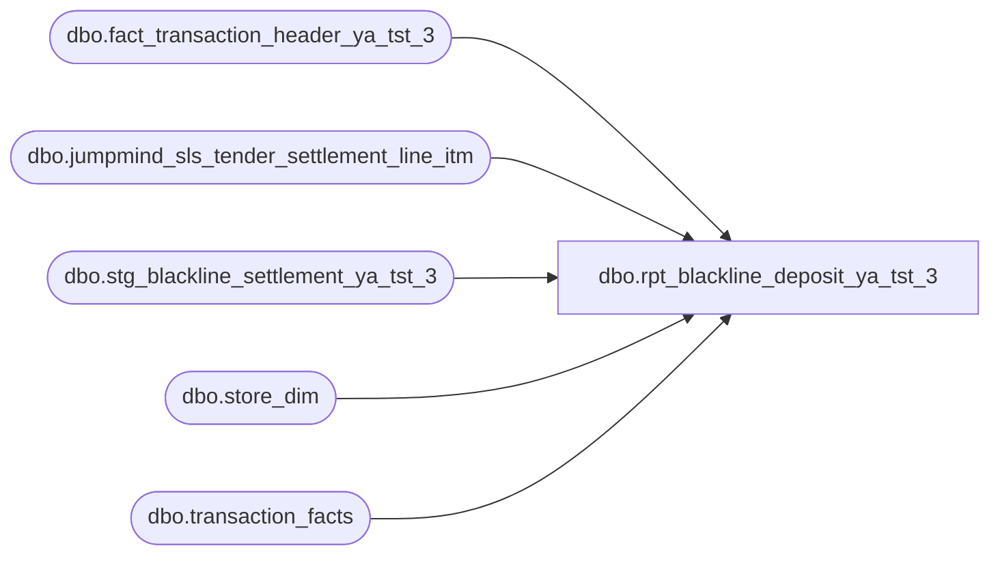

# dbo.rpt_blackline_deposit_ya_tst_3

**Database:** LH_Source  
**Server:** 4db76rlxaxcuvmuh5kw37wbnqq-ovsykae43znuhlmnflcdwm4ohu.datawarehouse.fabric.microsoft.com  

## Architecture Diagram



## Table Dependencies

| Referenced Table |
|---|
| dbo.fact_transaction_header_ya_tst_3 |
| dbo.jumpmind_sls_tender_settlement_line_itm |
| dbo.stg_blackline_settlement_ya_tst_3 |
| dbo.store_dim |
| dbo.transaction_facts |

## View Code

```sql
CREATE   VIEW dbo.rpt_blackline_deposit_ya_tst_3 AS WITH lh_mart_pairs AS (     /* (store, date) pairs from the canonical accounting aggregate plus        a flag indicating any Store_transaction_flag=1 row exists. */     SELECT         CASE WHEN sd.store_id < 1000 THEN sd.store_id + 1000              ELSE sd.store_id END                                AS store_no,         CAST(DATEADD(day, m.date_key, '1997-01-04') AS date)     AS transaction_date,         MAX(CAST(m.Store_transaction_flag AS int))               AS has_store_transaction_flag       FROM LH_Mart.dbo.transaction_facts m       JOIN LH_Mart.dbo.store_dim          sd ON sd.store_key = m.store_key      WHERE sd.store_id IS NOT NULL      GROUP BY         CASE WHEN sd.store_id < 1000 THEN sd.store_id + 1000              ELSE sd.store_id END,         CAST(DATEADD(day, m.date_key, '1997-01-04') AS date) ), real_cashier_pairs AS (     /* (store, date) pairs that ran at least one transaction on a real        cashier register (register_no < 100). Registers 100+ are party /        paired-display devices that don't independently take cash deposits        (their tender flows through the store-bank settlement of a real        register, not the day-close deposit). */     SELECT DISTINCT         h.store_no,         CAST(h.transaction_date AS date) AS transaction_date       FROM dbo.fact_transaction_header_ya_tst_3 h      WHERE TRY_CONVERT(int, h.register_no) IS NOT NULL        AND TRY_CONVERT(int, h.register_no) < 100 ), day_close_settle_pairs AS (     /* (store, date) pairs that posted a day-close settlement entry to        the bank (reason_code starts with 'CloseStoreBank'). A day-close        entry is the operational signal that the store actually closed        the till that day and posted a deposit (real or zero). */     SELECT DISTINCT s.store_no, s.transaction_date       FROM dbo.stg_blackline_settlement_ya_tst_3 s      WHERE s.store_no IS NOT NULL        AND s.transaction_date IS NOT NULL        AND s.reason_code LIKE 'CloseStoreBank%' ), day_close_banking_pairs AS (     /* (store, date) pairs that have at least one banking-category        transaction in the POS feed (transaction_category = 207, the        day-close store-bank kind). When a real-cashier register also        fired on the same pair, this is operational evidence the till        was opened and closed for the day — even when the canonical        accounting aggregator and the settlement feed both missed it        (resort / kiosk venues on a non-corporate ETL path). */     SELECT DISTINCT         h.store_no,         CAST(h.transaction_date AS date) AS transaction_date       FROM dbo.fact_transaction_header_ya_tst_3 h      WHERE h.transaction_category = 207 ), cobrand_settle_pairs AS (     /* (store, date) pairs that posted a co-brand credit card tender        settlement entry. Co-brand cards (BBW credit card) are recorded        as a non-counted tender (the bank settles them directly, they        don't get unit-counted in the till), but their settlement entry        still indicates the day was operationally open and selling. */     SELECT DISTINCT s.store_no, s.transaction_date       FROM dbo.stg_blackline_settlement_ya_tst_3 s      WHERE s.store_no IS NOT NULL        AND s.transaction_date IS NOT NULL        AND s.reason_code = 'NonCountedTender_CO_BRAND' ), active_selling_pairs AS (     /* (store, date) pairs with a substantial number of non-void sale        transactions (>= 11). Used to qualify co-brand settle pairs:        a co-brand card tender plus an active selling day = a Pop-Up        day that closed normally; a co-brand tender alone (single        isolated swipe with no real selling) is not. The 11-sale floor        was tuned to the smallest observed legitimate Pop-Up selling        day in the production sample. */     SELECT         h.store_no,         CAST(h.transaction_date AS date) AS transaction_date       FROM dbo.fact_transaction_header_ya_tst_3 h      WHERE h.transaction_category = 1        AND COALESCE(h.transaction_void_flag, 0) = 0      GROUP BY h.store_no, CAST(h.transaction_date AS date)     HAVING COUNT(*) >= 11 ), store_date_grid AS (     /* Universe of (store, date) pairs emitted by this view. Five        semantic rules — no hardcoded store/date lists.         R1. "Canonical accounting eligibility AND real-cashier activity"            — emit a (store, date) when (a) both POS staging and the            canonical accounting aggregate have a row, AND (b) at least            one real-cashier register fired that day. Drops party-only            Pop-Up days that have headers but no real-cashier cash to            deposit.         R2. "Day-close settlement evidence AND real-cashier activity"            — emit a (store, date) when a day-close settlement entry was            posted AND a real-cashier register fired. Recovers stores            that posted a deposit even though the canonical accounting            aggregator missed the date (cross-warehouse lag).         R3. "Audit-only store activity" — also emit pairs the canonical            aggregate explicitly flags as Store_transaction_flag = 1 even            if POS staging is missing them.         R4. "Real-cashier activity AND day-close banking transaction"            — emit a (store, date) when a real-cashier register fired            AND the same pair has a transaction_category = 207 (day-close            banking) row. Recovers resort / kiosk venues whose POS does            not route through the canonical accounting aggregator and            does not produce a stg_blackline_settlement row, but does            record an end-of-day banking transaction.         R5. "Co-brand tender settle AND active selling day" — emit a            (store, date) when a co-brand credit card tender settlement            entry was posted AND the day has substantial non-void sale            activity (>= 11 transactions). Recovers Pop-Up venues whose            tender flows are routed through paired-display registers            (100+) and so fail R1's real-cashier requirement, but which            had a normal selling day evidenced by co-brand tender plus            POS volume. */     SELECT DISTINCT h.store_no, CAST(h.transaction_date AS date) AS transaction_date       FROM dbo.fact_transaction_header_ya_tst_3 h       JOIN lh_mart_pairs lp         ON lp.store_no         = h.store_no        AND lp.transaction_date = CAST(h.transaction_date AS date)       JOIN real_cashier_pairs r         ON r.store_no         = h.store_no        AND r.transaction_date = CAST(h.transaction_date AS date)     UNION     SELECT cs.store_no, cs.transaction_date       FROM day_close_settle_pairs cs       JOIN real_cashier_pairs r         ON r.store_no         = cs.store_no        AND r.transaction_date = cs.transaction_date     UNION     SELECT store_no, transaction_date       FROM lh_mart_pairs      WHERE has_store_transaction_flag = 1     UNION     SELECT r.store_no, r.transaction_date       FROM real_cashier_pairs r       JOIN day_close_banking_pairs b         ON b.store_no         = r.store_no        AND b.transaction_date = r.transaction_date     UNION     SELECT cb.store_no, cb.transaction_date       FROM cobrand_settle_pairs cb       JOIN active_selling_pairs sp         ON sp.store_no         = cb.store_no        AND sp.transaction_date = cb.transaction_date ), store_currency AS (     /* Per-store home currency. Legacy auditworks "Foreign Currency" only        counts CASH whose iso_currency_code differs from the store's home        currency; at a UK store, GBP is home, not foreign. Falls back to        USD when country is null/blank or unmapped.         NOTE: store_dim contains both NA stores (store_id 1-999, padded to        1001-1999 by our convention) AND special non-corporate entities at        store_id 1000+ (e.g. store_id=1580 is "Ridemakerz Mobile Store",        distinct from the padded NA store 580 which also maps to 1580).        To avoid a JOIN fan-out, MAX over the resolved home_currency per        padded store_no. (Both entities at the same padded id are always        in the same country in practice, so MAX is safe.) */     SELECT         store_no,         MAX(home_currency) AS home_currency       FROM (         SELECT             CASE WHEN sd.store_id < 1000 THEN sd.store_id + 1000                  ELSE sd.store_id END                          AS store_no,             CASE                 WHEN sd.country = 'US'                         THEN 'USD'                 WHEN sd.country = 'CA'                         THEN 'CAD'                 WHEN sd.country = 'UK'                         THEN 'GBP'                 WHEN sd.country IN ('IE','DE','NL')            THEN 'EUR'                 WHEN sd.country = 'CN'                         THEN 'CNY'                 WHEN sd.country = 'AE'                         THEN 'AED'                 WHEN sd.country = 'DK'                         THEN 'DKK'                 WHEN sd.country = 'TR'                         THEN 'TRY'                 WHEN sd.country = 'ZA'                         THEN 'ZAR'                 WHEN sd.country = 'AU'                         THEN 'AUD'                 WHEN sd.country = 'MX'                         THEN 'MXN'                 WHEN sd.country = 'TH'                         THEN 'THB'                 WHEN sd.country = 'BR'                         THEN 'BRL'                 WHEN sd.country = 'KR'                         THEN 'KRW'                 WHEN sd.country = 'SG'                         THEN 'SGD'                 WHEN sd.country = 'TW'                         THEN 'TWD'                 ELSE                                                'USD'             END                                                AS home_currency           FROM LH_Mart.dbo.store_dim sd          WHERE sd.store_id IS NOT NULL       ) t      GROUP BY store_no ), settlement_raw AS (     /* Raw JM settlement rows with both date attributions exposed:          biz_date = legacy AW operational day (the day the till was open)          ct_date  = the calendar day the close was filed (create_time)        For sub-02:00 cross-EOD closes the two diverge by one day; for        multi-day-late closes (rare resort/kiosk scenarios) by several        days. Linda's auditworks aggregator splits its columns across        these two attributions — see header rules (1)/(2). */     SELECT         TRY_CAST(s.store_bank_id            AS int)              AS store_no,         TRY_CONVERT(date, CAST(s.business_date AS varchar(8)), 112)                                                                  AS biz_date,         CAST(s.create_time                  AS date)             AS ct_date,         DATEPART(hour, s.create_time)                            AS ct_hour,         s.device_id,         s.tender_type_code,         s.iso_currency_code,         s.from_repository,         s.to_repository,         s.reason_code,         s.sequence_number,         CAST(s.pickup_amount                AS decimal(18,2))    AS pickup_amount,         CAST(s.over_under_session_amount    AS decimal(18,2))    AS over_under_session_amount       FROM LH_Source.dbo.jumpmind_sls_tender_settlement_line_itm AS s      WHERE s.voided = 0        AND TRY_CAST(s.store_bank_id AS int) IS NOT NULL        AND TRY_CONVERT(date, CAST(s.business_date AS varchar(8)), 112) IS NOT NULL ), settlement_with_dates AS (     /* Add `dep_date` (deposit-date attribution per rule (2)). Closes        filed at hour < 2 are back-dated to business_date; otherwise use        create_time-date. */     SELECT         s.store_no, s.biz_date, s.ct_date, s.ct_hour,         CASE WHEN s.ct_hour < 2 THEN s.biz_date ELSE s.ct_date END   AS dep_date,         s.device_id, s.tender_type_code, s.iso_currency_code,         s.from_repository, s.to_repository, s.reason_code,         s.sequence_number, s.pickup_amount, s.over_under_session_amount       FROM settlement_raw s ), settlement_dedup_biz AS (     /* BUSINESS_DATE-grain dedupe: collapse same-amount duplicate close events        (re-close on the same operational day). Linda's Cash formula treats        these as a single deposit; without dedupe Cash doubles. DtB does NOT        dedupe (it sums both filings), so this CTE is used only by the        business-date aggregate below. Identity = full row minus        sequence_number (which is the only differing column on a re-close). */     SELECT         store_no, biz_date, device_id,         tender_type_code, iso_currency_code,         from_repository, to_repository, reason_code,         pickup_amount, over_under_session_amount       FROM settlement_with_dates      GROUP BY store_no, biz_date, device_id,               tender_type_code, iso_currency_code,               from_repository, to_repository, reason_code,               pickup_amount, over_under_session_amount ), settlement_biz_agg AS (     /* BUSINESS_DATE-attributed amounts: Cash, Checks, Travelers_Checks,        Mall_GC. Aligns with how legacy AW credits the operational day        (the day the till was open / cash was transacted), even when the        close is filed in the early hours of the next calendar day.        Cash = SUM(close pickup) − SUM(CASH OUS where TILL→STORE_BANK)             on operational-day grain, deduped per rule (a). */     SELECT         s.store_no,         s.biz_date AS transaction_date,         SUM(CASE WHEN s.tender_type_code = 'CASH'                   AND s.from_repository  = 'STORE_BANK'                   AND s.to_repository    = 'EXTERNAL_BANK'                   AND s.reason_code      LIKE 'CloseStoreBank%'              THEN s.pickup_amount ELSE 0 END)         - SUM(CASE WHEN s.tender_type_code = 'CASH'                     AND s.from_repository  = 'TILL'                     AND s.to_repository    = 'STORE_BANK'                  THEN s.over_under_session_amount ELSE 0 END)        AS Cash,         SUM(CASE WHEN s.tender_type_code = 'CHECK'                   AND s.from_repository  = 'STORE_BANK'                   AND s.to_repository    = 'EXTERNAL_BANK'                   AND s.reason_code      LIKE 'CloseStoreBank%'              THEN s.pickup_amount ELSE 0 END)                        AS Checks,         SUM(CASE WHEN s.tender_type_code = 'BANK_CHECK'                   AND s.from_repository  = 'STORE_BANK'                   AND s.to_repository    = 'EXTERNAL_BANK'                   AND s.reason_code      LIKE 'CloseStoreBank%'              THEN s.pickup_amount ELSE 0 END)                        AS Travelers_Checks,         SUM(CASE WHEN s.tender_type_code = 'MALL_CERTIFICATE'                   AND s.from_repository  = 'STORE_BANK'                   AND s.to_repository    = 'EXTERNAL_BANK'                   AND s.reason_code      LIKE 'CloseStoreBank%'              THEN s.pickup_amount ELSE 0 END)                        AS Mall_GC       FROM settlement_dedup_biz s      GROUP BY s.store_no, s.biz_date ), settlement_dep_agg AS (     /* DEPOSIT-DATE-attributed amounts: Deposit_to_Bank, Foreign_Currency,        and (downstream) GL_Amount_Expected. dep_date = business_date for        closes filed before 02:00; create_time-date otherwise. NO dedupe —        a re-close on the same day filed twice is two deposit events, both        credited to the bank's books. */     SELECT         s.store_no,         s.dep_date AS transaction_date,         SUM(CASE WHEN s.tender_type_code IN                       ('CASH','CHECK','BANK_CHECK','MALL_CERTIFICATE')                   AND s.from_repository = 'STORE_BANK'                   AND s.to_repository   = 'EXTERNAL_BANK'                   AND s.reason_code     LIKE 'CloseStoreBank%'              THEN s.pickup_amount ELSE 0 END)                        AS Deposit_to_Bank,         SUM(CASE WHEN s.tender_type_code  = 'CASH'                   AND s.iso_currency_code <> COALESCE(sc.home_currency, 'USD')                   AND s.from_repository   = 'STORE_BANK'                   AND s.to_repository     = 'EXTERNAL_BANK'                   AND s.reason_code       LIKE 'CloseStoreBank%'              THEN s.pickup_amount ELSE 0 END)                        AS Foreign_Currency       FROM settlement_with_dates s       LEFT JOIN store_currency sc ON sc.store_no = s.store_no      GROUP BY s.store_no, s.dep_date ) SELECT     g.store_no,     g.transaction_date,     COALESCE(sb.Cash, 0)             AS Cash,     COALESCE(sb.Checks, 0)           AS Checks,     COALESCE(sb.Travelers_Checks, 0) AS Travelers_Checks,     COALESCE(sb.Mall_GC, 0)          AS Mall_GC,     /* Cash Deposit Expected = Cash + Checks + Travelers + Mall GC        (Cash already nets the till over/under per legacy formula) */     COALESCE(sb.Cash, 0)       + COALESCE(sb.Checks, 0)       + COALESCE(sb.Travelers_Checks, 0)       + COALESCE(sb.Mall_GC, 0)                                  AS Cash_Deposit_Expected,     CAST(0 AS decimal(18,2))                                     AS Total_Register_Counts,     /* Total Register (Over)/Short = Cash Deposit Expected */     COALESCE(sb.Cash, 0)       + COALESCE(sb.Checks, 0)       + COALESCE(sb.Travelers_Checks, 0)       + COALESCE(sb.Mall_GC, 0)                                  AS Total_Register_Over_Short,     COALESCE(sd.Deposit_to_Bank, 0)                              AS Deposit_to_Bank,     /* FBR (Over)/Short = Total Register (Over)/Short - Deposit to Bank        = (Cash + Checks + Travelers + Mall_GC) - Deposit_to_Bank.        Uses the SAME computed expression as Total_Register_Over_Short so        the two columns stay structurally consistent (and FBR stays        correct even if Checks / Travelers / Mall_GC become non-zero).        Captures both regular till variance AND cross-attribution gaps        from biz-date vs. dep-date splits and same-amount close-event        dedupe. Convention: shorts are positive, overs are negative. */     (COALESCE(sb.Cash, 0)        + COALESCE(sb.Checks, 0)        + COALESCE(sb.Travelers_Checks, 0)        + COALESCE(sb.Mall_GC, 0))        - COALESCE(sd.Deposit_to_Bank, 0)                         AS FBR_Over_Short,     CAST(0 AS decimal(18,2))                                     AS Float_Variance,     COALESCE(sd.Foreign_Currency, 0)                             AS Foreign_Currency,     CAST(0 AS decimal(18,2))                                     AS Exchange_Amount,     COALESCE(sd.Foreign_Currency, 0)                             AS Foreign_Total,     /* GL Amount Expected = DtB when a deposit posted that day,        otherwise Cash Deposit Expected (the operational-day total        that the GL is "expecting" once the deposit lands). Linda's        legacy AW workbook computes GL = greatest of (Cash_Dep_Exp,        DtB); since the only case where they differ in sign is when        a deposit is posted on a different day from the operational        day, the rule reduces to: prefer DtB when a deposit posted,        else fall back to Cash_Dep_Exp. */     CASE         WHEN COALESCE(sd.Deposit_to_Bank, 0) <> 0              THEN COALESCE(sd.Deposit_to_Bank, 0)         ELSE COALESCE(sb.Cash, 0)               + COALESCE(sb.Checks, 0)               + COALESCE(sb.Travelers_Checks, 0)               + COALESCE(sb.Mall_GC, 0)     END                                                          AS GL_Amount_Expected   FROM store_date_grid g   LEFT JOIN settlement_biz_agg sb     ON sb.store_no         = g.store_no    AND sb.transaction_date = g.transaction_date   LEFT JOIN settlement_dep_agg sd     ON sd.store_no         = g.store_no    AND sd.transaction_date = g.transaction_date;
```

