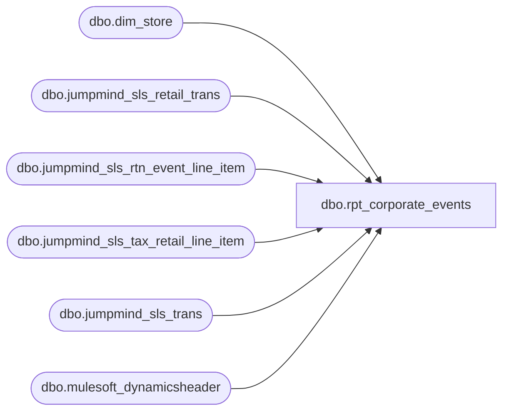

# dbo.rpt_corporate_events

**Database:** LH_Source  
**Server:** 4db76rlxaxcuvmuh5kw37wbnqq-ovsykae43znuhlmnflcdwm4ohu.datawarehouse.fabric.microsoft.com  

## Architecture Diagram



## Table Dependencies

| Referenced Table |
|---|
| dbo.dim_store |
| dbo.jumpmind_sls_retail_trans |
| dbo.jumpmind_sls_rtn_event_line_item |
| dbo.jumpmind_sls_tax_retail_line_item |
| dbo.jumpmind_sls_trans |
| dbo.mulesoft_dynamicsheader |

## View Code

```sql
/* =============================================================================    rpt_corporate_events.sql: Corporate Sales (Event-Invoice) Report    =============================================================================    Domain:    Sales (Corporate Account)    Audience:  Sales Audit, Corporate Sales / Events team, AR    Consumer:  Power BI dashboard "Corporate Event Sales, Invoiced"     PURPOSE      List every corporate-account event sale that was rung up at a store      and settled with the EVENT_INVOICE tender (i.e. invoiced back to the      corporate customer rather than paid at POS). Used by the Corporate      Sales team to track outstanding invoices and by AR to drive invoice      issuance.     GRAIN      One row per (store, register, business_date, sequence_number),      i.e. one row per corporate event transaction. Both original      EVENT_INVOICE sales and receipted credit RETURNs that void an      original event sale are emitted, the latter as negative rows      inheriting the original sale's event_id (see CREDIT / VOID-AND-      REISSUE TRANSACTIONS below).     BUSINESS RULES (operational layer)      R1. Event-tagged: jumpmind_sls_retail_trans.event_id IS NOT NULL AND          NOT IN ('', '0'). Only transactions explicitly tagged with a          corporate-event ID are eligible.      R2. Completed only: jumpmind_sls_trans.trans_status = 'COMPLETED'.          Drops suspended retrievals and cancelled transactions.      R3. Invoiced tender: tender_type_codes CONTAINS 'EVENT_INVOICE'          (CHARINDEX match). Some multi-tender transactions carry both          EVENT_INVOICE and a second tender (e.g. 'EVENT_INVOICE DEBIT_CARD');          an exact = match silently drops those. Any transaction whose          tender_type_codes includes EVENT_INVOICE is an invoiced corporate          purchase. Drops cases where no EVENT_INVOICE tender is present          (individual shoppers using credit card, cash, or gift card).      R4. US and Canada: dim_store.country_code IN ('US', 'CA'). Both          Company 1100 (US Events) and Company 1700 (Canadian Events)          carry corporate-account sales settled with EVENT_INVOICE.          Linda's xlsx reconciliation (April 2026) carries a separate          "Canadian Events" tab keyed off the same BAB Charge Account          (101010), and the Sales Audit team expects both surfaced          here. Prior versions of this rule were US-only because the          Corporate Sales programme was historically US-only; that is          no longer the case as of at least Apr 2026.     COLUMN-DERIVATION NOTES      - `[TransactionKey]` = '{device_id}-{business_date}-{sequence_number}'        (consumer key matching the corporate-events PBI source-key shape).      - `[Amount Already Paid]` = 0; by definition, EVENT_INVOICE tenders        are not yet paid at the time of POS settlement.      - `[Amount Owed]` = total; for EVENT_INVOICE the full receipt        total is the outstanding invoice amount.      - `[TaxName]` carries the name of the highest-dollar tax authority        (typically the state rate, e.g. "Sales and Use Tax") from        `dbo.jumpmind_sls_tax_retail_line_item`. Source is aggregated as        SUM(`tax_amount`) per `(transaction, rule_name, tax_percentage)`,        filtered to non-voided rows. Selection picks the largest aggregated        amount (deterministic tiebreak: `tax_percentage DESC, rule_name ASC`).        Transactions with no tax line emit NULL for TaxName.      - `[SalesTaxAmount]` = `rt.tax_total`, the transaction header's net        total tax across ALL jurisdictions (state + county + local). This        equals `[Total SalesTax]` (column I) and matches what Sales Audit        reports as the total tax for the event. Prior versions computed this        as `subtotal x dominant_rate / 100`, which yielded only the        state-authority portion and diverged from column I whenever multiple        tax jurisdictions applied (e.g. 6% state + 3% local = 9% total, but        the formula produced only the 6% portion). Fixed 2026-06-29.      - `[SalesTax Percentage]` = effective blended rate across all        jurisdictions = `ROUND(tax_total / subtotal x 100, 2)`. Prior versions        emitted the dominant authority's rate only (e.g. 6% state), which        disagreed with Sales Audit when local taxes brought the effective rate        higher (e.g. 9% blended). Fixed 2026-06-29. Rounded to 2 decimal        places 2026-07-08 (4-decimal arithmetic artefacts not meaningful).   UPSTREAM SOURCES (do not modify in place)    - LH_Source.dbo.jumpmind_sls_retail_trans    - LH_Source.dbo.jumpmind_sls_trans    - LH_Source.dbo.jumpmind_sls_tax_retail_line_item    - LH_Source.dbo.jumpmind_sls_rtn_event_line_item    - dbo.dim_store    (All three jumpmind_sls_* sources are referenced as 3-part    `LH_Source.dbo.` so the view binds at deploy time inside    bbw_mirror_dw. The jumpmind tables live exclusively in    LH_Source; the prior 2-part references compiled only because    of an out-of-order multi-pass deploy and would silently bind    to a non-existent local stub.)    CREDIT / VOID-AND-REISSUE TRANSACTIONS (two-branch design)     When the Corporate Sales team voids an EVENT_INVOICE sale and     re-issues a corrected invoice, the cashier rings the void as a     separate RETURN-type transaction with a negative `total`. Linda's     xlsx reconciliation tracks all three legs: original sale, credit     (return), and re-invoice. The credit row in JumpMind has     `event_id = NULL`, a non-EVENT_INVOICE tender (the refund's actual     settlement tender e.g. GIFT_CARD, UNSUPPORTED_AUTHORIZATION), and     `trans_type = 'RETURN'`, so it fails the original-sale branch's     R1 + R3 filters.      LINKAGE TABLE: `LH_Source.dbo.jumpmind_sls_rtn_event_line_item`     is JumpMind's purpose-built bridge for receipted returns. For     every line on a RETURN transaction that was processed with a     receipt reference (the cashier scanned or keyed the original     receipt), this table carries `orig_device_id`,     `orig_business_date`, and `orig_sequence_number` pointing back to     the original sale. We use this bridge to attribute receipted     credits to the originating event sale.      BRANCH 2 (this view) joins:       jumpmind_sls_retail_trans (RETURN row)         |-- jumpmind_sls_trans (trans_type='RETURN', status='COMPLETED')         |-- jumpmind_sls_rtn_event_line_item (orig_sequence_number IS         |     NOT NULL, voided=0) collapsed via ROW_NUMBER to one         |     dominant (orig_device_id, orig_business_date,         |     orig_sequence_number) per RETURN (the original most         |     pointed to by the receipted lines)         +-- the dominant original transaction, filtered to corp               EVENT_INVOICE sales; the credit inherits the original's               event_id      Worked examples from Apr 2026:       Store 1417 EventID 10658:         seq 523 (2026-04-28) SALE  EVENT_INVOICE  +4,350.00  branch 1         seq 525 (2026-04-28) RETURN UNSUPPORTED_AUTHORIZATION                                                   -4,350.00  branch 2                             bridge: orig_seq=523, n_lines=10         seq 526 (2026-04-28) SALE  EVENT_INVOICE  +3,975.00  branch 1      NON-RECEIPTED RETURNS REMAIN UPSTREAM-PENDING     When the cashier processes the void as a NON-receipted return     (the customer did not present the original receipt and the cashier     used the "employeenonreceipted" policy), the rtn_event_line_item     rows carry `orig_sequence_number = NULL`, so no JumpMind-side     linkage to the original sale exists. Worked example:       Store 1371 EventID 10632:         seq 2662 (2026-04-13) SALE  EVENT_INVOICE  +3,975.00  branch 1         seq 2716 (2026-04-15) RETURN GIFT_CARD     -3,975.00  not emitted                             bridge lines: NON_RCPT_ADD, orig=NULL         seq 2718 (2026-04-15) SALE  EVENT_INVOICE  +4,054.50  branch 1      Linda's xlsx still carries this credit because she sources from     the BAB Charge Account 101010 GL ledger (D365), where the original     EVENT_INVOICE DR and the offsetting void CR are both keyed by     EventID at the journal-entry level by AR / Sales Audit staff.     Resolution for non-receipted credits requires one of:       (a) JumpMind UI / ETL captures the EventID on the RETURN row           when the cashier voids an EVENT_INVOICE sale (register UI           change), OR       (b) the BAB Charge Account 101010 GL feed from D365 is landed           in Fabric, OR       (c) the AuditWorks Edit phase enriches event_id onto matched           non-receipted credits when it lands them in transaction_facts.    JOIN-CARDINALITY NOTE     `dim_store` in LH_Source ships with exact-duplicate rows: 453 of 454     distinct `business_unit_id` values appear twice (every column identical),     and one business_unit_id appears 232 times. Joining the transaction     streams to `dim_store` on `business_unit_id` therefore fans every     transaction out by 2x (or 232x for the outlier), doubling Amount Owed     versus Linda's canonical xlsx. We dedupe to one canonical row per     `business_unit_id` via ROW_NUMBER ordered by `store_id` so the choice is     deterministic even if BBW ever stops shipping byte-identical dupes.   ============================================================================= */  CREATE   VIEW dbo.rpt_corporate_events AS WITH dedupedSLS AS (     /* Temporary inline dedup for jumpmind_sls_trans, which carries duplicate        rows per transaction in the current LH_Source load. Pattern provided        by BBW team. Partitions on the full transaction identity key including        begin_time and end_time to ensure only genuine duplicates are collapsed. */     SELECT * FROM (         SELECT ROW_NUMBER() OVER (                    PARTITION BY device_id, business_date, sequence_number,                                 begin_time, end_time                    ORDER BY     device_id, business_date, sequence_number,                                 begin_time, end_time                ) AS isDuplicate,                *           FROM LH_Source.dbo.jumpmind_sls_trans     ) x     WHERE isDuplicate = 1 ), ds_dedup AS (     SELECT business_unit_id,            store_name,            country_code       FROM (           SELECT business_unit_id,                  store_name,                  country_code,                  ROW_NUMBER() OVER (                      PARTITION BY business_unit_id                      ORDER BY store_id                  ) AS rn             FROM dbo.dim_store       ) x      WHERE rn = 1 ), tax_per_txn AS (     SELECT device_id,            business_date,            sequence_number,            rule_name,            tax_percentage,            SUM(tax_amount) AS tax_amount_sum       FROM LH_Source.dbo.jumpmind_sls_tax_retail_line_item      WHERE voided = 0      GROUP BY device_id,               business_date,               sequence_number,               rule_name,               tax_percentage     HAVING SUM(tax_amount) > 0     /* Tax-exempt transactions have a rule row with tax_amount = 0. Without this        filter, tax_pick picks up the zero-amount rule and stamps the TaxName label        (e.g. "Sales and Use Tax") onto rows that have no actual tax. */ ), tax_pick AS (     SELECT device_id,            business_date,            sequence_number,            rule_name,            tax_amount_sum,            tax_percentage       FROM (           SELECT device_id,                  business_date,                  sequence_number,                  rule_name,                  tax_amount_sum,                  tax_percentage,                  ROW_NUMBER() OVER (                      PARTITION BY device_id, business_date, sequence_number                      ORDER BY tax_amount_sum DESC,                               tax_percentage  DESC,                               rule_name       ASC                  ) AS rn             FROM tax_per_txn       ) y      WHERE rn = 1 ), event_invoice_sales AS (     /* Branch 1: original event-invoice sales. */     SELECT         rt.device_id,         rt.business_date,         rt.sequence_number,         rt.event_id,         rt.subtotal,         rt.tax_total,         rt.total,         ds.store_name,         ds.country_code       FROM LH_Source.dbo.jumpmind_sls_retail_trans AS rt       INNER JOIN dedupedSLS                        AS t             ON  rt.device_id       = t.device_id             AND rt.business_date   = t.business_date             AND rt.sequence_number = t.sequence_number       INNER JOIN ds_dedup                          AS ds             ON  ds.business_unit_id =                 SUBSTRING(rt.device_id, 1, CHARINDEX('-', rt.device_id) - 1)      WHERE rt.event_id IS NOT NULL        AND rt.event_id NOT IN ('', '0')        AND t.trans_status       = 'COMPLETED'        AND CHARINDEX('EVENT_INVOICE', rt.tender_type_codes) > 0        AND ds.country_code      IN ('US', 'CA') ), rtn_bridge AS (     /* Per RETURN, collapse the rtn_event_line_item rows to the single        dominant (most-pointed-to) original. ROW_NUMBER picks the        original with the most receipted lines; deterministic tiebreak        on (orig_business_date ASC, orig_sequence_number ASC). */     SELECT         device_id,         business_date,         sequence_number,         orig_device_id,         orig_business_date,         orig_sequence_number       FROM (           SELECT               rel.device_id,               rel.business_date,               rel.sequence_number,               rel.orig_device_id,               rel.orig_business_date,               rel.orig_sequence_number,               COUNT(*) AS n_lines,               ROW_NUMBER() OVER (                   PARTITION BY rel.device_id, rel.business_date, rel.sequence_number                   ORDER BY COUNT(*) DESC,                            rel.orig_business_date ASC,                            rel.orig_sequence_number ASC               ) AS rn             FROM LH_Source.dbo.jumpmind_sls_rtn_event_line_item rel            WHERE rel.voided = 0              AND rel.orig_sequence_number IS NOT NULL            GROUP BY rel.device_id,                     rel.business_date,                     rel.sequence_number,                     rel.orig_device_id,                     rel.orig_business_date,                     rel.orig_sequence_number       ) z      WHERE rn = 1 ), event_credits AS (     /* Branch 2: receipted credit RETURNs whose dominant original is an        EVENT_INVOICE corp sale. The credit row carries the credit        transaction's own device_id / business_date / sequence_number        and its own subtotal / tax_total / total (already negative),        but inherits the original sale's event_id. */     SELECT         rt.device_id,         rt.business_date,         rt.sequence_number,         eis.event_id,         rt.subtotal,         rt.tax_total,         rt.total,         ds.store_name,         ds.country_code       FROM LH_Source.dbo.jumpmind_sls_retail_trans AS rt       INNER JOIN dedupedSLS                        AS t             ON  rt.device_id       = t.device_id             AND rt.business_date   = t.business_date             AND rt.sequence_number = t.sequence_number       INNER JOIN rtn_bridge                        AS rb             ON  rb.device_id       = rt.device_id             AND rb.business_date   = rt.business_date             AND rb.sequence_number = rt.sequence_number       INNER JOIN event_invoice_sales               AS eis             ON  eis.device_id       = rb.orig_device_id             AND eis.business_date   = rb.orig_business_date             AND eis.sequence_number = rb.orig_sequence_number       INNER JOIN ds_dedup                          AS ds             ON  ds.business_unit_id =                 SUBSTRING(rt.device_id, 1, CHARINDEX('-', rt.device_id) - 1)      WHERE t.trans_type       = 'RETURN'        AND t.trans_status     = 'COMPLETED'        AND rt.total           < 0        AND ds.country_code    IN ('US', 'CA') ), unioned AS (     SELECT device_id, business_date, sequence_number, event_id,            subtotal, tax_total, total, store_name, country_code       FROM event_invoice_sales     UNION ALL     SELECT device_id, business_date, sequence_number, event_id,            subtotal, tax_total, total, store_name, country_code       FROM event_credits ), d365_pos_header AS (     /* D365 retail header (POS), one row per TransactionKey. Surfaces the        literal D365 TransactionKey + RetailTransactionId. LEFT-joined in the        final SELECT so event transactions with no D365 header still appear,        with the key / id left blank. */     SELECT TransactionKey                                  AS transaction_key,            MAX(CAST(RetailTransactionId AS varchar(64)))   AS transaction_id       FROM LH_Source.dbo.mulesoft_dynamicsheader      WHERE TransactionKey IS NOT NULL AND TransactionKey <> ''      GROUP BY TransactionKey ) SELECT     CONCAT(         u.device_id, '-',         u.business_date, '-',         CAST(u.sequence_number AS varchar(20))     )                                              AS [TransactionKey],     TRY_CAST(SUBSTRING(u.device_id, 1,              CHARINDEX('-', u.device_id) - 1) AS int) AS [Store Number],     u.store_name                                   AS [StoreName],     CONVERT(date, u.business_date, 112)            AS [Transaction Date],     TRY_CAST(u.business_date AS int)               AS [PosBusiness Date],     u.event_id                                     AS [EventId],     u.subtotal                                     AS [Sales Before SalesTax],     u.tax_total                                    AS [Total SalesTax],     u.total                                        AS [TotalSales Include SalesTax],     CAST(0 AS decimal(18,2))                       AS [Amount Already Paid],     u.total                                        AS [Amount Owed],     /* Show TaxName only when the header tax_total is non-zero.        Some tax-exempt events have non-voided detail rows with positive        amounts (created before exemption was applied) but header tax_total = 0.        The header is authoritative; suppress the name when no tax was charged. */     CASE WHEN u.tax_total = 0 OR u.tax_total IS NULL THEN NULL          ELSE tp.rule_name     END                                            AS [TaxName],     -- Total tax across all jurisdictions (state + county + local).     -- Equals [Total SalesTax] and matches Sales Audit.     u.tax_total                                    AS [SalesTaxAmount],     -- Effective blended rate = tax_total / subtotal * 100.     -- NULL when subtotal is zero to avoid division by zero.     CASE         WHEN u.subtotal IS NULL OR u.subtotal = 0 THEN NULL         ELSE CAST(ROUND(u.tax_total * 100.0 / u.subtotal, 2) AS decimal(18,2))     END                                            AS [SalesTax Percentage],     /* Literal D365 Transaction Key / ID from the POS header. Blank (NULL)        where no D365 header exists in the mirror. Trailing columns; existing        [TransactionKey] (the consumer device-date-seq key) is unchanged. */     CAST(dhp.transaction_key AS varchar(80))       AS [Transaction Key],     CAST(dhp.transaction_id  AS varchar(64))       AS [Transaction ID] FROM unioned AS u LEFT JOIN tax_pick AS tp        ON  tp.device_id       = u.device_id        AND tp.business_date   = u.business_date        AND tp.sequence_number = u.sequence_number LEFT JOIN d365_pos_header AS dhp        ON dhp.transaction_key = CONCAT(               u.device_id, '-',               u.business_date, '-',               CAST(u.sequence_number AS varchar(20)));
```

