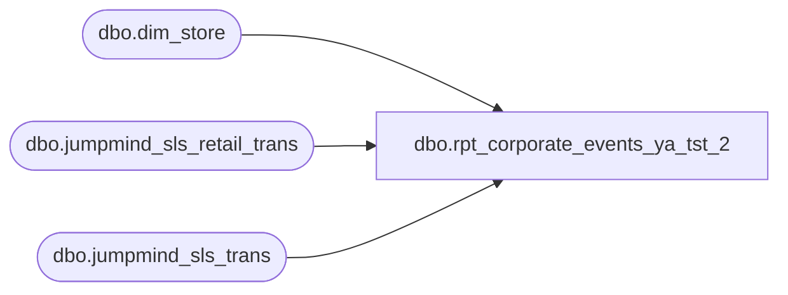

# dbo.rpt_corporate_events_ya_tst_2

**Database:** LH_Source  
**Server:** 4db76rlxaxcuvmuh5kw37wbnqq-ovsykae43znuhlmnflcdwm4ohu.datawarehouse.fabric.microsoft.com  

## Architecture Diagram



## Table Dependencies

| Referenced Table |
|---|
| dbo.dim_store |
| dbo.jumpmind_sls_retail_trans |
| dbo.jumpmind_sls_trans |

## View Code

```sql
CREATE   VIEW dbo.rpt_corporate_events_ya_tst_2 AS WITH ds_dedup AS (     SELECT business_unit_id,            store_name,            country_code       FROM (           SELECT business_unit_id,                  store_name,                  country_code,                  ROW_NUMBER() OVER (                      PARTITION BY business_unit_id                      ORDER BY store_id                  ) AS rn             FROM dbo.dim_store       ) x      WHERE rn = 1 ) SELECT     CONCAT(         rt.device_id, '-',         rt.business_date, '-',         CAST(rt.sequence_number AS varchar(20))     )                                              AS [TransactionKey],     TRY_CAST(SUBSTRING(rt.device_id, 1,              CHARINDEX('-', rt.device_id) - 1) AS int) AS [Store Number],     ds.store_name                                  AS [StoreName],     CONVERT(date, rt.business_date, 112)           AS [Transaction Date],     TRY_CAST(rt.business_date AS int)              AS [PosBusiness Date],     rt.event_id                                    AS [EventId],     rt.subtotal                                    AS [Sales Before SalesTax],     rt.tax_total                                   AS [Total SalesTax],     rt.total                                       AS [TotalSales Include SalesTax],     CAST(0 AS decimal(18,2))                       AS [Amount Already Paid],     rt.total                                       AS [Amount Owed] FROM dbo.jumpmind_sls_retail_trans AS rt INNER JOIN dbo.jumpmind_sls_trans  AS t        ON  rt.device_id       = t.device_id        AND rt.business_date   = t.business_date        AND rt.sequence_number = t.sequence_number INNER JOIN ds_dedup                AS ds        ON  ds.business_unit_id =            SUBSTRING(rt.device_id, 1, CHARINDEX('-', rt.device_id) - 1) WHERE rt.event_id IS NOT NULL   AND rt.event_id NOT IN ('', '0')   AND t.trans_status       = 'COMPLETED'   AND rt.tender_type_codes = 'EVENT_INVOICE'   AND ds.country_code      = 'US';
```

