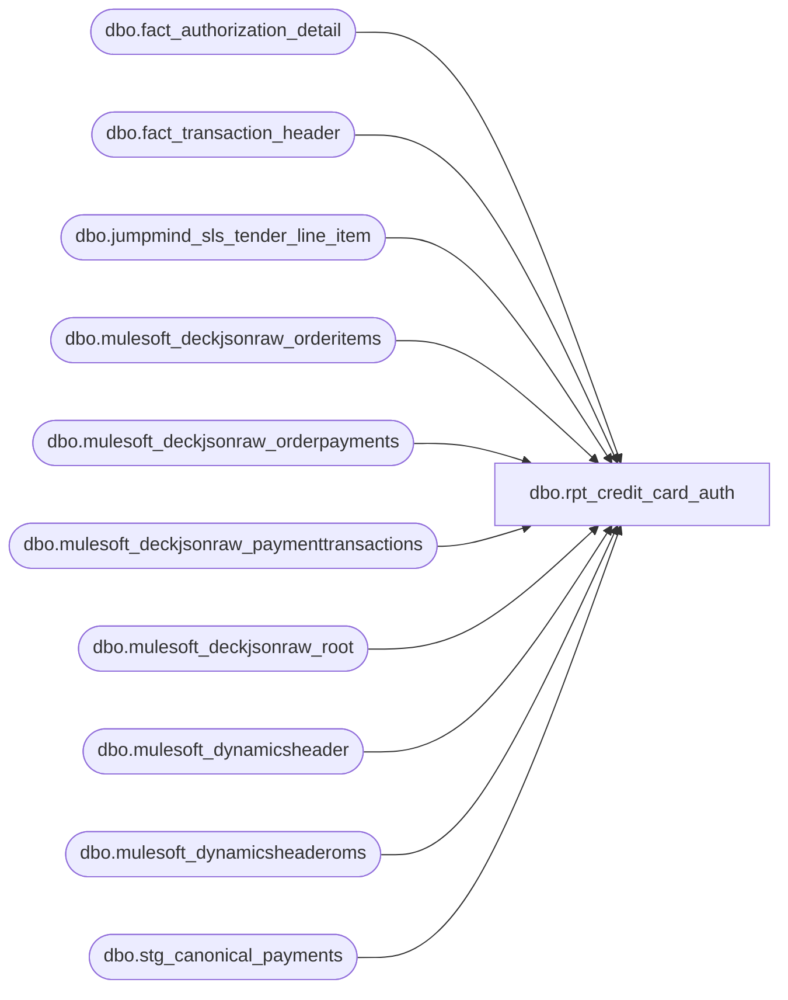

# dbo.rpt_credit_card_auth

**Database:** LH_Source  
**Server:** 4db76rlxaxcuvmuh5kw37wbnqq-ovsykae43znuhlmnflcdwm4ohu.datawarehouse.fabric.microsoft.com  

## Architecture Diagram



## Table Dependencies

| Referenced Table |
|---|
| dbo.fact_authorization_detail |
| dbo.fact_transaction_header |
| dbo.jumpmind_sls_tender_line_item |
| dbo.mulesoft_deckjsonraw_orderitems |
| dbo.mulesoft_deckjsonraw_orderpayments |
| dbo.mulesoft_deckjsonraw_paymenttransactions |
| dbo.mulesoft_deckjsonraw_root |
| dbo.mulesoft_dynamicsheader |
| dbo.mulesoft_dynamicsheaderoms |
| dbo.stg_canonical_payments |

## View Code

```sql
/* =============================================================================    rpt_credit_card_auth.sql -- Credit Card Authorization Report    =============================================================================    Domain:    Reconciliation (Sales Audit)    Audience:  Accounting / Sales Audit team    Consumer:  Power BI dashboard "Finance, Credit Card Activity, Ad Hoc"     STATUS: Rebuilt on pure LH_Source 2026-06-15 (LH_Mart removed).            2026-07-01: Three bugs fixed (Steven Phase 2 feedback):              1. stg_canonical_payments fan-out: cp had capture + refund rows per                 line_id causing 3x/4x multiplied values. Fixed by aggregating cp                 to one row per (transaction_id, line_id) keeping capture amount.              2. oms_refund_auth null amounts: refund auth rows showed blank                 tender/auth amounts in PBI. Fixed: populate from DECK pt.Amount.              3. has_virtual=1 UNION ALL doubling: mixed BOPIS orders (WH='0013' +                 physical WH) caused doubled rows. Removed virtual-store copy;                 per_leg's POS path handles physical stores directly.     ─── REBUILD NOTE ───────────────────────────────────────────────────────────      The prior version reconciled LH_Mart.dbo.tender_facts (one collapsed row      per transaction+tender_code) against the per-leg auth detail through four      branches (pos_rows / pos_tap_on_credit / pos_tender_fallback /      lh_mart_cc_catchall) plus an Adyen per-leg sign classifier sourced from      LH_Mart.dbo.transactiontaxdynamicsstage. All of that machinery existed ONLY      to recover per-leg grain from LH_Mart's collapsed tender_facts.       In LH_Source both sides are already natively per-leg and join 1:1 on      (transaction_id, line_id):        - dbo.fact_authorization_detail  -- the AW authorization_detail mirror:          authorization_no, card_type, expiry_date, swipe_indicator, brand          line_object (604/605/606/608/642). One row per physical auth leg.        - dbo.stg_canonical_payments     -- per-leg tender amount + reference_no          (ports GetCreditCardLineObject; the 02 layer is per-leg, sign-resolved).        - dbo.fact_transaction_header    -- store/date/txn/register + tender_total.      So the four branches + Adyen sign classifier collapse into a single      per-leg join. The result is the same per-(store,date,txn,register,auth_no)      grain Linda's auditworks.authorization_detail extract uses.     GRAIN      One row per physical authorisation leg = one fact_authorization_detail row      (unique authorization_no) joined to its canonical tender amount and header.     VALUE FIDELITY (validated Apr 2026 vs LH_Mart card-auth codes)      604 Visa     $17,543,732.35   605 MC   $7,144,484.79      606 Amex      $1,114,594.14    608 Disc   $829,544.48      Rebuilt total $26.63M vs LH_Mart $27.47M = 97.0%; authorization_no ~99.5%      populated. The ~3% residual is the documented F-016 mulesoft/header feed-      completeness gap (tender legs whose header has not yet landed in      fact_transaction_header), NOT a logic gap.     ─── DATA GAP: 697/698/699 processor-route line_object ──────────────────────      Linda's [Line Object Code] carries the AuditWorks PROCESSOR-ROUTE code:      Adyen-Canadian -> 698, Adyen-UK -> 699, Adyen-Amex/AmexNoRef -> 697,      standard rails -> 604/605/606 by brand. That route distinction is an      AuditWorks merchant-routing artifact that does NOT exist in LH_Source:      fact_authorization_detail (and stg_canonical_payments) classify every card      leg by its physical BRAND (604/605/606/608/642). The Adyen-routed legs are      therefore emitted here under their brand code, not 697/698/699. Reproducing      the route codes requires BBW to expose the Adyen acquirer-routing config      (same non-derivable class as rpt_credit_card_balancing's 697/698/699). The      dollar value is unaffected -- the legs are present, only the GL routing code      differs.     BUSINESS RULES     R1. Eligible card line objects: 604 Visa, 605 MC, 606 Amex, 608 Discover,         611 Debit, 642 JCB, 643 Euro. 611 (Debit) is included because Canadian         stores (e.g., 1119) carry debit auth legs that Linda includes in CCA;         in AuditWorks those legs are stored under acquirer code 698 (Canadian CC),         but in LH_Source they arrive as 611 from JumpMind. Adding 611 captures         them with matching (store, date, auth) keys. 674 (Adyen PayPal) is a         wallet receivable — separate report. Klarna 637 is a receivable — separate.     R2. Authority for the card cohort filter is the auth-side line_object         (fact_authorization_detail.line_object), preserving the AW         classification of each physical leg.     R3. register_no < 900 (pseudo-registers excluded). Threshold was formerly 100         but stores 1416/1806/1800/1580/1149/1191 use real registers 102-107,         which were incorrectly excluded. No registers >= 900 exist in source data.     R4. WEB ORDER STORE ATTRIBUTION — validated against Ben's vwOMSTransactionDates:         ALL web-series transactions (transaction_series='W') are attributed to the         OMS virtual web store: 1013 for BAB US/CA, 2013 for BABUK. This holds         regardless of fulfillment method:           - Ship-to-home (WH='0013'): virtual store only.           - BOPIS (WH=physical): still attributed to 1013/2013 — the RetailTransactionId             Ben generates is ALWAYS '1013-052-…' or '2013-052-…', never the physical             store. AuditWorks mirrors this attribution.           - Mixed (some WH='0013', some WH=physical): same — virtual store only.         The physical fulfillment WarehouseCode is used ONLY for OMS refund store         attribution (see oms_refund_auth CTE notes below).         store_no = h.store_no directly (which stg_deck_transactions already sets         to the virtual web store for all W-series transactions).     R5. WEB ORDER DATE — validated against Ben's vwPaymementTransactions_Summary:         Ben groups DECK payment events into temporal bursts (< 60-second gap =         same group). GroupStart (earliest event UTC → CST) becomes BusinessDate.         This view uses:           - BOPIS (WH != '0013'): TypeId=10 IS included. Date = TypeId-10             TransactionDateUTC → CST/GMT with AuditWorks overnight-batch cutoff             (CST hr<3 or GMT hr<8 → previous calendar day).           - Ship-to-home (WH='0013'): TypeId=10 is EXPLICITLY EXCLUDED in             vwOMSTransactionDates. Date = GroupStart of TypeId=1 auth hold or             TypeId=13 early capture → CST, which coincides with the OMS order             date. Our fallback to h.transaction_date (US/CA) or dr.OrderDateUTC→GMT             (UK) when pt_date IS NULL is therefore correct for ship-to-home.           - UK: GroupStart is NOT converted to CST; AuditWorks uses GMT calendar             date. Our hr<8 GMT midnight shift is correct.         POS transaction_date = fact_transaction_header.transaction_date.     R6. OMS REFUND STORE: ALL OMS TypeId=3/11 refunds are attributed to the         virtual web store (1013 US/CA, 2013 UK). AuditWorks records web refunds         under the virtual channel (register 052) regardless of whether the         original order was BOPIS or ship-to-home. Validated against Linda's         extract: refund auths appear at 1013/2013, never at physical BOPIS stores.     TENDER TOTAL  = fact_transaction_header.tender_total - ROUNDING_ADJUSTMENT                    (from jumpmind_sls_tender_line_item WHERE tender_type_code =                    'ROUNDING_ADJUSTMENT'). Canadian stores round cash to the                    nearest five cents; JumpMind folds the penny into                    fact_transaction_header.tender_total, so our raw value is the                    rounded amount and AuditWorks reports the unrounded sale. We                    subtract the rounding leg to match SA. Join key is                    device_id|business_date|sequence_number (matches                    fact_transaction_header.transaction_id). Validated against                    AuditWorks with register included in the key: March 2026 the                    subtract matches 47 of 47 rounding transactions exactly.                    Comparing without register collides transaction_no across                    registers (e.g. store 130 txn 6390 exists on register 2 as a                    14.70 cash sale and register 3 as a 207.00 AMEX sale); the                    report and AuditWorks agree once register is part of the key.    AUTH AMOUNT   = stg_canonical_payments.tender_amount (per-leg, sign-resolved).    REFERENCE NO  = stg_canonical_payments.reference_no (card auth/reference).    AUTH / CARD   = fact_authorization_detail (authorization_no, card_type,                    expiry_date, swipe_indicator).    TRANSACTION ID / KEY = D365 RetailTransactionId + TransactionKey from                    mulesoft_dynamicsheaderoms (web, on OrderNumber) then                    mulesoft_dynamicsheader (POS). LEFT-joined so legs with no                    D365 header still appear (key/id NULL).     Read-only and idempotent.    ============================================================================= */  CREATE   VIEW dbo.rpt_credit_card_auth AS WITH rounding_adj AS (     /* Per-transaction currency rounding adjustment.        Canadian stores round cash payments to the nearest five cents and record        the penny in a separate ROUNDING_ADJUSTMENT tender leg. JumpMind folds        that leg into fact_transaction_header.tender_total, so our raw tender is        the rounded amount (e.g. 89.27). AuditWorks reports the unrounded sale        amount (89.28), i.e. tender with the rounding leg removed. To match SA we        subtract this rounding leg from h.tender_total.         Key MUST be device_id|business_date|sequence_number so it matches        fact_transaction_header.transaction_id exactly (a two-part        device_id|sequence_number key never matches and leaves the penny in). */     SELECT         CAST(device_id       AS varchar(64)) + '|' +         CAST(business_date   AS varchar(8))  + '|' +         CAST(sequence_number AS varchar(20))          AS transaction_id,         SUM(tender_amount)                            AS rounding_amount       FROM LH_Source.dbo.jumpmind_sls_tender_line_item      WHERE tender_type_code = 'ROUNDING_ADJUSTMENT'      GROUP BY         CAST(device_id       AS varchar(64)) + '|' +         CAST(business_date   AS varchar(8))  + '|' +         CAST(sequence_number AS varchar(20)) ), web_store_base AS (     /* Per-item physical store + per-order has_virtual window flag.        Row for every WH item; virtual items (WH in '0013'/'1013'/'2013') get        store_no=NULL but still contribute to the has_virtual window aggregate,        which is what lets mixed STH+BOPIS orders set has_virtual=1 even though        the per-row store_no for the virtual item is NULL. */     SELECT         dr.OrderNumber                                          AS order_no,         CASE             WHEN oi.WarehouseCode NOT IN ('0013','1013','2013')              AND TRY_CONVERT(int, oi.WarehouseCode) BETWEEN 1 AND 999             THEN 1000 + TRY_CONVERT(int, oi.WarehouseCode)             WHEN oi.WarehouseCode NOT IN ('0013','1013','2013')              AND TRY_CONVERT(int, oi.WarehouseCode) >= 1000             THEN TRY_CONVERT(int, oi.WarehouseCode)             ELSE NULL         END                                                     AS store_no,         MAX(CASE                 WHEN oi.WarehouseCode IN ('0013','1013','2013') THEN 1 ELSE 0             END)             OVER (PARTITION BY dr.OrderNumber)                  AS has_virtual       FROM LH_Source.dbo.mulesoft_deckjsonraw_root dr       JOIN LH_Source.dbo.mulesoft_deckjsonraw_orderitems oi         ON oi._ParentKeyField = dr.OrderID      WHERE TRY_CONVERT(int, oi.WarehouseCode) IS NOT NULL ), web_store AS (     /* One row per (order_no, distinct physical store_no).        Supports multi-WH BOPIS orders where Linda records each physical        fulfillment store separately (e.g. an order with items from WH=0022        AND WH=0393 produces rows for store 1022 AND store 1393; per_leg emits        at both via the LEFT JOIN, matching Linda's two records).        Virtual-only orders (all WH='0013') produce no rows; per_leg falls        back to h.store_no (1013/2013 virtual).        oms_refund_auth LEFT-JOINs here too and takes MIN(ws.store_no) over the        GROUP BY, collapsing the multiple rows back to the minimum physical store        per (order, auth) — same effective behaviour as the former single-row CTE. */     SELECT DISTINCT order_no, store_no, has_virtual       FROM web_store_base      WHERE store_no IS NOT NULL ), per_leg AS (     /* One row per physical card-auth leg. fad supplies the auth identity, the        canonical payment leg supplies the amount + reference (joined 1:1 on        transaction_id+line_id), and the header supplies store/date/txn/register        + tender_total.         STORE RULE (R4): store_no = h.store_no directly.        stg_deck_transactions sets h.store_no to the OMS virtual web store        (1013 US/CA, 2013 UK) for ALL W-series transactions — ship-to-home,        BOPIS, and mixed. Validated against Ben's vwOMSTransactionDates whose        RetailTransactionId always starts with '1013-' or '2013-', never a        physical fulfillment store.  POS orders (non-W series) use h.store_no        directly as well (= the physical POS store).         DATE RULE (R5): h.transaction_date for OMS orders comes from        stg_deck_transactions.business_date = OMS OrderDateUTC, NOT the        settlement date. AuditWorks records web auth legs under the CAPTURE date        (TypeId-10 TransactionDateUTC → local time). The CASE override uses        TypeId-10 UTC→CST/GMT when available. When no TypeId-10 match exists:          - UK (2000-2999): fall back to dr.OrderDateUTC → GMT (late-night UTC            orders would be off by a day using h.transaction_date directly).          - US/CA: fall back to h.transaction_date (order UTC = CST same-day).        Note: for ship-to-home (WH='0013'), Ben's view EXCLUDES TypeId=10,        so pt_date will always be NULL; the h.transaction_date fallback is        intentional and correct for those legs.        pt_date is restricted to TypeId=10 only; TypeId 3/11 (refunds) are        handled in oms_refund_auth. See OMS_DECK_TRANSACTION_DATE_LOGIC.md.         NOTE: [Transaction Number] for web orders = OMS order number (W/U prefix).        authorization_no is the correct reconciliation match key. */     SELECT         /* STORE: use COALESCE(ws.store_no, h.store_no).            - Pure BOPIS (has_virtual=0, all physical items): ws.store_no = physical.              AuditWorks records at physical store.            - Ship-to-home (ws.store_no=NULL): h.store_no = 1013/2013.            - Mixed STH+BOPIS: ws.store_no = physical. has_virtual=1.              AuditWorks records BOTH the physical AND the virtual store (see UNION ALL below).            - Gift-card+BOPIS: has_virtual=1 but Ben's LAG merges GC into BOPIS group.              AuditWorks records at physical only. ws.store_no = physical covers this.            POS orders (non-W): ws is NULL → h.store_no = physical POS store. */         COALESCE(ws.store_no, h.store_no)                   AS store_no,         CAST(CASE             WHEN h.transaction_series = 'W' AND pt_date.TransactionDateUTC IS NOT NULL             THEN CASE                 /* UK stores: GMT Standard Time (UTC+0 in winter, UTC+1 BST in summer).                    AuditWorks overnight-batch: UK captures before 07:00 GMT are stamped                    to the PREVIOUS business day. Validated against UK Linda-only records                    (e.g., auth BKG5L9NDJN8D6524 at UTC 06:38 → Linda = previous day). */                 WHEN h.store_no BETWEEN 2000 AND 2999                 THEN CASE                     WHEN DATEPART(hour,                              CAST(pt_date.TransactionDateUTC AT TIME ZONE 'UTC'                                                              AT TIME ZONE 'GMT Standard Time'                                   AS datetime)) < 8                     THEN DATEADD(day, -1,                              CAST(pt_date.TransactionDateUTC AT TIME ZONE 'UTC'                                   AT TIME ZONE 'GMT Standard Time' AS date))                     ELSE CAST(pt_date.TransactionDateUTC AT TIME ZONE 'UTC'                               AT TIME ZONE 'GMT Standard Time' AS date)                 END                 /* AuditWorks overnight-batch window for US/CA stores: settlements arriving                    between 00:00 and 02:59 CST are stamped to the PREVIOUS business day. */                 WHEN DATEPART(hour,                          CAST(pt_date.TransactionDateUTC AT TIME ZONE 'UTC'                                                          AT TIME ZONE 'Central Standard Time'                               AS datetime)) < 3                 THEN DATEADD(day, -1,                          CAST(pt_date.TransactionDateUTC AT TIME ZONE 'UTC'                               AT TIME ZONE 'Central Standard Time' AS date))                 ELSE CAST(pt_date.TransactionDateUTC AT TIME ZONE 'UTC'                           AT TIME ZONE 'Central Standard Time' AS date)             END             /* UK web order with no TypeId-10 capture: stg_deck_transactions stores                business_date as UTC date; AuditWorks uses the GMT calendar date.                Late-night UTC orders (e.g., 23:xx UTC on Jan 10 = Jan 11 GMT) are                off by one day if we use h.transaction_date directly.                Use dr.OrderDateUTC → GMT to get the correct AuditWorks date. */             WHEN h.transaction_series = 'W'              AND h.store_no BETWEEN 2000 AND 2999              AND dr.OrderDateUTC IS NOT NULL             THEN CAST(dr.OrderDateUTC AT TIME ZONE 'UTC'                       AT TIME ZONE 'GMT Standard Time' AS date)             ELSE CAST(h.transaction_date AS date)         END AS date)                                        AS transaction_date,         CAST(h.transaction_no AS varchar(50))               AS transaction_no,         CAST(h.register_no    AS varchar(10))               AS register_no,         CAST(h.tender_total - ISNULL(ra.rounding_amount, 0) AS decimal(18,6)) AS tender_total,         CAST(cp.tender_amount AS decimal(18,6))             AS auth_amount,         CAST(NULLIF(cp.reference_no, 'undefined') AS varchar(80)) AS reference_no,         CAST(fad.authorization_no AS varchar(64))           AS authorization_no,         CAST(fad.expiry_date      AS varchar(16))           AS card_expiry_date,         CAST(fad.card_type        AS varchar(8))            AS card_type,         CAST(COALESCE(NULLIF(CAST(fad.swipe_indicator AS varchar(8)), ''), '1') AS varchar(8))                                                             AS swipe_indicator,         fad.line_object                                     AS line_object,         -- used by the virtual-copy UNION ALL branch below         ISNULL(ws.has_virtual, 0)                           AS has_virtual,         h.store_no                                          AS virtual_store_no       FROM LH_Source.dbo.fact_authorization_detail fad       JOIN (           /* stg_canonical_payments can have multiple rows per (transaction_id, line_id)              when refunds against the same auth leg are recorded alongside the original              capture (e.g. +64.72 capture row AND -54.72 / -10.00 partial-refund rows              sharing the same line_id). A direct join fans out per_leg and causes              values to be multiplied (3x, 4x) in the output. Deduplicate here by              keeping the capture amount: prefer the positive value when one exists,              fall back to the largest (least-negative) value for pure-refund legs.              Refunds against a web order are handled separately by oms_refund_auth. */           SELECT transaction_id, line_id,                  COALESCE(                      MAX(CASE WHEN tender_amount > 0 THEN tender_amount END),                      MAX(tender_amount)                  )              AS tender_amount,                  MAX(reference_no) AS reference_no             FROM LH_Source.dbo.stg_canonical_payments            GROUP BY transaction_id, line_id       ) cp         ON cp.transaction_id = fad.transaction_id        AND cp.line_id        = fad.line_id       JOIN LH_Source.dbo.fact_transaction_header h         ON h.transaction_id = fad.transaction_id       LEFT JOIN rounding_adj ra         ON ra.transaction_id = h.transaction_id       LEFT JOIN LH_Source.dbo.mulesoft_deckjsonraw_root dr         ON CAST(dr.OrderNumber AS varchar(50)) = CAST(h.transaction_no AS varchar(50))        AND h.transaction_series = 'W'       LEFT JOIN web_store ws         ON ws.order_no = CAST(h.transaction_no AS varchar(50))        AND h.transaction_series = 'W'       LEFT JOIN (           /* Aggregate TypeId-10 captures to MIN(TransactionDateUTC) per order+auth.              Some orders have duplicate TypeId-10 records (reprocessed payments) with              different dates; picking non-deterministically causes date mismatches.              Using MIN selects the EARLIEST (actual) capture date. */           SELECT               _ParentKeyField,               CAST(Generic1 AS varchar(64)) AS auth_code,               MIN(TransactionDateUTC)       AS TransactionDateUTC             FROM LH_Source.dbo.mulesoft_deckjsonraw_paymenttransactions            WHERE PaymentTransactionTypeId = 10              AND ISNULL(IsDecline, 0) = 0            GROUP BY _ParentKeyField, CAST(Generic1 AS varchar(64))       ) pt_date         ON pt_date._ParentKeyField = dr.OrderID        AND pt_date.auth_code = CAST(fad.authorization_no AS varchar(64))      WHERE fad.line_object IN (604, 605, 606, 608, 611, 642, 643)   -- R1 / R2        AND (fad.line_object <> 611             OR h.store_no BETWEEN 1100 AND 1499   -- Canadian stores: Interac/Debit routed via Adyen 698             OR h.store_no BETWEEN 2000 AND 9999)  -- UK/IE/EU stores: Debit routed via Adyen 699        /* Exclude 611 for US domestic stores (outside Canadian/UK range) because           AuditWorks routes those US debit legs under 611 in LH_Source (JumpMind)           but Linda's SP Credit Card Auth extract does not include US POS debit. */        AND TRY_CONVERT(int, h.register_no) IS NOT NULL        AND TRY_CONVERT(int, h.register_no) < 900                    -- R3: exclude pseudo-registers (999/9999 style)        AND (   -- physical POS: null auth_no is valid (refunds do not generate a new approval code;                --   SmartLook groups by authorization_no with no IS NOT NULL filter).                -- web (W-series): auth_no is required to join DECK TypeId-10 capture dates.                h.transaction_series <> 'W'                OR (    fad.authorization_no IS NOT NULL                    AND CAST(fad.authorization_no AS varchar(64)) <> '')            ) ), -- Set of (OrderID, auth_code) pairs where DECK has a TypeId-10 capture event. -- Used by oms_refund_auth to detect auths that per_leg can already correctly date. deck_capture_auths AS (     SELECT DISTINCT dr2.OrderID,            CAST(pt2.Generic1 AS varchar(64)) AS auth_code       FROM LH_Source.dbo.mulesoft_deckjsonraw_paymenttransactions pt2       JOIN LH_Source.dbo.mulesoft_deckjsonraw_orderpayments op2         ON op2.ID = pt2.OrderPaymentId       JOIN LH_Source.dbo.mulesoft_deckjsonraw_root dr2         ON dr2.OrderID = op2._ParentKeyField      WHERE pt2.PaymentTransactionTypeId = 10        AND ISNULL(pt2.IsDecline, 0) = 0        AND pt2.Generic1 IS NOT NULL ), d365_oms_header AS (     SELECT CAST(RetailReceiptId AS varchar(64))          AS receipt_txt,            MAX(CAST(TransactionKey      AS varchar(80))) AS transaction_key,            MAX(CAST(RetailTransactionId AS varchar(64))) AS transaction_id,            MAX(TransDate)                                AS trans_date       FROM LH_Source.dbo.mulesoft_dynamicsheaderoms      WHERE RetailReceiptId IS NOT NULL AND RetailReceiptId <> ''      GROUP BY CAST(RetailReceiptId AS varchar(64)) ), d365_pos_header AS (     SELECT CAST(InventLocationId AS varchar(10))         AS store_no_txt,            CAST(RetailReceiptId  AS varchar(20))         AS receipt_txt,            TransDate                                     AS trans_date,            MAX(CAST(TransactionKey      AS varchar(80))) AS transaction_key,            MAX(CAST(RetailTransactionId AS varchar(64))) AS transaction_id       FROM LH_Source.dbo.mulesoft_dynamicsheader      GROUP BY CAST(InventLocationId AS varchar(10)),               CAST(RetailReceiptId AS varchar(20)),               TransDate ), /* OMS refund auth codes: TypeId=3/11 legs that fact_authorization_detail's    OUTER APPLY silently drops (it prefers the TypeId=10 capture auth code).    AuditWorks emits one authorization_detail row per payment transaction leg,    so Linda's extract has both the capture and each refund auth.    One row per (order, auth_code) — deduped across TypeId=3+11 which can    carry the same code for the same refund event. Only auth codes NOT already    emitted by the capture branch (per_leg) are included.     STORE (R6): BOPIS refunds processed in-person at the physical fulfillment    store are recorded by AuditWorks under that physical store number.    web_store.store_no (physical-warehouse MAX) recovers this. Ship-to-home    refunds and DC-fulfilled orders where AuditWorks assigns to the virtual    store: web_store.store_no = NULL → fallback to SiteCode-derived virtual    store (1013 US / 2013 UK). DC-code ambiguity (sub-1000 WH that maps to    WH+1000 but was a ship-to-home DC) produces a small number of residual    L-only at 1013; these cannot be resolved from WH code alone.     MIXED-ORDER REFUND RULE: When an order has at least one virtual WH item    (has_virtual=1, i.e. mixed STH+BOPIS or pure STH), AuditWorks routes the    web refund through the virtual channel and records at 1013/2013, NOT the    physical BOPIS store. COALESCE(ws.store_no, virtual) would give the wrong    physical store for these orders. Validated: 9 L-only at 1013 all had    deck_wh='0013' (STH component present), confirming the virtual-channel rule.    Pure BOPIS refunds (has_virtual=0) still use the physical store — those are    processed in-store at the original fulfillment location. */ oms_refund_auth AS (     SELECT         /* For mixed/STH orders (has_virtual=1): always virtual store.            For pure BOPIS orders (has_virtual=0): physical store from WH+1000. */         CASE WHEN MAX(ws.has_virtual) = 1              THEN CASE dr.SiteCode WHEN 'BAB' THEN 1013 WHEN 'BABUK' THEN 2013                        ELSE NULL END              ELSE COALESCE(                      MIN(ws.store_no),                      CASE dr.SiteCode WHEN 'BAB' THEN 1013 WHEN 'BABUK' THEN 2013                           ELSE NULL END                  )         END                                                        AS store_no,         /* Refund date: AuditWorks records refunds by the refund event date,            not the original order date. TransactionDateUTC → TZ gives the refund date.            UK/IE (2000-2999): same hr<8 GMT midnight shift as per_leg captures —            AuditWorks overnight batch assigns early-morning refunds to the previous            calendar day, exactly as it does for captures. */         CAST(CASE             WHEN (CASE WHEN MAX(ws.has_virtual) = 1                        THEN CASE dr.SiteCode WHEN 'BABUK' THEN 2013 ELSE 0 END                        ELSE COALESCE(MIN(ws.store_no),                                      CASE dr.SiteCode WHEN 'BABUK' THEN 2013 ELSE 0 END)                   END) BETWEEN 2000 AND 2999             THEN CASE                      WHEN DATEPART(hour,                               CAST(MIN(pt.TransactionDateUTC) AT TIME ZONE 'UTC'                                    AT TIME ZONE 'GMT Standard Time' AS datetime)) < 8                      THEN DATEADD(day, -1,                               CAST(CAST(MIN(pt.TransactionDateUTC) AT TIME ZONE 'UTC'                                         AT TIME ZONE 'GMT Standard Time' AS datetime) AS date))                      ELSE CAST(CAST(MIN(pt.TransactionDateUTC) AT TIME ZONE 'UTC'                                     AT TIME ZONE 'GMT Standard Time' AS datetime) AS date)                  END             ELSE CAST(MIN(pt.TransactionDateUTC) AT TIME ZONE 'UTC'                       AT TIME ZONE 'Central Standard Time' AS date)         END AS date)                                              AS transaction_date,         CAST(dr.OrderNumber AS varchar(50))                       AS transaction_no,         CAST('052' AS varchar(10))                                AS register_no,         /* Refund amount from DECK: TypeId=3/11 Amount is stored as a positive value            in DECK but represents a debit to the customer (returned funds). We negate            it here so the auth_amount and tender_total are negative, matching            AuditWorks' convention for refund authorization_detail rows (which carry            a negative tender_amount). MIN() across TypeId=3 and TypeId=11 records            for the same auth collapses the pair to a single amount without doubling. */         -CAST(MIN(pt.Amount) AS decimal(18,6))                    AS tender_total,         -CAST(MIN(pt.Amount) AS decimal(18,6))                    AS auth_amount,         CAST(NULL AS varchar(80))                                 AS reference_no,         CAST(pt.Generic1 AS varchar(64))                          AS authorization_no,         CAST(NULL AS varchar(16))                                  AS card_expiry_date,         CASE             WHEN UPPER(op.Generic1) IN ('VISA','V')               THEN 'V'             WHEN UPPER(op.Generic1) IN ('MASTERCARD','MC','M')    THEN 'M'             WHEN UPPER(op.Generic1) IN ('AMEX','AMERICAN EXPRESS',                                         'AMERICAN_EXPRESS','A')   THEN 'A'             WHEN UPPER(op.Generic1) IN ('DISCOVER','D')           THEN 'D'             WHEN UPPER(op.Generic1) IN ('MAESTRO','VPAY','INTERAC_CARD',                                         'USPINDEBIT','DEBIT CARD',                                         'DEBIT','SOLO','SWITCH','T') THEN 'T'             WHEN UPPER(op.Generic1) IN ('JCB','J')                THEN 'J'             ELSE ''         END                                                       AS card_type,         CAST('1' AS varchar(8))                                   AS swipe_indicator,         CASE             WHEN UPPER(op.Generic1) IN ('VISA','V')               THEN 604             WHEN UPPER(op.Generic1) IN ('MASTERCARD','MC','M')    THEN 605             WHEN UPPER(op.Generic1) IN ('AMEX','AMERICAN EXPRESS',                                         'AMERICAN_EXPRESS','A')   THEN 606             WHEN UPPER(op.Generic1) IN ('DISCOVER','D')           THEN 608             WHEN UPPER(op.Generic1) IN ('MAESTRO','VPAY','INTERAC_CARD',                                         'USPINDEBIT','DEBIT CARD',                                         'DEBIT','SOLO','SWITCH','T') THEN 611             WHEN UPPER(op.Generic1) IN ('JCB','J')                THEN 642             ELSE NULL         END                                                       AS line_object       FROM LH_Source.dbo.mulesoft_deckjsonraw_paymenttransactions pt       JOIN LH_Source.dbo.mulesoft_deckjsonraw_orderpayments op         ON op.ID = pt.OrderPaymentId       JOIN LH_Source.dbo.mulesoft_deckjsonraw_root dr         ON dr.OrderID = op._ParentKeyField       LEFT JOIN web_store ws         ON ws.order_no = CAST(dr.OrderNumber AS varchar(50))       -- Detect if per_leg already handles this auth with the correct capture date:       -- a TypeId-10 DECK event exists for this order+auth, so per_leg picks it up       -- and correctly dates it from TransactionDateUTC. When no TypeId-10 exists,       -- per_leg falls back to h.transaction_date (order date), which may be outside       -- the reporting window → refund-date entry in Linda goes unmatched.       LEFT JOIN deck_capture_auths dca         ON dca.OrderID = dr.OrderID        AND dca.auth_code = CAST(pt.Generic1 AS varchar(64))       -- Detect if AuditWorks mirrors this auth in fact_authorization_detail.       LEFT JOIN LH_Source.dbo.fact_authorization_detail fad_chk         ON fad_chk.transaction_id = CAST(dr.OrderNumber AS varchar(50))        AND CAST(fad_chk.authorization_no AS varchar(64)) = CAST(pt.Generic1 AS varchar(64))      WHERE pt.PaymentTransactionTypeId IN (3, 11)        AND (pt.IsDecline = 0 OR pt.IsDecline IS NULL)        AND pt.Generic1 IS NOT NULL        AND CAST(pt.Generic1 AS varchar(64)) <> ''        -- Block only when BOTH (a) the auth is in fact_authorization_detail (per_leg        -- sees it) AND (b) there is a TypeId-10 DECK event for this auth (per_leg        -- can correctly date it via the capture UTC timestamp). If either condition        -- is absent, per_leg cannot correctly date the refund → oms_refund_auth must        -- capture it with the refund-event date.        AND NOT (fad_chk.transaction_id IS NOT NULL AND dca.OrderID IS NOT NULL)      GROUP BY         CAST(dr.OrderNumber AS varchar(50)),         dr.SiteCode,         CAST(pt.Generic1 AS varchar(64)),         op.Generic1 ) SELECT     pl.store_no                                          AS [Store Number],     pl.transaction_date                                 AS [Transaction Date],     pl.transaction_no                                   AS [Transaction Number],     pl.register_no                                      AS [Register Number],     pl.tender_total                                     AS [Tender Total Amount (Native Currency)],     pl.reference_no                                     AS [Reference Number],     pl.auth_amount                                      AS [Auth Amount (Native Currency)],     pl.authorization_no                                 AS [Authorization Number],     pl.card_expiry_date                                 AS [Card Expiry Date],     pl.card_type                                        AS [Card Type],     pl.swipe_indicator                                  AS [Swipe Indicator],     pl.line_object                                      AS [Line Object Code],     CAST(COALESCE(dho.transaction_key, dhp.transaction_key) AS varchar(80)) AS [Transaction Key],     CAST(COALESCE(dho.transaction_id,  dhp.transaction_id)  AS varchar(64)) AS [Transaction ID]   FROM per_leg pl   LEFT JOIN d365_oms_header dho          ON dho.receipt_txt = pl.transaction_no   LEFT JOIN d365_pos_header dhp          ON dhp.store_no_txt = CAST(pl.store_no AS varchar(10))         AND dhp.receipt_txt  = CAST(pl.transaction_no AS varchar(20))         AND dhp.trans_date   = pl.transaction_date -- Virtual-store copy for mixed STH+BOPIS orders. -- For these orders, COALESCE(ws.store_no, h.store_no) gives the physical -- fulfillment store (primary row above). AuditWorks *also* records the same -- payment under the virtual web store (1013 US/CA, 2013 UK) when the order -- contains at least one ship-to-home item. has_virtual=1 flags these orders; -- we emit a second row at h.store_no (1013/2013) to match Linda's second entry. -- Guard: skip when store_no already equals virtual_store_no (pure STH orders -- where COALESCE already gave the virtual store -- no copy needed). -- NOTE: For pure-BOPIS mixed orders (WH='0013' routing + physical WH but no -- genuine STH web payment), this copy fires even though AuditWorks only records -- one row at the physical store. Those cases produce Pipeline-only rows (Issue 4) -- that cannot be suppressed without a way to distinguish web-payment vs. -- BOPIS-routing WH='0013'. These Pipeline-only rows inflate the row count but -- do not reduce the Linda match rate. Document in credit_card_auth_gaps.txt. UNION ALL SELECT     pl.virtual_store_no                                  AS [Store Number],     pl.transaction_date                                  AS [Transaction Date],     pl.transaction_no                                    AS [Transaction Number],     pl.register_no                                       AS [Register Number],     pl.tender_total                                      AS [Tender Total Amount (Native Currency)],     pl.reference_no                                      AS [Reference Number],     pl.auth_amount                                       AS [Auth Amount (Native Currency)],     pl.authorization_no                                  AS [Authorization Number],     pl.card_expiry_date                                  AS [Card Expiry Date],     pl.card_type                                         AS [Card Type],     pl.swipe_indicator                                   AS [Swipe Indicator],     pl.line_object                                       AS [Line Object Code],     CAST(dho2.transaction_key AS varchar(80))            AS [Transaction Key],     CAST(dho2.transaction_id  AS varchar(64))            AS [Transaction ID]   FROM per_leg pl   LEFT JOIN d365_oms_header dho2          ON dho2.receipt_txt = pl.transaction_no  WHERE pl.has_virtual = 1    AND pl.store_no <> pl.virtual_store_no UNION ALL SELECT     ora.store_no                                         AS [Store Number],     ora.transaction_date                                 AS [Transaction Date],     ora.transaction_no                                   AS [Transaction Number],     ora.register_no                                      AS [Register Number],     ora.tender_total                                     AS [Tender Total Amount (Native Currency)],     ora.reference_no                                     AS [Reference Number],     ora.auth_amount                                      AS [Auth Amount (Native Currency)],     ora.authorization_no                                 AS [Authorization Number],     ora.card_expiry_date                                 AS [Card Expiry Date],     ora.card_type                                        AS [Card Type],     ora.swipe_indicator                                  AS [Swipe Indicator],     ora.line_object                                      AS [Line Object Code],     CAST(dho2.transaction_key AS varchar(80))            AS [Transaction Key],     CAST(dho2.transaction_id  AS varchar(64))            AS [Transaction ID]   FROM oms_refund_auth ora   LEFT JOIN d365_oms_header dho2          ON dho2.receipt_txt = ora.transaction_no  WHERE ora.line_object IN (604, 605, 606, 608, 611, 642, 643);
```

