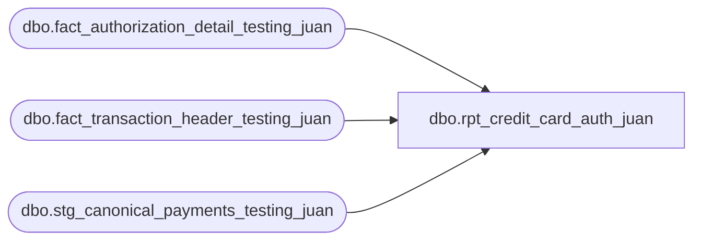

# dbo.rpt_credit_card_auth_juan

**Database:** LH_Source  
**Server:** 4db76rlxaxcuvmuh5kw37wbnqq-ovsykae43znuhlmnflcdwm4ohu.datawarehouse.fabric.microsoft.com  

## Architecture Diagram



## Table Dependencies

| Referenced Table |
|---|
| dbo.fact_authorization_detail_testing_juan |
| dbo.fact_transaction_header_testing_juan |
| dbo.stg_canonical_payments_testing_juan |

## View Code

```sql
CREATE   VIEW [dbo].[rpt_credit_card_auth_juan] AS SELECT      a.store_no          AS [Store Number],      a.transaction_date  AS [Transaction Date],      a.transaction_no    AS [Transaction Number],      a.register_no       AS [Register Number],      a.tender_total      AS [Tender Total Amount (Native Currency)],      b.reference_no      AS [Reference Number],      SUM(b.tender_amount * 1 * 1) AS [Auth Amount (Native Currency)],      c.authorization_no  AS [Authorization Number],      c.expiry_date       AS [Card Expiry Date],      c.card_type         AS [Card Type],      c.swipe_indicator   AS [Swipe Indicator],      b.line_object       AS [Line Object Code]    FROM dbo.fact_transaction_header_testing_juan     AS a,         dbo.stg_canonical_payments_testing_juan      AS b,             dbo.fact_authorization_detail_testing_juan   AS c   WHERE a.transaction_id = b.transaction_id     AND b.transaction_id = c.transaction_id     AND b.line_id        = c.line_id     AND ( a.transaction_void_flag = 0     AND   2=2     AND   2=2     AND   2=2     AND   a.transaction_category IN (1,2)     AND   b.line_object IN (604,605,606,608,642,643,670,671,672,673,674,697,698,699) )   GROUP BY      a.store_no, a.transaction_date, a.transaction_no, a.register_no,      a.tender_total, b.reference_no,      c.authorization_no, c.expiry_date, c.card_type, c.swipe_indicator,      b.line_object;
```

