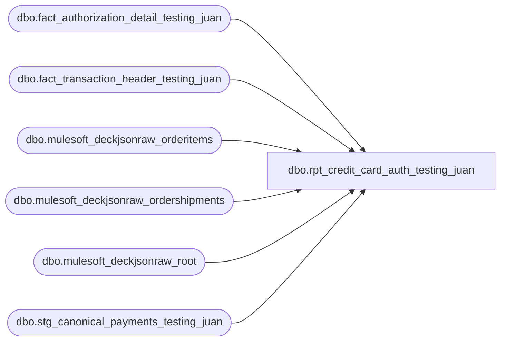

# dbo.rpt_credit_card_auth_testing_juan

**Database:** LH_Source  
**Server:** 4db76rlxaxcuvmuh5kw37wbnqq-ovsykae43znuhlmnflcdwm4ohu.datawarehouse.fabric.microsoft.com  

## Architecture Diagram



## Table Dependencies

| Referenced Table |
|---|
| dbo.fact_authorization_detail_testing_juan |
| dbo.fact_transaction_header_testing_juan |
| dbo.mulesoft_deckjsonraw_orderitems |
| dbo.mulesoft_deckjsonraw_ordershipments |
| dbo.mulesoft_deckjsonraw_root |
| dbo.stg_canonical_payments_testing_juan |

## View Code

```sql
CREATE VIEW [dbo].[rpt_credit_card_auth_testing_juan] AS WITH primary_wh AS (     SELECT OrderID, WarehouseCode       FROM (         SELECT OrderID, WarehouseCode,                ROW_NUMBER() OVER (PARTITION BY OrderID ORDER BY COUNT(*) DESC, WarehouseCode) AS rn           FROM LH_Source.dbo.mulesoft_deckjsonraw_orderitems          GROUP BY OrderID, WarehouseCode       ) x WHERE rn = 1 ), pos_rows AS (     SELECT         a.store_no         AS [Store Number],         a.transaction_date AS [Transaction Date],         a.transaction_no   AS [Transaction Number],         a.register_no      AS [Register Number],         a.tender_total     AS [Tender Total Amount (Native Currency)],         b.reference_no     AS [Reference Number],         SUM(b.tender_amount * 1 * 1) AS [Auth Amount (Native Currency)],         c.authorization_no AS [Authorization Number],         c.expiry_date      AS [Card Expiry Date],         c.card_type        AS [Card Type],         c.swipe_indicator  AS [Swipe Indicator],         c.line_object      AS [Line Object Code]       FROM dbo.fact_transaction_header_testing_juan a       JOIN dbo.stg_canonical_payments_testing_juan  b ON a.transaction_id = b.transaction_id       JOIN dbo.fact_authorization_detail_testing_juan c ON b.transaction_id = c.transaction_id AND b.line_id = c.line_id      WHERE a.transaction_void_flag = 0        AND a.transaction_category IN (1,2)        AND c.line_object IN (604,605,606,608,642,643,670,671,672,673,674,697,698,699)        AND c.source_system = 'JUMPMIND'      GROUP BY a.store_no, a.transaction_date, a.transaction_no, a.register_no, a.tender_total, b.reference_no,               c.authorization_no, c.expiry_date, c.card_type, c.swipe_indicator, c.line_object ), ecom_rows AS (     SELECT         CAST(LTRIM(pw.WarehouseCode, '0') AS int)                      AS [Store Number],         CAST(COALESCE(s.DateShipped, a.transaction_date) AS date)       AS [Transaction Date],         a.transaction_no   AS [Transaction Number],         a.register_no      AS [Register Number],         a.tender_total     AS [Tender Total Amount (Native Currency)],         b.reference_no     AS [Reference Number],         SUM(b.tender_amount * 1 * 1) AS [Auth Amount (Native Currency)],         c.authorization_no AS [Authorization Number],         c.expiry_date      AS [Card Expiry Date],         c.card_type        AS [Card Type],         c.swipe_indicator  AS [Swipe Indicator],         c.line_object      AS [Line Object Code]       FROM dbo.fact_transaction_header_testing_juan a       JOIN dbo.stg_canonical_payments_testing_juan  b ON a.transaction_id = b.transaction_id       JOIN dbo.fact_authorization_detail_testing_juan c ON b.transaction_id = c.transaction_id AND b.line_id = c.line_id       JOIN LH_Source.dbo.mulesoft_deckjsonraw_root djr ON djr.OrderNumber = a.transaction_id       OUTER APPLY (           /* OUTER APPLY (was CROSS APPLY): refund-leg rows belong to already-shipped              orders; the Shipped='True' record exists but may not be visible in the              same transaction window. OUTER APPLY retains the row and the COALESCE              on DateShipped falls back to a.transaction_date so no date is lost. */           SELECT TOP 1 sx.DateShipped             FROM LH_Source.dbo.mulesoft_deckjsonraw_ordershipments sx            WHERE sx._ParentKeyField = djr.OrderID AND sx.Shipped = 'True'            ORDER BY sx.DateShipped       ) s       JOIN primary_wh pw ON pw.OrderID = djr.OrderID      WHERE a.transaction_void_flag = 0        AND a.transaction_category IN (1,2)        AND c.line_object IN (604,605,606,608,642,643,670,671,672,673,674,697,698,699)        AND c.source_system = 'DECK_OMS'        AND djr.Settled  = 'True'        AND djr.SiteCode = 'BAB'        AND pw.WarehouseCode IN ('0001','0002','0003','0004','0005','0006','0007','0008','0009','0010')      GROUP BY pw.WarehouseCode, COALESCE(s.DateShipped, a.transaction_date),               a.transaction_no, a.register_no, a.tender_total, b.reference_no,               c.authorization_no, c.expiry_date, c.card_type, c.swipe_indicator, c.line_object ) SELECT * FROM pos_rows UNION ALL SELECT * FROM ecom_rows;
```

