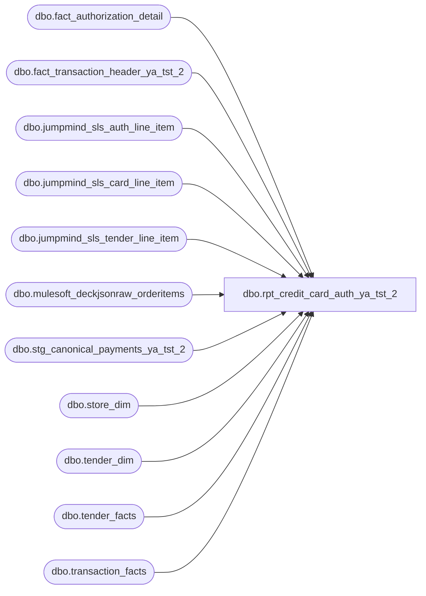

# dbo.rpt_credit_card_auth_ya_tst_2

**Database:** LH_Source  
**Server:** 4db76rlxaxcuvmuh5kw37wbnqq-ovsykae43znuhlmnflcdwm4ohu.datawarehouse.fabric.microsoft.com  

## Architecture Diagram



## Table Dependencies

| Referenced Table |
|---|
| dbo.fact_authorization_detail |
| dbo.fact_transaction_header_ya_tst_2 |
| dbo.jumpmind_sls_auth_line_item |
| dbo.jumpmind_sls_card_line_item |
| dbo.jumpmind_sls_tender_line_item |
| dbo.mulesoft_deckjsonraw_orderitems |
| dbo.stg_canonical_payments_ya_tst_2 |
| dbo.store_dim |
| dbo.tender_dim |
| dbo.tender_facts |
| dbo.transaction_facts |

## View Code

```sql
-- DEVIATION FROM CANONICAL: SmartLook source uses generic Field_a..Field_n -- column aliases. This port renames them to BAB-style descriptive brackets  CREATE   VIEW dbo.rpt_credit_card_auth_ya_tst_2 AS WITH primary_wh AS (     SELECT OrderID, WarehouseCode       FROM (         SELECT OrderID, WarehouseCode,                ROW_NUMBER() OVER (PARTITION BY OrderID ORDER BY COUNT(*) DESC, WarehouseCode) AS rn           FROM LH_Source.dbo.mulesoft_deckjsonraw_orderitems          GROUP BY OrderID, WarehouseCode       ) x WHERE rn = 1 ), pos_rows AS (     /* POS branch — main path via fact_authorization_detail.        Applies R1 (line_object IN list), R2 (filter on BOTH line- and auth-        side line_object), R3 (register_no < 100). */     SELECT         a.store_no         AS [Store Number],         a.transaction_date AS [Transaction Date],         a.transaction_no   AS [Transaction Number],         a.register_no      AS [Register Number],         a.tender_total     AS [Tender Total Amount (Native Currency)],         b.reference_no     AS [Reference Number],         SUM(b.tender_amount * 1 * 1) AS [Auth Amount (Native Currency)],         c.authorization_no AS [Authorization Number],         c.expiry_date      AS [Card Expiry Date],         c.card_type        AS [Card Type],         COALESCE(c.swipe_indicator, '1') AS [Swipe Indicator],         b.line_object      AS [Line Object Code]       FROM dbo.fact_transaction_header_ya_tst_2 a       JOIN dbo.stg_canonical_payments_ya_tst_2  b ON a.transaction_id = b.transaction_id       JOIN dbo.fact_authorization_detail c ON b.transaction_id = c.transaction_id AND b.line_id = c.line_id      WHERE a.transaction_void_flag = 0        AND a.transaction_category IN (1,2)        AND b.line_object IN (604,605,606,608,642,643,670,671,672,673,674,697,698,699)        AND c.line_object IN (604,605,606,608,642,643,670,671,672,673,674,697,698,699)        AND c.source_system = 'JUMPMIND'        AND TRY_CONVERT(int, a.register_no) IS NOT NULL        AND TRY_CONVERT(int, a.register_no) < 100      GROUP BY a.store_no, a.transaction_date, a.transaction_no, a.register_no, a.tender_total, b.reference_no,               c.authorization_no, c.expiry_date, c.card_type, c.swipe_indicator, b.line_object ), pos_tender_fallback AS (     /* POS branch — fallback path for transactions where the Stage-2 ETL        failed to populate fact_authorization_detail. Reads tender line        items directly from the operational JumpMind staging and synthesises        auth-detail-shaped columns from card_line / auth_line metadata. */     SELECT         a.store_no         AS [Store Number],         a.transaction_date AS [Transaction Date],         a.transaction_no   AS [Transaction Number],         a.register_no      AS [Register Number],         a.tender_total     AS [Tender Total Amount (Native Currency)],         cli.masked_card_number AS [Reference Number],         SUM(tli.tender_amount) AS [Auth Amount (Native Currency)],         ali.auth_code      AS [Authorization Number],         cli.expiration_date AS [Card Expiry Date],         CASE             WHEN UPPER(cli.brand) IN ('VISA','V')                                   THEN 'V'             WHEN UPPER(cli.brand) IN ('MASTERCARD','MC','M')                        THEN 'M'             WHEN UPPER(cli.brand) IN ('AMEX','AMERICAN EXPRESS','AMERICAN_EXPRESS','A') THEN 'A'             WHEN UPPER(cli.brand) IN ('DISCOVER','D')                               THEN 'D'             WHEN UPPER(cli.brand) IN ('MAESTRO','VPAY','INTERAC_CARD','USPINDEBIT',                                       'DEBIT CARD','DEBIT','SOLO','SWITCH','T')     THEN 'T'             WHEN UPPER(cli.brand) IN ('JCB','J')                                    THEN 'J'             ELSE NULL         END AS [Card Type],         COALESCE(cli.entry_mode, '1') AS [Swipe Indicator],         CASE  -- mirror stg_canonical_payments line_object derivation             WHEN tli.tender_type_code = 'DEBIT_CARD' THEN 611             WHEN tli.tender_type_code = 'CREDIT_CARD' THEN                 CASE                     WHEN UPPER(cli.brand) LIKE 'VISA%'    THEN 604                     WHEN UPPER(cli.brand) LIKE 'MASTER%'  THEN 605                     WHEN UPPER(cli.brand) LIKE 'AMEX%'    THEN 606                     WHEN UPPER(cli.brand) LIKE 'DISC%'    THEN 608                     ELSE 604                 END             ELSE -1         END AS [Line Object Code]       FROM LH_Source.dbo.jumpmind_sls_tender_line_item tli       JOIN LH_Source.dbo.jumpmind_sls_card_line_item cli         ON cli.device_id = tli.device_id        AND cli.business_date = tli.business_date        AND cli.sequence_number = tli.sequence_number        AND cli.ref_line_sequence_number = tli.line_sequence_number       LEFT JOIN LH_Source.dbo.jumpmind_sls_auth_line_item ali         ON ali.device_id = cli.device_id        AND ali.business_date = cli.business_date        AND ali.sequence_number = cli.sequence_number        AND ali.card_line_sequence_number = cli.line_sequence_number        AND (ali.voided = 0)       -- Re-derive the synthetic transaction_id so we can left-anti-join fact_authorization_detail       LEFT JOIN dbo.fact_authorization_detail c         ON c.transaction_id = CAST(tli.device_id AS varchar(64)) + '|' +                               CAST(tli.business_date AS varchar(8)) + '|' +                               CAST(tli.sequence_number AS varchar(20))        AND c.line_id = tli.line_sequence_number       -- Join header for context fields       JOIN dbo.fact_transaction_header_ya_tst_2 a         ON a.transaction_id = CAST(tli.device_id AS varchar(64)) + '|' +                               CAST(tli.business_date AS varchar(8)) + '|' +                               CAST(tli.sequence_number AS varchar(20))      WHERE tli.voided = 0        AND tli.tender_type_code = 'CREDIT_CARD'      -- R1: exclude debit (611)        AND a.transaction_void_flag = 0        AND a.transaction_category IN (1,2)        AND c.transaction_id IS NULL                  -- LEFT-ANTI: only rows missing from fact_authorization_detail        AND TRY_CONVERT(int, a.register_no) IS NOT NULL        AND TRY_CONVERT(int, a.register_no) < 100     -- R3      GROUP BY a.store_no, a.transaction_date, a.transaction_no, a.register_no, a.tender_total,               cli.masked_card_number, ali.auth_code, cli.expiration_date, cli.brand,               tli.tender_type_code, cli.entry_mode ), /* R4: web/OMS branch intentionally OMITTED — covered via canonical-accounting    catch-all (lh_mart_cc_catchall) using the AuditWorks transaction_no key. */ pos_aa_by_canonical_lo AS (     /* Per (Store, Date, TxNo, canonical_line_object) sum of POS-branch        Auth Amount values. Folds Adyen-route line_objects        (697 / 698 / 699) onto their standard-route partners        (606 / 604 / 605) so an Adyen-encoded leg in the catch-all is        compared against the same physical card's standard-route POS        coverage. Used by lh_mart_cc_catchall to compute the        not-yet-covered residual, and by catchall_amount_dup_suppressed        for the cross-brand same-amount cleanup. */     SELECT         [Store Number], [Transaction Date], [Transaction Number],         CASE             WHEN [Line Object Code] = 698 THEN 604             WHEN [Line Object Code] = 699 THEN 605             WHEN [Line Object Code] = 697 THEN 606             ELSE [Line Object Code]         END AS canonical_lo,         SUM([Auth Amount (Native Currency)]) AS pos_aa_total       FROM (             SELECT [Store Number], [Transaction Date], [Transaction Number],                    [Line Object Code], [Auth Amount (Native Currency)]               FROM pos_rows             UNION ALL             SELECT [Store Number], [Transaction Date], [Transaction Number],                    [Line Object Code], [Auth Amount (Native Currency)]               FROM pos_tender_fallback       ) p      GROUP BY         [Store Number], [Transaction Date], [Transaction Number],         CASE             WHEN [Line Object Code] = 698 THEN 604             WHEN [Line Object Code] = 699 THEN 605             WHEN [Line Object Code] = 697 THEN 606             ELSE [Line Object Code]         END ), mart_gross_receipt AS (     /* Per-transaction non-tax tender-facts sum used in the two-arm        Formula-C tender_total derivation (see header for derivation).        Mirrors txn_gross_receipt CTE in receivable / paypal / returns        reports. Computed once across all tender legs (not just CC ones)        so that GC-redemption and GC-issuance flows are fully accounted        for by the formula. */     SELECT tf.transaction_id,            SUM(CASE WHEN TRY_CONVERT(int, td.tender_code) = -1 THEN 0                     ELSE tf.tender_amt END) AS non_tax_tender_sum       FROM LH_Mart.dbo.tender_facts tf       JOIN LH_Mart.dbo.tender_dim   td ON td.tender_key = tf.tender_key      GROUP BY tf.transaction_id ), tf_with_code AS (     /* Per-leg projection of LH_Mart.tender_facts joined to tender_dim        so we can address tender_code as an integer.  Materialised once        and reused by both the catch-all source and the partner-route        suppression filter. */     SELECT tf.transaction_id,            tf.tender_amt,            TRY_CONVERT(int, td.tender_code) AS tender_code_int       FROM LH_Mart.dbo.tender_facts tf       JOIN LH_Mart.dbo.tender_dim   td ON td.tender_key = tf.tender_key ), lh_mart_cc_catchall AS (     /* R5: canonical-accounting catch-all. Pulls every CC tender row from        LH_Mart that did not flow into LH_Source's fact_authorization_detail        (store-and-forward auths, CSR refunds, NA-online & UK-online        transactions). Deduped against the POS branches downstream.         Auth Amount: per-leg residual — emits            tender_facts.tender_amt - SUM(POS legs of same canonical_lo)        so this branch contributes only the portion of LH_Mart's        tender-facts amount that is NOT already covered by the        fact_authorization_detail / JumpMind tender-line-item POS        branches above. When POS covers the entire CC amount for a        transaction the residual evaluates to 0 and the row is filtered        out, eliminating the per-leg double-count that was inflating        multi-card POS+catch-all transactions on the order of +N×AA.        The canonical_lo fold (698→604, 699→605, 697→606) is what        lets POS-side standard-route encoding cancel against        catch-all-side Adyen-route encoding for the same physical card.        Tender Total: Formula-C two-arm derivation that matches Linda's        legacy AW header (unchanged from prior shape; one row per        tender_facts leg carrying the same denormalised header total).        Cross-brand suppression for residuals that happen to equal a        differently-coded POS leg's amount is handled downstream by        catchall_amount_dup_suppressed. */     SELECT         [Store Number], [Transaction Date], [Transaction Number], [Register Number],         [Tender Total Amount (Native Currency)],         [Reference Number],         CAST([Auth Amount (Native Currency)] - ISNULL(pos_aa_total, 0) AS decimal(18,6))             AS [Auth Amount (Native Currency)],         [Authorization Number], [Card Expiry Date], [Card Type],         [Swipe Indicator], [Line Object Code]       FROM (         SELECT             CASE WHEN s.store_id < 1000 THEN s.store_id + 1000 ELSE s.store_id END                 AS [Store Number],             CAST(DATEADD(day, m.date_key, '1997-01-04') AS date) AS [Transaction Date],             CAST(m.transaction_no AS varchar(50)) AS [Transaction Number],             CAST(m.register_no   AS varchar(10)) AS [Register Number],             CAST(CASE                     WHEN ISNULL(g.non_tax_tender_sum, 0) = 0                        THEN m.receipt_total_amount - ISNULL(m.redemption_amount, 0)                     ELSE g.non_tax_tender_sum - 2 * ISNULL(m.redemption_amount, 0)                  END AS decimal(18,6))                       AS [Tender Total Amount (Native Currency)],             CAST(NULL AS varchar(80)) AS [Reference Number],             tfc.tender_amt            AS [Auth Amount (Native Currency)],             CAST(NULL AS varchar(50)) AS [Authorization Number],             CAST(NULL AS varchar(10)) AS [Card Expiry Date],             CAST(NULL AS varchar(1))  AS [Card Type],             CAST('1'  AS varchar(1))  AS [Swipe Indicator],             tfc.tender_code_int       AS [Line Object Code],             p.pos_aa_total           FROM LH_Mart.dbo.transaction_facts m           JOIN LH_Mart.dbo.store_dim s             ON s.store_key = m.store_key           JOIN tf_with_code tfc             ON tfc.transaction_id = m.transaction_id           LEFT JOIN mart_gross_receipt g             ON g.transaction_id = m.transaction_id           LEFT JOIN pos_aa_by_canonical_lo p             ON p.[Store Number]      = (CASE WHEN s.store_id < 1000 THEN s.store_id + 1000 ELSE s.store_id END)            AND p.[Transaction Date]  = CAST(DATEADD(day, m.date_key, '1997-01-04') AS date)            AND p.[Transaction Number]= CAST(m.transaction_no AS varchar(50))            AND p.canonical_lo        = CASE                                           WHEN tfc.tender_code_int = 698 THEN 604                                           WHEN tfc.tender_code_int = 699 THEN 605                                           WHEN tfc.tender_code_int = 697 THEN 606                                           ELSE tfc.tender_code_int                                        END          WHERE tfc.tender_code_int IN                /* R1: eligible credit-card line objects. Excludes 611 (debit) and                   674 (Adyen PayPal — operationally classified as a wallet                   receivable, settled separately, not via card processor). */                (604,605,606,608,642,643,670,671,672,673,697,698,699)            AND TRY_CONVERT(int, m.register_no) IS NOT NULL            AND TRY_CONVERT(int, m.register_no) < 100        -- R3       ) catchall_with_pos      WHERE [Auth Amount (Native Currency)] - ISNULL(pos_aa_total, 0) <> 0 ), unioned AS (     /* Union the three branches with a priority tag so multi-branch        (store, date, tx_no) tuples collapse to the highest-fidelity row. */     SELECT *, 1 AS branch_priority FROM pos_rows     UNION ALL     SELECT *, 2 AS branch_priority FROM pos_tender_fallback     UNION ALL     SELECT *, 3 AS branch_priority FROM lh_mart_cc_catchall ), deduped AS (     /* Per-row dedupe.        Partition uses a canonical_line_object that folds Adyen-route        line_objects (697 / 698 / 699) onto their standard-route partner        (606 / 604 / 605). LH_Mart.tender_facts encodes the same        physical card under the Adyen code while fact_authorization_detail        encodes it under the standard code, so a transaction with one        physical Visa leg surfaces as both 604 (POS branch) and 698        (catch-all). Folding them into the same partition lets the        lowest branch_priority (= POS-side) win, matching Linda's        single-row-per-physical-leg grain. */     SELECT         [Store Number], [Transaction Date], [Transaction Number], [Register Number],         [Tender Total Amount (Native Currency)], [Reference Number],         [Auth Amount (Native Currency)], [Authorization Number], [Card Expiry Date],         [Card Type], [Swipe Indicator], [Line Object Code]       FROM (         SELECT *,                ROW_NUMBER() OVER (                    PARTITION BY [Store Number], [Transaction Date], [Transaction Number],                                 CASE                                     WHEN [Line Object Code] = 698 THEN 604                                     WHEN [Line Object Code] = 699 THEN 605                                     WHEN [Line Object Code] = 697 THEN 606                                     ELSE [Line Object Code]                                 END,                                 [Auth Amount (Native Currency)]                    ORDER BY branch_priority,                             CASE WHEN [Reference Number] IS NULL THEN 1 ELSE 0 END                ) AS rn           FROM unioned       ) x      WHERE x.rn = 1 ), catchall_amount_dup_suppressed AS (     /* Cross-brand cleanup. A catch-all row (Reference Number IS NULL)        is dropped when a POS-branch row carries the same Auth Amount on        the same (Store, Date, TxNo) but a DIFFERENT canonical        line_object — i.e. JumpMind/auth_detail records the leg under        one card brand (e.g. 605 = MC) while LH_Mart's tender_facts        records the same physical leg under another (e.g. 698 = Visa        Adyen). Same-canonical_lo POS coverage is already netted out at        the lh_mart_cc_catchall residual subtraction, so we only need        this cleanup for the cross-brand encoding mismatch case. */     SELECT d.*       FROM deduped d      WHERE d.[Line Object Code] NOT IN (697,698,699,604,605,606)   -- always keep non-Visa/MC/Amex/Adyen         OR d.[Reference Number] IS NOT NULL                         -- POS rows always pass         OR NOT EXISTS (            SELECT 1 FROM deduped p             WHERE p.[Store Number]      = d.[Store Number]               AND p.[Transaction Date]  = d.[Transaction Date]               AND p.[Transaction Number]= d.[Transaction Number]               AND p.[Auth Amount (Native Currency)] = d.[Auth Amount (Native Currency)]               AND p.[Reference Number] IS NOT NULL                  -- POS-branch marker               AND CASE                      WHEN p.[Line Object Code] = 698 THEN 604                      WHEN p.[Line Object Code] = 699 THEN 605                      WHEN p.[Line Object Code] = 697 THEN 606                      ELSE p.[Line Object Code]                   END                   <>                   CASE                      WHEN d.[Line Object Code] = 698 THEN 604                      WHEN d.[Line Object Code] = 699 THEN 605                      WHEN d.[Line Object Code] = 697 THEN 606                      ELSE d.[Line Object Code]                   END        ) ) SELECT * FROM catchall_amount_dup_suppressed;
```

