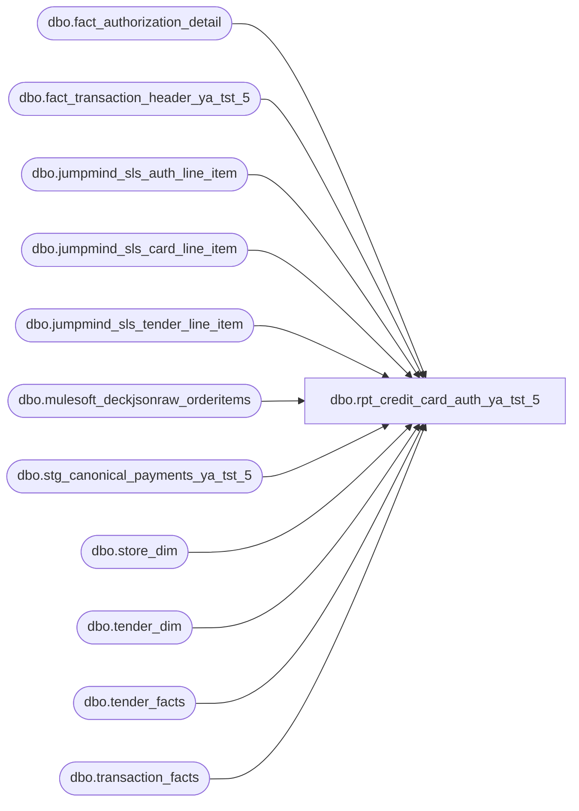

# dbo.rpt_credit_card_auth_ya_tst_5

**Database:** LH_Source  
**Server:** 4db76rlxaxcuvmuh5kw37wbnqq-ovsykae43znuhlmnflcdwm4ohu.datawarehouse.fabric.microsoft.com  

## Architecture Diagram



## Table Dependencies

| Referenced Table |
|---|
| dbo.fact_authorization_detail |
| dbo.fact_transaction_header_ya_tst_5 |
| dbo.jumpmind_sls_auth_line_item |
| dbo.jumpmind_sls_card_line_item |
| dbo.jumpmind_sls_tender_line_item |
| dbo.mulesoft_deckjsonraw_orderitems |
| dbo.stg_canonical_payments_ya_tst_5 |
| dbo.store_dim |
| dbo.tender_dim |
| dbo.tender_facts |
| dbo.transaction_facts |

## View Code

```sql
-- DEVIATION FROM CANONICAL: SmartLook source uses generic Field_a..Field_n -- column aliases. This port renames them to BAB-style descriptive brackets  CREATE   VIEW dbo.rpt_credit_card_auth_ya_tst_5 AS WITH primary_wh AS (     SELECT OrderID, WarehouseCode       FROM (         SELECT OrderID, WarehouseCode,                ROW_NUMBER() OVER (PARTITION BY OrderID ORDER BY COUNT(*) DESC, WarehouseCode) AS rn           FROM LH_Source.dbo.mulesoft_deckjsonraw_orderitems          GROUP BY OrderID, WarehouseCode       ) x WHERE rn = 1 ), txn_adyen_lo AS (     /* Per-transaction tender_facts.tender_code summary used to derive        the processor-route-aware [Line Object Code] on the POS branches.         Legacy AW writes a per-leg line_object on `transaction_line` from        the C# Sales Audit pipeline, which classifies each tender by its        physical processor route (Adyen Canadian -> 698, Adyen UK -> 699,        Adyen Amex / Amex No Ref -> 697, standard rails -> 604 / 605 /        606 by brand).  Linda's xlsx selects this column verbatim        (legacy `b.line_object`). In Fabric, `stg_canonical_payments`        derives line_object purely from card_type / tender_type_raw and        does NOT capture the processor-route distinction (its        AMEX_NO_REF / CANADIAN_CC tender_type_raw branches are dead in        practice: JM source data uses CREDIT_CARD even for Adyen-routed        legs). The processor-route signal survives in        `LH_Mart.tender_facts.tender_code`, which carries 697 / 698 /        699 for Adyen routes and 604 / 605 / 606 for standard rails.         Bridge: LH_Mart.transaction_facts.transaction_id is a different        identifier from LH_Source.fact_transaction_header.transaction_id        (numeric vs the JM `device|date|seq` string). We bridge via the        natural tuple (store_no padded to NA convention, transaction_date,        transaction_no_int, register_no_int), matching the existing        catchall_card_enrichment bridge pattern.         Per-transaction summary:          adyen_non_amex_lo  -> the 698 (CA route) or 699 (UK route)                               tender_code present in tender_facts, else                               NULL. Used for non-Amex CC legs.          has_adyen_amex     -> 1 if any 697 (Amex Adyen) tender_code is                               present in tender_facts, else NULL. Used                               to redirect Amex legs to 697.        When BOTH are NULL the transaction is on the standard route and        per-leg [Line Object Code] falls back to `c.line_object` (the        brand-encoded 604 / 605 / 606 / 608 / 642). */     SELECT         (CASE WHEN s.store_id < 1000 THEN s.store_id + 1000 ELSE s.store_id END)                                                                  AS store_no_padded,         CAST(DATEADD(day, m.date_key, '1997-01-04') AS date)     AS transaction_date,         TRY_CONVERT(int, m.transaction_no)                       AS transaction_no_int,         TRY_CONVERT(int, m.register_no)                          AS register_no_int,         MAX(CASE WHEN TRY_CONVERT(int, td.tender_code) IN (698,699)                  THEN TRY_CONVERT(int, td.tender_code) END)      AS adyen_non_amex_lo,         MAX(CASE WHEN TRY_CONVERT(int, td.tender_code) = 697                  THEN 1 END)                                     AS has_adyen_amex       FROM LH_Mart.dbo.transaction_facts m       JOIN LH_Mart.dbo.store_dim        s  ON s.store_key  = m.store_key       JOIN LH_Mart.dbo.tender_facts     tf ON tf.transaction_id = m.transaction_id       JOIN LH_Mart.dbo.tender_dim       td ON td.tender_key = tf.tender_key      WHERE TRY_CONVERT(int, m.transaction_no) IS NOT NULL        AND TRY_CONVERT(int, m.register_no)    IS NOT NULL      GROUP BY         (CASE WHEN s.store_id < 1000 THEN s.store_id + 1000 ELSE s.store_id END),         CAST(DATEADD(day, m.date_key, '1997-01-04') AS date),         TRY_CONVERT(int, m.transaction_no),         TRY_CONVERT(int, m.register_no) ), pos_rows AS (     /* POS branch, main path via fact_authorization_detail.        Applies R1 (CC line_object), R3 (register_no < 100).         Filter authority is the AUTH-side line_object (`fact_authorization_        detail.line_object`, `c.line_object`) because that preserves the        legacy AW per-leg row count. Fabric's `stg_canonical_payments`        reclassifies tap-debit-on-credit-rails legs to 611 / debit, which        drops those legs entirely if we filter on the canonical-payments        side (the catch-all picks them up but at a different grain).         Per-leg grain: one row per (transaction_id, line_id) tuple via the        fact_authorization_detail JOIN. The GROUP BY collapses only when        (reference_no, authorization_no, expiry_date, card_type) collide        (same physical leg ingested twice); each physical leg has a        unique authorization_no so no real collapse occurs.         [Line Object Code] resolution: per-transaction processor-route        lookup against `txn_adyen_lo` (see CTE header for full rationale).        Adyen-routed transactions -> 697 for Amex legs, 698 / 699 for        non-Amex CC legs (whichever the transaction's tender_facts row        carries). Standard-route transactions -> c.line_object (the        brand code from authorization_detail). This matches Linda's        per-leg encoding for both Adyen-routed international stores        (West Edmonton 698 / Bluewater UK 699) and standard-route        international stores (CrossIron Mills CA, which routes through        standard rails despite being Canadian: tender_facts emits 604 /        605 / 606 by brand for it, same as US stores). */     SELECT         a.store_no         AS [Store Number],         a.transaction_date AS [Transaction Date],         a.transaction_no   AS [Transaction Number],         a.register_no      AS [Register Number],         a.tender_total     AS [Tender Total Amount (Native Currency)],         b.reference_no     AS [Reference Number],         SUM(b.tender_amount * 1 * 1) AS [Auth Amount (Native Currency)],         c.authorization_no AS [Authorization Number],         c.expiry_date      AS [Card Expiry Date],         c.card_type        AS [Card Type],         COALESCE(c.swipe_indicator, '1') AS [Swipe Indicator],         CASE             WHEN c.card_type = 'A' AND e.has_adyen_amex = 1            THEN 697             WHEN c.card_type = 'A' AND e.adyen_non_amex_lo IS NOT NULL THEN 697             WHEN c.card_type <> 'A' AND e.adyen_non_amex_lo IS NOT NULL THEN e.adyen_non_amex_lo             ELSE c.line_object         END                AS [Line Object Code]       FROM dbo.fact_transaction_header_ya_tst_5 a       JOIN dbo.stg_canonical_payments_ya_tst_5  b ON a.transaction_id = b.transaction_id       JOIN dbo.fact_authorization_detail c ON b.transaction_id = c.transaction_id AND b.line_id = c.line_id       LEFT JOIN txn_adyen_lo e         ON e.store_no_padded     = TRY_CONVERT(int, a.store_no)        AND e.transaction_date    = a.transaction_date        AND e.transaction_no_int  = TRY_CONVERT(int, a.transaction_no)        AND e.register_no_int     = TRY_CONVERT(int, a.register_no)      WHERE a.transaction_void_flag = 0        AND a.transaction_category IN (1,2)        AND c.line_object IN (604,605,606,608,642,643,670,671,672,673,674,697,698,699)        AND c.source_system = 'JUMPMIND'        AND TRY_CONVERT(int, a.register_no) IS NOT NULL        AND TRY_CONVERT(int, a.register_no) < 100      GROUP BY a.store_no, a.transaction_date, a.transaction_no, a.register_no, a.tender_total, b.reference_no,               c.authorization_no, c.expiry_date, c.card_type, c.swipe_indicator, c.line_object,               e.adyen_non_amex_lo, e.has_adyen_amex ), pos_tender_fallback AS (     /* POS branch — fallback path for transactions where the Stage-2 ETL        failed to populate fact_authorization_detail. Reads tender line        items directly from the operational JumpMind staging and synthesises        auth-detail-shaped columns from card_line / auth_line metadata. */     SELECT         a.store_no         AS [Store Number],         a.transaction_date AS [Transaction Date],         a.transaction_no   AS [Transaction Number],         a.register_no      AS [Register Number],         a.tender_total     AS [Tender Total Amount (Native Currency)],         cli.masked_card_number AS [Reference Number],         SUM(tli.tender_amount) AS [Auth Amount (Native Currency)],         ali.auth_code      AS [Authorization Number],         cli.expiration_date AS [Card Expiry Date],         CASE             WHEN UPPER(cli.brand) IN ('VISA','V')                                   THEN 'V'             WHEN UPPER(cli.brand) IN ('MASTERCARD','MC','M')                        THEN 'M'             WHEN UPPER(cli.brand) IN ('AMEX','AMERICAN EXPRESS','AMERICAN_EXPRESS','A') THEN 'A'             WHEN UPPER(cli.brand) IN ('DISCOVER','D')                               THEN 'D'             WHEN UPPER(cli.brand) IN ('MAESTRO','VPAY','INTERAC_CARD','USPINDEBIT',                                       'DEBIT CARD','DEBIT','SOLO','SWITCH','T')     THEN 'T'             WHEN UPPER(cli.brand) IN ('JCB','J')                                    THEN 'J'             ELSE NULL         END AS [Card Type],         COALESCE(cli.entry_mode, '1') AS [Swipe Indicator],         /* Processor-route-aware line_object, mirroring pos_rows.            See txn_adyen_lo CTE header for the encoding rationale. */         CASE             WHEN tli.tender_type_code = 'DEBIT_CARD' THEN 611             WHEN tli.tender_type_code = 'CREDIT_CARD' THEN                 CASE                     WHEN UPPER(cli.brand) LIKE 'AMEX%'                          AND (e.has_adyen_amex = 1 OR e.adyen_non_amex_lo IS NOT NULL)                                                                           THEN 697                     WHEN UPPER(cli.brand) NOT LIKE 'AMEX%'                          AND e.adyen_non_amex_lo IS NOT NULL               THEN e.adyen_non_amex_lo                     WHEN UPPER(cli.brand) LIKE 'VISA%'                     THEN 604                     WHEN UPPER(cli.brand) LIKE 'MASTER%'                   THEN 605                     WHEN UPPER(cli.brand) LIKE 'AMEX%'                     THEN 606                     WHEN UPPER(cli.brand) LIKE 'DISC%'                     THEN 608                     ELSE 604                 END             ELSE -1         END AS [Line Object Code]       FROM LH_Source.dbo.jumpmind_sls_tender_line_item tli       JOIN LH_Source.dbo.jumpmind_sls_card_line_item cli         ON cli.device_id = tli.device_id        AND cli.business_date = tli.business_date        AND cli.sequence_number = tli.sequence_number        AND cli.ref_line_sequence_number = tli.line_sequence_number       LEFT JOIN LH_Source.dbo.jumpmind_sls_auth_line_item ali         ON ali.device_id = cli.device_id        AND ali.business_date = cli.business_date        AND ali.sequence_number = cli.sequence_number        AND ali.card_line_sequence_number = cli.line_sequence_number        AND (ali.voided = 0)       LEFT JOIN dbo.fact_authorization_detail c         ON c.transaction_id = CAST(tli.device_id AS varchar(64)) + '|' +                               CAST(tli.business_date AS varchar(8)) + '|' +                               CAST(tli.sequence_number AS varchar(20))        AND c.line_id = tli.line_sequence_number       JOIN dbo.fact_transaction_header_ya_tst_5 a         ON a.transaction_id = CAST(tli.device_id AS varchar(64)) + '|' +                               CAST(tli.business_date AS varchar(8)) + '|' +                               CAST(tli.sequence_number AS varchar(20))       LEFT JOIN txn_adyen_lo e         ON e.store_no_padded     = TRY_CONVERT(int, a.store_no)        AND e.transaction_date    = a.transaction_date        AND e.transaction_no_int  = TRY_CONVERT(int, a.transaction_no)        AND e.register_no_int     = TRY_CONVERT(int, a.register_no)      WHERE tli.voided = 0        AND tli.tender_type_code = 'CREDIT_CARD'      -- R1: exclude debit (611)        AND a.transaction_void_flag = 0        AND a.transaction_category IN (1,2)        AND c.transaction_id IS NULL                  -- LEFT-ANTI: only rows missing from fact_authorization_detail        AND TRY_CONVERT(int, a.register_no) IS NOT NULL        AND TRY_CONVERT(int, a.register_no) < 100     -- R3      GROUP BY a.store_no, a.transaction_date, a.transaction_no, a.register_no, a.tender_total,               cli.masked_card_number, ali.auth_code, cli.expiration_date, cli.brand,               tli.tender_type_code, cli.entry_mode,               e.adyen_non_amex_lo, e.has_adyen_amex ), /* R4: web/OMS branch intentionally OMITTED — covered via canonical-accounting    catch-all (lh_mart_cc_catchall) using the AuditWorks transaction_no key. */ pos_aa_by_canonical_lo AS (     /* Per (Store, Date, TxNo, Register) sum of POS-branch Auth Amount        values, bucketed across ALL CC line_objects into a single        canonical_lo = 9999 ("CC bucket"). Used by lh_mart_cc_catchall to        compute the not-yet-covered residual.         Single-bucket rationale: legacy AW codes ALL Adyen-routed credit-        card legs (Visa, MC, Amex, debit-on-credit-rails) under a single        Adyen line_object (e.g. 698) on the transaction_line / auth_detail        row, while LH_Mart.tender_facts independently encodes the        transaction's CC sum under one tender_code (often 698 even when        the underlying physical card is MC). Worked sample        (1215, 2026-01-11, '8223'): two MC legs at fact_authorization_        detail.line_object = 605, two stg_canonical_payments rows at        line_object = 605, but LH_Mart.tender_facts has one row at        tender_code = 698 (Adyen). A per-brand fold (605 vs 698->604) puts        them in different partitions and skips the residual subtraction,        causing the catch-all to emit a $200 row that double-counts the        POS-covered MC legs. Bucketing every CC line_object into one        'CC' partition catches the cross-brand encoding mismatch        uniformly.         Register is part of the grouping key because BBW transaction        numbers are recycled per register: the same store/date/txn_no        routinely lands on two adjacent registers (e.g. a continuation        sale moved between tills), each with its own fact_transaction_        header row and its own POS auth legs. Without register in the        key, POS coverage on register N is over-subtracted from the        catch-all residual on register M, driving the catch-all leg        negative and pulling per-key Auth Amount sums below Linda's. */     SELECT         [Store Number], [Transaction Date], [Transaction Number],         TRY_CONVERT(int, [Register Number]) AS register_int,         9999 AS canonical_lo,         SUM([Auth Amount (Native Currency)]) AS pos_aa_total       FROM (             SELECT [Store Number], [Transaction Date], [Transaction Number],                    [Register Number], [Line Object Code], [Auth Amount (Native Currency)]               FROM pos_rows              WHERE [Line Object Code] IN (604,605,606,608,642,643,670,671,672,673,674,697,698,699)             UNION ALL             SELECT [Store Number], [Transaction Date], [Transaction Number],                    [Register Number], [Line Object Code], [Auth Amount (Native Currency)]               FROM pos_tender_fallback              WHERE [Line Object Code] IN (604,605,606,608,642,643,670,671,672,673,674,697,698,699)       ) p      GROUP BY         [Store Number], [Transaction Date], [Transaction Number],         TRY_CONVERT(int, [Register Number]) ), mart_gross_receipt AS (     /* Per-transaction non-tax tender-facts sum used in the two-arm        Formula-C tender_total derivation (see header for derivation).        Mirrors txn_gross_receipt CTE in receivable / paypal / returns        reports. Computed once across all tender legs (not just CC ones)        so that GC-redemption and GC-issuance flows are fully accounted        for by the formula. */     SELECT tf.transaction_id,            SUM(CASE WHEN TRY_CONVERT(int, td.tender_code) = -1 THEN 0                     ELSE tf.tender_amt END) AS non_tax_tender_sum       FROM LH_Mart.dbo.tender_facts tf       JOIN LH_Mart.dbo.tender_dim   td ON td.tender_key = tf.tender_key      GROUP BY tf.transaction_id ), tf_with_code AS (     /* Per-leg projection of LH_Mart.tender_facts joined to tender_dim        so we can address tender_code as an integer.  Materialised once        and reused by both the catch-all source and the partner-route        suppression filter. */     SELECT tf.transaction_id,            tf.tender_amt,            TRY_CONVERT(int, td.tender_code) AS tender_code_int       FROM LH_Mart.dbo.tender_facts tf       JOIN LH_Mart.dbo.tender_dim   td ON td.tender_key = tf.tender_key ), catchall_card_enrichment AS (     /* Card / auth / reference metadata for transactions that flow into        the LH_Mart catch-all but ALSO exist as JumpMind POS transactions        in our fact tables. Covers the "tap-debit-on-credit-rails" edge        case (R2): stg_canonical_payments classifies the tender as 611        (debit) so pos_rows excludes the row, but        fact_authorization_detail correctly recovers the card brand,        reference number, and auth code from JM card_line_item /        auth_line_item. The catch-all branch previously emitted NULL        for these three columns because it sourced solely from        LH_Mart.tender_facts (no card metadata). This CTE pulls a        deterministic representative card per (store, date, txn_int,        register_int, canonical_line_object) tuple so the catch-all can        LEFT JOIN and surface the JM-side metadata.         Key normalisation: transaction_no and register_no are cast to        int on both sides of the join. fact_transaction_header carries        these as zero-padded varchars ('004', '03175') while        LH_Mart.transaction_facts stores them as small ints (4, 3175),        so a textual CAST(... AS varchar) comparison misses every        padded record. TRY_CONVERT(int, ...) collapses both sides to a        common integer form. Rows where the conversion fails are        excluded from enrichment (the LEFT JOIN downstream still emits        a catch-all row with NULL metadata for those, identical to the        pre-fix shape).         Determinism: MAX() across each metadata column. For a single        physical card the values are constant. For the rare multi-card-        same-canonical-lo case (e.g. two distinct Visas on one txn),        MAX returns the alphabetically-greatest value, which is stable        across runs. Dashboards previously rendered NULL for these        cases; any non-null value is strictly better. */     SELECT         fth.store_no                                                      AS store_no,         fth.transaction_date                                              AS transaction_date,         TRY_CONVERT(int, fth.transaction_no)                              AS transaction_no_int,         TRY_CONVERT(int, fth.register_no)                                 AS register_no_int,         CASE             WHEN c.line_object = 698 THEN 604             WHEN c.line_object = 699 THEN 605             WHEN c.line_object = 697 THEN 606             ELSE c.line_object         END                                                                AS canonical_lo,         MAX(b.reference_no)                                                AS reference_no,         MAX(c.authorization_no)                                            AS authorization_no,         MAX(c.card_type)                                                   AS card_type,         MAX(c.expiry_date)                                                 AS expiry_date,         MAX(COALESCE(c.swipe_indicator, '1'))                              AS swipe_indicator       FROM dbo.fact_transaction_header_ya_tst_5 fth       JOIN dbo.fact_authorization_detail c         ON c.transaction_id = fth.transaction_id       LEFT JOIN dbo.stg_canonical_payments_ya_tst_5 b         ON b.transaction_id = c.transaction_id        AND b.line_id        = c.line_id      WHERE c.source_system = 'JUMPMIND'        AND c.line_object IN (604,605,606,608,642,643,670,671,672,673,674,697,698,699)        AND TRY_CONVERT(int, fth.transaction_no) IS NOT NULL        AND TRY_CONVERT(int, fth.register_no)    IS NOT NULL      GROUP BY fth.store_no, fth.transaction_date,               TRY_CONVERT(int, fth.transaction_no),               TRY_CONVERT(int, fth.register_no),               CASE                   WHEN c.line_object = 698 THEN 604                   WHEN c.line_object = 699 THEN 605                   WHEN c.line_object = 697 THEN 606                   ELSE c.line_object               END ), lh_mart_cc_catchall AS (     /* R5: canonical-accounting catch-all. Pulls every CC tender row from        LH_Mart that did not flow into LH_Source's fact_authorization_detail        (store-and-forward auths, CSR refunds, NA-online & UK-online        transactions). Deduped against the POS branches downstream.         Auth Amount: per-leg residual — emits            tender_facts.tender_amt - SUM(POS legs of same canonical_lo)        so this branch contributes only the portion of LH_Mart's        tender-facts amount that is NOT already covered by the        fact_authorization_detail / JumpMind tender-line-item POS        branches above. When POS covers the entire CC amount for a        transaction the residual evaluates to 0 and the row is filtered        out, eliminating the per-leg double-count that was inflating        multi-card POS+catch-all transactions on the order of +N×AA.        The canonical_lo fold (698→604, 699→605, 697→606) is what        lets POS-side standard-route encoding cancel against        catch-all-side Adyen-route encoding for the same physical card.        Tender Total: Formula-C two-arm derivation that matches Linda's        legacy AW header (unchanged from prior shape; one row per        tender_facts leg carrying the same denormalised header total).        Cross-brand suppression for residuals that happen to equal a        differently-coded POS leg's amount is handled downstream by        catchall_amount_dup_suppressed. */     SELECT         [Store Number], [Transaction Date], [Transaction Number], [Register Number],         [Tender Total Amount (Native Currency)],         [Reference Number],         CAST([Auth Amount (Native Currency)] - ISNULL(pos_aa_total, 0) AS decimal(18,6))             AS [Auth Amount (Native Currency)],         [Authorization Number], [Card Expiry Date], [Card Type],         [Swipe Indicator], [Line Object Code]       FROM (         SELECT             CASE WHEN s.store_id < 1000 THEN s.store_id + 1000 ELSE s.store_id END                 AS [Store Number],             CAST(DATEADD(day, m.date_key, '1997-01-04') AS date) AS [Transaction Date],             CAST(m.transaction_no AS varchar(50)) AS [Transaction Number],             CAST(m.register_no   AS varchar(10)) AS [Register Number],             CAST(CASE                     WHEN ISNULL(g.non_tax_tender_sum, 0) = 0                        THEN m.receipt_total_amount - ISNULL(m.redemption_amount, 0)                     ELSE g.non_tax_tender_sum - 2 * ISNULL(m.redemption_amount, 0)                  END AS decimal(18,6))                       AS [Tender Total Amount (Native Currency)],             /* Enrich ref/auth/card from JM fact_authorization_detail when the                same physical transaction exists on the JM POS side but landed                in this catch-all branch because of the line_object=611                tap-debit-on-credit-rails edge case (R2). Falls back to NULL                when no JM-side counterpart exists (pure OMS web orders). */             ce.reference_no           AS [Reference Number],             tfc.tender_amt            AS [Auth Amount (Native Currency)],             ce.authorization_no       AS [Authorization Number],             ce.expiry_date            AS [Card Expiry Date],             ce.card_type              AS [Card Type],             COALESCE(ce.swipe_indicator, '1') AS [Swipe Indicator],             tfc.tender_code_int       AS [Line Object Code],             p.pos_aa_total           FROM LH_Mart.dbo.transaction_facts m           JOIN LH_Mart.dbo.store_dim s             ON s.store_key = m.store_key           JOIN tf_with_code tfc             ON tfc.transaction_id = m.transaction_id           LEFT JOIN mart_gross_receipt g             ON g.transaction_id = m.transaction_id           LEFT JOIN pos_aa_by_canonical_lo p             ON p.[Store Number]      = (CASE WHEN s.store_id < 1000 THEN s.store_id + 1000 ELSE s.store_id END)            AND p.[Transaction Date]  = CAST(DATEADD(day, m.date_key, '1997-01-04') AS date)            AND p.[Transaction Number]= CAST(m.transaction_no AS varchar(50))            AND p.register_int        = TRY_CONVERT(int, m.register_no)            AND p.canonical_lo        = 9999           LEFT JOIN catchall_card_enrichment ce             ON ce.store_no           = (CASE WHEN s.store_id < 1000 THEN s.store_id + 1000 ELSE s.store_id END)            AND ce.transaction_date   = CAST(DATEADD(day, m.date_key, '1997-01-04') AS date)            AND ce.transaction_no_int = TRY_CONVERT(int, m.transaction_no)            AND ce.register_no_int    = TRY_CONVERT(int, m.register_no)            AND ce.canonical_lo       = CASE                                           WHEN tfc.tender_code_int = 698 THEN 604                                           WHEN tfc.tender_code_int = 699 THEN 605                                           WHEN tfc.tender_code_int = 697 THEN 606                                           ELSE tfc.tender_code_int                                        END          WHERE tfc.tender_code_int IN                /* R1: eligible credit-card line objects. Excludes 611 (debit) and                   674 (Adyen PayPal, operationally classified as a wallet                   receivable, settled separately, not via card processor). */                (604,605,606,608,642,643,670,671,672,673,697,698,699)            AND TRY_CONVERT(int, m.register_no) IS NOT NULL            AND TRY_CONVERT(int, m.register_no) < 100        -- R3       ) catchall_with_pos      /* Sign-consistency cap: the residual MUST share its sign with         tender_amt. Without this guard, a transaction whose total         tender_facts CC amount is less than its POS coverage (e.g. a         multi-CC-tender-code transaction where one leg is fully POS-         covered) emits a negative-residual row that drags the per-key         Auth Amount sum below zero. Guard: only emit when residual         sign matches tender_amt sign. */      WHERE (             ([Auth Amount (Native Currency)] > 0              AND [Auth Amount (Native Currency)] - ISNULL(pos_aa_total, 0) > 0)          OR ([Auth Amount (Native Currency)] < 0              AND [Auth Amount (Native Currency)] - ISNULL(pos_aa_total, 0) < 0)        ) ), unioned AS (     /* Union the three branches with a priority tag so multi-branch        (store, date, tx_no) tuples collapse to the highest-fidelity row. */     SELECT *, 1 AS branch_priority FROM pos_rows     UNION ALL     SELECT *, 2 AS branch_priority FROM pos_tender_fallback     UNION ALL     SELECT *, 3 AS branch_priority FROM lh_mart_cc_catchall ), deduped AS (     /* Per-row dedupe.        Partition uses a canonical_line_object that folds Adyen-route        line_objects (697 / 698 / 699) onto their standard-route partner        (606 / 604 / 605). LH_Mart.tender_facts encodes the same        physical card under the Adyen code while fact_authorization_detail        encodes it under the standard code, so a transaction with one        physical Visa leg surfaces as both 604 (POS branch) and 698        (catch-all). Folding them into the same partition lets the        lowest branch_priority (= POS-side) win, matching Linda's        single-row-per-physical-leg grain.         Leg discriminator: ISNULL([Authorization Number], '') is added to        the partition key so distinct physical legs of a transaction        (each carrying a unique authorization_no from        fact_authorization_detail) are not collapsed when their        per-leg Auth Amount happens to coincide. Without it, a multi-card        sale where three Visa legs each authorise $100 (three distinct        physical cards / auth codes) collapses to one row, undercounting        the per-key Auth Amount sum by 2 x $100. Worked sample:        (1085, 2026-01-17, '9400') has four AW legs (auth_no 972483 /        977759 / 981692 / 017024) with gross_line_amount 100 / 100 / 100 /        12.98; the catch-all residual = 0 (POS covers the full        tender_facts.tender_amt = 312.98) so the per-key sum is purely        pos_rows. Pre-fix: dedupe collapses the three $100 legs into one,        pipeline sum = 112.98 vs Linda 312.98 (drift -200). Post-fix:        all four legs preserved, sum = 312.98. */     SELECT         [Store Number], [Transaction Date], [Transaction Number], [Register Number],         [Tender Total Amount (Native Currency)], [Reference Number],         [Auth Amount (Native Currency)], [Authorization Number], [Card Expiry Date],         [Card Type], [Swipe Indicator], [Line Object Code]       FROM (         SELECT *,                ROW_NUMBER() OVER (                    PARTITION BY [Store Number], [Transaction Date], [Transaction Number],                                 CASE                                     WHEN [Line Object Code] = 698 THEN 604                                     WHEN [Line Object Code] = 699 THEN 605                                     WHEN [Line Object Code] = 697 THEN 606                                     ELSE [Line Object Code]                                 END,                                 [Auth Amount (Native Currency)],                                 ISNULL([Authorization Number], ''),                                 ISNULL([Reference Number], '')                    ORDER BY branch_priority,                             CASE WHEN [Reference Number] IS NULL THEN 1 ELSE 0 END                ) AS rn           FROM unioned       ) x      WHERE x.rn = 1 ), catchall_amount_dup_suppressed AS (     /* Cross-brand cleanup. A catch-all row (Reference Number IS NULL)        is dropped when a POS-branch row carries the same Auth Amount on        the same (Store, Date, TxNo) but a DIFFERENT canonical        line_object, i.e. JumpMind/auth_detail records the leg under        one card brand (e.g. 605 = MC) while LH_Mart's tender_facts        records the same physical leg under another (e.g. 698 = Visa        Adyen). Same-canonical_lo POS coverage is already netted out at        the lh_mart_cc_catchall residual subtraction, so we only need        this cleanup for the cross-brand encoding mismatch case.         Note: with catchall_card_enrichment populating Reference Number        on tap-debit-on-credit-rails catch-all rows, those rows now        auto-pass via the `Reference Number IS NOT NULL` test. This is        correct: when the catch-all row carries a real card identity, we        are no longer in the "cross-brand encoding mismatch" suppression        scenario (the catch-all row is itself the canonical record). */     SELECT d.*       FROM deduped d      WHERE d.[Line Object Code] NOT IN (697,698,699,604,605,606)   -- always keep non-Visa/MC/Amex/Adyen         OR d.[Reference Number] IS NOT NULL                         -- POS rows and enriched catch-all always pass         OR NOT EXISTS (            SELECT 1 FROM deduped p             WHERE p.[Store Number]      = d.[Store Number]               AND p.[Transaction Date]  = d.[Transaction Date]               AND p.[Transaction Number]= d.[Transaction Number]               AND p.[Auth Amount (Native Currency)] = d.[Auth Amount (Native Currency)]               AND p.[Reference Number] IS NOT NULL                  -- POS-branch marker               AND CASE                      WHEN p.[Line Object Code] = 698 THEN 604                      WHEN p.[Line Object Code] = 699 THEN 605                      WHEN p.[Line Object Code] = 697 THEN 606                      ELSE p.[Line Object Code]                   END                   <>                   CASE                      WHEN d.[Line Object Code] = 698 THEN 604                      WHEN d.[Line Object Code] = 699 THEN 605                      WHEN d.[Line Object Code] = 697 THEN 606                      ELSE d.[Line Object Code]                   END        ) ) SELECT * FROM catchall_amount_dup_suppressed;
```

