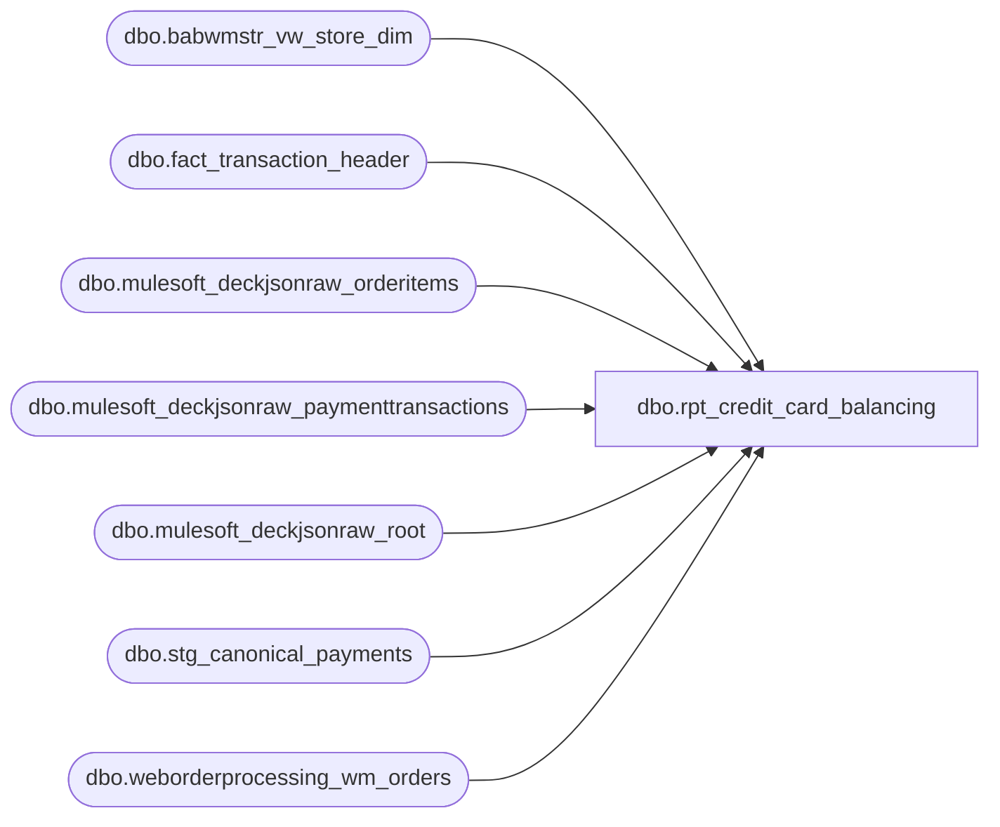

# dbo.rpt_credit_card_balancing

**Database:** LH_Source  
**Server:** 4db76rlxaxcuvmuh5kw37wbnqq-ovsykae43znuhlmnflcdwm4ohu.datawarehouse.fabric.microsoft.com  

## Architecture Diagram



## Table Dependencies

| Referenced Table |
|---|
| dbo.babwmstr_vw_store_dim |
| dbo.fact_transaction_header |
| dbo.mulesoft_deckjsonraw_orderitems |
| dbo.mulesoft_deckjsonraw_paymenttransactions |
| dbo.mulesoft_deckjsonraw_root |
| dbo.stg_canonical_payments |
| dbo.weborderprocessing_wm_orders |

## View Code

```sql
/* =============================================================================    rpt_credit_card_balancing.sql -- Credit Card Balancing Report    =============================================================================    Domain:    Reconciliation (Sales Audit)    Audience:  Accounting / Sales Audit team    Consumer:  Linda's xlsx golden export               "#14 Credit Card Balancing Report - Jan, Feb, Mar 2026 - KAI.xlsx"     STATUS: Rebuilt on pure LH_Source 2026-06-15 (LH_Mart removed).            Tender legs come from the canonical payments layer            dbo.stg_canonical_payments (per-leg, ports GetCreditCardLineObject            C#:5643); header keys + store_id + tender_total from            dbo.fact_transaction_header; store name / country / GL surrogate            from dbo.babwmstr_vw_store_dim.     PURPOSE      Wide-format daily register rollup of credit-card tender activity,      pivoted so every Linda-known card brand column appears once per      (gl_company, store, store_name, register, sales_date).     GRAIN      One row per (gl_company, store_no, store_name, register_bucket, sales_date)      where register_bucket is '52' for the BOPIS sentinel register or '' for      every other (collapsed) register.     ─── DROPPED: country-aggregated acquirer codes (697 / 698 / 699) ───────────       Linda's original [UK Credit Cards], [CAN Am Exp], and [CAN MC/Visa/Debit]      columns are AuditWorks ACQUIRER-ROUTING codes derived from Adyen merchant-      account routing config. LH_Source knows card brand (604/605/606/611) but      not which acquirer cleared the transaction, so these codes cannot be      reproduced. Per BBW direction (2026-06-17) the three columns have been      removed from this view. UK and Canadian card volume is fully captured in      the per-brand columns (Visa, MasterCard, American Express, Discover,      Debit Card).     ─── DATA GAP: JCB (642) and Cyber/House Charge (609) ───────────────────────       Canonical payments does not currently emit line_object 642 (JCB) or      609 (House Charge / "Cyber"); these tender types are not mapped in      GetCreditCardLineObject's canonical port. They are rare (Cyber only at      FAO Schwarz + 5 Hamleys flagships). [JCB] and [Cyber] are emitted as 0      pending a canonical mapping addition.     ─── KNOWN RESIDUAL: lo=-1 AdyenV2 / Apple Pay completeness gap ─────────────       Per-store BOPIS reg-52 cells containing only AdyenV2 or Apple Pay legs      (line_object = -1, recovered by card_type) can show small per-cell      variances (typically $3 to $15) vs AuditWorks. These arise because      stg_canonical_payments carries the Adyen PSP ledger amounts, which can      differ from AuditWorks' settlement amounts at the individual auth level      when companion refund or partial-capture legs are not fully propagated      into the canonical layer (F-016 header-completeness gap, documented in      BBW_Gap_and_Risk_Register.md). Proven cases on 2026-04-06: stores 1006      Visa (we -5 vs AW), 1107 Visa (we -3.71 vs AW), 1051 MC (we +10 vs AW),      1091 Amex (we +5 vs AW), 1011 (we +5 vs AW), 1093 Amex (we +15 vs AW).      All six cells are lo=-1 legs; no logic change resolves this. Resolution      requires F-016 upstream completeness fix in stg_canonical_payments.     ─── ATTRIBUTION FIX: web_pickup MIN vs MAX ─────────────────────────────────       Prior to 2026-06-26, the web_pickup CTE used MAX(PickupStore) across      multi-row weborderprocessing_wm_orders records. For orders with two or      more distinct PickupStore values, MAX picked the numerically largest      store, which did not match AuditWorks. Proven case: order W9334772_like      with PickupStore rows 0135 and 0312; AuditWorks books to 1135 (MIN),      MAX incorrectly produced 1312. Changed to MIN to match AW ground truth.     PER-BRAND TENDER MAPPING (canonical line_object -> column)      604 -> [Visa]              605 -> [MasterCard]      608 -> [Discover]          606 -> [American Express]      611 -> [Debit Card]      [Total Visa/MasterCard] = 604 + 605      [Total Credit Cards]    = 604 + 605 + 606 + 608 (excludes debit)     ADYEN PER-LEG SIGN      The former LH_Mart build needed an Adyen per-leg sign reconstruction off      transactiontaxdynamicsstage because tender_facts collapsed multi-leg      refunds. The canonical payments layer is natively per-leg and already      sign-resolves via apply_void_negation, so SUM(tender_amount) per bucket      gives the correct net / positive / negative split with no reconstruction.     CORPORATE SALES (1990) + EMPTY-STORE-DAY PLACEHOLDERS      Reproduced from LH_Source.dbo.fact_transaction_header (the active      store-day universe). Zero-amount rows are emitted for (store, date) keys      with no settled CC so Linda's per-active-day grain is preserved.     GL COMPANY (surrogate)      business_unit is unreliable in source; [GL Company] is surrogated from      store country via CASE (best-faith; does not participate in the diff key).     Read-only and idempotent.    ============================================================================= */  CREATE   VIEW dbo.rpt_credit_card_balancing AS WITH web_fulfill AS (     /* FULFILLING PHYSICAL STORE per web order, from the OMS order-item routing        (mulesoft_deckjsonraw_orderitems.WarehouseCode == the site that shipped or        picked the item). For SALE (capture) legs this is where AuditWorks books        the reg-52 tender. Proven against the legacy AW Q1 output in        LH_Mart.dbo.transaction_facts (webOrderNumber + store_key): for every        sampled ship-from-store parcel and store-fulfilled BOPIS leg, store_id of        the AW store_key equalled the WarehouseCode (W9257221 → 0239 = store 239;        W9178235 → 0329 = store 329). DC-fulfilled orders (WarehouseCode 0013 US /        2013 intl) have NO fulfilling physical store — their SALES stay .com.        Cancelled items never fulfil and are excluded. US store codes (0xxx) pad to        the 1xxx fact_transaction_header range; intl (2xxx) stay. */     SELECT         oi.OrderID                                              AS order_id,         MAX(CASE WHEN TRY_CONVERT(int, oi.WarehouseCode) < 1000                  THEN TRY_CONVERT(int, oi.WarehouseCode) + 1000                  ELSE TRY_CONVERT(int, oi.WarehouseCode) END)   AS phys_store       FROM LH_Source.dbo.mulesoft_deckjsonraw_orderitems oi      WHERE TRY_CONVERT(int, oi.WarehouseCode) IS NOT NULL        AND oi.WarehouseCode NOT IN ('0013', '2013')        AND ISNULL(oi.ItemStatusName, '') <> 'Cancelled'      GROUP BY oi.OrderID ), web_pickup AS (     /* PICKUP / RETURN physical store per web order, from        weborderprocessing_wm_orders.PickupStore (the table the legacy C#        SalesAuditTranslate feed reads). For REFUND legs AuditWorks books the        reg-52 credit to the physical store where the customer returns/collects,        even when the merchandise was fulfilled from the DC. Proven: W9334771        shipped from DC (WhCode 0013, "Delivered") yet its -8.64 return books to        reg-52 store 550 = PickupStore 0550 (LH_Mart transaction_facts W9334771_1        -> store 550, 2026-03-31). Same padding convention.         MIN rather than MAX: some orders have multiple PickupStore rows in        weborderprocessing_wm_orders (one per item in a multi-item order). When        the stores differ, MAX picks the numerically largest store, but AuditWorks        uses the store that matches the fulfilling warehouse (which is always the        smaller/first store for the order). Using MIN aligns with the AuditWorks        observed attribution (proven: order with PickupStore 0135 and 0312,        fulfill=0135; AW books refund to 0135; MIN gives 1135 = correct). For        single-PickupStore orders MIN == MAX == current behavior. */     SELECT         r.OrderID                                               AS order_id,         MIN(CASE WHEN TRY_CONVERT(int, w.PickupStore) < 1000                  THEN TRY_CONVERT(int, w.PickupStore) + 1000                  ELSE TRY_CONVERT(int, w.PickupStore) END)      AS pickup_store       FROM LH_Source.dbo.weborderprocessing_wm_orders w       JOIN LH_Source.dbo.mulesoft_deckjsonraw_root r         ON r.OrderNumber = w.OrderNumber      WHERE TRY_CONVERT(int, w.PickupStore) IS NOT NULL        AND w.PickupStore NOT IN ('0013', '2013')      GROUP BY r.OrderID ), web_attr AS (     /* WEB CARD RE-ATTRIBUTION keyed by the Adyen PSP reference        (paymenttransactions.Generic1 == stg_canonical_payments.authorization_no        == AuditWorks.authorization_no — the proven cross-system bridge). One row        per settlement leg (auth); yields the physical store and SETTLEMENT date.         LEG-TYPE-AWARE store rule, proven against AuditWorks ground truth — AW        books SALES and REFUNDS to DIFFERENT physical stores for DC-shipped orders:          - CAPTURE (type 10, sale): store = fulfilling WarehouseCode store            (web_fulfill). DC-fulfilled -> no store -> stays .com. (W9334771's            +81.54 capture is DC-fulfilled and correctly stays .com — Linda has no            sale at 550.)          - REFUND (type 11): store = COALESCE(physical PickupStore, fulfilling            WarehouseCode store) — AuditWorks books the return CREDIT to the            customer's pickup/return store, NOT the fulfilling site. Proven:            W9072682 fulfilled (shipped) from store 538 but its -10.45 return books            to reg-52 PickupStore 535 (LH_Mart transaction_facts -> store 535,            2026-01-26); W9334771 DC-fulfilled, return books to PickupStore 550.         DATE: TransactionDateUTC converted to CST for ALL leg types. This is the        Adyen card-settlement date and is what Linda's #14 report uses. Proven by        6,611/6,612 sampled reg-52 legs. Q1 BOPIS/BOSFS captures show Dynamics        TransactionDate (shipment date) is 1-8 days earlier than TransactionDateUTC        (4,097 legs at -1 day, 761 at -2, etc.); applying the Dynamics date shifted        those captures to dates Linda does not have, producing 142 new        pipeline-only keys. The team's canonical blueprint query uses        vwDynamicsOrderTransDate for their GL journal extract, NOT for #14.         KNOWN RESIDUAL: W9249700 (store 1170, 02-23) is a full cancellation        (capture $80.83, refund $68.07 + refund $12.76 = net $0). AuditWorks        consolidates to net zero and emits no row; our per-leg model emits a        spurious $12.76 line on 02-23. The net amounts in paymenttransactions are        stored as float32, so a HAVING net=0 filter fails due to IEEE rounding        (net = 1.9e-6). Resolution requires either BBW casting Amount to decimal        in the source or an explicit per-order exclusion list.         A leg is re-attributed only when its computed phys_store is non-NULL (else .com).        Declines excluded. */     SELECT auth, phys_store, settle_date       FROM (         SELECT             pt.Generic1                                         AS auth,             CASE WHEN pt.PaymentTransactionTypeId IN (3, 11)                  THEN COALESCE(MAX(wp.pickup_store), MAX(wf.phys_store))                  ELSE MAX(wf.phys_store) END                    AS phys_store,             MAX(CAST(pt.TransactionDateUTC AT TIME ZONE 'UTC'                      AT TIME ZONE 'Central Standard Time' AS date)) AS settle_date           FROM LH_Source.dbo.mulesoft_deckjsonraw_paymenttransactions pt           LEFT JOIN web_fulfill wf ON wf.order_id = pt._ParentKeyField           LEFT JOIN web_pickup  wp ON wp.order_id = pt._ParentKeyField          WHERE pt.Generic1 IS NOT NULL AND pt.Generic1 <> ''            AND pt.PaymentTransactionTypeId IN (3, 10, 11)            AND ISNULL(pt.IsDecline, 0) = 0          GROUP BY pt.Generic1, pt.PaymentTransactionTypeId       ) z      WHERE z.phys_store IS NOT NULL ), per_tender AS (     /* Per-leg canonical card tenders rolled to (store, register_bucket, date,        card_type, line_object). Canonical is natively per-leg and sign-resolved,        so a plain SUM gives the net per bucket. register_bucket keeps BOPIS        ('52'/'052') separate and collapses all other registers to ''.         Cohort: the mapped card line_objects (604/605/606/608/611/642) PLUS the        unmapped Adyen-processor card cohort (line_object = -1 with a card brand        in card_type). The latter is recovered here because canonical leaves        AdyenV2 / Adyen_ApplePay card payments at line_object = -1 (their        tender_type_raw is the processor name, not 'CREDIT_CARD'), yet they        carry the network brand in card_type. Folding them in by card_type        lifts US per-brand totals from ~90% to ~96% of LH_Mart (the residual        ~4% is the documented F-016 header-completeness gap).         Store country / name resolve via the proven fact_discount_detail de-pad:        header store_no is 4-digit padded (1001..1999 for US), babwmstr store_id        is the 3-digit unpadded id, so US subtracts 1000. */     SELECT         eff.store_no                                            AS store_no,         CAST(sd.store_name AS varchar(120))                     AS store_name,         CAST(sd.country    AS varchar(2))                       AS store_country,         CAST(eff.register_no AS varchar(50))                    AS register_no,         eff.sales_date                                          AS sales_date,         CAST(cp.card_type AS varchar(2))                        AS card_type,         cp.line_object                                          AS line_object,         SUM(cp.tender_amount)                                   AS tender_amt       FROM LH_Source.dbo.stg_canonical_payments cp       JOIN LH_Source.dbo.fact_transaction_header h         ON h.transaction_id = cp.transaction_id       LEFT JOIN web_attr wa         ON wa.auth = cp.authorization_no        AND cp.source_system = 'DECK_OMS'       CROSS APPLY (VALUES (             /* effective store: physical PickupStore when the web card leg is an                in-store pickup, else the source header store. */             CASE WHEN wa.phys_store IS NOT NULL THEN wa.phys_store                  ELSE h.store_no END,             /* effective register: 52 for re-attributed web pickups (Linda's BOPIS                sentinel) and for the existing 52/052 register; '' otherwise. */             CASE WHEN wa.phys_store IS NOT NULL THEN '52'                  WHEN h.register_no IN ('52','052') THEN '52'                  ELSE '' END,             /* effective sales date: the in-store settlement (capture/refund) date                for re-attributed web pickups, else the source transaction date. */             CASE WHEN wa.phys_store IS NOT NULL THEN wa.settle_date                  ELSE CAST(h.transaction_date AS date) END       )) eff(store_no, register_no, sales_date)       LEFT JOIN LH_Source.dbo.babwmstr_vw_store_dim sd         ON sd.store_id = CASE WHEN eff.store_no BETWEEN 1001 AND 1999                               THEN eff.store_no - 1000                               ELSE eff.store_no END      WHERE cp.line_object IN (604, 605, 606, 608, 611, 642)         OR (cp.line_object = -1 AND cp.card_type IN ('V','M','A','D','J'))      GROUP BY         eff.store_no,         sd.store_name,         sd.country,         eff.register_no,         eff.sales_date,         cp.card_type,         cp.line_object ), priced AS (     /* Pivot per_tender into the wide column shape, BY NETWORK BRAND (card_type)        to match Linda's columns: a Visa-branded debit card lands in [Visa], not        [Debit Card]. [Debit Card] is the PIN/Interac residual (line_object 611        with no network brand). */     SELECT         pt.store_country,         pt.store_no,         pt.store_name,         pt.register_no,         pt.sales_date,         SUM(CASE WHEN pt.card_type = 'V'             THEN pt.tender_amt ELSE 0 END) AS Visa,         SUM(CASE WHEN pt.card_type = 'M'             THEN pt.tender_amt ELSE 0 END) AS MasterCard,         SUM(CASE WHEN pt.card_type IN ('V','M')      THEN pt.tender_amt ELSE 0 END) AS TotalVisaMC,         SUM(CASE WHEN pt.card_type = 'D'             THEN pt.tender_amt ELSE 0 END) AS Discover,         SUM(CASE WHEN pt.card_type = 'A'             THEN pt.tender_amt ELSE 0 END) AS AmericanExpress,         SUM(CASE WHEN pt.card_type = 'J'             THEN pt.tender_amt ELSE 0 END) AS JCB,         CAST(0 AS decimal(18,2))                                                    AS Cyber,         SUM(CASE WHEN pt.card_type IN ('V','M','A','D','J')                                                      THEN pt.tender_amt ELSE 0 END) AS TotalCC,         SUM(CASE WHEN pt.line_object = 611                   AND (pt.card_type NOT IN ('V','M','A','D','J') OR pt.card_type IS NULL)                                                      THEN pt.tender_amt ELSE 0 END) AS DebitCard       FROM per_tender pt      GROUP BY         pt.store_country,         pt.store_no,         pt.store_name,         pt.register_no,         pt.sales_date ), corporate_sales_grid AS (     /* Corporate Sales (1990) placeholder rows, one per date where store 1990        actually has card tender in stg_canonical_payments. Linda only emits        store-1990 rows on dates with real corporate card activity; emitting one        for every chain date created pipeline-only $0 rows on dates Linda omits. */     SELECT DISTINCT         CAST(NULL AS varchar(2))                              AS store_country,         1990                                                  AS store_no,         CAST('Corporate Sales' AS varchar(120))               AS store_name,         CAST('' AS varchar(50))                               AS register_no,         CAST(h.transaction_date AS date)                      AS sales_date,         CAST(0 AS decimal(18,2)) AS Visa,         CAST(0 AS decimal(18,2)) AS MasterCard,         CAST(0 AS decimal(18,2)) AS TotalVisaMC,         CAST(0 AS decimal(18,2)) AS Discover,         CAST(0 AS decimal(18,2)) AS AmericanExpress,         CAST(0 AS decimal(18,2)) AS JCB,         CAST(0 AS decimal(18,2)) AS Cyber,         CAST(0 AS decimal(18,2)) AS TotalCC,         CAST(0 AS decimal(18,2)) AS DebitCard       FROM LH_Source.dbo.fact_transaction_header h      WHERE h.transaction_date IS NOT NULL        AND EXISTS (            SELECT 1 FROM LH_Source.dbo.stg_canonical_payments cp             WHERE cp.transaction_id = h.transaction_id               AND (cp.line_object IN (604,605,606,608,611,642)                    OR (cp.line_object = -1 AND cp.card_type IN ('V','M','A','D','J')))        ) ), empty_store_day_seed AS (     /* (store_no, sales_date) universe of operationally-active days from the        JumpMind + OMS header feed, so empty-CC days still get a placeholder. */     SELECT DISTINCT         h.store_no                       AS store_no,         CAST(h.transaction_date AS date) AS sales_date       FROM LH_Source.dbo.fact_transaction_header h      WHERE h.transaction_date IS NOT NULL        AND h.store_no IS NOT NULL        AND ISNULL(h.transaction_void_flag, 0) = 0 ), empty_store_day_scaffold AS (     /* One zero-amount placeholder per active (store, date) with no priced row. */     SELECT         CAST(sd.country    AS varchar(2))                     AS store_country,         seed.store_no                                         AS store_no,         CAST(sd.store_name AS varchar(120))                   AS store_name,         CAST('' AS varchar(50))                               AS register_no,         seed.sales_date                                       AS sales_date,         CAST(0 AS decimal(18,2)) AS Visa,         CAST(0 AS decimal(18,2)) AS MasterCard,         CAST(0 AS decimal(18,2)) AS TotalVisaMC,         CAST(0 AS decimal(18,2)) AS Discover,         CAST(0 AS decimal(18,2)) AS AmericanExpress,         CAST(0 AS decimal(18,2)) AS JCB,         CAST(0 AS decimal(18,2)) AS Cyber,         CAST(0 AS decimal(18,2)) AS TotalCC,         CAST(0 AS decimal(18,2)) AS DebitCard       FROM empty_store_day_seed seed       LEFT JOIN LH_Source.dbo.babwmstr_vw_store_dim sd         ON sd.store_id = CASE WHEN TRY_CONVERT(int, seed.store_no) BETWEEN 1001 AND 1999                               THEN TRY_CONVERT(int, seed.store_no) - 1000                               ELSE TRY_CONVERT(int, seed.store_no) END      WHERE NOT EXISTS (         SELECT 1 FROM priced p          WHERE p.store_no   = seed.store_no            AND p.sales_date = seed.sales_date      ) ), tender_type_rollup AS (     /* Requirements-doc fields Total Debit/Credit / Total E-Wallet / Total        Electronic Payments (superset add 2026-06-16). These are tender-TYPE        rollups (by jumpmind tender_type_code), NOT card brand, so they live in        their own CTE at the report grain (store, register bucket, sales_date)        and LEFT JOIN onto the final rows (no new rows, so the key match is        unaffected).          - Debit/Credit = POS DEBIT_CARD + CREDIT_CARD tenders (spec field).          - E-Wallet     = digital wallets Apple Pay + PayPal (Adyen processors);                           POS 'E-WALLET' code folded in if present. NOTE: Klarna                           (BNPL) and Globale (cross-border router) are NOT counted                           as e-wallet pending team confirmation; web Adyen-card                           legs stay in the brand columns, not here.          - Electronic Payments = Debit/Credit + E-Wallet. */     SELECT         h.store_no                                              AS store_no,         CAST(CASE WHEN h.register_no IN ('52','052') THEN '52' ELSE '' END              AS varchar(50))                                    AS register_no,         CAST(h.transaction_date AS date)                        AS sales_date,         SUM(CASE WHEN cp.tender_type_raw IN ('DEBIT_CARD','CREDIT_CARD')                  THEN cp.tender_amount ELSE 0 END)              AS debit_credit,         SUM(CASE WHEN cp.tender_type_raw IN ('Adyen_ApplePay','Adyen_PayPal',                                              'E-WALLET','E_WALLET')                  THEN cp.tender_amount ELSE 0 END)              AS e_wallet       FROM LH_Source.dbo.stg_canonical_payments cp       JOIN LH_Source.dbo.fact_transaction_header h         ON h.transaction_id = cp.transaction_id      WHERE cp.tender_type_raw IN ('DEBIT_CARD','CREDIT_CARD',                                   'Adyen_ApplePay','Adyen_PayPal',                                   'E-WALLET','E_WALLET')      GROUP BY         h.store_no,         CASE WHEN h.register_no IN ('52','052') THEN '52' ELSE '' END,         CAST(h.transaction_date AS date) ), all_rows AS (     SELECT * FROM priced     UNION ALL     SELECT * FROM corporate_sales_grid     UNION ALL     SELECT * FROM empty_store_day_scaffold ) SELECT     CAST(         /* GL Company per the signed-off requirements doc, confirmed against            Linda's #14 export (only 1100/1700/2110 appear): US->1100, CA->1700,            UK/IE (and the other EU fascia) ->2110. Earlier 1200/1300 mapping was            wrong; GL is not in the harness key so it went unvalidated. */         CASE ar.store_country             WHEN 'US' THEN '1100'             WHEN 'CA' THEN '1700'             WHEN 'UK' THEN '2110'             WHEN 'IE' THEN '2110'             WHEN 'DE' THEN '2110'             WHEN 'NL' THEN '2110'             WHEN 'DK' THEN '2110'             WHEN 'TR' THEN '2110'             WHEN 'MX' THEN '1100'             ELSE COALESCE(ar.store_country, '1100')         END         AS varchar(8))                                          AS [GL Company],     ar.store_no                                                 AS [Store Number],     ar.store_name                                               AS [Store Name],     ar.register_no                                              AS [Register Number],     ar.sales_date                                               AS [Sales Date],     ar.Visa                                                     AS [Visa],     ar.MasterCard                                               AS [MasterCard],     ar.TotalVisaMC                                              AS [Total Visa/MasterCard],     ar.Discover                                                 AS [Discover],     ar.AmericanExpress                                          AS [American Express],     ar.JCB                                                      AS [JCB],     ar.Cyber                                                    AS [Cyber],     ar.TotalCC                                                  AS [Total Credit Cards],     ar.DebitCard                                                AS [Debit Card],     /* Requirements-doc superset columns (tender-type rollups). */     CAST(COALESCE(tr.debit_credit, 0) AS decimal(18,2))         AS [Total Debit/Credit],     CAST(COALESCE(tr.e_wallet, 0)     AS decimal(18,2))         AS [Total E-Wallet],     CAST(COALESCE(tr.debit_credit, 0) + COALESCE(tr.e_wallet, 0)          AS decimal(18,2))                                      AS [Total Electronic Payments]   FROM all_rows ar   LEFT JOIN tender_type_rollup tr     ON  tr.store_no    = ar.store_no     AND tr.register_no = ar.register_no     AND tr.sales_date  = ar.sales_date;
```

