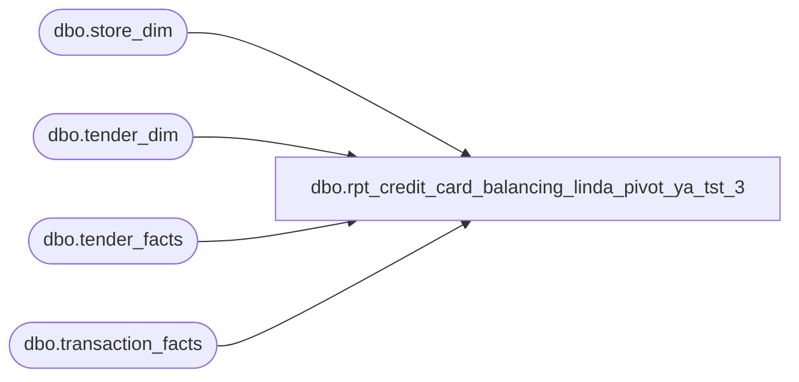

# dbo.rpt_credit_card_balancing_linda_pivot_ya_tst_3

**Database:** LH_Source  
**Server:** 4db76rlxaxcuvmuh5kw37wbnqq-ovsykae43znuhlmnflcdwm4ohu.datawarehouse.fabric.microsoft.com  

## Architecture Diagram



## Table Dependencies

| Referenced Table |
|---|
| dbo.store_dim |
| dbo.tender_dim |
| dbo.tender_facts |
| dbo.transaction_facts |

## View Code

```sql
CREATE   VIEW dbo.rpt_credit_card_balancing_linda_pivot_ya_tst_3 AS WITH /* per_tender — tender_facts pulled to a daily-register grain, keyed on    the (store_no, register_no, transaction_date) primary axis. */ per_tender AS (     SELECT         CASE             WHEN sd.store_id < 1000 THEN sd.store_id + 1000             ELSE sd.store_id         END                                                   AS store_no,         CAST(sd.store_name AS varchar(120))                   AS store_name,         CAST(sd.country AS varchar(2))                        AS store_country,         CAST(tf.register_no AS varchar(50))                   AS register_no,         CAST(DATEADD(d, tf.date_key, '1997-01-04') AS date)   AS sales_date,         td.tender_code                                        AS tender_code,         SUM(tfx.tender_amt)                                   AS tender_amt       FROM LH_Mart.dbo.transaction_facts tf       JOIN LH_Mart.dbo.tender_facts      tfx ON tfx.transaction_id = tf.transaction_id       JOIN LH_Mart.dbo.tender_dim        td  ON td.tender_key = tfx.tender_key       JOIN LH_Mart.dbo.store_dim         sd  ON sd.store_key  = tf.store_key      WHERE TRY_CONVERT(int, td.tender_code) BETWEEN 604 AND 699        AND sd.store_id IS NOT NULL        AND sd.store_id <> 385                  /* exclude QA test store */      GROUP BY         sd.store_id,         sd.store_name,         sd.country,         tf.register_no,         tf.date_key,         td.tender_code ) SELECT     /* Field_a — gl_company surrogate from store country (U3). */     CAST(         CASE pt.store_country             WHEN 'US' THEN '1100'             WHEN 'CA' THEN '1200'             WHEN 'UK' THEN '1300'             WHEN 'IE' THEN '1300'             WHEN 'DE' THEN '1300'             WHEN 'NL' THEN '1300'             WHEN 'DK' THEN '1300'             WHEN 'TR' THEN '1300'             WHEN 'AE' THEN '1400'             WHEN 'CN' THEN '1500'             WHEN 'AU' THEN '1600'             WHEN 'KR' THEN '1700'             WHEN 'TH' THEN '1700'             WHEN 'SG' THEN '1700'             WHEN 'TW' THEN '1700'             WHEN 'ZA' THEN '1800'             WHEN 'BR' THEN '1900'             WHEN 'MX' THEN '1100'             ELSE COALESCE(pt.store_country, 'UNK')         END         AS varchar(8))                                              AS [GL Company],      pt.store_no                                                     AS [Store Number],     pt.store_name                                                   AS [Store Name],     pt.register_no                                                  AS [Register Number],     pt.sales_date                                                   AS [Sales Date],      /* Field_f .. q — per-tender pivot. */     SUM(CASE WHEN pt.tender_code IN ('604','670')        THEN pt.tender_amt ELSE 0 END)                                                                     AS [Visa],     SUM(CASE WHEN pt.tender_code IN ('605','671')        THEN pt.tender_amt ELSE 0 END)                                                                     AS [MasterCard],     SUM(CASE WHEN pt.tender_code IN ('604','670','605','671')                                                          THEN pt.tender_amt ELSE 0 END)                                                                     AS [Total Visa/MasterCard],     SUM(CASE WHEN pt.tender_code IN ('608','672')        THEN pt.tender_amt ELSE 0 END)                                                                     AS [Discover],     SUM(CASE WHEN pt.tender_code IN ('606','673')        THEN pt.tender_amt ELSE 0 END)                                                                     AS [American Express],     SUM(CASE WHEN pt.tender_code = '642'                 THEN pt.tender_amt ELSE 0 END)                                                                     AS [JCB],     /* Field_l — Cyber: tender_code 609 ('House Charge') at partner/licensed        venues (FAO Schwarz, Hamleys flagships). See header mapping note. */     SUM(CASE WHEN pt.tender_code = '609'                 THEN pt.tender_amt ELSE 0 END)                                                                     AS [Cyber],     SUM(CASE WHEN pt.tender_code = '699'                 THEN pt.tender_amt ELSE 0 END)                                                                     AS [UK Credit Cards],     /* Field_n — CAN Am Exp: tender_code 697 ('American Express (No Ref)').        Never emitted at US stores; carries CA + UK AmEx activity. See        header mapping note for why 697 was removed from [American Express]. */     SUM(CASE WHEN pt.tender_code = '697'                 THEN pt.tender_amt ELSE 0 END)                                                                     AS [CAN Am Exp],     SUM(CASE WHEN pt.tender_code = '698'                 THEN pt.tender_amt ELSE 0 END)                                                                     AS [CAN MC/Visa/Debit],     SUM(CASE WHEN pt.tender_code IN             ('604','670','605','671','608','672','606','673',              '642','609','699','697','698')                                                          THEN pt.tender_amt ELSE 0 END)                                                                     AS [Total Credit Cards],     SUM(CASE WHEN pt.tender_code = '611'                 THEN pt.tender_amt ELSE 0 END)                                                                     AS [Debit Card]   FROM per_tender pt  GROUP BY     pt.store_country,     pt.store_no,     pt.store_name,     pt.register_no,     pt.sales_date;
```

