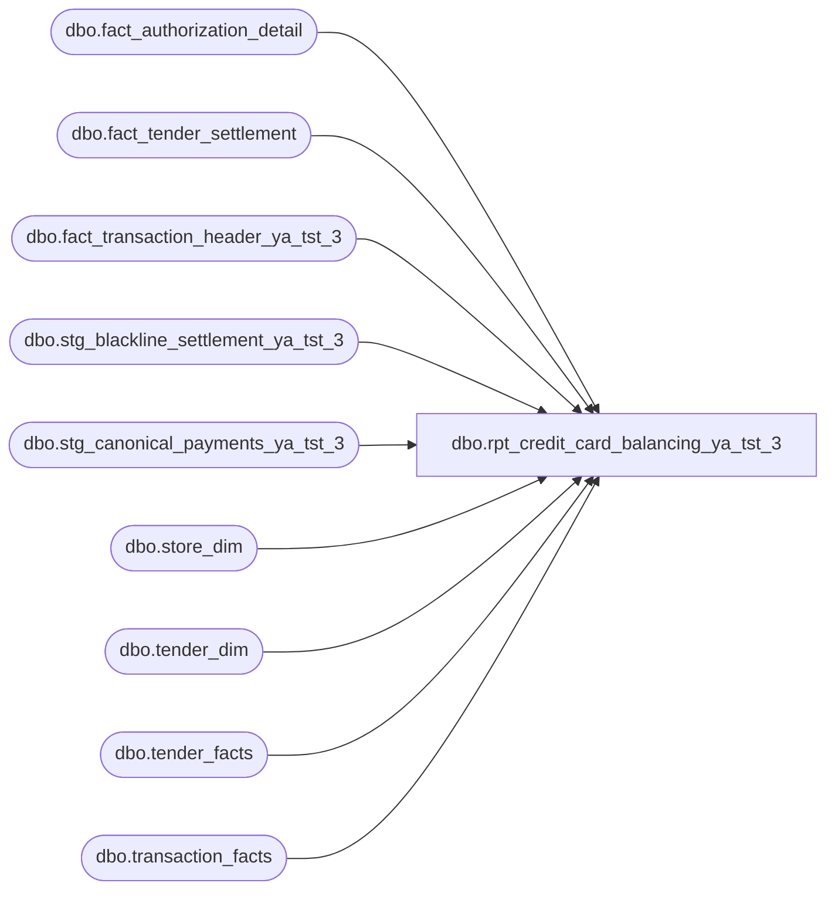

# dbo.rpt_credit_card_balancing_ya_tst_3

**Database:** LH_Source  
**Server:** 4db76rlxaxcuvmuh5kw37wbnqq-ovsykae43znuhlmnflcdwm4ohu.datawarehouse.fabric.microsoft.com  

## Architecture Diagram



## Table Dependencies

| Referenced Table |
|---|
| dbo.fact_authorization_detail |
| dbo.fact_tender_settlement |
| dbo.fact_transaction_header_ya_tst_3 |
| dbo.stg_blackline_settlement_ya_tst_3 |
| dbo.stg_canonical_payments_ya_tst_3 |
| dbo.store_dim |
| dbo.tender_dim |
| dbo.tender_facts |
| dbo.transaction_facts |

## View Code

```sql
CREATE   VIEW dbo.rpt_credit_card_balancing_ya_tst_3 AS WITH auth_side AS (     /* POS-side authorisations: tender line items in the credit-card range        (R1: codes 604..699 inclusive) for non-voided transactions. Carries        short-form `card_type` ('V','M','A','D','T','J'); see FEED-DEDUP        RULE in the header for cross-feed collapse logic. */     SELECT         h.store_no,         h.transaction_date,         CAST(h.transaction_no AS varchar(50))          AS transaction_no,         a.authorization_no,         a.card_type,         p.line_object,         p.tender_amount                                AS auth_amount,         1                                              AS feed_priority       FROM dbo.fact_transaction_header_ya_tst_3     AS h       INNER JOIN dbo.fact_authorization_detail AS a ON a.transaction_id = h.transaction_id       LEFT  JOIN dbo.stg_canonical_payments_ya_tst_3    AS p             ON p.transaction_id = a.transaction_id AND p.line_id = a.line_id      WHERE h.transaction_void_flag = 0        AND p.line_object BETWEEN 604 AND 699 ), settle_side AS (     SELECT         ts.store_no,         ts.transaction_date,         ts.transaction_no,         ts.line_object,         ts.settled_amount,         ts.settlement_status,         ts.settlement_reference       FROM dbo.fact_tender_settlement AS ts      WHERE ts.tender_type IN ('CREDIT_CARD','BNPL_OR_WALLET','MAESTRO','JCB') ), lh_mart_cc_catchall AS (     /* Canonical-accounting-side CC tenders (R1: codes 604..699 inclusive,        including 674 = CC refund/chargeback reversals). This branch covers        web/UK store CC activity that does not flow through the POS        authorisation feed (different POS technology stack). Carries        long-form `card_type` ('Visa','Master Card','American Express',        'Discover','UK Credit Card', etc.); see FEED-DEDUP RULE in the        header for cross-feed collapse logic. */     SELECT         CASE WHEN s.store_id < 1000 THEN s.store_id + 1000 ELSE s.store_id END             AS store_no,         CAST(DATEADD(day, m.date_key, '1997-01-04') AS date) AS transaction_date,         CAST(m.transaction_no AS varchar(50))                AS transaction_no,         CAST(NULL AS varchar(80))                            AS authorization_no,         td.tender_desc                                        AS card_type,         TRY_CONVERT(int, td.tender_code)                      AS line_object,         SUM(tf.tender_amt)                                    AS auth_amount,         2                                                     AS feed_priority       FROM LH_Mart.dbo.transaction_facts m       JOIN LH_Mart.dbo.store_dim    s  ON s.store_key  = m.store_key       JOIN LH_Mart.dbo.tender_facts tf ON tf.transaction_id = m.transaction_id       JOIN LH_Mart.dbo.tender_dim   td ON td.tender_key = tf.tender_key      WHERE TRY_CONVERT(int, td.tender_code) BETWEEN 604 AND 699      GROUP BY s.store_id, m.date_key, m.transaction_no, td.tender_desc, td.tender_code ), auth_side_pairs AS (     SELECT DISTINCT store_no, transaction_date FROM auth_side ), lhmart_cc_pairs AS (     SELECT DISTINCT store_no, transaction_date FROM lh_mart_cc_catchall ), corporate_sales_grid AS (     /* (R3e) Corporate Sales (store 1990) — enterprise sales channel        run by corporate office. Zero rows in any Fabric fact table        (verified). Consumer dashboard surfaces a daily placeholder        row for visual consistency. Emit (1990, date) for every        chain-active date (proxy for "corporate office operating day"). */     SELECT 1990 AS store_no, d.transaction_date       FROM (SELECT DISTINCT CAST(h.transaction_date AS date) AS transaction_date               FROM dbo.fact_transaction_header_ya_tst_3 h              WHERE h.transaction_void_flag = 0) d ), lh_nongaap_pairs AS (     /* (R3b) (store, date) pairs from canonical accounting feed with        non-GAAP activity indicators — days a store had real business        activity worth reconciling even if no CC tender was used. */     SELECT DISTINCT         CASE WHEN s.store_id < 1000 THEN s.store_id + 1000 ELSE s.store_id END AS store_no,         CAST(DATEADD(day, m.date_key, '1997-01-04') AS date) AS transaction_date       FROM LH_Mart.dbo.transaction_facts m       JOIN LH_Mart.dbo.store_dim s ON s.store_key = m.store_key      WHERE s.store_id IS NOT NULL        AND s.store_id <> 385                  -- R4: exclude QA test store        AND m.date_key BETWEEN DATEDIFF(day, '1997-01-04', DATEADD(year, -2, GETDATE()))                           AND DATEDIFF(day, '1997-01-04', GETDATE())        AND (m.Store_transaction_flag = 1             OR m.party_flag = 1             OR m.donation_only_flag = 1             OR m.giftcard_only_flag = 1             OR m.party_deposit_only_flag = 1             OR m.Enterprise_Selling_Only_Flag = 1) ), active_selling_pairs AS (     /* (store, date) pairs with substantial non-void POS sale activity        (>= 11 cat=1 transactions). Used as a floor for R3c and R3d to        distinguish legitimate operational selling days from incidental        tender events. The 11-sale threshold was tuned against the        smallest observed legitimate Pop-Up selling day in production. */     SELECT h.store_no, CAST(h.transaction_date AS date) AS transaction_date       FROM dbo.fact_transaction_header_ya_tst_3 h      WHERE h.transaction_category = 1        AND COALESCE(h.transaction_void_flag, 0) = 0      GROUP BY h.store_no, CAST(h.transaction_date AS date)     HAVING COUNT(*) >= 11 ), real_cashier_pairs AS (     /* (store, date) pairs that ran at least one transaction on a        real-cashier register (register_no < 100) — i.e. a staffed,        customer-facing till. Pop-up paired-display registers (100+)        are not real tills and don't, on their own, evidence an        operationally open store-day. Same definition as in R3d        and rpt_blackline_deposit. */     SELECT DISTINCT         h.store_no,         CAST(h.transaction_date AS date) AS transaction_date       FROM dbo.fact_transaction_header_ya_tst_3 h      WHERE TRY_CONVERT(int, h.register_no) IS NOT NULL        AND TRY_CONVERT(int, h.register_no) < 100 ), cobrand_settle_pairs AS (     /* (R3c) (store, date) pairs that posted any        `NonCountedTender_CO_BRAND` entry in the daily cash settlement        feed AND have operational till evidence on the same pair —        either a real-cashier register fired or the day was an active        selling day (>= 11 non-void POS sales). CO_BRAND = Build-A-Bear        co-brand credit cards (BBW Visa, BBW MasterCard); these tender        at the till but the co-brand processor doesn't write rows        into `fact_authorization_detail` or `LH_Mart.tender_facts`,        so the only evidence of co-brand CC use is the        NonCountedTender settlement line.         The till-evidence guard (real-cashier OR active-selling)        excludes incidental tender-only events at sparse-activity        warehouse stores or closed Pop-Up venues whose settlement        system continues to emit stale CO_BRAND entries — those days        have no operational till to reconcile. The active-selling        leg (>= 11 sales) preserves legitimate Pop-Up selling days        that ran exclusively on paired-display registers (100+) but        had substantial selling volume; the real-cashier leg        preserves typical mall-store days where cobrand-only signals        sit alongside ordinary till activity. */     SELECT DISTINCT s.store_no, s.transaction_date       FROM dbo.stg_blackline_settlement_ya_tst_3 s      WHERE s.store_no IS NOT NULL        AND s.transaction_date IS NOT NULL        AND s.reason_code = 'NonCountedTender_CO_BRAND'        AND (               EXISTS (SELECT 1 FROM real_cashier_pairs r                        WHERE r.store_no         = s.store_no                          AND r.transaction_date = s.transaction_date)            OR EXISTS (SELECT 1 FROM active_selling_pairs a                        WHERE a.store_no         = s.store_no                          AND a.transaction_date = s.transaction_date)        ) ), real_cashier_dayclose_pairs AS (     /* (R3d) (store, date) pairs where a real-cashier register        (register_no < 100) fired on a non-void sale/return AND a        day-close banking transaction (transaction_category = 207)        was recorded on the same pair AND the day had an active        POS selling day. Recovers resort / kiosk venues that opened        a till, posted a day-close, and had real selling — even        when no CC tender was used (so they don't appear in R3a or        R3b's LH_Mart CC scan). The active-selling-day floor again        excludes incidental day-close events that don't warrant a        reconciliation row. */     SELECT DISTINCT h1.store_no, CAST(h1.transaction_date AS date) AS transaction_date       FROM dbo.fact_transaction_header_ya_tst_3 h1       JOIN active_selling_pairs a         ON a.store_no         = h1.store_no        AND a.transaction_date = CAST(h1.transaction_date AS date)      WHERE TRY_CONVERT(int, h1.register_no) < 100        AND h1.transaction_category IN (1, 2)        AND COALESCE(h1.transaction_void_flag, 0) = 0        AND EXISTS (          SELECT 1 FROM dbo.fact_transaction_header_ya_tst_3 h2           WHERE h2.store_no = h1.store_no             AND CAST(h2.transaction_date AS date) = CAST(h1.transaction_date AS date)             AND h2.transaction_category = 207        ) ), store_universe AS (     SELECT store_no, transaction_date FROM auth_side_pairs              -- R3a (POS CC auth)     UNION     SELECT store_no, transaction_date FROM lhmart_cc_pairs              -- R3a (LH_Mart CC)     UNION     SELECT store_no, transaction_date FROM lh_nongaap_pairs             -- R3b (non-GAAP flags)     UNION     SELECT store_no, transaction_date FROM cobrand_settle_pairs         -- R3c (CO_BRAND + active)     UNION     SELECT store_no, transaction_date FROM real_cashier_dayclose_pairs  -- R3d (cashier+207+active)     UNION     SELECT store_no, transaction_date FROM corporate_sales_grid         -- R3e (corp placeholder) ), presence_zero AS (     SELECT         u.store_no, u.transaction_date,         CAST(NULL AS varchar(50)) AS transaction_no,         CAST(NULL AS varchar(80)) AS authorization_no,         CAST(NULL AS varchar(50)) AS card_type,         CAST(NULL AS int)         AS line_object,         CAST(0 AS decimal(18,2))  AS auth_amount,         9                         AS feed_priority       FROM store_universe u ), unioned_raw AS (     SELECT store_no, transaction_date, transaction_no, authorization_no,            card_type, line_object, auth_amount, feed_priority FROM auth_side     UNION ALL     SELECT store_no, transaction_date, transaction_no, authorization_no,            card_type, line_object, auth_amount, feed_priority FROM lh_mart_cc_catchall     UNION ALL     SELECT store_no, transaction_date, transaction_no, authorization_no,            card_type, line_object, auth_amount, feed_priority FROM presence_zero ), unioned AS (     /* Cross-feed dedupe per FEED-DEDUP RULE: collapse short-form        (auth_side 'V'/'M'/'A'/'D') and long-form (lh_mart 'Visa'/        'Master Card'/'American Express'/'Discover') rows for the same        physical auth into a single canonical row. Partition deliberately        omits `line_object` because auth_side commonly carries 611        (debit rail) for the same physical credit-card auth that        lh_mart records under 604/605/606/608. POS branch wins ties        (feed_priority=1) so the report carries the auth-detail        authorisation_no when both feeds report the auth. */     SELECT store_no, transaction_date, transaction_no, authorization_no,            card_type, line_object, auth_amount       FROM (         SELECT store_no, transaction_date, transaction_no, authorization_no,                card_type, line_object, auth_amount, feed_priority,                ROW_NUMBER() OVER (                    PARTITION BY store_no,                                 transaction_date,                                 COALESCE(transaction_no, '__placeholder__'),                                 CAST(auth_amount AS decimal(18,2))                    ORDER BY feed_priority                ) AS rn           FROM unioned_raw       ) x      WHERE x.rn = 1 ) SELECT     u.store_no                                                     AS [Store Number],     u.transaction_date                                             AS [Transaction Date],     u.transaction_no                                               AS [Transaction Number],     u.authorization_no                                             AS [Authorization Number],     u.card_type                                                    AS [Card Type],     u.line_object                                                  AS [Line Object Code],     u.auth_amount                                                  AS [Auth Amount (Native Currency)],     s.settled_amount                                               AS [Settled Amount (Native Currency)],     (u.auth_amount - COALESCE(s.settled_amount, 0))                AS [Variance Amount (Native Currency)],     s.settlement_status                                            AS [Settlement Status],     s.settlement_reference                                         AS [Settlement Reference]   FROM unioned AS u   LEFT JOIN settle_side AS s     ON s.store_no         = u.store_no    AND s.transaction_date = u.transaction_date    AND s.transaction_no   = u.transaction_no    AND s.line_object      = u.line_object   /* Restrict output to the canonical (store, date) universe defined in R3 */  WHERE EXISTS (         SELECT 1 FROM store_universe su          WHERE su.store_no = u.store_no            AND su.transaction_date = u.transaction_date        );
```

