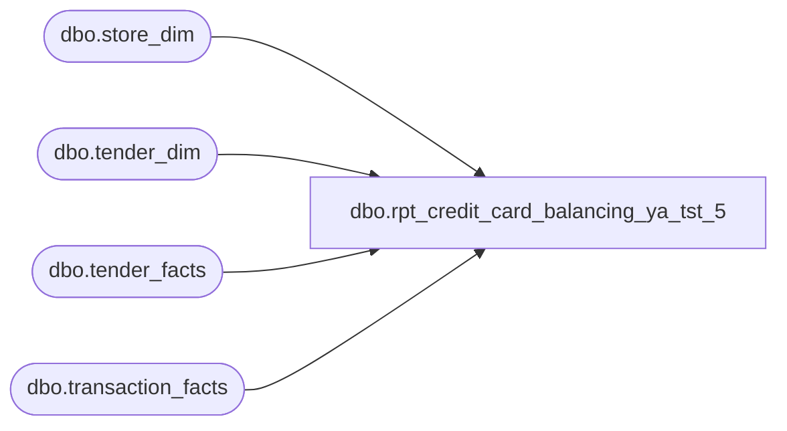

# dbo.rpt_credit_card_balancing_ya_tst_5

**Database:** LH_Source  
**Server:** 4db76rlxaxcuvmuh5kw37wbnqq-ovsykae43znuhlmnflcdwm4ohu.datawarehouse.fabric.microsoft.com  

## Architecture Diagram



## Table Dependencies

| Referenced Table |
|---|
| dbo.store_dim |
| dbo.tender_dim |
| dbo.tender_facts |
| dbo.transaction_facts |

## View Code

```sql
CREATE   VIEW dbo.rpt_credit_card_balancing_ya_tst_5 AS WITH per_tender AS (     /* Pull each tender_facts row to (store, register_bucket, date,        tender_code) grain. SUM consolidates per-transaction tender lines        into one net amount per bucket. register_bucket collapses every        physical register that is NOT '52' into the empty-string sentinel        so the row grain matches Linda's xlsx (BOPIS register '52' kept        separate, all other registers aggregated). */     SELECT         CASE WHEN sd.store_id < 1000 THEN sd.store_id + 1000 ELSE sd.store_id END                                                               AS store_no,         CAST(sd.store_name AS varchar(120))                   AS store_name,         CAST(sd.country    AS varchar(2))                     AS store_country,         CAST(CASE WHEN tf.register_no = '52' THEN '52' ELSE '' END              AS varchar(50))                                  AS register_no,         CAST(DATEADD(d, tf.date_key, '1997-01-04') AS date)   AS sales_date,         td.tender_code                                        AS tender_code,         SUM(tfx.tender_amt)                                   AS tender_amt       FROM LH_Mart.dbo.transaction_facts tf       JOIN LH_Mart.dbo.tender_facts      tfx ON tfx.transaction_id = tf.transaction_id       JOIN LH_Mart.dbo.tender_dim        td  ON td.tender_key      = tfx.tender_key       JOIN LH_Mart.dbo.store_dim         sd  ON sd.store_key       = tf.store_key      WHERE sd.store_id IS NOT NULL        AND sd.store_id <> 385                  /* exclude QA test store */        AND TRY_CONVERT(int, td.tender_code) IN             (604, 670, 605, 671, 608, 672, 606, 673,              642, 609, 699, 697, 698, 611)      GROUP BY         sd.store_id,         sd.store_name,         sd.country,         CASE WHEN tf.register_no = '52' THEN '52' ELSE '' END,         tf.date_key,         td.tender_code ), priced AS (     /* Pivot per_tender into the wide column shape. One row per        (store, store_name, country, register_bucket, sales_date). */     SELECT         pt.store_country,         pt.store_no,         pt.store_name,         pt.register_no,         pt.sales_date,         SUM(CASE WHEN pt.tender_code IN ('604','670')        THEN pt.tender_amt ELSE 0 END) AS Visa,         SUM(CASE WHEN pt.tender_code IN ('605','671')        THEN pt.tender_amt ELSE 0 END) AS MasterCard,         SUM(CASE WHEN pt.tender_code IN ('604','670','605','671')                                                              THEN pt.tender_amt ELSE 0 END) AS TotalVisaMC,         SUM(CASE WHEN pt.tender_code IN ('608','672')        THEN pt.tender_amt ELSE 0 END) AS Discover,         SUM(CASE WHEN pt.tender_code IN ('606','673')        THEN pt.tender_amt ELSE 0 END) AS AmericanExpress,         SUM(CASE WHEN pt.tender_code = '642'                 THEN pt.tender_amt ELSE 0 END) AS JCB,         SUM(CASE WHEN pt.tender_code = '609'                 THEN pt.tender_amt ELSE 0 END) AS Cyber,         SUM(CASE WHEN pt.tender_code = '699'                 THEN pt.tender_amt ELSE 0 END) AS UKCreditCards,         SUM(CASE WHEN pt.tender_code = '697'                 THEN pt.tender_amt ELSE 0 END) AS CANAmEx,         SUM(CASE WHEN pt.tender_code = '698'                 THEN pt.tender_amt ELSE 0 END) AS CANMCVisaDebit,         SUM(CASE WHEN pt.tender_code IN                 ('604','670','605','671','608','672','606','673',                  '642','609','699','697','698')                                                              THEN pt.tender_amt ELSE 0 END) AS TotalCC,         SUM(CASE WHEN pt.tender_code = '611'                 THEN pt.tender_amt ELSE 0 END) AS DebitCard       FROM per_tender pt      GROUP BY         pt.store_country,         pt.store_no,         pt.store_name,         pt.register_no,         pt.sales_date ), corporate_sales_grid AS (     /* Corporate Sales (1990) placeholder rows for every date the chain        was operationally active. Zero amounts; emitted so Linda's        per-date placeholder is reproduced. Source the active-date set        from LH_Mart.dbo.transaction_facts so the placeholder universe        matches the same canonical accounting feed the report draws        from. */     SELECT DISTINCT         CAST(NULL AS varchar(2))                              AS store_country,         1990                                                  AS store_no,         CAST('Corporate Sales' AS varchar(120))               AS store_name,         CAST('' AS varchar(50))                               AS register_no,         CAST(DATEADD(d, tf.date_key, '1997-01-04') AS date)   AS sales_date,         CAST(0 AS decimal(18,2)) AS Visa,         CAST(0 AS decimal(18,2)) AS MasterCard,         CAST(0 AS decimal(18,2)) AS TotalVisaMC,         CAST(0 AS decimal(18,2)) AS Discover,         CAST(0 AS decimal(18,2)) AS AmericanExpress,         CAST(0 AS decimal(18,2)) AS JCB,         CAST(0 AS decimal(18,2)) AS Cyber,         CAST(0 AS decimal(18,2)) AS UKCreditCards,         CAST(0 AS decimal(18,2)) AS CANAmEx,         CAST(0 AS decimal(18,2)) AS CANMCVisaDebit,         CAST(0 AS decimal(18,2)) AS TotalCC,         CAST(0 AS decimal(18,2)) AS DebitCard       FROM LH_Mart.dbo.transaction_facts tf      WHERE tf.date_key IS NOT NULL ), all_rows AS (     SELECT * FROM priced     UNION ALL     SELECT * FROM corporate_sales_grid ) SELECT     CAST(         CASE ar.store_country             WHEN 'US' THEN '1100'             WHEN 'CA' THEN '1200'             WHEN 'UK' THEN '1300'             WHEN 'IE' THEN '1300'             WHEN 'DE' THEN '1300'             WHEN 'NL' THEN '1300'             WHEN 'DK' THEN '1300'             WHEN 'TR' THEN '1300'             WHEN 'AE' THEN '1400'             WHEN 'CN' THEN '1500'             WHEN 'AU' THEN '1600'             WHEN 'KR' THEN '1700'             WHEN 'TH' THEN '1700'             WHEN 'SG' THEN '1700'             WHEN 'TW' THEN '1700'             WHEN 'ZA' THEN '1800'             WHEN 'BR' THEN '1900'             WHEN 'MX' THEN '1100'             ELSE COALESCE(ar.store_country, '1100')         END         AS varchar(8))                                          AS [GL Company],     ar.store_no                                                 AS [Store Number],     ar.store_name                                               AS [Store Name],     ar.register_no                                              AS [Register Number],     ar.sales_date                                               AS [Sales Date],     ar.Visa                                                     AS [Visa],     ar.MasterCard                                               AS [MasterCard],     ar.TotalVisaMC                                              AS [Total Visa/MasterCard],     ar.Discover                                                 AS [Discover],     ar.AmericanExpress                                          AS [American Express],     ar.JCB                                                      AS [JCB],     ar.Cyber                                                    AS [Cyber],     ar.UKCreditCards                                            AS [UK Credit Cards],     ar.CANAmEx                                                  AS [CAN Am Exp],     ar.CANMCVisaDebit                                           AS [CAN MC/Visa/Debit],     ar.TotalCC                                                  AS [Total Credit Cards],     ar.DebitCard                                                AS [Debit Card]   FROM all_rows ar;
```

