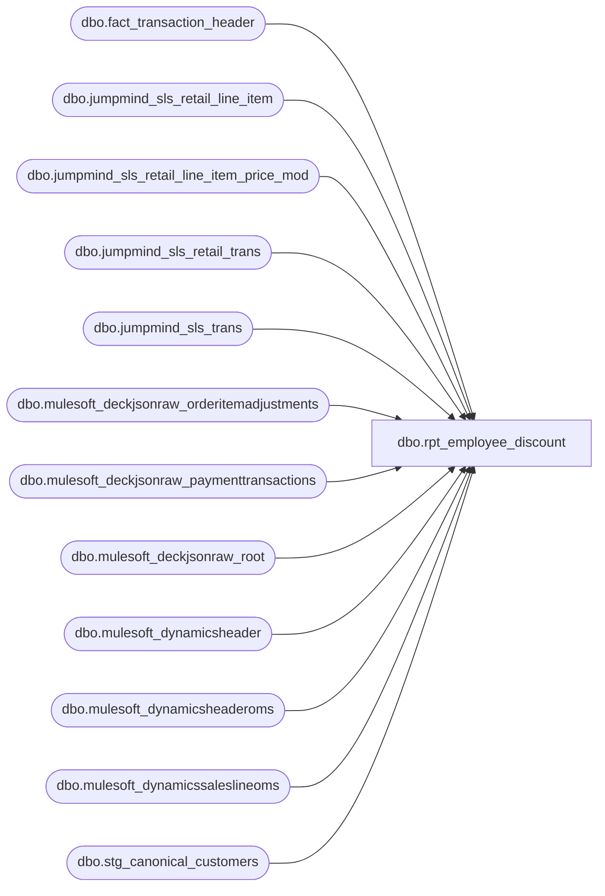

# dbo.rpt_employee_discount

**Database:** LH_Source  
**Server:** 4db76rlxaxcuvmuh5kw37wbnqq-ovsykae43znuhlmnflcdwm4ohu.datawarehouse.fabric.microsoft.com  

## Architecture Diagram



## Table Dependencies

| Referenced Table |
|---|
| dbo.fact_transaction_header |
| dbo.jumpmind_sls_retail_line_item |
| dbo.jumpmind_sls_retail_line_item_price_mod |
| dbo.jumpmind_sls_retail_trans |
| dbo.jumpmind_sls_trans |
| dbo.mulesoft_deckjsonraw_orderitemadjustments |
| dbo.mulesoft_deckjsonraw_paymenttransactions |
| dbo.mulesoft_deckjsonraw_root |
| dbo.mulesoft_dynamicsheader |
| dbo.mulesoft_dynamicsheaderoms |
| dbo.mulesoft_dynamicssaleslineoms |
| dbo.stg_canonical_customers |

## View Code

```sql
/* =============================================================================    rpt_employee_discount.sql — Employee Discount Report    =============================================================================    Domain:    Sales / HR Audit    Audience:  Sales Audit, HR-Payroll, Loss Prevention    Consumer:  Power BI dashboard "Employee Discount – Store Sheet"     PURPOSE      Surface every completed retail transaction where an employee-discount      price modification was applied, so HR-Payroll can validate the      discount against employee eligibility and Loss Prevention can monitor      for abuse patterns.     GRAIN      One row per (transaction, promotion). A single transaction with two      different employee-discount promotion IDs emits two rows.     -------------------------------------------------------------------------    SCHEMA ALIGNMENT (2026-05-17)    -------------------------------------------------------------------------    The output is now a strict superset of the SmartLook source view    `JM Employee Discount` (workspace/BBW_SmartLook_SQL_Reports-main/    Employee Discount.sql). SmartLook columns appear FIRST in SmartLook    order; Fabric-extension columns trail.     The five SmartLook columns added in this revision (and their source):         cashier_no    fact_transaction_header.cashier_no                        (canonical cashier_no, derived in                         stg_jumpmind_transactions from JM                         jumpmind_sls_trans.username with a 9999                         sentinel for non-numeric usernames).         tender_total  fact_transaction_header.tender_total                        (alias of gross_total — header gross amount in                         native currency).         customer_no   stg_canonical_customers.customer_no                        (purchasing-customer role only, customer_role = 1;                         LEFT JOIN — employee-purchase rows where the                         customer was not captured still emit with NULL                         customer fields).         first_name    stg_canonical_customers.first_name                        (purchasing customer; NULL for POS rows where the                         single JM customer_name field could not be split).         last_name     stg_canonical_customers.last_name                        (purchasing customer; populated as the raw JM                         customer_name when first_name is NULL).     Three pre-existing columns were renamed to the SmartLook canonical    names so the SmartLook block is byte-for-byte name-compatible:         store_id           → store_no        actual_date        → transaction_date        unit_gross_amount  → gross_line_amount     The derivations behind those three columns are UNCHANGED (BBW    currency-padded store ID, IE/UK overnight-rollover-corrected date,    negative-signed price-modification total per consumer convention).     Fabric extension columns — not in SmartLook source, retained for    downstream consumers (Power BI dashboard already depends on them):         country, promotion_type, promotion_name, reference_no,        transaction_id, OrderNumber     The SmartLook `pos_discount_amount` column (Field_k) is intentionally    NOT emitted: in the SmartLook source it is hard-coded to 0 and never    updated by any of the downstream UPDATE statements, so reproducing it    would add a constant-zero column with no information content.     -------------------------------------------------------------------------    SOURCE REBUILD    -------------------------------------------------------------------------    The SmartLook source identified employee-discount rows via    `transaction_line.line_object = 1940` against the legacy    `auditworks.dbo.transaction_*` tables. That line-object code returns    ZERO ROWS in the Fabric Mirror ingestion: the JumpMind → Fabric    pipeline does not project an LO=1940 row for employee-discount price    modifications. The discount is instead carried as a row in    `jumpmind_sls_retail_line_item_price_mod` with    `promotion_type = 'EMPLOYEE_DISCOUNT'`, gated by a Marketing-curated    PRM allow-list (see R2 below).     This view therefore SOURCES from the price-modification table and    joins the Mulesoft Dynamics merchandise-only discount header to    exclude gift-card-only redemptions (R3). The five SmartLook    columns added above let the downstream consumer reconcile rows    against Linda's xlsx by (store, date, transaction_no, register).     Linda must validate the new schema against her xlsx. The Fabric row    set is derived from a different upstream than the legacy AuditWorks    `line_object = 1940` lookup; row counts, employee-id filtering, and    amount-sign conventions should be spot-checked against the legacy    pull before the dashboard is repointed.    -------------------------------------------------------------------------   BUSINESS RULES (operational layer)   -------------------------------------------------------------------------     R1. Discount type: price_mod.promotion_type = 'EMPLOYEE_DISCOUNT'.         This is the Fabric marker for the employee-discount price-mod         family and is the full scope of the report. It covers the standard         country "30% Off Purchase - Employee Discount" promotions         (US PRM0c8Pb00000000aiIAA, UK PRM0c8Pb00000000aNIAQ,         CA PRM0c8Pb00000000a8IAA, IE PRM0c8Pb000000015lIAA) AND the         time-boxed associate-bonus campaigns ("Associate Bonus Discount -         <month> - ITEM", e.g. US PRM0c8Pb0000000hD3IAI). Every row carries         a real employee_id_for_discount. The broad definition matches what         the LH_Mart discount classification treats as an employee discount.     R1b. (History.) A 2026-06-02 revision narrowed R1 to descriptions         ending "Off Purchase - Employee Discount" to suppress a per-         transaction double-row Steven flagged in the Apr-May 2026 reconcile.         That narrowing also dropped the entire associate-bonus family, which         Linda's FY2026 file (2026-05-14) does include (US 2,436, UK 241,         IE 42 rows in April 2026). The narrowing is removed; double-counting         is prevented at the line grain by R3b (gift-card lines excluded) and         R7 (voided lines excluded), so a transaction emits one row per         distinct employee promotion it actually carries.     R2. (History.) A 2026-05-27 revision used promotion_type alone, the         same scope restored here.     R3. Discount must apply to merchandise (not solely to a gift-card         "Activate" sale). Enforced at TWO grains:           (a) Transaction grain via mulesoft_dynamicsheader.TotalDiscAmount > 0               (excludes transactions whose merchandise-only discount               collapses to zero, i.e. gift-card-only employee purchases).           (b) Line grain via jumpmind_sls_retail_line_item.item_type               <> 'GIFTCARD'. A single mixed transaction can carry an               employee-discount price_mod against BOTH a STOCK line               (merchandise, count) AND a GIFTCARD "Activate" line               (gift-card sale, do NOT count). Legacy AW               transaction_line.line_object = 1940 surfaced only the               merchandise portion of the per-transaction discount;               summing pm.modification_total unfiltered overstates               the discount by the gift-card line's portion.     R4. Transaction must be non-zero net (st.total > 0). Zero-dollar         exchanges where the customer paid nothing are excluded from         employee-discount reporting.     R5. Transaction must be COMPLETED and not in training mode.     R6. Employee ID for discount must be captured         (st.employee_id_for_discount IS NOT NULL).     R7. Line-item must not be voided         (jumpmind_sls_retail_line_item.voided = 0). JumpMind preserves         price_mod rows that reference voided line-items (the void is         recorded on the line, not on the price-mod); summing them         overstates the discount. Legacy AW's transaction_line table         dropped void-flagged lines before line_object = 1940 was         emitted, which is the truth Linda's xlsx encodes.    COLUMN-DERIVATION NOTES     - `transaction_date` uses last_update_time rather than business_date       so IE / UK overnight rollovers are dated to the calendar day the       discount was actually transacted.     - `register_no` strips a leading '1' from 3-digit device suffixes       (e.g. '0582-103' becomes 3). Three-digit registers starting with       '1' are an in-store paired-display device pattern; only the       2-digit suffix is the physical register.     - `gross_line_amount` is emitted as negative (sign convention of the       downstream consumer report).     - `promotion_name` = price_mod.description verbatim (already country-prefixed upstream).     - `cashier_no`, `tender_total`, `customer_no`, `first_name`,       `last_name` are pulled via LEFT JOIN on       `dbo.fact_transaction_header` and `dbo.stg_canonical_customers`       using the canonical Fabric transaction_id       (`device_id|business_date|sequence_number`). Customer fields are       restricted to `customer_role = 1` (purchasing customer).     - `transaction_id` is the D365 Commerce RetailTransactionId, the       canonical transaction id the requirements doc defines (Requirement       Docs/Requirements-Employee Discount.xlsx, field "Transaction ID").       POS rows source it from       `LH_Source.mulesoft_dynamicsheader.RetailTransactionId` (joined on       TransactionKey = device_id-business_date-sequence_number via dh,       already present in pos_rows). Web / BOSFS rows source it from       `LH_Source.mulesoft_dynamicsheaderoms.RetailTransactionId` (joined       RetailReceiptId = the bare webOrderNumber). The web id carries the       web order number that starts with 'W' (US web) or 'U' (UK web),       e.g. 1013-052-20260107-W9129425_1. Prior revisions emitted the       legacy AuditWorks numeric receipt id (e.g. 517585545) here; that is       the old Sales Audit layout id and is no longer surfaced because it       is not the D365 id the requirements doc asks for. The Linda       value-check keys on (store, date, transaction_no, register) and       compares gross_line_amount only, so re-sourcing this column does       not affect reconciliation.     - `OrderNumber` is the bare web order number from       `mulesoft_deckjsonraw_root.OrderNumber` (e.g. W9129425, U2962871).       Store POS rows emit NULL. Web rows always populate it.     - Web `transaction_no` = numeric portion of that order number       (W9378779 -> 9378779, U2962871 -> 2962871). Web has no JumpMind       sequence_number; the order digits are the stable per-order id.     - Web `register_no` = 52 (OMS / BOPIS web register), taken from the       middle segment of the D365 Transaction Key when present       (1013-052-... -> 52), else hard-coded 52. Confirmed 2026-07-17       after BBW reported Transaction No / Register No / Order Number       blank in Power BI while Transaction Key / ID were filled: Key/ID       had been wired from mulesoft_dynamicsheaderoms but transaction_no       and register_no were left as CAST(NULL) on the web branch.    WEB / BOSFS EMPLOYEE-DISCOUNT ROWS (web_rows branch, added 2026-06-02)     - Web employee discounts ARE now emitted, via a second branch unioned       after the store branch. Sourced from       mulesoft_deckjsonraw_orderitemadjustments + deckjsonraw_root       (LH_Mart removed 2026-06-15). D365 OMS header supplies Transaction       Key / ID; register_no and transaction_no are derived as above.     - One row per (web order, promo code), summing the per-item discount.       customer_no / first_name / last_name stay NULL on the web branch       (deck root does not carry a JumpMind purchasing-customer header).    UPSTREAM SOURCES (do not modify in place)     - LH_Source.dbo.jumpmind_sls_retail_trans               st     - LH_Source.dbo.jumpmind_sls_retail_line_item_price_mod pm     - LH_Source.dbo.jumpmind_sls_retail_line_item           li (added 2026-05-17, R3b/R7)     - LH_Source.dbo.jumpmind_sls_trans                      t     - LH_Source.dbo.mulesoft_dynamicsheader                 dh     - dbo.fact_transaction_header                           h  (added 2026-05-17)     - dbo.stg_canonical_customers                           c  (added 2026-05-17)     - LH_Source.dbo.mulesoft_deckjsonraw_orderitemadjustments oia (web_rows discount lines; CouponCode/NetPrice; replaces LH_Mart.discount_facts 2026-06-15)     - LH_Source.dbo.mulesoft_deckjsonraw_root               r  (web_rows OrderNumber/SiteCode/OrderDateUTC/OrderStatus)     - LH_Source.dbo.mulesoft_dynamicsheaderoms             doh (web_rows D365 Transaction Key/ID on OrderNumber)     NOTE: LH_Mart removed 2026-06-15. POS [Transaction ID] now sourced from           the D365 RetailTransactionId (mulesoft_dynamicsheader); the legacy           AuditWorks numeric id and the web-order enrichment (transaction_facts)           are no longer surfaced (no LH_Source mirror for 2026).   ============================================================================= */  CREATE   VIEW dbo.rpt_employee_discount AS WITH pos_rows AS (     SELECT         /* canonical Fabric transaction_id used to join header / customer            tables. Matches the derivation in stg_jumpmind_transactions and            the pos-side stg_canonical_customers (device_id | business_date            | sequence_number). NOT emitted to the consumer — internal            join key only. */         CAST(st.device_id        AS varchar(64)) + '|' +         CAST(st.business_date    AS varchar(8))  + '|' +         CAST(st.sequence_number  AS varchar(20))                      AS fab_transaction_id,          /* country derived from iso_currency_code (USD/CAD/GBP/EUR) */         CASE st.iso_currency_code             WHEN 'USD' THEN 'US'             WHEN 'CAD' THEN 'CA'             WHEN 'GBP' THEN 'UK'             WHEN 'EUR' THEN 'IE'             ELSE NULL         END                                                           AS country,         /* store_no: BBW-padded form (4-digit NA = 1001-1999, UK/CA/IE = 2000+) */         TRY_CONVERT(int, LTRIM(RTRIM(t.business_unit_id)))            AS store_no,         /* transaction_date: requirements-doc field 2 — capture date converted            UTC -> Central (last_update_time is stored UTC). */         COALESCE(             CAST(st.last_update_time AT TIME ZONE 'UTC'                                      AT TIME ZONE 'Central Standard Time' AS date),             TRY_CONVERT(date, st.business_date, 112)         )                                                              AS transaction_date,         CAST(st.sequence_number AS bigint)                            AS transaction_no,         /* register_no: see column-derivation note in header */         TRY_CONVERT(int,             CASE                 WHEN LEN(RIGHT(st.device_id, 3)) = 3                   AND LEFT(RIGHT(st.device_id, 3), 1) = '1'                     THEN SUBSTRING(RIGHT(st.device_id, 3), 2, 2)                 ELSE RIGHT(st.device_id, 3)             END         )                                                             AS register_no,         /* gross_line_amount: emitted as negative (consumer sign convention) */         SUM(-1 * CAST(pm.modification_total AS decimal(18,2)))        AS gross_line_amount,         MAX(CAST(pm.promotion_type AS varchar(64)))                   AS promotion_type,         /* promotion_name = price_mod.description verbatim. The description            already carries the country prefix (e.g. 'UK - 30% Off Purchase -            Employee Discount'), which is exactly Linda's promotion_name, so we            do NOT prepend country again (that produced 'UK - UK - ...'). */         MAX(CAST(pm.description AS varchar(256)))                      AS promotion_name,         CAST(pm.promotion_id AS varchar(64))                          AS reference_no,         /* date_key derivation for the LH_Mart.transaction_facts LEFT JOIN            in the final SELECT. epoch is 1997-01-04 (BBW Mart convention). */         DATEDIFF(day, '1997-01-04',             COALESCE(                 CAST(st.last_update_time AT TIME ZONE 'UTC'                                          AT TIME ZONE 'Central Standard Time' AS date),                 TRY_CONVERT(date, st.business_date, 112)             )         )                                                             AS lh_mart_date_key,         /* D365 RetailTransactionId (requirements-doc "Transaction ID").            dh is the POS Dynamics header joined on TransactionKey =            device_id-business_date-sequence_number, functionally one value            per transaction grain, so MAX() is a safe collapse under the            GROUP BY. */         MAX(CAST(dh.RetailTransactionId AS varchar(64)))              AS retail_transaction_id,         /* Literal D365 TransactionKey from the POS header (requirements-doc            "Transaction Key"). dh is the 1:1 POS header, so MAX() is a safe            collapse under the GROUP BY. Surfaced as a trailing column below. */         MAX(CAST(dh.TransactionKey AS varchar(80)))                   AS transaction_key,         /* Requirements-doc fields 9-12 (Employee ID / Name / Loyalty / Category).            Per-transaction attributes on the POS header, so MAX() collapses            safely under the GROUP BY (one value per transaction grain). */         MAX(CAST(st.employee_id_for_discount   AS varchar(64)))        AS employee_id,         MAX(CAST(st.employee_name_for_discount AS varchar(256)))       AS employee_name,         MAX(CAST(st.loyalty_card_number        AS varchar(64)))        AS loyalty_card_number,         /* Discount Category: PowerBI hard-codes "Employee Discount" for POS rows            (requirements doc field 12, BAB PowerBI Calculation). */         CAST('Employee Discount' AS varchar(64))                       AS discount_category,         /* Currency: requirements-doc field 7 = ISO currency code (POS). */         CAST(st.iso_currency_code AS varchar(3))                       AS iso_currency       FROM LH_Source.dbo.jumpmind_sls_retail_trans               st       JOIN LH_Source.dbo.jumpmind_sls_retail_line_item_price_mod pm             ON st.device_id       = pm.device_id            AND st.business_date   = pm.business_date            AND st.sequence_number = pm.sequence_number       /* Line-item join (R3b, R7): a single transaction can carry employee          discounts on BOTH a STOCK line (merchandise — count) AND a          GIFTCARD "Activate" line (gift-card sale — do NOT count), and          price_mod preserves rows for voided line-items. Filter both          here so SUM(pm.modification_total) excludes them — that's what          legacy AW transaction_line.line_object = 1940 (Linda's truth)          already excluded upstream. */       JOIN LH_Source.dbo.jumpmind_sls_retail_line_item           li             ON  li.device_id            = pm.device_id             AND li.business_date        = pm.business_date             AND li.sequence_number      = pm.sequence_number             AND li.line_sequence_number = pm.line_sequence_number       JOIN LH_Source.dbo.jumpmind_sls_trans                       t             ON st.device_id       = t.device_id            AND st.business_date   = t.business_date            AND st.sequence_number = t.sequence_number       /* LEFT (not INNER) join — R3a gate relaxed 2026-07-02: transactions          whose D365 header is missing or has a mismatched TransactionKey          (D365 wrote a different device/date than JumpMind) still emit with          NULL Transaction ID / Transaction Key, making the gap visible in          Power BI rather than silently dropping the row. TotalDiscAmount          is NOT filtered to > 0: returns carry negative TotalDiscAmount and          even-exchanges carry 0; both are valid employee-discount returns          (BBW confirmed 2026-06-17). */       LEFT JOIN LH_Source.dbo.mulesoft_dynamicsheader              dh             ON dh.TransactionKey = CONCAT(t.device_id, '-', t.business_date, '-', t.sequence_number)      WHERE pm.promotion_type = 'EMPLOYEE_DISCOUNT'                -- R1        /* R1 is the full employee-discount scope. Every price modification           tagged promotion_type='EMPLOYEE_DISCOUNT' is an employee discount:           the standard country "30% Off Purchase - Employee Discount"           promotions (US/UK/CA/IE), the time-boxed associate-bonus campaigns           ("Associate Bonus Discount - <month> - ITEM"), and any future           country variant. A prior revision narrowed this to descriptions           ending "Off Purchase - Employee Discount", which dropped the           associate-bonus family entirely (those rows carry a real           employee_id and belong in the report). The narrowing is removed;           double-counting is prevented at the line grain by the void and           gift-card gates below (R3b, R7), not by excluding promotions. */        AND ISNULL(pm.voided, 0) = 0        AND ISNULL(li.voided, 0) = 0                               -- R7        AND li.item_type <> 'GIFTCARD'                             -- R3b        AND ISNULL(t.training_mode, 0) = 0                         -- R5        AND UPPER(t.trans_status) = 'COMPLETED'                    -- R5        AND st.employee_id_for_discount IS NOT NULL                -- R6        /* R4 removed: st.total <= 0 for returns/even-exchanges — these are           valid employee-discount reversals and must be included. The           SmartLook source (Employee Discount.sql) has no total > 0 gate. */      /* GROUP BY pm.promotion_id — one row per (transaction, promotion). */      GROUP BY         st.iso_currency_code,         t.business_unit_id,         st.business_date,         st.sequence_number,         st.device_id,         pm.promotion_id,         /* Group by the raw inputs of transaction_date, not the AT TIME ZONE            expression (business_date is already grouped above): last_update_time            is constant within a transaction group (device/business_date/sequence),            so grain is unchanged, and every column the SELECT's date expression            references is now grouped. */         st.last_update_time ), /* Header context (cashier_no, tender_total) keyed on the canonical Fabric    transaction_id. LEFT JOIN preserves price-modification rows whose header    may not yet have replicated (rare). */ header_context AS (     SELECT         h.transaction_id,         h.cashier_no,         h.tender_total       FROM dbo.fact_transaction_header h ), /* Purchasing-customer context (customer_no, first_name, last_name) keyed    on the canonical Fabric transaction_id. Filtered to role = 1    (purchasing customer) — every transaction emits exactly one role-1 row    when a customer was captured, so the LEFT JOIN is 1:1 against pos_rows.    LEFT JOIN — employee-purchase rows where no customer was captured    still emit with NULL customer fields. */ customer_context AS (     SELECT         c.transaction_id,         c.customer_no,         c.first_name,         c.last_name       FROM dbo.stg_canonical_customers c      WHERE c.customer_role = 1 ), /* D365 OMS header for the web branch, de-duplicated to one row per web order    receipt (RetailReceiptId = the web order number). LEFT-joined into web_rows    below to fill [Transaction Key] / [Transaction ID] for web associate-discount    rows (previously NULL because the AW id->web header map lived in LH_Mart). */ d365_oms_header AS (     SELECT CAST(RetailReceiptId AS varchar(40))          AS receipt_txt,            MAX(CAST(TransactionKey      AS varchar(80)))  AS transaction_key,            MAX(CAST(RetailTransactionId AS varchar(64)))  AS transaction_id       FROM LH_Source.dbo.mulesoft_dynamicsheaderoms      WHERE RetailReceiptId IS NOT NULL AND RetailReceiptId <> ''      GROUP BY CAST(RetailReceiptId AS varchar(40)) ), /* Web tender total (requirements-doc field 8, OMS): captured payment amount per    web order. PaymentTransactionTypeId IN (10,11,14) = the captured/settled    payment statuses per the spec. Keyed on OrderID for the web_rows join. */ web_payments AS (     SELECT         _ParentKeyField                                AS OrderID,         SUM(CAST(Amount AS decimal(18,2)))             AS tender_total,         /* capture date (requirements-doc field 2): earliest capture/settlement            event, NOT the order-placed date and NOT the auth (type 13). Captures            land as type 10 or, when settled later, type 14; refunds (11) excluded            from the date. Orders placed late in one month are often captured the            next, and Linda dates the row by capture. */         MIN(CASE WHEN PaymentTransactionTypeId IN (10, 14)                  THEN TransactionDateUTC END)          AS capture_dt_utc       FROM LH_Source.dbo.mulesoft_deckjsonraw_paymenttransactions      WHERE PaymentTransactionTypeId IN (10, 11, 14)      GROUP BY _ParentKeyField ), /* Fulfillment store for web orders: MIN(InventLocationId) from D365 OMS sales    lines, converted to a BBW store number. Ship-to-home orders fulfill from the    virtual web warehouse (1013/2013); BOPIS orders fulfill from the physical    store (InventLocationId = the store number). Same pattern as rpt_credit_card_auth. */ web_store AS (     SELECT         dsl.RetailReceiptId                                          AS order_no,         MIN(TRY_CONVERT(int, dsl.InventLocationId))                  AS fulfill_store_no       FROM LH_Source.dbo.mulesoft_dynamicssaleslineoms dsl      WHERE TRY_CONVERT(int, dsl.InventLocationId) IS NOT NULL      GROUP BY dsl.RetailReceiptId ), web_rows AS (     /* Web associate-discount transactions, re-sourced 2026-06-15 off raw deck        (LH_Mart removed). Linda's "Web Employee Discounts" sheet flags these by        the associate web campaign promo code (e.g. STUFFYOULOVE_26). The applied        discount lines live in mulesoft_deckjsonraw_orderitemadjustments        (CouponCode = the promo code, NetPrice = the per-item discount amount),        joined to mulesoft_deckjsonraw_root by OrderID for the web order number        (root.OrderNumber), site (SiteCode -> store) and order date. Restricted        to settled web orders via OrderStatus IN (6,10) (the blueprint's settled-        web filter). One row per (web order, promo code), summing the per-item        discount, emitted negative to match the POS branch sign convention.         NOTE: deck is the live feed and runs ~2 weeks ahead of the former        LH_Mart.discount_facts load (verified stale at 2026-05-30 vs deck        2026-06-14), so this branch is MORE complete than the prior LH_Mart-        backed version. The previously-NULL web Transaction Key/ID are now        resolved from the D365 OMS header on OrderNumber.         PROMO-CODE LIST: the IN-list is the Marketing-curated set of associate        web-discount codes; STUFFYOULOVE_26 is the Apr-May 2026 code. Extend as        Marketing issues new associate web campaign codes. */     SELECT         COALESCE(MIN(ws.fulfill_store_no),                  CASE r.SiteCode WHEN 'BAB' THEN 1013 WHEN 'BABUK' THEN 2013                       ELSE NULL END)                                   AS store_no,         /* transaction_date (requirements-doc field 2, OMS): payment CAPTURE date            converted UTC->CST, falling back to OrderDateUTC only when no capture            event exists. Captures are often days after the order is placed, so            dating by OrderDateUTC dropped late-month orders captured next month. */         COALESCE(             CAST(MIN(wp.capture_dt_utc) AT TIME ZONE 'UTC'                                         AT TIME ZONE 'Central Standard Time' AS date),             CAST(MAX(r.OrderDateUTC) AS date)         )                                                              AS transaction_date,         /* transaction_no: numeric digits of the web order (no JM sequence). */         TRY_CAST(             CASE                 WHEN r.OrderNumber LIKE 'W%' OR r.OrderNumber LIKE 'U%'                     THEN SUBSTRING(r.OrderNumber, 2, 32)                 ELSE NULL             END AS bigint         )                                                              AS transaction_no,         /* register_no: OMS web / BOPIS register 52 from Transaction Key. */         COALESCE(             TRY_CAST(                 PARSENAME(REPLACE(MAX(doh.transaction_key), '-', '.'), 3)                 AS int             ),             52         )                                                              AS register_no,         /* Cashier Number (requirements-doc field 3, OMS): web order UserID. */         TRY_CONVERT(int, MAX(CAST(r.UserID AS varchar(32))))           AS cashier_no,         /* Tender Total (requirements-doc field 8, OMS): captured payment amount. */         CAST(MAX(wp.tender_total) AS decimal(38,18))                   AS tender_total,         CAST(NULL AS varchar(8000))                                    AS customer_no,         CAST(NULL AS varchar(8000))                                    AS first_name,         CAST(NULL AS varchar(8000))                                    AS last_name,         SUM(-1 * CAST(oia.NetPrice AS decimal(18,2)))                  AS gross_line_amount,         CASE r.SiteCode WHEN 'BAB' THEN 'US' WHEN 'BABUK' THEN 'UK'              ELSE NULL END                                             AS country,         CAST('EMPLOYEE_DISCOUNT' AS varchar(64))                       AS promotion_type,         CAST(MAX(oia.DiscountText) AS varchar(256))                    AS promotion_name,         CAST(oia.CouponCode AS varchar(64))                            AS reference_no,         CAST(NULL AS bigint)                                           AS transaction_id,         CAST(r.OrderNumber AS varchar(64))                             AS OrderNumber,         MAX(doh.transaction_id)                                        AS retail_transaction_id,         MAX(doh.transaction_key)                                       AS transaction_key,         /* Requirements-doc fields 9-12 (OMS): Employee ID / Name are blank for            web per the spec; Loyalty = root.Custom3; Category = DiscountText. */         CAST(NULL AS varchar(64))                                      AS employee_id,         CAST(NULL AS varchar(256))                                     AS employee_name,         MAX(CAST(r.Custom3 AS varchar(64)))                            AS loyalty_card_number,         CAST(MAX(oia.DiscountText) AS varchar(64))                     AS discount_category,         /* Currency: requirements-doc field 7 OMS = None (web has no ISO code). */         CAST(NULL AS varchar(3))                                       AS iso_currency       FROM LH_Source.dbo.mulesoft_deckjsonraw_orderitemadjustments oia       JOIN LH_Source.dbo.mulesoft_deckjsonraw_root              r         ON r.OrderID = oia._ParentKeyField       LEFT JOIN d365_oms_header                                doh         ON doh.receipt_txt = r.OrderNumber       LEFT JOIN web_payments                                   wp         ON wp.OrderID = r.OrderID       LEFT JOIN web_store                                      ws         ON ws.order_no = r.OrderNumber      /* Requirements-doc field 6 + applied-filters: select OMS employee         discounts by the associate/employee discount categories and keyword         match, not a hard-coded coupon code. Captures every associate web         campaign code (STUFFYOULOVE_26, WinterFun30!, SpringBonus26!, …). */      WHERE (               oia.DiscountText IN ('Associate Discount 30% Off',                                    'Associate Discount 50% Off',                                    'AssociateDiscount2025',                                    'Employee Discount')            OR oia.PromotionID  LIKE '%Emp%'            OR oia.DiscountText LIKE '%Associate%'            OR oia.CampaignID   LIKE '%EmployeeDisc%'        )        AND r.OrderNumber NOT LIKE 'B%'           -- exclude B-series orders (spec)        AND ISNULL(r.OrderStatus, 0) <> 1         -- order_status Completed/blank (spec)      GROUP BY         r.SiteCode,         oia.CouponCode,         r.OrderNumber ) SELECT     /* SmartLook columns (in SmartLook source order) */     p.store_no,     p.transaction_date,     p.transaction_no,     p.register_no,     h.cashier_no,     h.tender_total,     c.customer_no,     c.first_name,     c.last_name,     p.gross_line_amount,     /* Fabric extension columns; not in SmartLook source, retained for        downstream consumers (Power BI dashboard) */     p.country,     p.promotion_type,     p.promotion_name,     p.reference_no,     /* Power BI expects bigint. Sourced from the D365 RetailTransactionId        (mulesoft_dynamicsheader), the canonical id per the requirements doc.        The legacy AuditWorks numeric id (formerly LH_Mart.transaction_facts)        is no longer surfaced; LH_Mart removed 2026-06-15. */     TRY_CAST(NULLIF(LTRIM(RTRIM(p.retail_transaction_id)), '') AS bigint)                                                                        AS transaction_id,     /* POS in-store rows have no web order number; emit NULL (matches prior        behaviour -- the AuditWorks POS row carried no web order reference). */     CAST(NULL AS varchar(64))                                          AS OrderNumber,     /* Literal D365 Transaction Key / ID from the POS header (per BBW request,        sourced from mulesoft_dynamicsheader[oms]). Trailing columns; the        existing numeric `transaction_id` above is unchanged. The POS header is        INNER-joined for the R3a merchandise gate, so these are populated for        every emitted POS row; header-missing transactions remain dropped by        R3a (an upstream mulesoft_dynamicsheader feed gap, not fixable here). */     CAST(p.transaction_key AS varchar(80))                             AS [Transaction Key],     CAST(p.retail_transaction_id AS varchar(64))                       AS [Transaction ID],     /* Requirements-doc fields 9-12 (added 2026-06-16 to close the spec gap). */     p.employee_id                                                      AS [Employee ID],     p.employee_name                                                    AS [Employee Name],     p.loyalty_card_number                                              AS [Loyalty Card Number],     p.discount_category                                                AS [Discount Category],     p.iso_currency                                                     AS [Currency]   FROM pos_rows         p   LEFT JOIN header_context   h ON h.transaction_id = p.fab_transaction_id   LEFT JOIN customer_context c ON c.transaction_id = p.fab_transaction_id UNION ALL SELECT     w.store_no,     w.transaction_date,     w.transaction_no,     w.register_no,     w.cashier_no,     w.tender_total,     w.customer_no,     w.first_name,     w.last_name,     w.gross_line_amount,     w.country,     w.promotion_type,     w.promotion_name,     w.reference_no,     /* numeric transaction_id = D365 RetailTransactionId (web OMS header),        mirroring the POS branch; the legacy AuditWorks numeric id is gone. */     TRY_CAST(NULLIF(LTRIM(RTRIM(w.retail_transaction_id)), '') AS bigint)                                                                        AS transaction_id,     w.OrderNumber,     CAST(w.transaction_key AS varchar(80))                             AS [Transaction Key],     CAST(w.retail_transaction_id AS varchar(64))                       AS [Transaction ID],     w.employee_id                                                      AS [Employee ID],     w.employee_name                                                    AS [Employee Name],     w.loyalty_card_number                                              AS [Loyalty Card Number],     w.discount_category                                                AS [Discount Category],     w.iso_currency                                                     AS [Currency]   FROM web_rows w;
```

