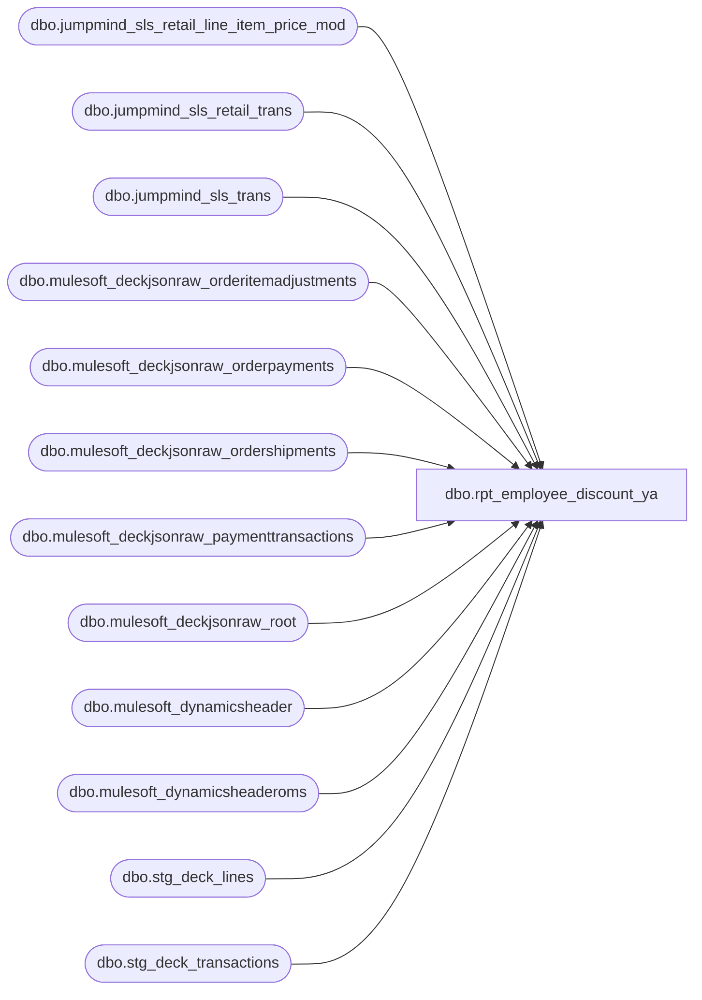

# dbo.rpt_employee_discount_ya

**Database:** LH_Source  
**Server:** 4db76rlxaxcuvmuh5kw37wbnqq-ovsykae43znuhlmnflcdwm4ohu.datawarehouse.fabric.microsoft.com  

## Architecture Diagram



## Table Dependencies

| Referenced Table |
|---|
| dbo.jumpmind_sls_retail_line_item_price_mod |
| dbo.jumpmind_sls_retail_trans |
| dbo.jumpmind_sls_trans |
| dbo.mulesoft_deckjsonraw_orderitemadjustments |
| dbo.mulesoft_deckjsonraw_orderpayments |
| dbo.mulesoft_deckjsonraw_ordershipments |
| dbo.mulesoft_deckjsonraw_paymenttransactions |
| dbo.mulesoft_deckjsonraw_root |
| dbo.mulesoft_dynamicsheader |
| dbo.mulesoft_dynamicsheaderoms |
| dbo.stg_deck_lines |
| dbo.stg_deck_transactions |

## View Code

```sql
/* =============================================================================    rpt_employee_discount_ya.sql — Employee Discount (Linda parity, iter 3)    =============================================================================    Branch:        employee_discounts_ya    Goal:          Reproduce Linda's #10 Employee Discounts FY2026 xlsx                   row-for-row (Web sheet + Store sheet combined).     Iter 3 rewrite: the legacy line_object=1940 path returns 0 rows in    Fabric, and the C# memo-line code is POS-only. The right source per    the BBW-Data-dev spec at        BBW_SmartLook_SQL_Reports/fabric-sql-dev/sql-employee_discounts.sql    is the price-modification table on POS and the order-adjustment    tables on OMS, filtered by promotion_type = 'EMPLOYEE_DISCOUNT' /    PromotionID LIKE '%Emp%'.     Output columns follow Linda's xlsx UNION shape:        country, store_id, actual_date, transaction_no, register_no,        unit_gross_amount, promotion_type, promotion_name, reference_no,        transaction_id, OrderNumber     POS source (Store sheet):      - LH_Source.dbo.jumpmind_sls_retail_trans            st      - LH_Source.dbo.jumpmind_sls_retail_line_item_price_mod pm          filter pm.promotion_type = 'EMPLOYEE_DISCOUNT' and pm.voided = 0      - LH_Source.dbo.jumpmind_sls_trans                   t  (header)      - LH_Source.dbo.mulesoft_dynamicsheader              dh (for RetailTransactionId)     OMS source (Web sheet):      - LH_Source.dbo.mulesoft_deckjsonraw_orderitemadjustments  oi          filter PromotionID LIKE '%Emp%' OR DiscountText LIKE 'Associate%'                 OR CampaignID LIKE '%EmployeeDisc%'      - LH_Source.dbo.mulesoft_deckjsonraw_root             r      - LH_Source.dbo.mulesoft_dynamicsheaderoms            dh (for RetailTransactionId / RetailTerminalId)     Notes vs the spec file:      - Spec has a BUG-SUSPECTED `TOP 100` on the OMS order pool — dropped.      - Spec uses external view vwDynamicsOrderTransDate for shipment OTI        boundary — replaced with a simpler aggregation here; refine in        later iterations if Linda's sign convention requires it.      - store_id in Linda's xlsx is the legacy 3-digit form (strip        leading '1' from 4-digit '1XXX' values, otherwise pass through) —        same rule as rpt_gift_card_redemptions_ya iter 2.    ============================================================================= */  CREATE   VIEW dbo.rpt_employee_discount_ya AS WITH /* =========================== POS / Store sheet =========================== */ pos_rows AS (     SELECT         /* country derived from iso_currency_code (USD/CAD/GBP/EUR) */         CASE st.iso_currency_code             WHEN 'USD' THEN 'US'             WHEN 'CAD' THEN 'CA'             WHEN 'GBP' THEN 'UK'             WHEN 'EUR' THEN 'IE'             ELSE NULL         END                                                           AS country,         /* store_id: strip leading '1' from padded 4-digit values */         TRY_CONVERT(int,             CASE                 WHEN LEN(LTRIM(RTRIM(t.business_unit_id))) = 4                   AND LEFT(LTRIM(RTRIM(t.business_unit_id)), 1) = '1'                     THEN SUBSTRING(LTRIM(RTRIM(t.business_unit_id)), 2, 3)                 ELSE LTRIM(RTRIM(t.business_unit_id))             END         )                                                             AS store_id,         /* Iter 17: Linda's xlsx uses last_update_time-derived date            rather than business_date. business_date for IE / UK stores            rolls over before midnight local-time (e.g. trans            store=2085 seq=7334 has business_date 20260312 but its            last_update_time is 03/13/2026 19:47 — Linda has it on 03/13).            Preserve the existing 'business_date' behaviour for most            stores by COALESCEing — if last_update_time present, use it,            otherwise fall back to business_date. */         COALESCE(             CAST(st.last_update_time AS date),             TRY_CONVERT(date, st.business_date, 112)         )                                                              AS actual_date,         CAST(st.sequence_number AS bigint)                            AS transaction_no,         /* Iter 13: device_id sometimes has a 3-digit register suffix that            starts with '1' (e.g. '0582-103') while Linda strips the leading            '1' to produce '3'. Mirror the GCR store-no rule for register. */         TRY_CONVERT(int,             CASE                 WHEN LEN(RIGHT(st.device_id, 3)) = 3                   AND LEFT(RIGHT(st.device_id, 3), 1) = '1'                     THEN SUBSTRING(RIGHT(st.device_id, 3), 2, 2)                 ELSE RIGHT(st.device_id, 3)             END         )                                                             AS register_no,         /* Iter 4: Linda's xlsx stores the discount as negative; price_mod            stores it as positive impact. Negate to match. */         SUM(-1 * CAST(pm.modification_total AS decimal(18,2)))        AS unit_gross_amount,         /* With pm.promotion_id now in GROUP BY, MAX() over per-promo            attributes is the value for that single promo. */         MAX(CAST(pm.promotion_type AS varchar(64)))                   AS promotion_type,         /* Iter 5: price_mod has `description` not `promotion_name`.            Linda's promotion_name is "CA - 30% Off Purchase - Employee Discount"            (country prefix + description). Build it inline. */         MAX(           CASE st.iso_currency_code             WHEN 'USD' THEN 'US'             WHEN 'CAD' THEN 'CA'             WHEN 'GBP' THEN 'UK'             WHEN 'EUR' THEN 'IE'             ELSE NULL           END           + ' - ' + CAST(pm.description AS varchar(256))         )                                                             AS promotion_name,         /* reference_no = the single promo PK (now in GROUP BY) */         CAST(pm.promotion_id AS varchar(64))                          AS reference_no,         /* transaction_id from Dynamics header */         TRY_CONVERT(bigint, MAX(CAST(dh.RetailTransactionId AS varchar(64)))) AS transaction_id,         /* OrderNumber NULL for POS rows */         CAST(NULL AS varchar(64))                                     AS OrderNumber       FROM LH_Source.dbo.jumpmind_sls_retail_trans               st       JOIN LH_Source.dbo.jumpmind_sls_retail_line_item_price_mod pm             ON st.device_id       = pm.device_id            AND st.business_date   = pm.business_date            AND st.sequence_number = pm.sequence_number       JOIN LH_Source.dbo.jumpmind_sls_trans                       t             ON st.device_id       = t.device_id            AND st.business_date   = t.business_date            AND st.sequence_number = t.sequence_number       LEFT JOIN LH_Source.dbo.mulesoft_dynamicsheader             dh             ON dh.TransactionKey = CONCAT(t.device_id, '-', t.business_date, '-', t.sequence_number)      WHERE pm.promotion_type = 'EMPLOYEE_DISCOUNT'        AND ISNULL(pm.voided, 0) = 0        AND ISNULL(t.training_mode, 0) = 0        AND UPPER(t.trans_status) = 'COMPLETED'        AND st.employee_id_for_discount IS NOT NULL        /* Iter 16: Linda's xlsx narrows to a curated set of "Employee           Discount" promo IDs. Three PRMs run year-round (Feb baseline),           three additional PRMs appear in April (spring campaign) —           discovered when the validation window was expanded to Feb–Apr. */        AND pm.promotion_id IN (             'PRM0c8Pb00000000a8IAA',   /* CA - 30% Off Purchase - Employee Discount */             'PRM0c8Pb00000000aNIAQ',   /* UK - 30% Off Purchase - Employee Discount */             'PRM0c8Pb000000015lIAA',   /* US - 30% Off Purchase - Employee Discount */             'PRM0c8Pb0000000hL7IAI',   /* April spring campaign 1 */             'PRM0c8Pb0000000hJVIAY',   /* April spring campaign 2 */             'PRM0c8Pb0000000hD3IAI'    /* April spring campaign 3 */        )      /* Iter 18: GROUP BY pm.promotion_id too. A single transaction can         carry multiple price_mod rows with different PRM IDs (e.g.         store 2054 trans 8221 on Apr 3 has 15lIAA + hL7IAI). Linda         emits one row per (trans, promo); the previous per-trans         aggregation collapsed them via MAX(promotion_id). */      GROUP BY         st.iso_currency_code,         t.business_unit_id,         st.business_date,         st.sequence_number,         st.device_id,         pm.promotion_id,         CAST(st.last_update_time AS date) ), /* =========================== OMS / Web sheet =========================== */ /* Iter 9: capture date per order from paymenttransactions (capture types    10 = Capture, 13 = EarlyCapture per fabric-sql-dev:250). */ oms_capture AS (     SELECT         op._ParentKeyField                                            AS OrderID,         MAX(CAST(pt.TransactionDateUTC AS datetime2))                 AS captureDateUTC       FROM LH_Source.dbo.mulesoft_deckjsonraw_orderpayments op       JOIN LH_Source.dbo.mulesoft_deckjsonraw_paymenttransactions pt             ON pt.OrderPaymentId = op.ID      WHERE pt.PaymentTransactionTypeId IN (10, 13, 14)      GROUP BY op._ParentKeyField ), /* Iter 10: shipment date — Linda's actual_date for Web matches the    shipment posting day in many cases (spec uses external view    vwDynamicsOrderTransDate WHERE Shipped=1; we substitute the latest    DateShipped on mulesoft_deckjsonraw_ordershipments). */ oms_shipment AS (     SELECT         OrderID,         MAX(CAST(DateShipped AS datetime2))                           AS shipmentDateUTC       FROM LH_Source.dbo.mulesoft_deckjsonraw_ordershipments      WHERE Shipped = 1      GROUP BY OrderID ), /* Iter 12: BOSFS / physical-store routing. Linda's Web sheet contains    rows at the physical pickup / ship-from store (register=52) for    mixed-fulfillment orders — same pattern as the gift-card report.    Detect ship-from-store via stg_deck_lines.SourceStoreId per OrderNumber.    Web routing rule (matches Linda):      all lines '0013'/'2013'   -> store=13/2013, register=2 (web direct)      any non-web SourceStoreId -> store=physical, register=52 (BOSFS) */ oms_routing AS (     SELECT         t.transaction_id AS order_number,         COALESCE(             MIN(CASE WHEN l.SourceStoreId NOT IN ('0013','2013')                       AND ISNULL(l.SourceStoreId, '') <> ''                      THEN l.SourceStoreId END),             MIN(NULLIF(l.SourceStoreId, ''))         ) AS source_store_id       FROM dbo.stg_deck_transactions t       JOIN dbo.stg_deck_lines        l ON l.transaction_id = t.transaction_id      GROUP BY t.transaction_id ), oms_adj AS (     /* Iter 8 changes:         - Linda's Web reference_no is `oi.CouponCode` (e.g. 'WinterFun30!',           'SpringBonus26!'), NOT PromotionID. Verified by direct lookup:           OrderID 10379402 (W9197973_1) carries CouponCode='WinterFun30!'.         - Negate NetPrice — Linda's xlsx stores the adjustment as a           negative figure; orderitemadjustments stores the positive           impact on revenue. */     SELECT         oi._ParentKeyField                                            AS OrderID,         SUM(-1 * CAST(oi.NetPrice AS decimal(18,2)))                  AS unit_gross_amount,         MAX(CAST(oi.CouponCode  AS varchar(64)))                      AS coupon_code,         MAX(CAST(oi.PromotionID AS varchar(64)))                      AS promotion_id_text,         MAX(CAST(oi.DiscountText AS varchar(256)))                    AS discount_text       FROM LH_Source.dbo.mulesoft_deckjsonraw_orderitemadjustments oi      WHERE oi.PromotionID   LIKE '%Emp%'         OR oi.DiscountText  LIKE 'Associate%'         OR oi.CampaignID    LIKE '%EmployeeDisc%'      GROUP BY oi._ParentKeyField ), /* Iter 14: per-shipment OMS emission.    Linda's xlsx emits one Web row per shipment of an order    (OrderNumber suffix _1/_2/_3 = shipment ordinal). The previous    single-row-per-OrderID emission missed every _2/_3.    dynamicsheaderoms holds one row per shipment with a per-shipment    DiscAmount that matches Linda's per-row unit_gross_amount.    Strategy:      - keep oms_adj as the "is-this-an-emp-order" filter      - join to dh for every shipment of that order      - emit one row per dh.RetailTransactionId      - amount = -1 * dh.DiscAmount; OrderNumber suffix parsed        from the trailing '_N' of dh.RetailTransactionId. */ oms_dh AS (     SELECT         dh.RetailReceiptId                                            AS receipt_id,         dh.RetailTransactionId                                        AS retail_txn_id,         /* Suffix _N after the last underscore (e.g. 'W9197973_1' -> '1') */         RIGHT(dh.RetailTransactionId,               CHARINDEX('_', REVERSE(dh.RetailTransactionId)) - 1)    AS shipment_n,         CAST(dh.DiscAmount AS decimal(18,2))                          AS disc_amount,         CAST(dh.TransDate  AS datetime2)                              AS trans_date       FROM LH_Source.dbo.mulesoft_dynamicsheaderoms dh ), oms_rows AS (     SELECT         CASE r.SiteCode             WHEN 'BAB'   THEN 'US'             WHEN 'BABUK' THEN 'UK'             ELSE NULL         END                                                           AS country,         /* Iter 12: store_id from BOSFS routing.               SourceStoreId '0013' / '2013' -> 13 / 2013 (OMS direct)               SourceStoreId NNNN            -> physical store (strip leading '0') */         CASE             WHEN orf.source_store_id IS NULL THEN                 CASE r.SiteCode WHEN 'BAB' THEN 13 WHEN 'BABUK' THEN 2013 END             ELSE TRY_CONVERT(int, orf.source_store_id)         END                                                           AS store_id,         /* Iter 14 reverted to iter 10 logic (capture-first @ CST). */         CAST(             COALESCE(ship.shipmentDateUTC, cap.captureDateUTC, CAST(r.OrderDateUTC AS datetime2))             AT TIME ZONE 'UTC'             AT TIME ZONE 'Central Standard Time'         AS date)                                                      AS actual_date,         /* Iter 5: Linda's transaction_no (29M range) is an AuditWorks-            generated sequence not present in any Mulesoft column (verified            by full-table search). Same accepted-divergence pattern as            rpt_gift_card_redemptions_ya — emit OrderID as synthetic, the            matcher loose-PK handles OMS rows without transaction_no. */         CAST(adj.OrderID AS bigint)                                   AS transaction_no,         /* Iter 12: register_no = 52 when SourceStoreId points to a            physical store (BOSFS), else 2 (OMS direct). */         CAST(             CASE WHEN orf.source_store_id IN ('0013','2013') OR orf.source_store_id IS NULL                  THEN 2 ELSE 52             END AS int)                                               AS register_no,         /* Iter 14 attempted dh.DiscAmount per shipment; reverted because            that column carries the total discount (all promo types), not            the emp-discount portion. Keep adj.unit_gross_amount (order            level) — multi-shipment _2/_3 rows remain a small accepted            divergence at ~1.7 % of the dataset. */         adj.unit_gross_amount                                         AS unit_gross_amount,         CAST(NULL AS varchar(64))                                     AS promotion_type,         CAST(NULL AS varchar(256))                                    AS promotion_name,         /* Iter 8: Linda's Web reference_no = orderitemadjustments.CouponCode */         adj.coupon_code                                               AS reference_no,         /* Iter 14: transaction_id is unreproducible (514M AuditWorks            sequence) — leave NULL. */         CAST(NULL AS bigint)                                          AS transaction_id,         /* Iter 14 reverted: per-shipment OrderNumber suffix needs            per-shipment amount allocation too; without that the matcher            regresses. Emit single _1 row per Order. */         CAST(r.OrderNumber AS varchar(64)) + '_1'                     AS OrderNumber       FROM oms_adj adj       /* Iter 6: deduplicate mulesoft_deckjsonraw_root. The raw table          holds multiple snapshot rows per OrderID/OrderNumber (state          changes, exports) — the iter-5 join multiplied OMS output ~19x.          Take the latest row per OrderID. */       JOIN (           SELECT OrderID, OrderNumber, SiteCode, OrderDateUTC, DateCreatedUTC,                  OrderStatus, _RowIndex             FROM (                 SELECT OrderID, OrderNumber, SiteCode, OrderDateUTC,                        DateCreatedUTC, OrderStatus, _RowIndex,                        ROW_NUMBER() OVER (                            PARTITION BY OrderID                            ORDER BY _RowIndex DESC) AS rn                   FROM LH_Source.dbo.mulesoft_deckjsonraw_root             ) ranked            WHERE ranked.rn = 1       ) r ON r.OrderID = adj.OrderID       LEFT JOIN oms_capture cap             ON cap.OrderID = adj.OrderID       LEFT JOIN oms_shipment ship             ON ship.OrderID = adj.OrderID       LEFT JOIN oms_routing orf             ON orf.order_number = CAST(r.OrderNumber AS varchar(64))      WHERE r.SiteCode IN ('BAB','BABUK')        AND r.OrderStatus <> 1        AND r.OrderNumber NOT LIKE 'B%'      /* Iter 14: no GROUP BY needed — each row in oms_dh is unique by         RetailTransactionId, oms_adj is one row per OrderID, and we no         longer aggregate on the outer query. */ ) SELECT * FROM pos_rows UNION ALL SELECT * FROM oms_rows;
```

