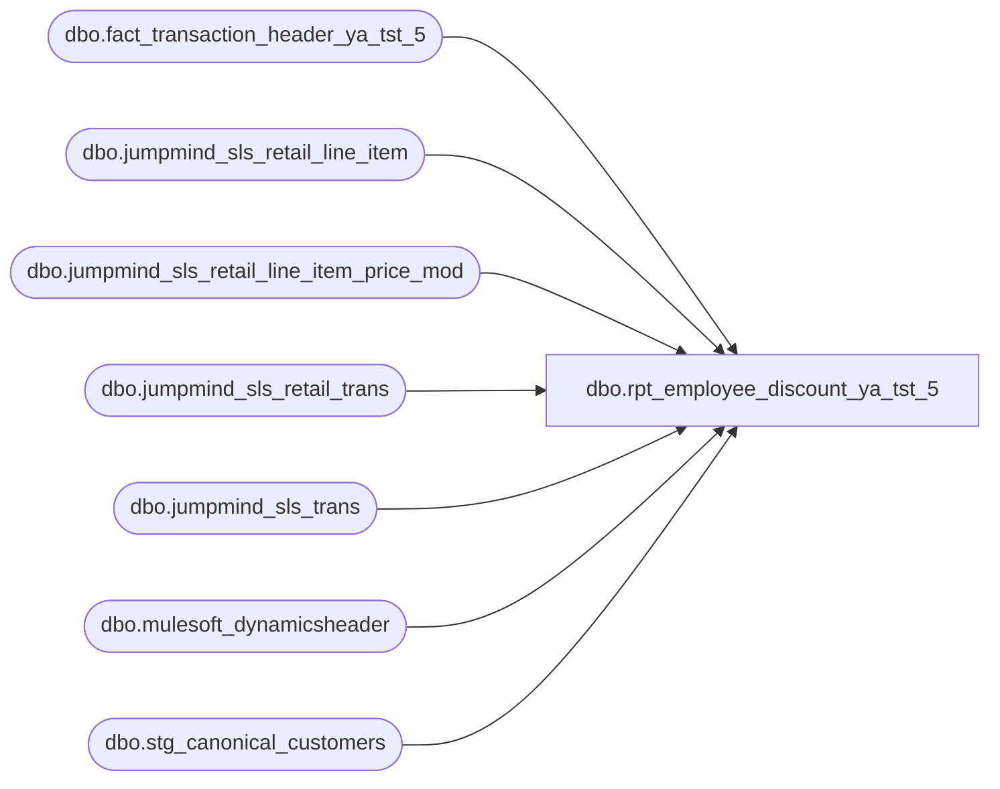

# dbo.rpt_employee_discount_ya_tst_5

**Database:** LH_Source  
**Server:** 4db76rlxaxcuvmuh5kw37wbnqq-ovsykae43znuhlmnflcdwm4ohu.datawarehouse.fabric.microsoft.com  

## Architecture Diagram



## Table Dependencies

| Referenced Table |
|---|
| dbo.fact_transaction_header_ya_tst_5 |
| dbo.jumpmind_sls_retail_line_item |
| dbo.jumpmind_sls_retail_line_item_price_mod |
| dbo.jumpmind_sls_retail_trans |
| dbo.jumpmind_sls_trans |
| dbo.mulesoft_dynamicsheader |
| dbo.stg_canonical_customers |

## View Code

```sql
CREATE   VIEW dbo.rpt_employee_discount_ya_tst_5 AS WITH pos_rows AS (     SELECT         /* canonical Fabric transaction_id used to join header / customer            tables. Matches the derivation in stg_jumpmind_transactions and            the pos-side stg_canonical_customers (device_id | business_date            | sequence_number). NOT emitted to the consumer — internal            join key only. */         CAST(st.device_id        AS varchar(64)) + '|' +         CAST(st.business_date    AS varchar(8))  + '|' +         CAST(st.sequence_number  AS varchar(20))                      AS fab_transaction_id,          /* country derived from iso_currency_code (USD/CAD/GBP/EUR) */         CASE st.iso_currency_code             WHEN 'USD' THEN 'US'             WHEN 'CAD' THEN 'CA'             WHEN 'GBP' THEN 'UK'             WHEN 'EUR' THEN 'IE'             ELSE NULL         END                                                           AS country,         /* store_no: BBW-padded form (4-digit NA = 1001-1999, UK/CA/IE = 2000+) */         TRY_CONVERT(int, LTRIM(RTRIM(t.business_unit_id)))            AS store_no,         /* transaction_date: see column-derivation note R-IE/UK in header */         COALESCE(             CAST(st.last_update_time AS date),             TRY_CONVERT(date, st.business_date, 112)         )                                                              AS transaction_date,         CAST(st.sequence_number AS bigint)                            AS transaction_no,         /* register_no: see column-derivation note in header */         TRY_CONVERT(int,             CASE                 WHEN LEN(RIGHT(st.device_id, 3)) = 3                   AND LEFT(RIGHT(st.device_id, 3), 1) = '1'                     THEN SUBSTRING(RIGHT(st.device_id, 3), 2, 2)                 ELSE RIGHT(st.device_id, 3)             END         )                                                             AS register_no,         /* gross_line_amount: emitted as negative (consumer sign convention) */         SUM(-1 * CAST(pm.modification_total AS decimal(18,2)))        AS gross_line_amount,         MAX(CAST(pm.promotion_type AS varchar(64)))                   AS promotion_type,         /* promotion_name: country prefix + price_mod.description */         MAX(           CASE st.iso_currency_code             WHEN 'USD' THEN 'US'             WHEN 'CAD' THEN 'CA'             WHEN 'GBP' THEN 'UK'             WHEN 'EUR' THEN 'IE'             ELSE NULL           END           + ' - ' + CAST(pm.description AS varchar(256))         )                                                             AS promotion_name,         CAST(pm.promotion_id AS varchar(64))                          AS reference_no,         /* transaction_id from Dynamics header (already INNER-joined below) */         TRY_CONVERT(bigint, MAX(CAST(dh.RetailTransactionId AS varchar(64)))) AS transaction_id,         /* OrderNumber NULL for POS rows */         CAST(NULL AS varchar(64))                                     AS OrderNumber       FROM LH_Source.dbo.jumpmind_sls_retail_trans               st       JOIN LH_Source.dbo.jumpmind_sls_retail_line_item_price_mod pm             ON st.device_id       = pm.device_id            AND st.business_date   = pm.business_date            AND st.sequence_number = pm.sequence_number       /* Line-item join (R3b, R7): a single transaction can carry employee          discounts on BOTH a STOCK line (merchandise — count) AND a          GIFTCARD "Activate" line (gift-card sale — do NOT count), and          price_mod preserves rows for voided line-items. Filter both          here so SUM(pm.modification_total) excludes them — that's what          legacy AW transaction_line.line_object = 1940 (Linda's truth)          already excluded upstream. */       JOIN LH_Source.dbo.jumpmind_sls_retail_line_item           li             ON  li.device_id            = pm.device_id             AND li.business_date        = pm.business_date             AND li.sequence_number      = pm.sequence_number             AND li.line_sequence_number = pm.line_sequence_number       JOIN LH_Source.dbo.jumpmind_sls_trans                       t             ON st.device_id       = t.device_id            AND st.business_date   = t.business_date            AND st.sequence_number = t.sequence_number       /* INNER (not LEFT) join — R3a requires merchandise discount > 0 */       JOIN LH_Source.dbo.mulesoft_dynamicsheader                  dh             ON dh.TransactionKey = CONCAT(t.device_id, '-', t.business_date, '-', t.sequence_number)      WHERE pm.promotion_type = 'EMPLOYEE_DISCOUNT'                -- R1        AND ISNULL(pm.voided, 0) = 0        AND ISNULL(li.voided, 0) = 0                               -- R7        AND li.item_type <> 'GIFTCARD'                             -- R3b        AND ISNULL(t.training_mode, 0) = 0                         -- R5        AND UPPER(t.trans_status) = 'COMPLETED'                    -- R5        AND st.employee_id_for_discount IS NOT NULL                -- R6        AND pm.promotion_id IN (                                   -- R2 (Marketing-curated)             'PRM0c8Pb00000000a8IAA',   /* CA - 30% Off Purchase - Employee Discount */             'PRM0c8Pb00000000aNIAQ',   /* UK - 30% Off Purchase - Employee Discount */             'PRM0c8Pb000000015lIAA',   /* IE - 30% Off Purchase - Employee Discount */             'PRM0c8Pb0000000hL7IAI',   /* US - April spring campaign 1 */             'PRM0c8Pb0000000hJVIAY',   /* US - April spring campaign 2 */             'PRM0c8Pb0000000hD3IAI'    /* US - April spring campaign 3 */        )        AND dh.TotalDiscAmount > 0                                 -- R3a        AND ISNULL(st.total, 0) > 0                                -- R4      /* GROUP BY pm.promotion_id — one row per (transaction, promotion). */      GROUP BY         st.iso_currency_code,         t.business_unit_id,         st.business_date,         st.sequence_number,         st.device_id,         pm.promotion_id,         CAST(st.last_update_time AS date) ), /* Header context (cashier_no, tender_total) keyed on the canonical Fabric    transaction_id. LEFT JOIN preserves price-modification rows whose header    may not yet have replicated (rare). */ header_context AS (     SELECT         h.transaction_id,         h.cashier_no,         h.tender_total       FROM dbo.fact_transaction_header_ya_tst_5 h ), /* Purchasing-customer context (customer_no, first_name, last_name) keyed    on the canonical Fabric transaction_id. Filtered to role = 1    (purchasing customer) — every transaction emits exactly one role-1 row    when a customer was captured, so the LEFT JOIN is 1:1 against pos_rows.    LEFT JOIN — employee-purchase rows where no customer was captured    still emit with NULL customer fields. */ customer_context AS (     SELECT         c.transaction_id,         c.customer_no,         c.first_name,         c.last_name       FROM dbo.stg_canonical_customers c      WHERE c.customer_role = 1 ) SELECT     /* SmartLook columns (in SmartLook source order) */     p.store_no,     p.transaction_date,     p.transaction_no,     p.register_no,     h.cashier_no,     h.tender_total,     c.customer_no,     c.first_name,     c.last_name,     p.gross_line_amount,     /* Fabric extension columns — not in SmartLook source, retained for        downstream consumers (Power BI dashboard) */     p.country,     p.promotion_type,     p.promotion_name,     p.reference_no,     p.transaction_id,     p.OrderNumber   FROM pos_rows         p   LEFT JOIN header_context   h ON h.transaction_id = p.fab_transaction_id   LEFT JOIN customer_context c ON c.transaction_id = p.fab_transaction_id;
```

