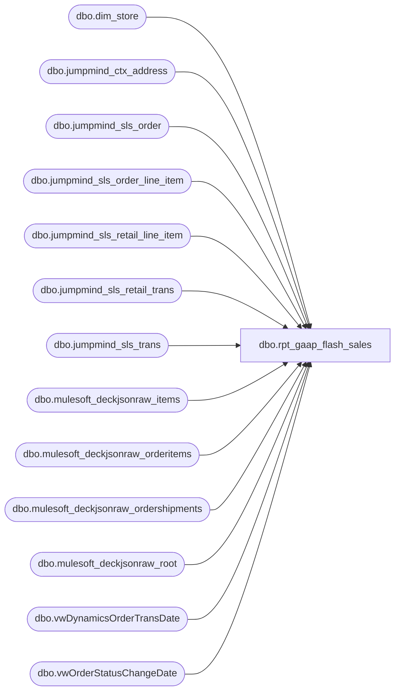

# dbo.rpt_gaap_flash_sales

**Database:** LH_Source  
**Server:** 4db76rlxaxcuvmuh5kw37wbnqq-ovsykae43znuhlmnflcdwm4ohu.datawarehouse.fabric.microsoft.com  

## Architecture Diagram



## Table Dependencies

| Referenced Table |
|---|
| dbo.dim_store |
| dbo.jumpmind_ctx_address |
| dbo.jumpmind_sls_order |
| dbo.jumpmind_sls_order_line_item |
| dbo.jumpmind_sls_retail_line_item |
| dbo.jumpmind_sls_retail_trans |
| dbo.jumpmind_sls_trans |
| dbo.mulesoft_deckjsonraw_items |
| dbo.mulesoft_deckjsonraw_orderitems |
| dbo.mulesoft_deckjsonraw_ordershipments |
| dbo.mulesoft_deckjsonraw_root |
| dbo.vwDynamicsOrderTransDate |
| dbo.vwOrderStatusChangeDate |

## View Code

```sql
/* =============================================================================    rpt_gaap_flash_sales.sql -- GAAP Flash Sales Report  (BLUEPRINT REBUILD)    =============================================================================    Domain:    Sales / Finance    Consumer:  Power BI dashboard "GAAP Flash Sales (Daily)"     GRAIN: one row per (store, business date).     SOURCE OF TRUTH      Rebuilt to the finance "LH_Data_Summed_by_GL" blueprint, GL 400000      (Sales - Merchandise). Computed entirely from LH_Source raw feeds; no      LH_Mart. Two contributions, exactly as the blueprint defines them:         POS  (merchSales):  LH_Source.dbo.jumpmind_sls_retail_line_item                            .extended_amount for COMPLETED, non-void                            merchandise lines, excluding the blueprint's                            non-merch item_id list and the GIFTCARD / DONATION                            / STORE_ORDER_SHIPPING / SERVICE item_types, and                            excluding endless-aisle order lines (s.sequence_number                            IS NULL). UK / IE booked ex-VAT (extended_amount -                            tax_amount). US / CA booked at extended_amount.         OMS  (omsMerchSales): LH_Source.dbo.mulesoft_deckjsonraw_* shipped                            order items whose ItemTypeID is neither gift card                            (2,24) nor donation (5), at oi.NetPrice.     CONVENTION NOTES (blueprint authoritative, per 2026-06-15 decision)      - UK / IE are EX-VAT here. The prior view multiplied GBP/EUR by 1.20 to        tie to Linda's VAT-inclusive xlsx; the blueprint books ex-VAT, so that        markup is removed.      - Amounts are SIGNED / NET (returns subtract). The prior view took ABS()        per store-day; the blueprint keeps the sign.      - @eurExchangeRate is 1.000000 in the blueprint, so IE collapses to        (extended_amount - tax_amount) with no FX applied.     STORE SCOPE      The blueprint hard-codes a 448 business_unit_id IN-list. We instead scope      via the INNER JOIN to jumpmind_ctx_address (every real store + its      country_id), so the view does not go stale as stores open. This is the      ONLY intentional deviation from the blueprint and it makes the report      MORE complete, not less (see DATA GAPS).     VALIDATION (2026-03-11, vs blueprint GL 400000)      CA 33,554.50 = 33,554.50 (exact). IE 3,784.80 = 3,784.80 (exact).      US: blueprint 751,347.37; rebuild 759,257.37. The +7,910.00 is exactly          three US stores (1585=4,825.00, 1584=2,240.00, 1591=845.00) that have          real merchandise sales but are absent from the blueprint's 448-store          list. US in-list POS (725,093.37) + US OMS (26,254.00) ties to the          blueprint to the penny.      UK: blueprint 65,819.08; rebuild 66,174.57. The +355.49 is the OMS          dual-date quirk below; it nets to zero over any multi-day period.     DATA GAPS (per 2026-06-15 ask)      1. Blueprint store list is stale. Stores 1584 / 1585 / 1591 (and any         future openings) ring real sales but are not in the finance         @businessUnitIDs list, so a single-day blueprint run understates US by         their volume. Finance must add new stores to that list; this report         already includes them.      2. OMS date is dual-keyed in the blueprint: UK/IE OMS rows are FILTERED on         v.TransactionDate but LABELLED by OrderDateUTC, so a single UK/IE OMS         order can be counted on a different day than it is filtered. A         parameterless view cannot reproduce that split; we label OMS by         OrderDateUTC (matching the blueprint's output column). Effect is a         sub-$400/day shuffle between adjacent UK days that nets to zero over a         period. US is unaffected (BAB rows use OrderDateUTC for both).     UPSTREAM SOURCES (LH_Source only)      jumpmind_sls_trans, jumpmind_sls_retail_trans, jumpmind_sls_order,      jumpmind_sls_order_line_item, jumpmind_sls_retail_line_item,      jumpmind_ctx_address, mulesoft_deckjsonraw_root / items / orderitems /      ordershipments, vwDynamicsOrderTransDate, vwOrderStatusChangeDate,      dbo.dim_store (Store Name only).    ============================================================================= */  CREATE   VIEW dbo.rpt_gaap_flash_sales AS WITH jm_trans AS (     SELECT device_id, business_unit_id, sequence_number, business_date,            trans_type, trans_status, create_time       FROM LH_Source.dbo.jumpmind_sls_trans      WHERE TRY_CONVERT(date, business_date) IS NOT NULL ), jm_retail_trans AS (     SELECT device_id, order_id, sequence_number, business_date, create_time       FROM LH_Source.dbo.jumpmind_sls_retail_trans      WHERE TRY_CONVERT(date, business_date) IS NOT NULL ), sales_orders AS (     /* Endless-aisle / order lines, excluded from POS merch so they are not        double-counted against the OMS branch. */     SELECT so.business_unit_id,            soli.orig_sequence_number      AS sequence_number,            soli.orig_line_sequence_number AS line_sequence_number,            so.business_date,            so.device_id       FROM LH_Source.dbo.jumpmind_sls_order            so       JOIN LH_Source.dbo.jumpmind_sls_order_line_item  soli ON so.order_id = soli.order_id       JOIN jm_retail_trans rt ON rt.order_id = soli.order_id                              AND rt.business_date = soli.orig_business_date                              AND rt.sequence_number = soli.orig_sequence_number       JOIN jm_trans        t  ON t.device_id = rt.device_id                              AND t.business_date = rt.business_date                              AND t.sequence_number = rt.sequence_number ), pos_merch AS (     /* Blueprint merchSales, GL 400000.        Date keyed on business_date (the store's declared business close) to        match AuditWorks transaction_date attribution. The blueprint windows on        create_time for single-day slice reproducibility; this view uses        business_date so Linda's date labels agree with the pipeline. */     SELECT         t.business_unit_id,         cbu.country_id,         TRY_CONVERT(date, t.business_date) AS business_date,         CASE             WHEN cbu.country_id IN ('UK','IE')                 THEN li.extended_amount - li.tax_amount   /* ex-VAT, tax is at line level */             ELSE li.extended_amount                       /* US / CA */         END AS amt       FROM LH_Source.dbo.jumpmind_sls_retail_line_item li       JOIN jm_trans t         ON t.business_date = li.business_date        AND t.sequence_number = li.sequence_number        AND t.device_id = li.device_id       LEFT JOIN sales_orders s         ON t.business_unit_id = s.business_unit_id        AND t.sequence_number = s.sequence_number        AND li.line_sequence_number = s.line_sequence_number        AND t.business_date = s.business_date        AND li.device_id = s.device_id       INNER JOIN LH_Source.dbo.jumpmind_ctx_address cbu         ON cbu.business_unit_id = LEFT(li.device_id, 4)      WHERE t.trans_status = 'COMPLETED'        AND li.voided = 0        AND li.item_id NOT IN ('999999990','999999995','899999902','999999996','999999997','000078','080150','080151','080188','080189','080510','080511','080512','080513','080706','080707','080742','080743','080744','080745','080746','080747','080748','080749','080751','080752','080753','080754','080755','080756','080757','080758','080759','080760','080761','080762','080763','080764','080765','080766','080767','080768','080769','080770','080771','080780','081678','083004','089505','090891','090892','098047','098089','098090','098091'             ,'180150','180510','180511','180512','180513','180706','180707','180745','180748','180749','180751','180753','180754','180755','180756','180760','180761','180767','180768','180770','180771','180780','183004','189014','189015','189016','189017','189018','190891','190892'             ,'480150','480151','480510','480511','480512','480513','480707','480708','480709','480745','480748','480749','480751','480753','480754','480755','480756','480757','480758','480760','480761','480764','480766','480767','480768','480770','480771','480780','480805','481089','483004','490891','490892'             ,'00001','00002','000025','000026','000027','000029','00003','000032','000035','00004','000042','000044','00006','000077','000078','000081','000082','00010','00011','00012','00013','00014','00015','00016','00017','00018','00019','00020','00021','00022','022610'             ,'080726','080727','080728','080729','080730','080731','080733','080736','080738','080741','091450','098041','098042','098043','098044','098075','098088','198075','400003','480200','480731','491450','491451','498033','498041','498088')        AND li.item_type NOT IN ('GIFTCARD','DONATION','STORE_ORDER_SHIPPING','SERVICE')        AND s.sequence_number IS NULL        AND TRY_CONVERT(date, t.business_date) >= DATEADD(year, -2, GETDATE())   /* rolling perf window */ ), oms_merch AS (     /* Blueprint omsMerchSales, GL 400000 only (ItemTypeID not gift card 2/24,        not donation 5).        OMS store attribution: SiteCode BAB/BABUK maps to the US/UK webstore        entities (1013/2013) matching Linda's AuditWorks attribution. When        v.InventLocationId carries the SiteCode literal ('BAB','BABUK') it        cannot be cast to int and would be dropped; the CASE prevents that. */     SELECT         CASE             WHEN r.SiteCode = 'BAB'   THEN '1013'             WHEN r.SiteCode = 'BABUK' THEN '2013'             ELSE v.InventLocationId         END AS business_unit_id,         CASE WHEN r.SiteCode = 'BAB' THEN 'US' WHEN r.SiteCode = 'BABUK' THEN 'UK' END AS country_id,         CAST(r.OrderDateUTC AS date) AS business_date,         oi.NetPrice AS amt       FROM LH_Source.dbo.mulesoft_deckjsonraw_root r       INNER JOIN LH_Source.dbo.mulesoft_deckjsonraw_items i               ON r.OrderID = i._ParentKeyField AND i.OrderShipmentID <> 0       INNER JOIN LH_Source.dbo.mulesoft_deckjsonraw_orderitems oi               ON i.OrderItemID = oi.ID       INNER JOIN LH_Source.dbo.mulesoft_deckjsonraw_ordershipments os               ON i.OrderShipmentID = os.OrderShipmentID AND os.Shipped = 1 AND oi.RoutingID = os.WarehouseID       INNER JOIN LH_Source.dbo.vwDynamicsOrderTransDate v               ON r.OrderNumber = v.OrderNumber AND os.OrderShipmentID = v.OrderShipmentID       INNER JOIN LH_Source.dbo.vwOrderStatusChangeDate v2               ON r.OrderNumber = v2.OrderNumber      WHERE r.OrderStatus IN (6, 10)        AND v.ECommOrderType NOT IN ('Webstore')        AND v.Shipped = 1        AND oi.ItemTypeID NOT IN (2, 24, 5)        AND r.OrderDateUTC >= DATEADD(year, -2, GETDATE())   /* rolling perf window */ ), combined AS (     SELECT business_unit_id, business_date, amt FROM pos_merch     UNION ALL     SELECT business_unit_id, business_date, amt FROM oms_merch ), agg AS (     SELECT         TRY_CONVERT(int, business_unit_id) AS store_no,         business_date                      AS transaction_date,         SUM(amt)                           AS net_sales_amt       FROM combined      WHERE business_unit_id IS NOT NULL        AND business_date IS NOT NULL      GROUP BY TRY_CONVERT(int, business_unit_id), business_date ), store_lookup AS (     SELECT TRY_CAST(store_id AS int) AS store_no_int,            MAX(store_name)           AS store_name       FROM dbo.dim_store      WHERE TRY_CAST(store_id AS int) IS NOT NULL      GROUP BY TRY_CAST(store_id AS int) ) SELECT     a.store_no                       AS [Store Number],     sl.store_name                    AS [Store Name],     a.transaction_date               AS [Transaction Date],     a.net_sales_amt                  AS [Net Sales Amount (Native Currency)],     0                                AS [Reserved]   FROM agg a   LEFT JOIN store_lookup sl ON sl.store_no_int = a.store_no  WHERE a.store_no IS NOT NULL;
```

