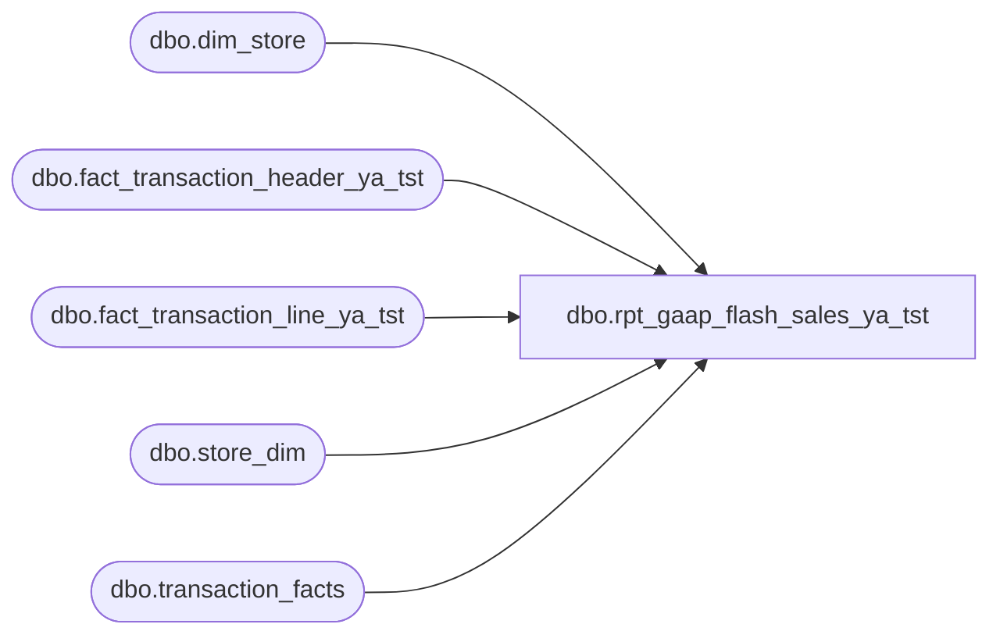

# dbo.rpt_gaap_flash_sales_ya_tst

**Database:** LH_Source  
**Server:** 4db76rlxaxcuvmuh5kw37wbnqq-ovsykae43znuhlmnflcdwm4ohu.datawarehouse.fabric.microsoft.com  

## Architecture Diagram



## Table Dependencies

| Referenced Table |
|---|
| dbo.dim_store |
| dbo.fact_transaction_header_ya_tst |
| dbo.fact_transaction_line_ya_tst |
| dbo.store_dim |
| dbo.transaction_facts |

## View Code

```sql
CREATE   VIEW dbo.rpt_gaap_flash_sales_ya_tst AS WITH lh_agg AS (     /* LH_Mart per-(store, date) aggregates: total row count + count of        rows with any Store/GAAP/party "main" flag. Powers the rescue rule. */     SELECT         CASE WHEN sd.store_id < 1000 THEN sd.store_id + 1000 ELSE sd.store_id END AS store_no,         CAST(DATEADD(day, m.date_key, '1997-01-04') AS date) AS transaction_date,         COUNT(*) AS lh_total_rows,         SUM(CASE WHEN m.Store_transaction_flag = 1                    OR m.GAAP_transaction_flag = 1                    OR m.party_flag = 1                   THEN 1 ELSE 0 END) AS lh_main_count       FROM LH_Mart.dbo.transaction_facts m       JOIN LH_Mart.dbo.store_dim sd ON sd.store_key = m.store_key      WHERE sd.store_id IS NOT NULL        /* Rolling 2-year window for perf; downstream filters narrow further. */        AND m.date_key BETWEEN DATEDIFF(day, '1997-01-04', DATEADD(year, -2, GETDATE()))                           AND DATEDIFF(day, '1997-01-04', GETDATE())      GROUP BY         CASE WHEN sd.store_id < 1000 THEN sd.store_id + 1000 ELSE sd.store_id END,         CAST(DATEADD(day, m.date_key, '1997-01-04') AS date) ), fact_pair_counts AS (     /* fact_transaction_header cat=1/2 non-void counts per (store, date) —        used as the "real activity" denominator in the rescue rule. */     SELECT         a.store_no,         CAST(a.transaction_date AS date) AS transaction_date,         COUNT(*) AS fact_count       FROM dbo.fact_transaction_header_ya_tst a      WHERE a.transaction_void_flag = 0        AND a.transaction_category IN (1, 2)        /* Rolling 2-year window for perf; matches lh_agg window above. */        AND a.transaction_date >= DATEADD(year, -2, GETDATE())      GROUP BY a.store_no, CAST(a.transaction_date AS date) ), primary_universe AS (     /* R1: canonical-accounting-classified Store + GAAP transactions. */     SELECT DISTINCT         CASE WHEN sd.store_id < 1000 THEN sd.store_id + 1000 ELSE sd.store_id END AS store_no,         CAST(DATEADD(day, m.date_key, '1997-01-04') AS date) AS transaction_date       FROM LH_Mart.dbo.transaction_facts m       JOIN LH_Mart.dbo.store_dim sd ON sd.store_key = m.store_key      WHERE sd.store_id IS NOT NULL        AND m.GAAP_transaction_flag = 1        AND m.Store_transaction_flag = 1        AND m.date_key BETWEEN DATEDIFF(day, '1997-01-04', DATEADD(year, -2, GETDATE()))                           AND DATEDIFF(day, '1997-01-04', GETDATE()) ), rescue_universe AS (     /* Rescue rule for LH_Mart partial-load gaps (e.g. (2013, 2026-03-22)        where 10 giftcard_only_flag=1 rows exist but no Store/GAAP/party        rows, while fact_transaction_header has 238 cat=1 nonvoid rows).        Thresholds verified via gaap_flash_sales_fast.py to recover the        single edge case without false positives. */     SELECT lh.store_no, lh.transaction_date       FROM lh_agg lh       JOIN fact_pair_counts fc         ON fc.store_no = lh.store_no        AND fc.transaction_date = lh.transaction_date      WHERE lh.lh_main_count = 0        AND lh.lh_total_rows <= 11        AND fc.fact_count >= 100 ), universe AS (     SELECT store_no, transaction_date FROM primary_universe     UNION     SELECT store_no, transaction_date FROM rescue_universe ), amounts AS (     /* R3: net sales amount per (store, date) using the GAAP line_object        IN-list. Pairs in the universe with no qualifying lines yield no        row here and the outer LEFT JOIN COALESCEs amount to 0 (R4). */     SELECT         a.store_no,         CAST(a.transaction_date AS date) AS transaction_date,         SUM(((b.gross_line_amount - b.pos_discount_amount))              * b.db_cr_none * b.voiding_reversal_flag) AS net_sales_amt       FROM dbo.fact_transaction_header_ya_tst a       JOIN dbo.fact_transaction_line_ya_tst   b ON a.transaction_id = b.transaction_id      WHERE a.transaction_void_flag = 0        AND a.transaction_category IN (1, 2)        AND b.line_void_flag = 0        AND b.line_object IN (100, 102, 103, 104, 200, 202, 203, 204, 210,                              250, 290, 291, 295, 621, 623, 640, 1187, 1199)        /* R3: exclude Fabric-staging LOYALTY/EMPLOYEE → 100 re-classification */        AND NOT (b.line_object = 100 AND b.item_type IN ('LOYALTY', 'EMPLOYEE'))        AND a.transaction_date >= DATEADD(year, -2, GETDATE())      GROUP BY a.store_no, CAST(a.transaction_date AS date) ) SELECT     u.store_no                                                AS [Store Number],     c.store_name                                              AS [Store Name],     u.transaction_date                                        AS [Transaction Date],     COALESCE(amt.net_sales_amt, 0)                            AS [Net Sales Amount (Native Currency)],     0                                                         AS [Reserved]   FROM universe AS u   LEFT JOIN amounts AS amt     ON amt.store_no         = u.store_no    AND amt.transaction_date = u.transaction_date   LEFT JOIN dbo.dim_store AS c     ON TRY_CAST(c.store_id AS int) = u.store_no;
```

