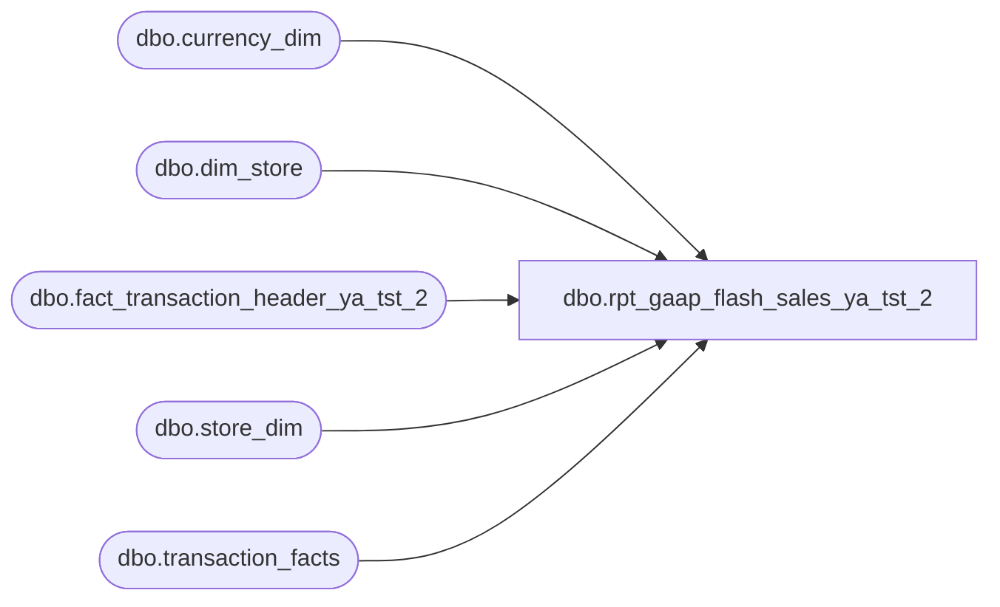

# dbo.rpt_gaap_flash_sales_ya_tst_2

**Database:** LH_Source  
**Server:** 4db76rlxaxcuvmuh5kw37wbnqq-ovsykae43znuhlmnflcdwm4ohu.datawarehouse.fabric.microsoft.com  

## Architecture Diagram



## Table Dependencies

| Referenced Table |
|---|
| dbo.currency_dim |
| dbo.dim_store |
| dbo.fact_transaction_header_ya_tst_2 |
| dbo.store_dim |
| dbo.transaction_facts |

## View Code

```sql
CREATE   VIEW dbo.rpt_gaap_flash_sales_ya_tst_2 AS WITH lh_agg AS (     /* LH_Mart per-(store, date) aggregates: total row count + count of        rows with any Store/GAAP/party "main" flag. Powers the rescue rule. */     SELECT         CASE WHEN sd.store_id < 1000 THEN sd.store_id + 1000 ELSE sd.store_id END AS store_no,         CAST(DATEADD(day, m.date_key, '1997-01-04') AS date) AS transaction_date,         COUNT(*) AS lh_total_rows,         SUM(CASE WHEN m.Store_transaction_flag = 1                    OR m.GAAP_transaction_flag = 1                    OR m.party_flag = 1                   THEN 1 ELSE 0 END) AS lh_main_count       FROM LH_Mart.dbo.transaction_facts m       JOIN LH_Mart.dbo.store_dim sd ON sd.store_key = m.store_key      WHERE sd.store_id IS NOT NULL        /* Rolling 2-year window for perf; downstream filters narrow further. */        AND m.date_key BETWEEN DATEDIFF(day, '1997-01-04', DATEADD(year, -2, GETDATE()))                           AND DATEDIFF(day, '1997-01-04', GETDATE())      GROUP BY         CASE WHEN sd.store_id < 1000 THEN sd.store_id + 1000 ELSE sd.store_id END,         CAST(DATEADD(day, m.date_key, '1997-01-04') AS date) ), fact_pair_counts AS (     /* fact_transaction_header cat=1/2 non-void counts per (store, date) —        used as the "real activity" denominator in the rescue rule. */     SELECT         a.store_no,         CAST(a.transaction_date AS date) AS transaction_date,         COUNT(*) AS fact_count       FROM dbo.fact_transaction_header_ya_tst_2 a      WHERE a.transaction_void_flag = 0        AND a.transaction_category IN (1, 2)        /* Rolling 2-year window for perf; matches lh_agg window above. */        AND a.transaction_date >= DATEADD(year, -2, GETDATE())      GROUP BY a.store_no, CAST(a.transaction_date AS date) ), primary_universe AS (     /* R1: canonical-accounting-classified Store + GAAP transactions. */     SELECT DISTINCT         CASE WHEN sd.store_id < 1000 THEN sd.store_id + 1000 ELSE sd.store_id END AS store_no,         CAST(DATEADD(day, m.date_key, '1997-01-04') AS date) AS transaction_date       FROM LH_Mart.dbo.transaction_facts m       JOIN LH_Mart.dbo.store_dim sd ON sd.store_key = m.store_key      WHERE sd.store_id IS NOT NULL        AND m.GAAP_transaction_flag = 1        AND m.Store_transaction_flag = 1        AND m.date_key BETWEEN DATEDIFF(day, '1997-01-04', DATEADD(year, -2, GETDATE()))                           AND DATEDIFF(day, '1997-01-04', GETDATE()) ), rescue_universe AS (     /* Rescue rule for LH_Mart partial-load gaps (e.g. (2013, 2026-03-22)        where 10 giftcard_only_flag=1 rows exist but no Store/GAAP/party        rows, while fact_transaction_header has 238 cat=1 nonvoid rows).        Thresholds verified via gaap_flash_sales_fast.py to recover the        single edge case without false positives. */     SELECT lh.store_no, lh.transaction_date       FROM lh_agg lh       JOIN fact_pair_counts fc         ON fc.store_no = lh.store_no        AND fc.transaction_date = lh.transaction_date      WHERE lh.lh_main_count = 0        AND lh.lh_total_rows <= 11        AND fc.fact_count >= 100 ), universe AS (     SELECT store_no, transaction_date FROM primary_universe     UNION     SELECT store_no, transaction_date FROM rescue_universe ), amounts AS (     /* R3: net sales amount per (store, date) from LH_Mart.transaction_facts.        See header for full rationale.         Filter: Store_transaction_flag = 1 (the LH_Mart row-level mirror of        Linda's `transaction_void_flag = 0 AND transaction_category IN (1,2)`).        We deliberately do NOT add GAAP_transaction_flag = 1 here — Linda's        SmartLook source query has no GAAP flag (the word "GAAP" in the        report title refers to the GAAP *line_object* whitelist applied at        the line level upstream). Adding GAAP_transaction_flag = 1 would        strip rows that contribute small positive amounts on quiet days        (verified — going from `Store=1 only` to `GAAP=1 AND Store=1` swings        198 keys from in-tolerance to out-of-tolerance).         The 1.20 markup is applied at the row level (multiplied into        GAAP_sales_amount before SUM) so a store-date with both US and        non-US rows would still mark up only the non-USD rows. */     SELECT         CASE WHEN sd.store_id < 1000              THEN sd.store_id + 1000              ELSE sd.store_id END AS store_no,         CAST(DATEADD(day, m.date_key, '1997-01-04') AS date) AS transaction_date,         ABS(SUM(m.GAAP_sales_amount                 * CASE WHEN cd.currency_code IN ('GBP', 'EUR')                        THEN 1.20  /* UK / EU VAT add-back; see header R3 */                        ELSE 1.0                   END)) AS net_sales_amt       FROM LH_Mart.dbo.transaction_facts m       JOIN LH_Mart.dbo.store_dim sd         ON sd.store_key = m.store_key       LEFT JOIN LH_Mart.dbo.currency_dim cd         ON cd.currency_key = m.currency_key      WHERE sd.store_id IS NOT NULL        /* Row filter: see header. Store_transaction_flag=1 mirrors Linda's           auditworks `transaction_void_flag=0 AND transaction_category IN (1,2)`           on the standard Bear-Plus / Bare-Bear / Plus-Only transaction types.           We additionally OR in `(Store_Sales_Amount > 0 AND transaction_type_key = 3)`           to catch "Plus Only" merchandise transactions (ttkey=3, transaction_type           'Plus Only') that LH_Mart leaves Store_transaction_flag = 0 on even when           Store_Sales_Amount is populated — these are typically multi-unit           merchandise sales with all sales in non_animal_UGA / other_UGA, and           Linda includes them. Verified: (1534, 2026-03-30) gains the two missing           txns 516801872 / 516801873 that account for the $2,625 shortfall. */        AND (m.Store_transaction_flag = 1             OR (m.transaction_type_key = 3 AND m.Store_Sales_Amount > 0))        AND m.date_key BETWEEN DATEDIFF(day, '1997-01-04', DATEADD(year, -2, GETDATE()))                           AND DATEDIFF(day, '1997-01-04', GETDATE())      GROUP BY         CASE WHEN sd.store_id < 1000              THEN sd.store_id + 1000              ELSE sd.store_id END,         CAST(DATEADD(day, m.date_key, '1997-01-04') AS date) ), store_lookup AS (     /* dbo.dim_store has ~1.66 duplicate rows per store_id on average and        up to 2 rows for some keys (verified 2026-05-17 — every store_id        1004, 1013, 1131, 1132, 1148, 1417, 1459, 1536 returned 2 rows).        A direct JOIN doubles every (store, date) row out of the view,        which silently 2x's every downstream value comparison.        Dedupe to one row per store_id before the outer join. */     SELECT         TRY_CAST(store_id AS int) AS store_no_int,         MAX(store_name) AS store_name       FROM dbo.dim_store      WHERE TRY_CAST(store_id AS int) IS NOT NULL      GROUP BY TRY_CAST(store_id AS int) ) SELECT     u.store_no                                                AS [Store Number],     sl.store_name                                             AS [Store Name],     u.transaction_date                                        AS [Transaction Date],     COALESCE(amt.net_sales_amt, 0)                            AS [Net Sales Amount (Native Currency)],     0                                                         AS [Reserved]   FROM universe AS u   LEFT JOIN amounts AS amt     ON amt.store_no         = u.store_no    AND amt.transaction_date = u.transaction_date   LEFT JOIN store_lookup AS sl     ON sl.store_no_int = u.store_no;
```

