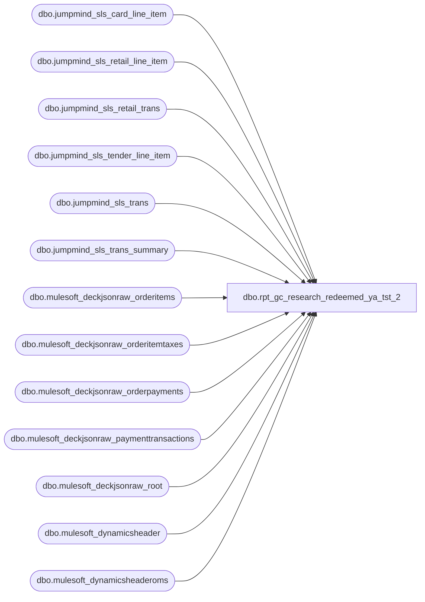

# dbo.rpt_gc_research_redeemed_ya_tst_2

**Database:** LH_Source  
**Server:** 4db76rlxaxcuvmuh5kw37wbnqq-ovsykae43znuhlmnflcdwm4ohu.datawarehouse.fabric.microsoft.com  

## Architecture Diagram



## Table Dependencies

| Referenced Table |
|---|
| dbo.jumpmind_sls_card_line_item |
| dbo.jumpmind_sls_retail_line_item |
| dbo.jumpmind_sls_retail_trans |
| dbo.jumpmind_sls_tender_line_item |
| dbo.jumpmind_sls_trans |
| dbo.jumpmind_sls_trans_summary |
| dbo.mulesoft_deckjsonraw_orderitems |
| dbo.mulesoft_deckjsonraw_orderitemtaxes |
| dbo.mulesoft_deckjsonraw_orderpayments |
| dbo.mulesoft_deckjsonraw_paymenttransactions |
| dbo.mulesoft_deckjsonraw_root |
| dbo.mulesoft_dynamicsheader |
| dbo.mulesoft_dynamicsheaderoms |

## View Code

```sql
CREATE   VIEW dbo.rpt_gc_research_redeemed_ya_tst_2 AS WITH /* ── POS path ─────────────────────────────────────────────────────────── */ pos_gc_redeem AS (     SELECT         CONCAT(t.device_id, '-', t.business_date, '-', t.sequence_number) AS transaction_key,         CAST(t.sequence_number AS varchar(50))                            AS transaction_no,         TRY_CONVERT(int, t.business_unit_id)                              AS store_no,         CAST(t.username AS varchar(64))                                   AS associate_id,         TRY_CONVERT(datetime2(6), t.last_update_time)                     AS transaction_date,         CAST(c.type_code AS varchar(200))                                 AS tender_type,         CAST(ts.tender1_auth_code AS varchar(64))                         AS status,         CAST(c.card_number AS varchar(64))                                AS card_number,         CAST(tli.tender_amount AS decimal(18,6))                          AS tender_amount,         CAST(st.customer_name AS varchar(200))                            AS customer_name,         CAST(st.loyalty_card_number AS varchar(100))                      AS loyalty_card_number,         CONCAT(j.item_id, ' - ', j.item_description)                      AS item_line,         CAST(j.actual_unit_price AS decimal(18,2))                        AS gross_amount,         CAST(j.tax_amount AS decimal(18,2))                               AS tax_amount,         CAST('POS' AS varchar(10))                                        AS source_system       FROM LH_Source.dbo.jumpmind_sls_trans                  t       JOIN LH_Source.dbo.jumpmind_sls_card_line_item         c         ON c.device_id       = t.device_id        AND c.business_date   = t.business_date        AND c.sequence_number = t.sequence_number       LEFT JOIN LH_Source.dbo.jumpmind_sls_tender_line_item  tli         ON tli.device_id            = c.device_id        AND tli.business_date        = c.business_date        AND tli.sequence_number      = c.sequence_number        AND tli.line_sequence_number = c.ref_line_sequence_number       LEFT JOIN LH_Source.dbo.jumpmind_sls_trans_summary     ts         ON ts.device_id       = t.device_id        AND ts.business_date   = t.business_date        AND ts.sequence_number = t.sequence_number       LEFT JOIN LH_Source.dbo.jumpmind_sls_retail_trans      st         ON st.device_id       = t.device_id        AND st.business_date   = t.business_date        AND st.sequence_number = t.sequence_number       LEFT JOIN LH_Source.dbo.jumpmind_sls_retail_line_item  j         ON j.device_id       = t.device_id        AND j.business_date   = t.business_date        AND j.sequence_number = t.sequence_number      WHERE c.type_code = 'Gift Card'                                      /* BAB filter */        AND t.business_unit_id IS NOT NULL                                  /* BAB filter */        /* Void filter dropped 2026-05-15: original `AND ISNULL(c.voided,0)=0`           referenced a column that does not exist on jumpmind_sls_card_line_item           (LH_Source schema confirmed: 20 cols, no `voided`). Closest analogue           is jumpmind_sls_tender_line_item.voided which IS filtered upstream           where redemption-tender semantics actually live. Re-add a parent           transaction void check here once SME confirms the right source           (tli.voided vs t.trans_status_code vs jumpmind_sls_trans.voided_*). */ ), /* ── OMS path ─────────────────────────────────────────────────────────── */ oms_gc_redeem AS (     SELECT         CONCAT(             CASE WHEN r.SiteCode = 'BAB' THEN '1013' WHEN r.SiteCode = 'BABUK' THEN '2013' ELSE '9999' END,             '-052-', CONVERT(varchar(8), CAST(COALESCE(r.OrderDateUTC, r.DateCreatedUTC) AS date), 112),             '-', r.OrderID         )                                                                 AS transaction_key,         COALESCE(TRY_CONVERT(varchar(50), r.OrderNumber),                  TRY_CONVERT(varchar(50), r.OrderID))                      AS transaction_no,         CASE WHEN r.SiteCode = 'BAB' THEN 1013 WHEN r.SiteCode = 'BABUK' THEN 2013 ELSE 9999 END AS store_no,         CAST(r.UserID AS varchar(64))                                     AS associate_id,         TRY_CONVERT(datetime2(6), COALESCE(r.OrderDateUTC, r.DateCreatedUTC, r.InsertDate)) AS transaction_date,         CAST(op.Generic1 AS varchar(200))                                 AS tender_type,         CAST(COALESCE(NULLIF(pt.Generic1,''), 'NONE') AS varchar(64))     AS status,         CAST(pt.Generic1 AS varchar(64))                                  AS card_number,         /* tender_amount per BAB OMS formula */         COALESCE(             CASE                 WHEN pt.Amount IS NULL OR pt.Amount = 0 THEN NULL                 WHEN pt.PaymentTransactionTypeId IN (3,4,11) THEN -ABS(pt.Amount)                 WHEN pt.PaymentTransactionTypeId IN (1,2,10,14) THEN  ABS(pt.Amount)                 ELSE pt.Amount             END,             NULLIF(op.CapturedAmount, 0),             NULLIF(op.AuthorizedAmount, 0),             -1 * NULLIF(op.CreditedAmount, 0),             0         )                                                                 AS tender_amount,         TRIM(CONCAT(ISNULL(r.FirstName1,''), ' ', ISNULL(r.LastName1,''))) AS customer_name,         CAST(r.Custom3 AS varchar(100))                                   AS loyalty_card_number,         CONCAT(oi.StyleNumber, ' - ', oi.Custom1)                         AS item_line,         CAST(oi.NetPrice AS decimal(18,2))                                AS gross_amount,         CAST(ISNULL(oit.Amount, 0) AS decimal(18,2))                      AS tax_amount,         CAST('OMS' AS varchar(10))                                        AS source_system       FROM LH_Source.dbo.mulesoft_deckjsonraw_root            r       JOIN LH_Source.dbo.mulesoft_deckjsonraw_orderpayments   op         ON TRY_CONVERT(int, op._ParentKeyField) = TRY_CONVERT(int, r._RowIndex)       LEFT JOIN LH_Source.dbo.mulesoft_deckjsonraw_paymenttransactions pt         ON pt.OrderPaymentId = op.ID       LEFT JOIN LH_Source.dbo.mulesoft_deckjsonraw_orderitems  oi         ON TRY_CONVERT(bigint, oi.OrderID) = TRY_CONVERT(bigint, r.OrderID)       LEFT JOIN LH_Source.dbo.mulesoft_deckjsonraw_orderitemtaxes oit         ON TRY_CONVERT(bigint, oi._ParentKeyField) = TRY_CONVERT(bigint, oit._ParentKeyField)      WHERE op.Generic1 = 'Gift Card'                                      /* BAB filter */ ) SELECT     /* Field 1: Transaction ID — prefer canonical mulesoft_dynamicsheader[oms] */     COALESCE(         (SELECT TOP 1 CAST(dh.RetailTransactionId AS varchar(64))            FROM LH_Source.dbo.mulesoft_dynamicsheader dh           WHERE dh.TransactionKey = u.transaction_key),         (SELECT TOP 1 CAST(dh.RetailTransactionId AS varchar(64))            FROM LH_Source.dbo.mulesoft_dynamicsheaderoms dh           WHERE dh.RetailReceiptId = u.transaction_no),         u.transaction_key     )                                            AS [Transaction ID],     u.transaction_no                             AS [Transaction No],     CAST(u.transaction_date AS date)             AS [Transaction Date],     u.store_no                                   AS [Store Number],     u.associate_id                               AS [Associate Id],     u.tender_type                                AS [Tender Type],     u.status                                     AS [Status],     u.card_number                                AS [Card Number],     u.tender_amount                              AS [Tender Amount (Native Currency)],     u.customer_name                              AS [Customer Name],     u.loyalty_card_number                        AS [Loyalty Card Number],     u.item_line                                  AS [Item Line],     u.gross_amount                               AS [Gross],     u.tax_amount                                 AS [Tax Amount]   FROM (         SELECT * FROM pos_gc_redeem         UNION ALL         SELECT * FROM oms_gc_redeem   ) u;
```

