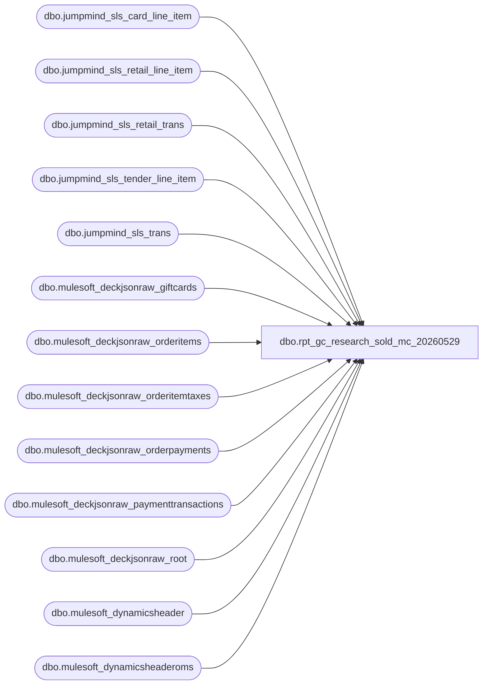

# dbo.rpt_gc_research_sold_mc_20260529

**Database:** LH_Source  
**Server:** 4db76rlxaxcuvmuh5kw37wbnqq-ovsykae43znuhlmnflcdwm4ohu.datawarehouse.fabric.microsoft.com  

## Architecture Diagram



## Table Dependencies

| Referenced Table |
|---|
| dbo.jumpmind_sls_card_line_item |
| dbo.jumpmind_sls_retail_line_item |
| dbo.jumpmind_sls_retail_trans |
| dbo.jumpmind_sls_tender_line_item |
| dbo.jumpmind_sls_trans |
| dbo.mulesoft_deckjsonraw_giftcards |
| dbo.mulesoft_deckjsonraw_orderitems |
| dbo.mulesoft_deckjsonraw_orderitemtaxes |
| dbo.mulesoft_deckjsonraw_orderpayments |
| dbo.mulesoft_deckjsonraw_paymenttransactions |
| dbo.mulesoft_deckjsonraw_root |
| dbo.mulesoft_dynamicsheader |
| dbo.mulesoft_dynamicsheaderoms |

## View Code

```sql
CREATE   VIEW dbo.rpt_gc_research_sold_mc_20260529 AS WITH /* ── POS path ─────────────────────────────────────────────────────────── */ pos_gc_sold AS (     SELECT         CONCAT(t.device_id, '-', t.business_date, '-', t.sequence_number) AS transaction_key,         TRY_CONVERT(int, t.business_unit_id)                              AS store_no,         RIGHT(t.device_id, 3)                                             AS register_no,         CAST(t.username AS varchar(64))                                   AS associate_id,         TRY_CONVERT(datetime2(6), t.create_time)                          AS activation_date,         CAST(t.trans_status AS varchar(64))                               AS trans_status,         TRY_CONVERT(bit, t.training_mode)                                 AS training_mode,         CAST(j.item_description AS varchar(8000))                         AS item_description,         CONVERT(varchar(64), c.gift_card_action_code)                     AS gift_card_action_code,         CONVERT(varchar(64), c.card_number)                               AS gift_card_number,         CAST(j.iso_currency_code AS varchar(8))                           AS currency_code,         CAST(j.quantity AS decimal(18,2))                                 AS qty,         CAST(j.extended_amount AS decimal(18,2))                          AS regular_sales_amount,         CAST(j.extended_discounted_amount AS decimal(18,2))               AS actual_sales_amount,         CAST(j.discount_amount AS decimal(18,2))                          AS discount_amount,         CAST(j.tax_amount AS decimal(18,2))                               AS tax_amount,         CAST(j.item_type AS varchar(64))                                  AS item_type,         CAST(j.line_item_type AS varchar(64))                             AS line_item_type,         st.customer_name,         st.loyalty_card_number,         CAST('POS' AS varchar(10))                                        AS source_system       FROM LH_Source.dbo.jumpmind_sls_trans               t       JOIN LH_Source.dbo.jumpmind_sls_retail_line_item    j         ON t.device_id       = j.device_id        AND t.business_date   = j.business_date        AND t.sequence_number = j.sequence_number       LEFT JOIN LH_Source.dbo.jumpmind_sls_card_line_item c         ON c.device_id       = j.device_id        AND c.business_date   = j.business_date        AND c.sequence_number = j.sequence_number        AND c.type_code       = 'GIFTCARD'       LEFT JOIN LH_Source.dbo.jumpmind_sls_retail_trans   st         ON st.device_id       = t.device_id        AND st.business_date   = t.business_date        AND st.sequence_number = t.sequence_number      WHERE j.item_description = 'Activate - Gift Card'                    /* BAB filter */        AND t.business_unit_id IS NOT NULL                                  /* BAB filter */ ), pos_tender AS (     SELECT         CONCAT(tli.device_id, '-', tli.business_date, '-', tli.sequence_number) AS transaction_key,         SUM(CAST(tli.tender_amount AS decimal(18,6)))                     AS tender_amount       FROM LH_Source.dbo.jumpmind_sls_tender_line_item tli      WHERE tli.create_by = 'openpos-sls'        AND ISNULL(tli.voided, 0) = 0      GROUP BY tli.device_id, tli.business_date, tli.sequence_number ), pos_calc AS (     SELECT         p.*,         /* BAB GBP/EUR TE calculation */         CASE             WHEN p.currency_code IN ('GBP','EUR')                 THEN (ABS(p.actual_sales_amount) - ABS(p.tax_amount)) * SIGN(p.qty)             ELSE p.actual_sales_amount         END                                                               AS actual_sales_amount_te,         CASE             WHEN p.currency_code IN ('GBP','EUR')                 THEN (ABS(p.regular_sales_amount) - ABS(p.tax_amount)                       + ABS(CASE WHEN (ABS(p.actual_sales_amount) - ABS(p.tax_amount)) <> 0                                   THEN p.discount_amount - (p.discount_amount * (p.tax_amount / NULLIF((ABS(p.actual_sales_amount) - ABS(p.tax_amount)) * SIGN(p.qty), 0)))                                   ELSE p.discount_amount END)                      ) * SIGN(p.qty)             ELSE p.regular_sales_amount         END                                                               AS regular_sales_amount_te       FROM pos_gc_sold p ), /* ── OMS path ─────────────────────────────────────────────────────────── */ oms_gc_sold AS (     SELECT         CONCAT(             CASE WHEN r.SiteCode = 'BAB' THEN '1013' WHEN r.SiteCode = 'BABUK' THEN '2013' ELSE '9999' END,             '-052-', CONVERT(varchar(8), CAST(COALESCE(r.OrderDateUTC, r.DateCreatedUTC) AS date), 112),             '-', r.OrderID         )                                                                 AS transaction_key,         CASE WHEN r.SiteCode = 'BAB' THEN 1013 WHEN r.SiteCode = 'BABUK' THEN 2013 ELSE 9999 END AS store_no,         CAST('052' AS varchar(3))                                         AS register_no,         CAST(r.UserID AS varchar(64))                                     AS associate_id,         TRY_CONVERT(datetime2(6), COALESCE(r.DateCreatedUTC, r.InsertDate)) AS activation_date,         CAST('COMPLETED' AS varchar(64))                                  AS trans_status,         CAST(0 AS bit)                                                    AS training_mode,         CAST(oi.Custom1 AS varchar(8000))                                 AS item_description,         CASE WHEN TRY_CONVERT(int, g.Processed) = 1 THEN 'Issue' ELSE NULL END AS gift_card_action_code,         CONVERT(varchar(64), TRY_CONVERT(bigint, g.GiftCardNumber))       AS gift_card_number,         CASE WHEN r.SiteCode = 'BABUK' THEN 'GBP' ELSE 'USD' END         AS currency_code,         CAST(1 AS decimal(18,2))                                          AS qty,         CAST(oi.GrossPrice AS decimal(18,2))                              AS regular_sales_amount,         CAST(oi.GrossPrice AS decimal(18,2))                              AS actual_sales_amount,         CAST(NULLIF(oi.GrossPrice - oi.NetPrice, 0.0) AS decimal(18,2))   AS discount_amount,         CAST(ISNULL(oit.Amount, 0) AS decimal(18,2))                      AS tax_amount,         CAST(oi.Custom1 AS varchar(64))                                   AS item_type,         CAST('Web Sale' AS varchar(64))                                   AS line_item_type,         TRIM(CONCAT(ISNULL(r.FirstName1,''), ' ', ISNULL(r.LastName1,''))) AS customer_name,         CAST(r.Custom3 AS varchar(100))                                   AS loyalty_card_number,         CAST('OMS' AS varchar(10))                                        AS source_system,         r.OrderID, r.OrderNumber       FROM LH_Source.dbo.mulesoft_deckjsonraw_root      r       JOIN LH_Source.dbo.mulesoft_deckjsonraw_orderitems oi         ON TRY_CONVERT(bigint, oi.OrderID) = TRY_CONVERT(bigint, r.OrderID)       LEFT JOIN LH_Source.dbo.mulesoft_deckjsonraw_orderitemtaxes oit         ON TRY_CONVERT(bigint, oi._ParentKeyField) = TRY_CONVERT(bigint, oit._ParentKeyField)       LEFT JOIN LH_Source.dbo.mulesoft_deckjsonraw_giftcards g         ON g._ParentKeyField = oi._ParentKeyField      WHERE oi.Custom1 = 'Activate - Gift Card'                            /* BAB filter */        AND r.OrderID IS NOT NULL ), oms_tender AS (     SELECT         TRY_CONVERT(int, op._ParentKeyField)                              AS ParentOrderID,         SUM(             COALESCE(                 CASE                     WHEN pt.Amount IS NULL OR pt.Amount = 0 THEN NULL                     WHEN pt.PaymentTransactionTypeId IN (3,4,11) THEN -ABS(pt.Amount)                     WHEN pt.PaymentTransactionTypeId IN (1,2,10,14) THEN  ABS(pt.Amount)                     ELSE pt.Amount                 END,                 NULLIF(op.CapturedAmount, 0),                 NULLIF(op.AuthorizedAmount, 0),                 -1 * NULLIF(op.CreditedAmount, 0),                 0             )         )                                                                 AS tender_amount       FROM LH_Source.dbo.mulesoft_deckjsonraw_orderpayments op       LEFT JOIN LH_Source.dbo.mulesoft_deckjsonraw_paymenttransactions pt         ON pt.OrderPaymentId = op.ID      GROUP BY TRY_CONVERT(int, op._ParentKeyField) ), oms_calc AS (     SELECT         o.*,         CASE             WHEN o.currency_code IN ('GBP','EUR')                 THEN (ABS(o.actual_sales_amount) - ABS(o.tax_amount)) * SIGN(o.qty)             ELSE o.actual_sales_amount         END                                                               AS actual_sales_amount_te,         o.regular_sales_amount                                            AS regular_sales_amount_te       FROM oms_gc_sold o ) SELECT     /* Field 1: Transaction ID — prefer canonical mulesoft_dynamicsheader[oms].RetailTransactionId */     COALESCE(         (SELECT TOP 1 CAST(dh.RetailTransactionId AS varchar(64))            FROM LH_Source.dbo.mulesoft_dynamicsheader dh           WHERE dh.TransactionKey = u.transaction_key),         (SELECT TOP 1 CAST(dh.RetailTransactionId AS varchar(64))            FROM LH_Source.dbo.mulesoft_dynamicsheaderoms dh           WHERE dh.RetailReceiptId = u.transaction_key),         u.transaction_key     )                                                AS [Transaction ID],     CAST(u.activation_date AS date)                  AS [Transaction Date],     u.store_no                                       AS [Store Number],     u.register_no                                    AS [RegisterNo],     u.associate_id                                   AS [Associate Id],     u.item_description                               AS [Item Description],     u.gift_card_action_code                          AS [Gift Card Action Code],     u.gift_card_number                               AS [Gift Card Number],     u.tender_amount                                  AS [Tender Amount (Native Currency)],     u.regular_sales_amount_te                        AS [Activated Gift Cards Gross Amount TE (Native)],     u.actual_sales_amount_te                         AS [Activated Gift Cards Net Amount TE (Native)],     u.activation_date                                AS [Activation Date],     u.customer_name                                  AS [Customer Name],     u.loyalty_card_number                            AS [Loyalty Card Number]   FROM (         SELECT pc.transaction_key, pc.store_no, pc.register_no, pc.associate_id,                pc.activation_date, pc.item_description, pc.gift_card_action_code,                pc.gift_card_number, pt.tender_amount,                pc.regular_sales_amount_te, pc.actual_sales_amount_te,                pc.customer_name, pc.loyalty_card_number,                pc.source_system           FROM pos_calc pc           LEFT JOIN pos_tender pt ON pt.transaction_key = pc.transaction_key          WHERE pc.trans_status = 'COMPLETED'            AND pc.training_mode = 0            AND pc.item_type     = 'GIFTCARD'            AND pc.line_item_type IN ('Store_sale','Web Sale')         UNION ALL         SELECT oc.transaction_key, oc.store_no, oc.register_no, oc.associate_id,                oc.activation_date, oc.item_description, oc.gift_card_action_code,                oc.gift_card_number, ot.tender_amount,                oc.regular_sales_amount_te, oc.actual_sales_amount_te,                oc.customer_name, oc.loyalty_card_number,                oc.source_system           FROM oms_calc oc           LEFT JOIN oms_tender ot ON ot.ParentOrderID = oc.OrderID          WHERE oc.item_type    = 'GIFTCARD'            AND oc.line_item_type IN ('Store Sale','Web Sale')   ) u;
```

