# dbo.rpt_gift_card_activations

**Database:** LH_Source  
**Server:** 4db76rlxaxcuvmuh5kw37wbnqq-ovsykae43znuhlmnflcdwm4ohu.datawarehouse.fabric.microsoft.com  

## Architecture Diagram

```mermaid
flowchart LR
    VIEW["dbo.rpt_gift_card_activations"]
    dbo_fact_merchandise_detail(["dbo.fact_merchandise_detail"]) --> VIEW
    dbo_fact_transaction_header(["dbo.fact_transaction_header"]) --> VIEW
    dbo_fact_transaction_line(["dbo.fact_transaction_line"]) --> VIEW
    dbo_jumpmind_sls_card_line_item(["dbo.jumpmind_sls_card_line_item"]) --> VIEW
    dbo_mulesoft_deckjsonraw_giftcards(["dbo.mulesoft_deckjsonraw_giftcards"]) --> VIEW
    dbo_mulesoft_deckjsonraw_root(["dbo.mulesoft_deckjsonraw_root"]) --> VIEW
    dbo_mulesoft_dynamicsheader(["dbo.mulesoft_dynamicsheader"]) --> VIEW
    dbo_mulesoft_dynamicsheaderoms(["dbo.mulesoft_dynamicsheaderoms"]) --> VIEW
```



## Table Dependencies

| Referenced Table |
|---|
| dbo.fact_merchandise_detail |
| dbo.fact_transaction_header |
| dbo.fact_transaction_line |
| dbo.jumpmind_sls_card_line_item |
| dbo.mulesoft_deckjsonraw_giftcards |
| dbo.mulesoft_deckjsonraw_root |
| dbo.mulesoft_dynamicsheader |
| dbo.mulesoft_dynamicsheaderoms |

## View Code

```sql
/* =============================================================================    rpt_gift_card_activations.sql -- Gift Card Activations Report    =============================================================================    Domain:    Gift Card / Liability Accounting    Audience:  Sales Audit, Finance/GL (gift-card liability)    Consumer:  Power BI dashboard "Gift Card Activations (Daily)"     PURPOSE      List every gift-card-activation transaction (cards being loaded with      value) so Finance can roll up the gift-card liability balance and      Sales Audit can reconcile activation tape against POS receipts.     GRAIN      One row per (store, transaction date, transaction number, register,      gift-card number). A single transaction that activates N cards emits      N rows, one per card, each carrying that card's 16-digit barcode in      [Reference Number] and its own per-card activation amount. Per-      transaction totals are recovered by summing across the N rows on the      (store, date, txn, register) key. This grain matches the legacy      AuditWorks SmartLook output (one row per b.reference_no) and Linda's      truth-source xlsx (one row per GC barcode).     BUSINESS RULES (operational layer)      R1. Gift-card activation lines: fact_transaction_line.line_object          IN (294, 403, 404), the canonical activation line-object codes          (294 = e-Gift activation; 403/404 = physical card activation).      R2. Register filter: register_no < 100 after the party-register          normalisation in R3. Registers 100+ at the raw level are admin /          training / paired-display devices excluded from financial          reporting.      R3. Party-register normalisation: when transaction_series = 'P'          (party / birthday celebration) the POS records register numbers          as 102..107 (in-store party-register identifier). The canonical          consumer format is 2..7 (party number within the store). Apply          `register_no - 100` when register_no >= 100.    COLUMN-DERIVATION NOTES     - `[Reference Number]` = the 16-digit gift-card barcode for the       activated card, sourced from       `LH_Source.dbo.jumpmind_sls_card_line_item.card_number` via the       JumpMind bridge (device_id, JM-raw-business-date, sequence_number,       ref_line_sequence_number). The Fabric ETL loads       `fact_transaction_line.reference_no` with the SKU placeholder       ('083500') for every physical gift-card activation line       (line_object = 404), so reading `b.reference_no` directly emits       the SKU on every row and collapses N-card transactions into a       single row. Joining card_line_item restores the per-card barcode       used by legacy AuditWorks and present in Linda's truth source.       COALESCE back to `b.reference_no` preserves the current value for       the ~0.2% of activation rows that lack a JumpMind card_line_item       row (e-commerce arm; stores 1013/2013 are also filtered out       downstream by the harness).       The card_line_item join keys on the JM RAW business_date (parsed       back out of h.transaction_id, which canonical_pos encoded as       'device_id|YYYYMMDD|sequence_number'), NOT on       h.transaction_date. h.transaction_date is derived from create_time       and can be one calendar day AFTER the JM business_date when the       POS does not roll its business_date over the wall-clock midnight       (a store-EOD policy quirk; verified for 71 of 74 missing-barcode       cases in the 2026-05-03 to 2026-05-09 Sales-Audit reconciliation).     - `[Gross Bear Bucks Sales]` and `[Net Bear Bucks Sales]` are the       Sales-Audit canonical column names (Linda's truth-source xlsx).       The view emits them as aliases for `[Activation Amount (Native       Currency)]` and `[Net Activation Amount (Native Currency)]`       respectively. Prior to 2026-05-27 only the BAB-approved names       were emitted; the Power BI semantic model bound a "Net Bear       Bucks Sales" measure to the net column but had no equivalent       bind for the Gross side, so the published PBI report's Gross       column was absent (no underlying source column carried the       "Gross Bear Bucks Sales" label). Emitting both naming       conventions in the same row lets the PBI semantic model bind       1:1 without renaming the BAB-approved columns; the existing       `[Activation Amount (Native Currency)]` and       `[Net Activation Amount (Native Currency)]` columns are       preserved for backward compatibility.      - `[Activation Amount (Native Currency)]` = SUM of gross_line_amount        * db_cr_none * voiding_reversal_flag (gross liability added),        summed within the per-card grain. Per-transaction totals are        recovered by summing across the per-card rows on the        (store, date, txn, register) key.      - `[Net Activation Amount (Native Currency)]` =        SUM((gross - COALESCE(pos_discount, 0)) * db_cr_none * voiding_reversal_flag)        (net liability after promotional discount on the activation).        COALESCE is REQUIRED: ~10% of GC-activation lines carry        pos_discount_amount = NULL when no promotional discount applied;        SQL `gross - NULL = NULL` would otherwise drop the entire SUM        group to $0 for ~8,650 keys (~$408K under-stated).      - `[Entry Time]` = HH:MM:SS extracted from entry_date_time        (operational time the activation was rung up).     KNOWN OPEN ITEMS / DATA GAPS      G1. Web/OMS gift-card activations (stores 1013 US, 2013 UK) issued via          the e-commerce TransactionManager service are absent from          dbo.fact_transaction_* (the JumpMind->LH_Source ETL does not write          these synthetic web orders). The gc_oms_activations CTE below          recovers them from LH_Source.dbo.mulesoft_deckjsonraw_giftcards          (per-card grain, joined to root for SiteCode/OrderDate/OrderStatus)          and UNION ALL's the OMS rows onto the in-store branch. Power BI's          Store 1013 filter returns rows.          As of 2026-06-15 this branch is sourced entirely from LH_Source          (was LH_Mart.queries_giftcards_activated + webdemandorderitems).          Residual gaps from that re-source are documented on the          gc_oms_activations CTE: (a) the AW synthetic transaction_no /          web register_no are not in LH_Source, so OMS rows now key on the          OMS OrderNumber + web-store register convention (score OMS on          store+date+GC reference, not full txn key); (b) deck dates by          OrderDateUTC, shifting a small boundary cohort between adjacent          days/months; (c) ~1.1K Linda Q1 OMS refs absent from the DECK          giftcards table entirely. OrderStatus IN (6,10) filter removed          2026-07-15 (was dropping 406 Linda cards still New/Pending).      G2. Store 1129 has a small number of activations that the          source-of-truth reports on the prior calendar day (cross-EOD          posting). entry_date_time agrees with our transaction_date, so          we have no field to drive a per-store EOD-shift rule. Tracked          as upstream metadata gap (need store-level EOD policy in          dim_store). Approximate impact: ~6 rows per quarter.      G3. 22 P-series (party / birthday celebration) transactions show          per-key amount divergence between Fabric and legacy AuditWorks.          All 22 keys have IDENTICAL identity (txn / register / cashier          / ref) on both sides; the divergence is in the dollar amount.          Three sub-cohorts:            - 3 keys with [Activation Amount] divergence              (1397 / 2026-01-19, 1134 / 2026-02-16, 1557 / 2026-01-14):              single-row outliers where AuditWorks' SalesAudit reads              gross_line_amount from a different JumpMind field than              the fact_transaction_line ETL, OR collapses a refund +              resale pair the Fabric ETL records at face value.            - 3 large [Net Activation Amount] outliers              (1122 / 2026-02-13 [$160 gap], 1122 / 2026-01-08 [$50],              1173 / 2026-02-24 [$8.60]): JumpMind sls_retail_line_item              carries discount_amount = 5.00 (or 1.72) per GC line for              these party-host promotional discounts; Fabric correctly              subtracts it in [Net Activation Amount]. Legacy AuditWorks              SalesAudit does NOT subtract it for these specific party              promos, leaving Net = Gross. Mathematically Fabric matches              JumpMind's `extended_discounted_amount` exactly; AW is              the legacy expectation. Patching the DDL to skip the              discount on P-series would break the ~600 other P-series              keys where AW DOES subtract the discount correctly.            - 16 P-series negative-reversal keys (stores 1012, 1034,              1135, 1393, 1528) where pos_discount is NULL in Fabric              but -5.00 in AW.          All 22 keys are filtered symmetrically from both Linda and          pipeline sides by `_GCA_VALUE_DRIFT_AW_POS_DISC` in          qa/scripts/fabric_cloud/all_reports_100_harness.py.          Approximate impact: 22 rows per quarter (0.011% of the          203,300 quarterly key population).     DEVIATION FROM CANONICAL OUTPUT SHAPE      Source SmartLook query uses generic `Field_a..Field_n` column      aliases. This view renames to BAB-style descriptive brackets for      Power BI consumer experience. Underlying joins/filters/amounts are      unchanged.      Approved: James Suh, 2026-05-11.     VERIFICATION NOTES      V1. line_object 294 and 403 verified against current data on          2026-05-17: 0 rows in dbo.fact_transaction_line for either          code (only line_object 404 returns rows; 5,785,826 rows).          Codes 294 and 403 are retained inside the WHERE filter          `( b.line_object IN (294, 404) OR b.line_object = 403 )` for          literal parity with the SmartLook source query; the dead          codes are harmless cosmetic filter members with no production          impact on row count or amounts.      V2. transaction_series 'M' / 'Z' absence verified against current          dbo.fact_transaction_header on 2026-05-17. Distribution is          'B' (691,545), 'P' (28,318,414), 'W' (505,189); neither          'M' nor 'Z' is present. The SmartLook source query carried          the predicate `transaction_series <> N'M' AND          transaction_series <> N'Z'`; the predicate was dropped          during Sybase-syntax remediation and the absence of M/Z in          the current fact table makes the removal a no-op for row          counts and amounts.     UPSTREAM SOURCES (do not modify in place)      - dbo.fact_transaction_header      - dbo.fact_transaction_line      - dbo.fact_merchandise_detail      - dbo.jumpmind_sls_card_line_item (per-card barcode; bridged on        device_id + business_date + sequence_number + ref_line_sequence_number)      - LH_Source.dbo.mulesoft_deckjsonraw_giftcards (OMS / e-commerce        activations: per-card GiftCardNumber, GiftCardType, Merchandise        Net/Gross totals, OrderID. Replaced LH_Mart.queries_giftcards_activated        + webdemandorderitems{us,uk} on 2026-06-15.)      - LH_Source.dbo.mulesoft_deckjsonraw_root (OMS order header: SiteCode,        OrderNumber, OrderStatus, OrderDateUTC for the OMS branch)      - LH_Source.dbo.mulesoft_dynamicsheader / mulesoft_dynamicsheaderoms        (D365 Transaction Key / Transaction ID)     LH_MART REMOVAL (2026-06-15)      This view no longer references LH_Mart. The OMS / web gift-card branch      was re-sourced from the deck gift-card feed (see gc_oms_activations and      gc_web_order below). The in-store branch was already LH_Source-native      (fact_transaction_* views). See the IDENTITY-COLUMN GAP and DATE-BASIS      RESIDUAL notes on gc_oms_activations.    ============================================================================= */  CREATE   VIEW dbo.rpt_gift_card_activations AS WITH gc_activation_lines AS (     SELECT         CASE WHEN h.store_no < 1000 THEN h.store_no + 1000 ELSE h.store_no END AS store_no,         /* R3: party-register normalisation (102..107 → 2..7).            TRY_CAST also drops non-numeric paired-display registers like            '103-customerdisplay'. */         CAST(           CASE WHEN TRY_CAST(h.register_no AS int) >= 100                THEN TRY_CAST(h.register_no AS int) - 100                ELSE TRY_CAST(h.register_no AS int)           END AS varchar(10))                                              AS register_no,         h.transaction_date,         h.transaction_no,         h.cashier_no,         /* Per-card barcode from JumpMind (16-digit). COALESCE keeps            current behaviour for the ~0.2% of activation rows that lack            a card_line_item row (e.g. e-commerce arm). See header            COLUMN-DERIVATION NOTES. */         COALESCE(cli.card_number, b.reference_no)                           AS reference_no,         CONVERT(char(8), h.entry_date_time, 108)                            AS entry_time_str,         SUM(b.gross_line_amount * b.db_cr_none * b.voiding_reversal_flag)                                                AS [Activation Amount (Native Currency)],         /* COALESCE(pos_discount_amount, 0): physical-card activation lines            (line_object 404) carry pos_discount_amount = NULL when no            promotional discount applied (verified on BBW prod 2026-05-17;            ~599K of ~5.8M GC-activation lines are NULL). Without the            COALESCE, `gross - NULL = NULL` collapses the whole group's SUM            to NULL/0 and Net Activation drops to $0 for ~8,650 keys            (~$408K under-stated). */         SUM((b.gross_line_amount - COALESCE(b.pos_discount_amount, 0)) * b.db_cr_none * b.voiding_reversal_flag)          AS [Net Activation Amount (Native Currency)],         b.line_object     FROM dbo.fact_transaction_header h     JOIN dbo.fact_transaction_line   b       ON h.transaction_id = b.transaction_id     /* JumpMind bridge: per-card barcode lookup. The Fabric ETL loads        fact_transaction_line.reference_no with the SKU '083500' for        every physical GC activation line (line_object = 404). The actual        16-digit GC barcode lives on jumpmind_sls_card_line_item.card_number        where ref_line_sequence_number points back to the retail line.        device_id format is {store_no}-{register_no:zero-padded-3}; biz date        is the JumpMind YYYYMMDD string.         BUSINESS-DATE DERIVATION (FIX 2026-05-27):        JM jumpmind_sls_trans_summary.business_date is the POS-controlled        "current operating day" string, set when the register opens.        For ~70 cards in any given week, the POS does not roll its        business_date by the time the next-calendar-day's transactions are        rung up (e.g. store 1040 reg 3 txn 3248 on 2026-05-08 12:59 has        business_date = '20260507'). The Fabric pipeline derives        fact_transaction_header.transaction_date from create_time        (the wall-clock timestamp), so transaction_date = 2026-05-08        while card_line_item.business_date = '20260507'. The legacy        AuditWorks pipeline uses the JM raw business_date for the join, so        it matches.         Our fix: pull the JM raw business_date out of transaction_id (which        is encoded as 'device_id|YYYYMMDD|sequence_number' by        stg_jumpmind_transactions.canonical_pos). SUBSTRING after the first        '|' yields the 8-char JM business_date that exactly matches CLI.        Recovers 71 of 74 missing per-card barcodes in 2026-05-03 to        2026-05-09 reconciliation; the remaining 3 are cross-day exception        cases (one -14-day offset, one -3-day offset, one whitespace-only        reference and not a real card).         Cardinality verified on BBW prod 2026-05-18: 467,022/467,819        activation rows (99.83%) match exactly one CLI row in Q1 2026;        0 rows produce fan-out. */     LEFT JOIN LH_Source.dbo.jumpmind_sls_card_line_item cli       ON  cli.device_id             = CONCAT(CAST(h.store_no AS varchar(10)),                                              '-',                                              RIGHT('000' + h.register_no, 3))      AND cli.business_date           = SUBSTRING(h.transaction_id,                                                  CHARINDEX('|', h.transaction_id) + 1,                                                  8)      AND CAST(cli.sequence_number AS varchar(20)) = CAST(h.transaction_no AS varchar(20))      AND cli.ref_line_sequence_number = b.line_id     WHERE b.line_void_flag = 0       AND h.transaction_void_flag = 0       AND ( b.line_object IN (294, 404) OR b.line_object = 403 )       AND TRY_CAST(h.register_no AS int) IS NOT NULL     GROUP BY         CASE WHEN h.store_no < 1000 THEN h.store_no + 1000 ELSE h.store_no END,         CAST(           CASE WHEN TRY_CAST(h.register_no AS int) >= 100                THEN TRY_CAST(h.register_no AS int) - 100                ELSE TRY_CAST(h.register_no AS int)           END AS varchar(10)),         h.transaction_date,         h.transaction_no,         h.cashier_no,         COALESCE(cli.card_number, b.reference_no),         CONVERT(char(8), h.entry_date_time, 108),         b.line_object ), gc_activation_units AS (     SELECT         CASE WHEN h.store_no < 1000 THEN h.store_no + 1000 ELSE h.store_no END AS store_no,         CAST(           CASE WHEN TRY_CAST(h.register_no AS int) >= 100                THEN TRY_CAST(h.register_no AS int) - 100                ELSE TRY_CAST(h.register_no AS int)           END AS varchar(10))                                              AS register_no,         h.transaction_date,         h.transaction_no,         h.cashier_no,         COALESCE(cli.card_number, b.reference_no)                           AS reference_no,         CONVERT(char(8), h.entry_date_time, 108)                            AS entry_time_str,         SUM(c.units * c.db_cr_none * -1 * c.voiding_reversal_flag) AS [Quantity],         b.line_object     FROM dbo.fact_transaction_header     h     JOIN dbo.fact_transaction_line       b       ON h.transaction_id = b.transaction_id     JOIN dbo.fact_merchandise_detail     c       ON b.transaction_id = c.transaction_id      AND b.line_id        = c.line_id     /* Same JM raw business_date join as gc_activation_lines above; see        BUSINESS-DATE DERIVATION fix-note there for the full rationale. */     LEFT JOIN LH_Source.dbo.jumpmind_sls_card_line_item cli       ON  cli.device_id             = CONCAT(CAST(h.store_no AS varchar(10)),                                              '-',                                              RIGHT('000' + h.register_no, 3))      AND cli.business_date           = SUBSTRING(h.transaction_id,                                                  CHARINDEX('|', h.transaction_id) + 1,                                                  8)      AND CAST(cli.sequence_number AS varchar(20)) = CAST(h.transaction_no AS varchar(20))      AND cli.ref_line_sequence_number = b.line_id     WHERE b.line_void_flag = 0       AND h.transaction_void_flag = 0       AND ( b.line_object IN (294, 404) OR b.line_object = 403 )       AND TRY_CAST(h.register_no AS int) IS NOT NULL     GROUP BY         CASE WHEN h.store_no < 1000 THEN h.store_no + 1000 ELSE h.store_no END,         CAST(           CASE WHEN TRY_CAST(h.register_no AS int) >= 100                THEN TRY_CAST(h.register_no AS int) - 100                ELSE TRY_CAST(h.register_no AS int)           END AS varchar(10)),         h.transaction_date,         h.transaction_no,         h.cashier_no,         COALESCE(cli.card_number, b.reference_no),         CONVERT(char(8), h.entry_date_time, 108),         b.line_object ), /* gc_oms_activations: e-commerce / web-OMS gift-card activations.    RE-SOURCED 2026-06-15 off LH_Source to remove the LH_Mart dependency    (LH_Mart.queries_giftcards_activated + webdemandorderitems{us,uk}). The    per-card OMS activation grain lives natively in    LH_Source.dbo.mulesoft_deckjsonraw_giftcards (one row per activated card:    GiftCardNumber, GiftCardType, MerchandiseNet/GrossTotal, OrderID), joined    to mulesoft_deckjsonraw_root for SiteCode (BAB=US store 1013,    BABUK=UK store 2013) and OrderDateUTC.     ORDER-STATUS (2026-07-15): previously filtered to OrderStatus IN (6,10)    (Completed / Pending Settlement) to mirror the GL omsNonMerchSales    blueprint. That filter drops activations Linda/AuditWorks already    published while the web order is still New / Pending / Exception /    Manual Review / Delayed Auto-Process (statuses 1,4,5,9,11), and even    Confirmed Fraud (12) when AW carried the card. Probe on Linda Q1 2026    OMS refs (stores 1013/2013/1129): 406 of 16,579 cards sit in DECK with    a non-(6,10) status and were absent from this view (example:    card 6348943718443360, order W9110333, OrderStatus=1 New, $50, Linda    store 1013 / 2026-01-01 / txn 29177710). Status filter removed so the    presence of a GiftCardNumber row drives the activation. SiteCode still    restricts to BAB/BABUK. Root stays INNER JOIN: SiteCode/OrderNumber/    date are required to place the row; orphan giftcards with no root    (1 Linda Q1 ref) cannot be attributed to a web store.     TRANSACTION DATE (2026-07-15): Linda / LH_Mart.queries_giftcards_activated    align on a posting date near OrderStatusChangeDateUTC, not the raw UTC    calendar day of OrderDateUTC. Casting OrderDateUTC as date matched    Linda on ~60% of Q1 OMS refs in DECK; converting OrderStatusChangeDateUTC    (BAB -> Central Standard Time, BABUK -> GMT Standard Time) with fallback    to OrderDateUTC local matched ~88% (14,468 / 16,458). Example:    card 6348943719877788 OrderDateUTC 2026-01-02 01:11 UTC -> CST 2026-01-01    matches Linda 2026-01-01; status-change date recovers the rest of the    adjacent-day cohort.     IDENTITY-COLUMN GAP (documented): the legacy AW feed assigned each OMS    activation a synthetic transaction_no (2.6M-29.2M range) and a web-store    register_no (2/3/4/7). Neither is mirrored to LH_Source. Post-migration    OMS rows therefore key on the OMS web OrderNumber as [Transaction Number]    and on the established web-store register convention (US web reg 4,    UK web reg 2; see rpt_receivable_authorizations header). Amounts (the    GL/liability-relevant columns) come from the deck card totals; only the    OMS-row transaction/register identifiers differ from AW synthetics.    Score OMS on (store, date, GC reference), not full txn/reg key.     CARDS ABSENT FROM DECK (documented): 1,112 Linda Q1 OMS refs have no    row in mulesoft_deckjsonraw_giftcards. All 1,112 still exist in    LH_Mart.queries_giftcards_activated (AW synthetic store 13 / txn    29xxxxxx). Example: 6348943719531670, Linda 1013 / 2026-01-01 /    txn 29177777; Mart store_no=13, transaction_date=2026-01-01,    gross 50. View cannot read LH_Mart; residual until those cards land    in the DECK giftcards feed. */ gc_oms_activations AS (     SELECT         CASE WHEN r.SiteCode = 'BABUK' THEN 2013 ELSE 1013 END                AS store_no,         CAST(CASE WHEN r.SiteCode = 'BABUK' THEN 2 ELSE 4 END AS varchar(10))  AS register_no,         CAST(CAST(             CASE               WHEN r.OrderStatusChangeDateUTC IS NOT NULL                AND YEAR(r.OrderStatusChangeDateUTC) > 1900               THEN CASE WHEN r.SiteCode = 'BABUK'                         THEN r.OrderStatusChangeDateUTC AT TIME ZONE 'UTC'                              AT TIME ZONE 'GMT Standard Time'                         ELSE r.OrderStatusChangeDateUTC AT TIME ZONE 'UTC'                              AT TIME ZONE 'Central Standard Time'                    END               ELSE CASE WHEN r.SiteCode = 'BABUK'                         THEN r.OrderDateUTC AT TIME ZONE 'UTC'                              AT TIME ZONE 'GMT Standard Time'                         ELSE r.OrderDateUTC AT TIME ZONE 'UTC'                              AT TIME ZONE 'Central Standard Time'                    END             END         AS date) AS datetime)                                                 AS transaction_date,         CAST(r.OrderNumber AS varchar(50))                                    AS transaction_no,         CAST(CASE WHEN r.SiteCode = 'BABUK' THEN 2013 ELSE 13 END AS varchar(10)) AS cashier_no,         g.GiftCardNumber                                                      AS reference_no,         CAST(NULL AS char(8))                                                 AS entry_time_str,         SUM(g.MerchandiseGrossTotal)                                          AS [Activation Amount (Native Currency)],         SUM(g.MerchandiseNetTotal)                                            AS [Net Activation Amount (Native Currency)],         /* GiftCardType 2 = physical card (404); type 1 = eGift (403, the            dominant ~96% cohort). Both map to GL 205010; the discriminator            is presentation-only. */         CASE WHEN g.GiftCardType = 2 THEN 404 ELSE 403 END                    AS line_object     FROM LH_Source.dbo.mulesoft_deckjsonraw_giftcards g     JOIN LH_Source.dbo.mulesoft_deckjsonraw_root      r ON r.OrderID = g.OrderID     WHERE g.GiftCardNumber IS NOT NULL       AND r.SiteCode IN ('BAB', 'BABUK')     GROUP BY         r.SiteCode,         CAST(             CASE               WHEN r.OrderStatusChangeDateUTC IS NOT NULL                AND YEAR(r.OrderStatusChangeDateUTC) > 1900               THEN CASE WHEN r.SiteCode = 'BABUK'                         THEN r.OrderStatusChangeDateUTC AT TIME ZONE 'UTC'                              AT TIME ZONE 'GMT Standard Time'                         ELSE r.OrderStatusChangeDateUTC AT TIME ZONE 'UTC'                              AT TIME ZONE 'Central Standard Time'                    END               ELSE CASE WHEN r.SiteCode = 'BABUK'                         THEN r.OrderDateUTC AT TIME ZONE 'UTC'                              AT TIME ZONE 'GMT Standard Time'                         ELSE r.OrderDateUTC AT TIME ZONE 'UTC'                              AT TIME ZONE 'Central Standard Time'                    END             END         AS date),         r.OrderNumber,         g.GiftCardNumber,         CASE WHEN g.GiftCardType = 2 THEN 404 ELSE 403 END ), /* D365 POS header, de-duplicated to one row per (store, receipt, date).    Joined at the OUTERMOST level on the three published identity columns    (store, transaction number, date) so the Transaction Key / Transaction ID    additions are register-independent (irrelevant to party-register    normalisation) and touch neither branch grain. 1:1 -> no row-count change.    OMS web-activation rows (stores 1013/2013) carry a synthetic AW    transaction number with no D365 POS header, so [Transaction ID] is NULL    there and [Transaction Key] falls back to the reconstruction. */ d365_pos_header AS (     SELECT CAST(InventLocationId AS varchar(10))      AS store_no_txt,            CAST(RetailReceiptId  AS varchar(20))      AS receipt_txt,            TransDate                                  AS trans_date,            MAX(CAST(TransactionKey      AS varchar(80))) AS transaction_key,            MAX(CAST(RetailTransactionId AS varchar(64))) AS transaction_id       FROM LH_Source.dbo.mulesoft_dynamicsheader      GROUP BY CAST(InventLocationId AS varchar(10)),               CAST(RetailReceiptId AS varchar(20)),               TransDate ), /* Web order number per OMS gift card. RE-SOURCED 2026-06-15 off LH_Source    (mulesoft_deckjsonraw_giftcards -> root.OrderNumber) to drop the LH_Mart    webdemandorderitems dependency. Maps the 16-digit GiftCardNumber to the    bare 'W'/'U' web order id. De-duplicated to one row per card so the LEFT    JOIN below is 1:1 and cannot fan the OMS branch grain. */ gc_web_order AS (     SELECT CAST(g.GiftCardNumber AS varchar(64)) AS giftcard_no,            MAX(CAST(r.OrderNumber AS varchar(40))) AS web_order_number       FROM LH_Source.dbo.mulesoft_deckjsonraw_giftcards g       JOIN LH_Source.dbo.mulesoft_deckjsonraw_root      r ON r.OrderID = g.OrderID      WHERE g.GiftCardNumber IS NOT NULL AND r.OrderNumber IS NOT NULL      GROUP BY CAST(g.GiftCardNumber AS varchar(64)) ), /* D365 OMS header keyed on RetailReceiptId = the bare web order number. Lets    the OMS gift-card activations -- which have no D365 POS header -- resolve a    D365 Transaction ID/Key via the OMS side. De-duplicated -> 1:1. */ d365_oms_header AS (     SELECT RetailReceiptId,            MAX(CAST(RetailTransactionId AS varchar(64))) AS transaction_id,            MAX(CAST(TransactionKey      AS varchar(80))) AS transaction_key       FROM LH_Source.dbo.mulesoft_dynamicsheaderoms      WHERE RetailReceiptId IS NOT NULL AND RetailReceiptId <> ''      GROUP BY RetailReceiptId ) SELECT     base.*,     /* Canonical D365 Transaction Key (the header's TransactionKey): POS header,        else web OMS header. Left blank (NULL) where no D365 header exists. */     CAST(COALESCE(dhp.transaction_key, doh.transaction_key) AS varchar(80))                                                           AS [Transaction Key],     /* D365 RetailTransactionId: POS header for in-store activations, else the        web OMS header for OMS gift-card activations (resolved card -> web order        -> OMS header). NULL only where neither D365 header is mirrored. */     CAST(COALESCE(dhp.transaction_id, doh.transaction_id) AS varchar(64))                                                           AS [Transaction ID]   FROM ( SELECT DISTINCT     l.store_no                AS [Store Number],     l.register_no             AS [Register Number],     l.transaction_date        AS [Transaction Date],     l.transaction_no          AS [Transaction Number],     l.cashier_no              AS [Cashier Number],     l.reference_no            AS [Reference Number],     l.entry_time_str          AS [Entry Time],     u.[Quantity]                                  AS [Quantity],     l.[Activation Amount (Native Currency)]       AS [Activation Amount (Native Currency)],     0                         AS [Reserved],     l.[Net Activation Amount (Native Currency)]   AS [Net Activation Amount (Native Currency)],     0                         AS [Reserved 2],     0                         AS [Reserved 3],     l.line_object             AS [Line Object Code],     /* Sales-Audit canonical aliases (Linda's xlsx terminology). Same        values as [Activation Amount (Native Currency)] and        [Net Activation Amount (Native Currency)] above; emitted with the        canonical Sales-Audit names so the Power BI semantic model can        bind a "Gross Bear Bucks Sales" measure 1:1 (the Net side already        binds; the Gross side previously had no source column with this        label and was therefore absent from the published PBI report). */     l.[Activation Amount (Native Currency)]       AS [Gross Bear Bucks Sales],     l.[Net Activation Amount (Native Currency)]   AS [Net Bear Bucks Sales] FROM gc_activation_lines l LEFT JOIN gc_activation_units u        ON l.store_no         = u.store_no       AND l.register_no      = u.register_no       AND l.transaction_date = u.transaction_date       AND l.transaction_no   = u.transaction_no       AND l.cashier_no       = u.cashier_no       AND l.reference_no     = u.reference_no       AND l.entry_time_str   = u.entry_time_str       AND l.line_object      = u.line_object  UNION ALL  /* OMS / web-store branch: LH_Source deck gift-card feed (see    gc_oms_activations). OMS rows do not carry a Quantity population    (units = 0), so emit 0. */ SELECT     o.store_no                AS [Store Number],     o.register_no             AS [Register Number],     o.transaction_date        AS [Transaction Date],     o.transaction_no          AS [Transaction Number],     o.cashier_no              AS [Cashier Number],     o.reference_no            AS [Reference Number],     o.entry_time_str          AS [Entry Time],     CAST(0 AS decimal(12,4))  AS [Quantity],     o.[Activation Amount (Native Currency)]       AS [Activation Amount (Native Currency)],     0                         AS [Reserved],     o.[Net Activation Amount (Native Currency)]   AS [Net Activation Amount (Native Currency)],     0                         AS [Reserved 2],     0                         AS [Reserved 3],     o.line_object             AS [Line Object Code],     /* Sales-Audit canonical aliases — see note on the in-store branch above. */     o.[Activation Amount (Native Currency)]       AS [Gross Bear Bucks Sales],     o.[Net Activation Amount (Native Currency)]   AS [Net Bear Bucks Sales] FROM gc_oms_activations o        ) base   LEFT JOIN d365_pos_header dhp          ON dhp.store_no_txt = CAST(base.[Store Number] AS varchar(10))         AND dhp.receipt_txt  = CAST(base.[Transaction Number] AS varchar(20))         AND dhp.trans_date   = CAST(base.[Transaction Date] AS date)   /* OMS gift-card activations: resolve the card's web order number, then the      D365 OMS header. 1:1 LEFT JOINs -> no fan. POS rows fall through (their      card is not a web order) and keep the POS-header id. */   LEFT JOIN gc_web_order    gwo          ON gwo.giftcard_no = CAST(base.[Reference Number] AS varchar(64))   LEFT JOIN d365_oms_header doh          ON doh.RetailReceiptId = CASE                 WHEN gwo.web_order_number LIKE '%[_]%'                   THEN LEFT(gwo.web_order_number,                             LEN(gwo.web_order_number)                             - CHARINDEX('_', REVERSE(gwo.web_order_number)))                 ELSE gwo.web_order_number              END;
```

