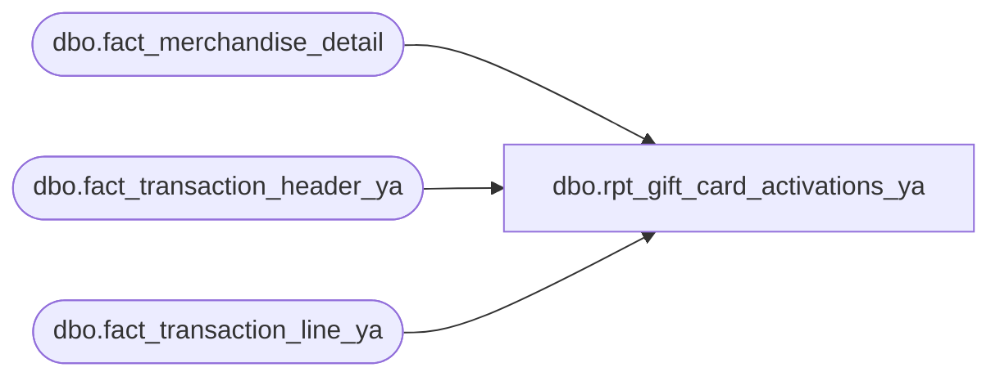

# dbo.rpt_gift_card_activations_ya

**Database:** LH_Source  
**Server:** 4db76rlxaxcuvmuh5kw37wbnqq-ovsykae43znuhlmnflcdwm4ohu.datawarehouse.fabric.microsoft.com  

## Architecture Diagram



## Table Dependencies

| Referenced Table |
|---|
| dbo.fact_merchandise_detail |
| dbo.fact_transaction_header_ya |
| dbo.fact_transaction_line_ya |

## View Code

```sql
CREATE   VIEW dbo.rpt_gift_card_activations_ya AS WITH gc_activation_lines AS (     SELECT         a.store_no,         a.register_no,         a.transaction_date,         a.transaction_no,         a.cashier_no,         b.reference_no,         CONVERT(char(8), a.entry_date_time, 108) AS entry_time_str,         SUM(b.gross_line_amount * b.db_cr_none * b.voiding_reversal_flag)                                AS [Activation Amount (Native Currency)],         SUM((ISNULL(b.gross_line_amount, 0) - ISNULL(b.pos_discount_amount, 0)) * b.db_cr_none * b.voiding_reversal_flag)      AS [Net Activation Amount (Native Currency)],         b.line_object     FROM dbo.fact_transaction_header_ya a     JOIN dbo.fact_transaction_line_ya   b       ON a.transaction_id = b.transaction_id     WHERE b.line_void_flag = 0       AND a.transaction_void_flag = 0       AND ( b.line_object IN (294, 404) OR b.line_object = 403 )     GROUP BY         a.store_no,         a.register_no,         a.transaction_date,         a.transaction_no,         a.cashier_no,         b.reference_no,         CONVERT(char(8), a.entry_date_time, 108),         b.line_object ), gc_activation_units AS (     SELECT         a.store_no,         a.register_no,         a.transaction_date,         a.transaction_no,         a.cashier_no,         b.reference_no,         CONVERT(char(8), a.entry_date_time, 108) AS entry_time_str,         SUM(c.units * c.db_cr_none * -1 * c.voiding_reversal_flag) AS [Quantity],         b.line_object     FROM dbo.fact_transaction_header_ya  a     JOIN dbo.fact_transaction_line_ya    b       ON a.transaction_id = b.transaction_id     JOIN dbo.fact_merchandise_detail     c       ON b.transaction_id = c.transaction_id      AND b.line_id        = c.line_id     WHERE b.line_void_flag = 0       AND a.transaction_void_flag = 0       AND ( b.line_object IN (294, 404) OR b.line_object = 403 )     GROUP BY         a.store_no,         a.register_no,         a.transaction_date,         a.transaction_no,         a.cashier_no,         b.reference_no,         CONVERT(char(8), a.entry_date_time, 108),         b.line_object ) SELECT DISTINCT     l.store_no                AS [Store Number],     l.register_no             AS [Register Number],     l.transaction_date        AS [Transaction Date],     l.transaction_no          AS [Transaction Number],     l.cashier_no              AS [Cashier Number],     l.reference_no            AS [Reference Number],     l.entry_time_str          AS [Entry Time],     ISNULL(u.[Quantity], 0)                       AS [Quantity],     l.[Activation Amount (Native Currency)]       AS [Activation Amount (Native Currency)],     0                         AS [Reserved],     l.[Net Activation Amount (Native Currency)]   AS [Net Activation Amount (Native Currency)],     0                         AS [Reserved 2],     0                         AS [Reserved 3],     l.line_object             AS [Line Object Code] FROM gc_activation_lines l LEFT JOIN gc_activation_units u        ON l.store_no         = u.store_no       AND l.register_no      = u.register_no       AND l.transaction_date = u.transaction_date       AND l.transaction_no   = u.transaction_no       AND l.cashier_no       = u.cashier_no       AND l.reference_no     = u.reference_no       AND l.entry_time_str   = u.entry_time_str       AND l.line_object      = u.line_object;
```

