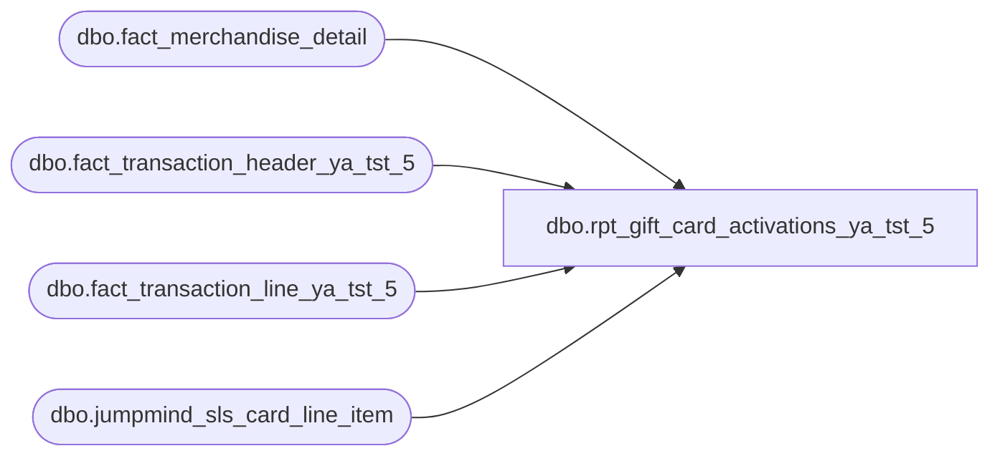

# dbo.rpt_gift_card_activations_ya_tst_5

**Database:** LH_Source  
**Server:** 4db76rlxaxcuvmuh5kw37wbnqq-ovsykae43znuhlmnflcdwm4ohu.datawarehouse.fabric.microsoft.com  

## Architecture Diagram



## Table Dependencies

| Referenced Table |
|---|
| dbo.fact_merchandise_detail |
| dbo.fact_transaction_header_ya_tst_5 |
| dbo.fact_transaction_line_ya_tst_5 |
| dbo.jumpmind_sls_card_line_item |

## View Code

```sql
CREATE   VIEW dbo.rpt_gift_card_activations_ya_tst_5 AS WITH gc_activation_lines AS (     SELECT         CASE WHEN h.store_no < 1000 THEN h.store_no + 1000 ELSE h.store_no END AS store_no,         /* R3: party-register normalisation (102..107 → 2..7).            TRY_CAST also drops non-numeric paired-display registers like            '103-customerdisplay'. */         CAST(           CASE WHEN TRY_CAST(h.register_no AS int) >= 100                THEN TRY_CAST(h.register_no AS int) - 100                ELSE TRY_CAST(h.register_no AS int)           END AS varchar(10))                                              AS register_no,         h.transaction_date,         h.transaction_no,         h.cashier_no,         /* Per-card barcode from JumpMind (16-digit). COALESCE keeps            current behaviour for the ~0.2% of activation rows that lack            a card_line_item row (e.g. e-commerce arm). See header            COLUMN-DERIVATION NOTES. */         COALESCE(cli.card_number, b.reference_no)                           AS reference_no,         CONVERT(char(8), h.entry_date_time, 108)                            AS entry_time_str,         SUM(b.gross_line_amount * b.db_cr_none * b.voiding_reversal_flag)                                                AS [Activation Amount (Native Currency)],         /* COALESCE(pos_discount_amount, 0): physical-card activation lines            (line_object 404) carry pos_discount_amount = NULL when no            promotional discount applied (verified on BBW prod 2026-05-17;            ~599K of ~5.8M GC-activation lines are NULL). Without the            COALESCE, `gross - NULL = NULL` collapses the whole group's SUM            to NULL/0 and Net Activation drops to $0 for ~8,650 keys            (~$408K under-stated). */         SUM((b.gross_line_amount - COALESCE(b.pos_discount_amount, 0)) * b.db_cr_none * b.voiding_reversal_flag)          AS [Net Activation Amount (Native Currency)],         b.line_object     FROM dbo.fact_transaction_header_ya_tst_5 h     JOIN dbo.fact_transaction_line_ya_tst_5   b       ON h.transaction_id = b.transaction_id     /* JumpMind bridge: per-card barcode lookup. The Fabric ETL loads        fact_transaction_line.reference_no with the SKU '083500' for        every physical GC activation line (line_object = 404). The actual        16-digit GC barcode lives on jumpmind_sls_card_line_item.card_number        where ref_line_sequence_number points back to the retail line.        device_id format is {store_no}-{register_no:zero-padded-3}; biz date        is the JumpMind YYYYMMDD string. Cardinality verified on BBW prod        2026-05-18: 467,022/467,819 activation rows (99.83%) match exactly        one CLI row in Q1 2026; 0 rows produce fan-out. */     LEFT JOIN dbo.jumpmind_sls_card_line_item cli       ON  cli.device_id             = CONCAT(CAST(h.store_no AS varchar(10)),                                              '-',                                              RIGHT('000' + h.register_no, 3))      AND cli.business_date           = CONVERT(varchar(8), h.transaction_date, 112)      AND CAST(cli.sequence_number AS varchar(20)) = CAST(h.transaction_no AS varchar(20))      AND cli.ref_line_sequence_number = b.line_id     WHERE b.line_void_flag = 0       AND h.transaction_void_flag = 0       AND ( b.line_object IN (294, 404) OR b.line_object = 403 )       AND TRY_CAST(h.register_no AS int) IS NOT NULL     GROUP BY         CASE WHEN h.store_no < 1000 THEN h.store_no + 1000 ELSE h.store_no END,         CAST(           CASE WHEN TRY_CAST(h.register_no AS int) >= 100                THEN TRY_CAST(h.register_no AS int) - 100                ELSE TRY_CAST(h.register_no AS int)           END AS varchar(10)),         h.transaction_date,         h.transaction_no,         h.cashier_no,         COALESCE(cli.card_number, b.reference_no),         CONVERT(char(8), h.entry_date_time, 108),         b.line_object ), gc_activation_units AS (     SELECT         CASE WHEN h.store_no < 1000 THEN h.store_no + 1000 ELSE h.store_no END AS store_no,         CAST(           CASE WHEN TRY_CAST(h.register_no AS int) >= 100                THEN TRY_CAST(h.register_no AS int) - 100                ELSE TRY_CAST(h.register_no AS int)           END AS varchar(10))                                              AS register_no,         h.transaction_date,         h.transaction_no,         h.cashier_no,         COALESCE(cli.card_number, b.reference_no)                           AS reference_no,         CONVERT(char(8), h.entry_date_time, 108)                            AS entry_time_str,         SUM(c.units * c.db_cr_none * -1 * c.voiding_reversal_flag) AS [Quantity],         b.line_object     FROM dbo.fact_transaction_header_ya_tst_5     h     JOIN dbo.fact_transaction_line_ya_tst_5       b       ON h.transaction_id = b.transaction_id     JOIN dbo.fact_merchandise_detail     c       ON b.transaction_id = c.transaction_id      AND b.line_id        = c.line_id     LEFT JOIN dbo.jumpmind_sls_card_line_item cli       ON  cli.device_id             = CONCAT(CAST(h.store_no AS varchar(10)),                                              '-',                                              RIGHT('000' + h.register_no, 3))      AND cli.business_date           = CONVERT(varchar(8), h.transaction_date, 112)      AND CAST(cli.sequence_number AS varchar(20)) = CAST(h.transaction_no AS varchar(20))      AND cli.ref_line_sequence_number = b.line_id     WHERE b.line_void_flag = 0       AND h.transaction_void_flag = 0       AND ( b.line_object IN (294, 404) OR b.line_object = 403 )       AND TRY_CAST(h.register_no AS int) IS NOT NULL     GROUP BY         CASE WHEN h.store_no < 1000 THEN h.store_no + 1000 ELSE h.store_no END,         CAST(           CASE WHEN TRY_CAST(h.register_no AS int) >= 100                THEN TRY_CAST(h.register_no AS int) - 100                ELSE TRY_CAST(h.register_no AS int)           END AS varchar(10)),         h.transaction_date,         h.transaction_no,         h.cashier_no,         COALESCE(cli.card_number, b.reference_no),         CONVERT(char(8), h.entry_date_time, 108),         b.line_object ) SELECT DISTINCT     l.store_no                AS [Store Number],     l.register_no             AS [Register Number],     l.transaction_date        AS [Transaction Date],     l.transaction_no          AS [Transaction Number],     l.cashier_no              AS [Cashier Number],     l.reference_no            AS [Reference Number],     l.entry_time_str          AS [Entry Time],     u.[Quantity]                                  AS [Quantity],     l.[Activation Amount (Native Currency)]       AS [Activation Amount (Native Currency)],     0                         AS [Reserved],     l.[Net Activation Amount (Native Currency)]   AS [Net Activation Amount (Native Currency)],     0                         AS [Reserved 2],     0                         AS [Reserved 3],     l.line_object             AS [Line Object Code] FROM gc_activation_lines l LEFT JOIN gc_activation_units u        ON l.store_no         = u.store_no       AND l.register_no      = u.register_no       AND l.transaction_date = u.transaction_date       AND l.transaction_no   = u.transaction_no       AND l.cashier_no       = u.cashier_no       AND l.reference_no     = u.reference_no       AND l.entry_time_str   = u.entry_time_str       AND l.line_object      = u.line_object;
```

