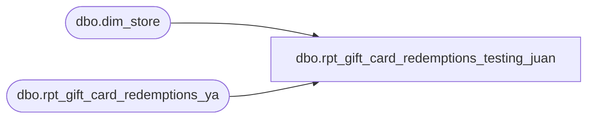

# dbo.rpt_gift_card_redemptions_testing_juan

**Database:** LH_Source  
**Server:** 4db76rlxaxcuvmuh5kw37wbnqq-ovsykae43znuhlmnflcdwm4ohu.datawarehouse.fabric.microsoft.com  

## Architecture Diagram



## Table Dependencies

| Referenced Table |
|---|
| dbo.dim_store |
| dbo.rpt_gift_card_redemptions_ya |

## View Code

```sql
CREATE VIEW dbo.rpt_gift_card_redemptions_testing_juan AS /*  =============================================================================     rpt_gift_card_redemptions_testing_juan     =============================================================================     Source:   dbo.rpt_gift_card_redemptions_ya  (rpt_ view — full card numbers,               AW-mapped store_no, register_no, amounts via JumpMind tender lines)     Dim:      dbo.dim_store  (store_name, legal_entity, currency)      store_aw derivation already done inside rpt_gift_card_redemptions_ya:       raw business_unit_id '1NNN' → strip leading '1' → NNN (US)       raw business_unit_id '2NNN' → keep as-is (UK/intl)     dim_store join reverses that: store_aw < 2000 → store_id = store_aw + 1000                                   store_aw ≥ 2000 → store_id = store_aw     ============================================================================= */ SELECT     r.store_no                                          AS store_aw,     s.store_name,     s.legal_entity_company,     s.currency_code,     r.transaction_date,     CAST(r.register_no   AS VARCHAR(10))                AS register_no,     CAST(r.transaction_no AS VARCHAR(50))               AS transaction_no,     r.cashier_no,     r.reference_no,     r.entry_time,     r.units,     r.gross_bear_bucks                                  AS gross_bear_bucks_sales,     r.net_bear_bucks                                    AS net_bear_bucks_sales,     r.gross_gift_card,     r.line_object FROM dbo.rpt_gift_card_redemptions_ya AS r LEFT JOIN dbo.dim_store AS s     ON TRY_CONVERT(INT, s.store_id) = CASE            WHEN r.store_no < 2000 THEN r.store_no + 1000            ELSE r.store_no        END;
```

