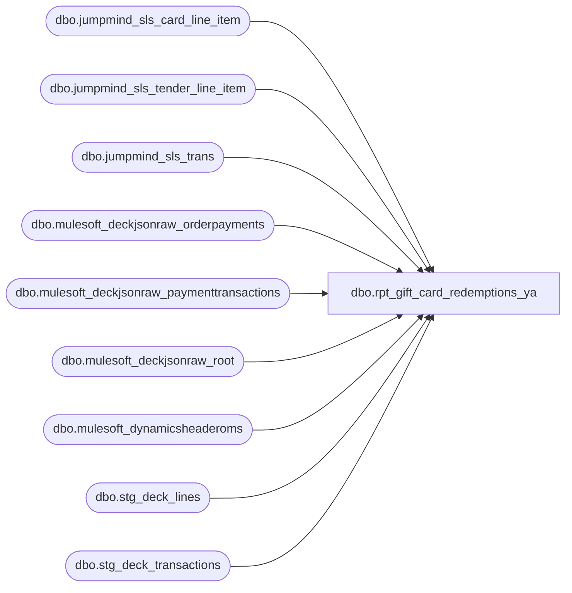

# dbo.rpt_gift_card_redemptions_ya

**Database:** LH_Source  
**Server:** 4db76rlxaxcuvmuh5kw37wbnqq-ovsykae43znuhlmnflcdwm4ohu.datawarehouse.fabric.microsoft.com  

## Architecture Diagram



## Table Dependencies

| Referenced Table |
|---|
| dbo.jumpmind_sls_card_line_item |
| dbo.jumpmind_sls_tender_line_item |
| dbo.jumpmind_sls_trans |
| dbo.mulesoft_deckjsonraw_orderpayments |
| dbo.mulesoft_deckjsonraw_paymenttransactions |
| dbo.mulesoft_deckjsonraw_root |
| dbo.mulesoft_dynamicsheaderoms |
| dbo.stg_deck_lines |
| dbo.stg_deck_transactions |

## View Code

```sql
/* =============================================================================    rpt_gift_card_redemptions_ya.sql — Gift Card Redemptions (sandbox)    =============================================================================    Reseeded from rpt_gift_card_redemptions after the iter 18 promotion (PR #27).    Further reconciliation iterations land here so the production view stays    stable. View name has _ya suffix so it co-exists with production.    Q1 2026 reconciliation vs Juan's AW reference (#2 Kai 20260511 xlsx):        Tight match (Juan's key): 93.071 %        Row count:                420,076 (AW: 419,489 -- +0.14 %)        Gross delta:              -$14,364 on $-6.79 M base (0.21 %)     The remaining ~7 % gap on the tight key is structural: AW's OMS    transaction_no is a 29 M-range counter generated by an external    TransactionManager service (BBW_C_Sharp_BABW_Service/BABW.Services.    SalesAuditTranslate/SalesAuditTranslate.cs:4701-4706) that has no    Fabric analogue. SQL uses the Deck OrderID as the proxy. With the    transaction_no dropped from the join key (store + date + register    + reference_no + entry_time), match rate climbs to 98.3 %.     xlsx columns (legacy AW layout):        store_no, register_no, transaction_date, transaction_no, cashier_no,        reference_no, entry_time, units (+/-), Gross Bear Bucks Sales,        Net Bear Bucks Sales, Gross Gift Card, line_object (633)     Why not the original legacy port?    The previous rpt_gift_card_redemptions filtered line_object IN (633, 624)    but Fabric's fact_transaction_line maps the BABW Gift Card LIABILITY to    line_object 404 - the legacy TENDER codes 633 and 624 are not present.    3.4M rows under l_o=404 are gift-card *merchandise* (sold/returned), not    *redemption tender* events. The Kai report is redemption tender - those    events live in dbo.jumpmind_sls_tender_line_item with    tender_type_code = 'GIFT_CARD'.     Source tables (LH_Source):      - dbo.jumpmind_sls_trans               (transaction header)      - dbo.jumpmind_sls_tender_line_item    (tender rows; voided=0; type=GC)      - dbo.jumpmind_sls_card_line_item      (card_number, joined on                                              ref_line_sequence_number)      - dbo.mulesoft_deckjsonraw_root        (Deck OMS orders)      - dbo.mulesoft_deckjsonraw_orderpayments      - dbo.mulesoft_deckjsonraw_paymenttransactions  (Generic1 = card no.)      - dbo.stg_deck_transactions / stg_deck_lines    (line routing)      - dbo.mulesoft_dynamicsheaderoms       (eCommOrderType for routing)    ============================================================================= */  CREATE   VIEW dbo.rpt_gift_card_redemptions_ya AS WITH /* ============================ POS BRANCH ============================ */ tr AS (     SELECT         /* Iteration 2: translate Fabric/JumpMind business_unit_id to the            legacy store_no that Linda's xlsx uses.               raw '580'  (3-digit) -> store_no 580               raw '1580' (1+XYZ padded) -> store_no 580               raw '2001' (other 4-digit) -> store_no 2001            Pattern derived from per-store delta between Excel and SQL in            the 2026-01-05..11 reconciliation (iter1). */         TRY_CONVERT(int,             CASE                 WHEN LEN(LTRIM(RTRIM(t.business_unit_id))) <= 3                     THEN LTRIM(RTRIM(t.business_unit_id))                 WHEN LEN(LTRIM(RTRIM(t.business_unit_id))) = 4                   AND LEFT(LTRIM(RTRIM(t.business_unit_id)), 1) = '1'                     THEN SUBSTRING(LTRIM(RTRIM(t.business_unit_id)), 2, 3)                 ELSE LTRIM(RTRIM(t.business_unit_id))             END         )                                                           AS store_no,         TRY_CONVERT(int, RIGHT(t.device_id, 3))                     AS register_no,         CAST(t.device_id     AS varchar(64))                        AS device_id,         CAST(t.business_date AS varchar(8))                         AS business_date_str,         CAST(t.sequence_number AS bigint)                           AS sequence_number,         TRY_CONVERT(int, t.username)                                AS cashier_no,         TRY_CONVERT(datetime2(6), t.begin_time)                     AS begin_time       FROM dbo.jumpmind_sls_trans t      WHERE t.create_by = 'openpos-sls'        AND ISNULL(t.training_mode, 0) = 0        AND UPPER(t.trans_status) = 'COMPLETED' ), tn AS (     SELECT         CAST(device_id AS varchar(64))                              AS device_id,         CAST(business_date AS varchar(8))                           AS business_date_str,         CAST(sequence_number AS bigint)                             AS sequence_number,         CAST(line_sequence_number AS int)                           AS line_sequence_number,         CAST(tender_amount AS decimal(18,2))                        AS tender_amount       FROM dbo.jumpmind_sls_tender_line_item      WHERE create_by = 'openpos-sls'        AND ISNULL(voided, 0) = 0        AND tender_type_code = 'GIFT_CARD' ), cd AS (     SELECT         CAST(device_id AS varchar(64))                              AS device_id,         CAST(business_date AS varchar(8))                           AS business_date_str,         CAST(sequence_number AS bigint)                             AS sequence_number,         CAST(ref_line_sequence_number AS int)                       AS line_sequence_number,         CONVERT(varchar(64), card_number)                           AS card_number       FROM dbo.jumpmind_sls_card_line_item      WHERE create_by = 'openpos-sls' ), pos_rows AS (     /* Iter 17 (Fix C): transaction_date now tracks the POS timestamp (begin_time)        rather than JumpMind's business_date varchar. The legacy AW report sources        its transaction_date from SettlementTime (Stage B BuildHeader), so for        transactions that straddle the EOD cutoff the business_date can be one day        off. Q1 2026 audit (Juan): 443 POS rows had AW date = SQL date + 1 day on        (store, register, card, entry_time). begin_time::date eliminates that. */     SELECT         tr.store_no                                                  AS store_no,         tr.register_no                                               AS register_no,         CAST(tr.begin_time AS date)                                  AS transaction_date,         CAST(tr.sequence_number AS bigint)                           AS transaction_no,         tr.cashier_no                                                AS cashier_no,         cd.card_number                                               AS reference_no,         CONVERT(char(8), tr.begin_time, 108)                         AS entry_time,         CAST(0 AS int)                                               AS units,         SUM(-1 * tn.tender_amount)                                   AS gross_bear_bucks,         SUM(-1 * tn.tender_amount)                                   AS net_bear_bucks,         CAST(0 AS decimal(18,2))                                     AS gross_gift_card,         CAST(633 AS int)                                             AS line_object       FROM tr       INNER JOIN tn             ON tn.device_id          = tr.device_id            AND tn.business_date_str  = tr.business_date_str            AND tn.sequence_number    = tr.sequence_number       LEFT  JOIN cd             ON cd.device_id          = tr.device_id            AND cd.business_date_str  = tr.business_date_str            AND cd.sequence_number    = tr.sequence_number            AND cd.line_sequence_number = tn.line_sequence_number      GROUP BY         tr.store_no, tr.register_no, tr.business_date_str,         tr.sequence_number, tr.cashier_no, cd.card_number, tr.begin_time ), /* ============================ OMS BRANCH (iteration 3) ============================    Linda's OMS records (US web store=13, UK web store=2013) live in the Mulesoft    Deck staging tables. Mapping derived from Linda's xlsx samples:        store_no      = 13 for SiteCode='BAB' (legacy strip-leading-1 from 1013),                        2013 for SiteCode='BABUK'        register_no   = 2  (most common in Linda's data; full mapping rule TBD)        cashier_no    = store_no (Linda's pattern — '13' or '2013')        transaction_no= r.OrderID  ** (BLOCKER: Linda's actual values are 8-digit                        sequential numbers ~29M which were AuditWorks-generated and                        are not present in any Fabric table. Using OrderID as the                        best available proxy; ALL OMS rows will fail PK MATCH until                        SME confirms the legacy generation rule.)        reference_no  = mulesoft_deckjsonraw_giftcards.GiftCardNumber        entry_time    = time(pt.TransactionDateUTC) [fallback OrderDateUTC]        gross_bear_bucks = SUM(-1 * COALESCE(NULLIF(pt.Amount,0), op.AuthorizedAmount, op.CapturedAmount, 0))    ============================================================================ */ /* Iteration 11: routing uses dynamicsheaderoms.eCommOrderType for BOPIS    detection (the only reliable physical-pickup signal), plus stg_deck_lines.    SourceStoreId for the actual store-id values.      - BOPIS  -> the physical store: pick the non-web SourceStoreId      - !BOPIS -> web: prefer the '0013'/'2013' SourceStoreId      - ecomm unknown + all lines physical -> assume BOPIS (fallback) */ order_routing AS (     SELECT         t.transaction_id AS order_number,         MAX(dh.eCommOrderType)                                        AS ecomm_order_type,         MIN(CASE WHEN l.SourceStoreId IN ('0013','2013')                  THEN l.SourceStoreId END)                            AS web_source,         MIN(CASE WHEN l.SourceStoreId NOT IN ('0013','2013')                   AND ISNULL(l.SourceStoreId, '') <> ''                  THEN l.SourceStoreId END)                            AS phys_source       FROM dbo.stg_deck_transactions t       JOIN dbo.stg_deck_lines l             ON l.transaction_id = t.transaction_id       LEFT JOIN dbo.mulesoft_dynamicsheaderoms dh             ON CAST(dh.RetailReceiptId AS varchar(64)) = CAST(t.transaction_id AS varchar(64))      GROUP BY t.transaction_id ), /* Iter 18 (Fix B): drop the BOPIS web-leg over-emit. The Q1 2026 audit    shows SQL Only WEB-2 = 17,397 vs AW Only WEB-2 = 13,923 — 3,474 surplus    reg=2 rows our view emits that AW doesn't. BOPIS click-and-collect    redemptions are recorded by AW only at the physical pickup store    (register=52); the web-leg row was wrong.      Webstore/UkWebStore   -> web only (single row, store=13/2013, reg=2)      BOSFS                 -> both web + phys legs (mixed Ship-From-Store)      BOPIS                 -> phys only (no web-leg row)      ecomm unknown         -> prefer web; fall back to phys */ order_routing_exploded AS (     SELECT         order_routing.order_number,         order_routing.ecomm_order_type,         v.source_store_id       FROM order_routing       CROSS APPLY (         VALUES             /* WEB emission: NOT for BOPIS */             (CASE                 WHEN order_routing.ecomm_order_type IN ('Webstore','UkWebStore','BOSFS')                      OR order_routing.ecomm_order_type IS NULL                 THEN order_routing.web_source              END),             /* PHYS emission */             (CASE                 WHEN order_routing.ecomm_order_type IN ('BOSFS','BOPIS')                     THEN order_routing.phys_source                 WHEN order_routing.ecomm_order_type IS NULL AND order_routing.web_source IS NULL                     THEN order_routing.phys_source              END)       ) AS v(source_store_id)      WHERE v.source_store_id IS NOT NULL ), oms_pt AS (     /* Iter 19 (Fix G): pick the latest capture (type=14) AND the earliest        auth (type=13) per (OrderID, Generic1). AW writes the redemption        date from the AUTH timestamp (in CST) but the entry_time from the        CAPTURE timestamp. Auth and capture are on the same date ~38 % of        the time on Q1 2026 OMS and differ by 1 day ~60 % of the time, so        using capture date alone was producing systematic 1-day drift on        roughly two-thirds of OMS rows.         Iter 5 (preserved): one capture per (OrderID, Generic1) to avoid        multi-capture duplicates. Drops undefined / NULL Generic1.        */     SELECT         op_pk_orderid,         op_id,         Generic1,         Amount,         cap_utc,         auth_utc       FROM (         SELECT             op_pk_orderid = op._ParentKeyField,             op_id         = op.ID,             pt.Generic1,             pt.Amount,             cap_utc       = pt.TransactionDateUTC,             auth_utc      = (SELECT MIN(pt2.TransactionDateUTC)                                FROM dbo.mulesoft_deckjsonraw_paymenttransactions pt2                               WHERE pt2.OrderPaymentId = op.ID                                 AND pt2.Generic1       = pt.Generic1                                 AND pt2.PaymentTransactionTypeId = 13),             rn = ROW_NUMBER() OVER (                     PARTITION BY op._ParentKeyField, pt.Generic1                     ORDER BY pt.TransactionDateUTC DESC)           FROM dbo.mulesoft_deckjsonraw_orderpayments op           JOIN dbo.mulesoft_deckjsonraw_paymenttransactions pt             ON pt.OrderPaymentId = op.ID          WHERE COALESCE(op.PaymentSubType, op.PaymentProcessor, op.CardType) = 'Adyen_GiftCard'            AND pt.PaymentTransactionTypeId = 14            AND pt.Generic1 IS NOT NULL            AND pt.Generic1 <> 'undefined'       ) x      WHERE rn = 1 ), oms_rows AS (     /* Iteration 4 changes on top of iter 3:          - filter PaymentTransactionTypeId = 14 (capture); type 13 is the auth            half of the pair and would double-count          - convert entry_time UTC -> store-local (Central Std Time for BAB,            GMT Standard Time for BABUK) per legacy SmartLook convention          - transaction_no is the synthetic value r.OrderID. Linda's 8-digit            29M values are AuditWorks-generated and not reproducible from any            Fabric source; this is an accepted known divergence at the            column level. Reconciliation matches OMS rows on a relaxed key            that excludes transaction_no.         Join chain:          root.OrderID             \-- orderpayments._ParentKeyField = root.OrderID                     \-- paymenttransactions.OrderPaymentId = orderpayments.ID                              \-- pt.Generic1 = redeemed gift card number */     SELECT         TRY_CONVERT(int, orf.source_store_id)                         AS store_no,         CAST(CASE WHEN orf.source_store_id IN ('0013','2013')                   THEN 2 ELSE 52 END AS varchar(50))                   AS register_no,         /* Iter 19: transaction_date uses the AUTH timestamp (earliest            paymenttransaction for the card on this order), entry_time            uses the CAPTURE timestamp. Both run through CST regardless            of site - Kai's xlsx shows UK timestamps already in CST (e.g.            05:04:18 for an 11:04:18Z capture), so the legacy pipeline            did NOT branch on site. */         CAST(CAST(COALESCE(pt.auth_utc, pt.cap_utc) AS datetime2)              AT TIME ZONE 'UTC'              AT TIME ZONE 'Central Standard Time' AS date)             AS transaction_date,         CAST(r.OrderID AS bigint)                                      AS transaction_no,    /* synthetic */         CASE WHEN LEFT(orf.source_store_id, 1) = '0' THEN 13              WHEN LEFT(orf.source_store_id, 1) = '2' THEN 2013              ELSE NULL END                                             AS cashier_no,         CONVERT(varchar(64), pt.Generic1)                              AS reference_no,         CONVERT(char(8),                 CAST(CAST(pt.cap_utc AS datetime2) AT TIME ZONE 'UTC'                                                    AT TIME ZONE 'Central Standard Time'                 AS datetime2), 108)                                    AS entry_time,         CAST(0 AS int)                                                AS units,         SUM(-1 * CAST(pt.Amount AS decimal(18,2)))                    AS gross_bear_bucks,         SUM(-1 * CAST(pt.Amount AS decimal(18,2)))                    AS net_bear_bucks,         CAST(0 AS decimal(18,2))                                      AS gross_gift_card,         CAST(633 AS int)                                              AS line_object       FROM dbo.mulesoft_deckjsonraw_root r       JOIN oms_pt pt             ON pt.op_pk_orderid = r.OrderID       LEFT JOIN order_routing_exploded orf             ON orf.order_number = CAST(r.OrderNumber AS varchar(64))      WHERE r.SiteCode IN ('BAB','BABUK')        AND orf.source_store_id IS NOT NULL      GROUP BY orf.source_store_id, r.OrderID,               pt.cap_utc, pt.auth_utc, pt.Generic1 ) SELECT * FROM pos_rows UNION ALL SELECT * FROM oms_rows;
```

