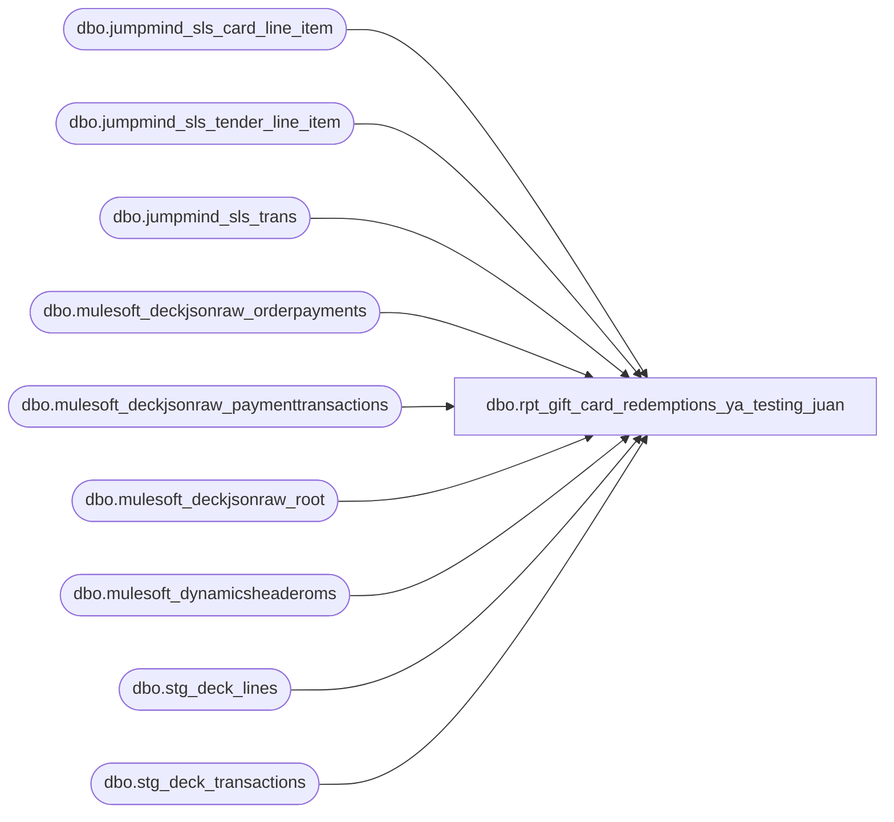

# dbo.rpt_gift_card_redemptions_ya_testing_juan

**Database:** LH_Source  
**Server:** 4db76rlxaxcuvmuh5kw37wbnqq-ovsykae43znuhlmnflcdwm4ohu.datawarehouse.fabric.microsoft.com  

## Architecture Diagram



## Table Dependencies

| Referenced Table |
|---|
| dbo.jumpmind_sls_card_line_item |
| dbo.jumpmind_sls_tender_line_item |
| dbo.jumpmind_sls_trans |
| dbo.mulesoft_deckjsonraw_orderpayments |
| dbo.mulesoft_deckjsonraw_paymenttransactions |
| dbo.mulesoft_deckjsonraw_root |
| dbo.mulesoft_dynamicsheaderoms |
| dbo.stg_deck_lines |
| dbo.stg_deck_transactions |

## View Code

```sql
CREATE   VIEW dbo.rpt_gift_card_redemptions_ya_testing_juan AS WITH tr AS (     SELECT         TRY_CONVERT(int,             CASE                 WHEN LEN(LTRIM(RTRIM(t.business_unit_id))) <= 3                     THEN LTRIM(RTRIM(t.business_unit_id))                 WHEN LEN(LTRIM(RTRIM(t.business_unit_id))) = 4                   AND LEFT(LTRIM(RTRIM(t.business_unit_id)), 1) = '1'                     THEN SUBSTRING(LTRIM(RTRIM(t.business_unit_id)), 2, 3)                 ELSE LTRIM(RTRIM(t.business_unit_id))             END         )                                                           AS store_no,         TRY_CONVERT(int, RIGHT(t.device_id, 3))                     AS register_no,         CAST(t.device_id     AS varchar(64))                        AS device_id,         CAST(t.business_date AS varchar(8))                         AS business_date_str,         CAST(t.sequence_number AS bigint)                           AS sequence_number,         TRY_CONVERT(int, t.username)                                AS cashier_no,         TRY_CONVERT(datetime2(6), t.begin_time)                     AS begin_time       FROM dbo.jumpmind_sls_trans t      WHERE t.create_by = 'openpos-sls'        AND ISNULL(t.training_mode, 0) = 0        AND UPPER(t.trans_status) = 'COMPLETED' ), tn AS (     SELECT         CAST(device_id AS varchar(64))                              AS device_id,         CAST(business_date AS varchar(8))                           AS business_date_str,         CAST(sequence_number AS bigint)                             AS sequence_number,         CAST(line_sequence_number AS int)                           AS line_sequence_number,         CAST(tender_amount AS decimal(18,2))                        AS tender_amount       FROM dbo.jumpmind_sls_tender_line_item      WHERE create_by = 'openpos-sls'        AND ISNULL(voided, 0) = 0        AND tender_type_code = 'GIFT_CARD' ), cd AS (     SELECT         CAST(device_id AS varchar(64))                              AS device_id,         CAST(business_date AS varchar(8))                           AS business_date_str,         CAST(sequence_number AS bigint)                             AS sequence_number,         CAST(ref_line_sequence_number AS int)                       AS line_sequence_number,         CONVERT(varchar(64), card_number)                           AS card_number       FROM dbo.jumpmind_sls_card_line_item      WHERE create_by = 'openpos-sls' ), pos_rows AS (     SELECT         tr.store_no,         tr.register_no,         TRY_CONVERT(date, tr.business_date_str, 112)                AS transaction_date,         CAST(tr.sequence_number AS bigint)                          AS transaction_no,         tr.cashier_no,         cd.card_number                                              AS reference_no,         CONVERT(char(8), tr.begin_time, 108)                        AS entry_time,         CAST(0 AS int)                                              AS units,         SUM(-1 * tn.tender_amount)                                  AS gross_bear_bucks,         SUM(-1 * tn.tender_amount)                                  AS net_bear_bucks,         CAST(0 AS decimal(18,2))                                    AS gross_gift_card,         CAST(633 AS int)                                            AS line_object       FROM tr       INNER JOIN tn ON tn.device_id         = tr.device_id                    AND tn.business_date_str = tr.business_date_str                    AND tn.sequence_number   = tr.sequence_number       LEFT  JOIN cd ON cd.device_id         = tr.device_id                    AND cd.business_date_str = tr.business_date_str                    AND cd.sequence_number   = tr.sequence_number                    AND cd.line_sequence_number = tn.line_sequence_number      GROUP BY tr.store_no, tr.register_no, tr.business_date_str,               tr.sequence_number, tr.cashier_no, cd.card_number, tr.begin_time ), order_routing AS (     SELECT         t.transaction_id AS order_number,         MAX(dh.eCommOrderType)                                      AS ecomm_order_type,         MIN(CASE WHEN l.SourceStoreId IN ('0013','2013') THEN l.SourceStoreId END) AS web_source,         MIN(CASE WHEN l.SourceStoreId NOT IN ('0013','2013')                   AND ISNULL(l.SourceStoreId,'') <> ''                  THEN l.SourceStoreId END)                          AS phys_source       FROM dbo.stg_deck_transactions t       JOIN dbo.stg_deck_lines l ON l.transaction_id = t.transaction_id       LEFT JOIN dbo.mulesoft_dynamicsheaderoms dh             ON CAST(dh.RetailReceiptId AS varchar(64)) = CAST(t.transaction_id AS varchar(64))      GROUP BY t.transaction_id ), order_routing_exploded AS (     SELECT         order_routing.order_number,         order_routing.ecomm_order_type,         v.source_store_id       FROM order_routing       CROSS APPLY (         VALUES             (CASE WHEN order_routing.ecomm_order_type IN ('Webstore','UkWebStore','BOSFS','BOPIS')                        OR order_routing.ecomm_order_type IS NULL                   THEN order_routing.web_source END),             (CASE WHEN order_routing.ecomm_order_type IN ('BOSFS','BOPIS')                   THEN order_routing.phys_source                   WHEN order_routing.ecomm_order_type IS NULL AND order_routing.web_source IS NULL                   THEN order_routing.phys_source END)       ) AS v(source_store_id)      WHERE v.source_store_id IS NOT NULL ), oms_pt AS (     SELECT *       FROM (         SELECT             op_pk_orderid    = op._ParentKeyField,             op_id            = op.ID,             pt.Generic1,             pt.Amount,             pt.TransactionDateUTC,             pt.PaymentTransactionTypeId,             rn = ROW_NUMBER() OVER (                     PARTITION BY op._ParentKeyField, pt.Generic1                     ORDER BY pt.TransactionDateUTC DESC)           FROM dbo.mulesoft_deckjsonraw_orderpayments op           JOIN dbo.mulesoft_deckjsonraw_paymenttransactions pt ON pt.OrderPaymentId = op.ID          WHERE COALESCE(op.PaymentSubType, op.PaymentProcessor, op.CardType) = 'Adyen_GiftCard'            AND pt.PaymentTransactionTypeId = 14            AND pt.Generic1 IS NOT NULL            AND pt.Generic1 <> 'undefined'       ) x      WHERE rn = 1 ), oms_rows AS (     SELECT         TRY_CONVERT(int, orf.source_store_id)                       AS store_no,         CAST(CASE WHEN orf.source_store_id IN ('0013','2013') THEN 2 ELSE 52 END AS varchar(50)) AS register_no,         CAST(CAST(pt.TransactionDateUTC AS datetime2) AT TIME ZONE 'UTC'                                                       AT TIME ZONE 'Central Standard Time' AS date) AS transaction_date,         CAST(r.OrderID AS bigint)                                   AS transaction_no,         CASE WHEN LEFT(orf.source_store_id,1)='0' THEN 13              WHEN LEFT(orf.source_store_id,1)='2' THEN 2013              ELSE NULL END                                          AS cashier_no,         CONVERT(varchar(64), pt.Generic1)                           AS reference_no,         CONVERT(char(8),             CAST(CAST(pt.TransactionDateUTC AS datetime2) AT TIME ZONE 'UTC'                                                           AT TIME ZONE 'Central Standard Time'             AS datetime2), 108)                                     AS entry_time,         CAST(0 AS int)                                              AS units,         SUM(-1 * CAST(pt.Amount AS decimal(18,2)))                  AS gross_bear_bucks,         SUM(-1 * CAST(pt.Amount AS decimal(18,2)))                  AS net_bear_bucks,         CAST(0 AS decimal(18,2))                                    AS gross_gift_card,         CAST(633 AS int)                                            AS line_object       FROM dbo.mulesoft_deckjsonraw_root r       JOIN oms_pt pt ON pt.op_pk_orderid = r.OrderID       LEFT JOIN order_routing_exploded orf ON orf.order_number = CAST(r.OrderNumber AS varchar(64))      WHERE r.SiteCode IN ('BAB','BABUK')        AND orf.source_store_id IS NOT NULL      GROUP BY orf.source_store_id, r.OrderID, pt.TransactionDateUTC, pt.Generic1 ) SELECT * FROM pos_rows UNION ALL SELECT * FROM oms_rows;
```

