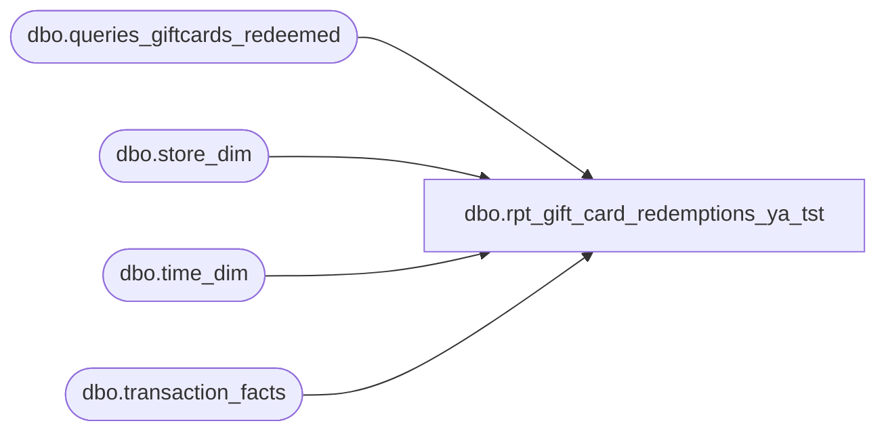

# dbo.rpt_gift_card_redemptions_ya_tst

**Database:** LH_Source  
**Server:** 4db76rlxaxcuvmuh5kw37wbnqq-ovsykae43znuhlmnflcdwm4ohu.datawarehouse.fabric.microsoft.com  

## Architecture Diagram



## Table Dependencies

| Referenced Table |
|---|
| dbo.queries_giftcards_redeemed |
| dbo.store_dim |
| dbo.time_dim |
| dbo.transaction_facts |

## View Code

```sql
CREATE   VIEW dbo.rpt_gift_card_redemptions_ya_tst AS WITH /* R1. Universe — every accounting transaction with non-zero gift-card        tender activity. One row per transaction. */ gc_txn AS (     SELECT         tf.transaction_id,         tf.transaction_no,         tf.register_no,         tf.cashier_key,         tf.date_key,         tf.time_key,         tf.currency_key,         tf.redemption_amount,         CASE WHEN sd.store_id < 1000 THEN sd.store_id + 1000 ELSE sd.store_id END AS store_no       FROM LH_Mart.dbo.transaction_facts tf       JOIN LH_Mart.dbo.store_dim sd ON sd.store_key = tf.store_key      WHERE tf.redemption_amount <> 0 ), /* R2. Per-card breakout — one row per (transaction, redeemed gift card).        Joined LEFT so universe is preserved when this view lags. */ gc_card AS (     SELECT         CAST(transaction_id AS int)             AS transaction_id,         CONVERT(varchar(64), giftcard_no)        AS giftcard_no,         CAST(gross_line_amount AS decimal(18,2)) AS gross_line_amount,         CAST(pos_discount_amount AS decimal(18,2)) AS pos_discount_amount,         DFLT_CRNCY_CODE                          AS currency_code       FROM LH_Mart.dbo.queries_giftcards_redeemed ) SELECT     gc_txn.store_no                                                AS store_no,     CAST(gc_txn.register_no AS varchar(50))                        AS register_no,     CAST(DATEADD(d, gc_txn.date_key, '1997-01-04') AS date)        AS transaction_date,     CAST(gc_txn.transaction_no AS bigint)                          AS transaction_no,     gc_txn.cashier_key                                             AS cashier_no,     gc_card.giftcard_no                                            AS reference_no,     CASE         WHEN td.hour IS NOT NULL             THEN RIGHT('0' + CONVERT(varchar(2), td.hour), 2)   + ':' +                  RIGHT('0' + CONVERT(varchar(2), td.minute), 2) + ':00'         ELSE '00:00:00'     END                                                            AS entry_time,     CAST(0 AS int)                                                 AS units,     /* Bear Bucks / gift-card tender amount. Negative = customer paid with        gift card; positive = customer refunded back to gift card. The        per-card amount is preferred when available; the transaction-level        redemption_amount is the fallback. */     CAST(COALESCE(gc_card.gross_line_amount, gc_txn.redemption_amount)          AS decimal(18,2))                                         AS gross_bear_bucks,     CAST(COALESCE(gc_card.gross_line_amount, gc_txn.redemption_amount)          AS decimal(18,2))                                         AS net_bear_bucks,     CAST(0 AS decimal(18,2))                                       AS gross_gift_card,     CAST(633 AS int)                                               AS line_object   FROM gc_txn   LEFT JOIN gc_card             ON gc_card.transaction_id = gc_txn.transaction_id   LEFT JOIN LH_Mart.dbo.time_dim td ON td.time_key      = gc_txn.time_key;
```

