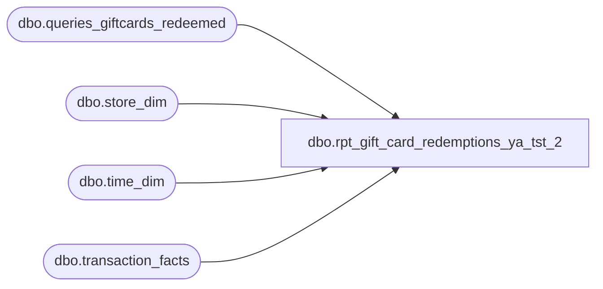

# dbo.rpt_gift_card_redemptions_ya_tst_2

**Database:** LH_Source  
**Server:** 4db76rlxaxcuvmuh5kw37wbnqq-ovsykae43znuhlmnflcdwm4ohu.datawarehouse.fabric.microsoft.com  

## Architecture Diagram



## Table Dependencies

| Referenced Table |
|---|
| dbo.queries_giftcards_redeemed |
| dbo.store_dim |
| dbo.time_dim |
| dbo.transaction_facts |

## View Code

```sql
CREATE   VIEW dbo.rpt_gift_card_redemptions_ya_tst_2 AS WITH /* R1. Universe — every accounting transaction with non-zero gift-card        tender activity. One row per transaction. */ gc_txn AS (     SELECT         tf.transaction_id,         tf.transaction_no,         tf.register_no,         tf.cashier_key,         tf.date_key,         tf.time_key,         tf.currency_key,         tf.redemption_amount,         CASE             WHEN sd.store_id < 1000 THEN sd.store_id + 1000             ELSE sd.store_id         END AS store_no       FROM LH_Mart.dbo.transaction_facts tf       JOIN LH_Mart.dbo.store_dim sd ON sd.store_key = tf.store_key      WHERE tf.redemption_amount <> 0 ), /* R2. Per-card breakout — one row per (transaction, redeemed gift card).        The source view's `gross_line_amount` is unreliable as a tender        figure (~12/229,813 txns have per-card amount disagreeing with        transaction-level redemption_amount; the per-card view sometimes        records the gift card's REMAINING BALANCE rather than the amount        tendered, and is uniformly POSITIVE while redemption_amount is        signed). Authoritative tender amount lives in        transaction_facts.redemption_amount. We preserve per-card grain by        proportionally allocating the signed transaction total across each        card row weighted by |gross_line_amount|; per-key SUM equals        redemption_amount exactly. Single-card txns get the full amount;        multi-card txns split it. */ gc_card AS (     SELECT DISTINCT         CAST(transaction_id AS int)               AS transaction_id,         CONVERT(varchar(64), giftcard_no)         AS giftcard_no,         CAST(gross_line_amount AS decimal(18,2))  AS gross_line_amount,         CAST(pos_discount_amount AS decimal(18,2)) AS pos_discount_amount       FROM LH_Mart.dbo.queries_giftcards_redeemed ), gc_card_weighted AS (     SELECT         transaction_id,         giftcard_no,         gross_line_amount,         pos_discount_amount,         SUM(ABS(gross_line_amount))             OVER (PARTITION BY transaction_id) AS sum_abs_card       FROM gc_card ) SELECT     gc_txn.store_no                                                AS [Store Number],     CAST(gc_txn.register_no AS varchar(50))                        AS [Register Number],     CAST(DATEADD(d, gc_txn.date_key, '1997-01-04') AS date)        AS [Transaction Date],     CAST(gc_txn.transaction_no AS bigint)                          AS [Transaction Number],     gc_txn.cashier_key                                             AS [Cashier Number],     gcw.giftcard_no                                                AS [Reference Number],     CASE         WHEN td.hour IS NOT NULL             THEN RIGHT('0' + CONVERT(varchar(2), td.hour),   2) + ':' +                  RIGHT('0' + CONVERT(varchar(2), td.minute), 2) + ':00'         ELSE '00:00:00'     END                                                            AS [Entry Time],     CAST(0 AS int)                                                 AS [Quantity],     /* Field_i — Redemption Amount (Native Currency).        Negative = customer paid with gift card; positive = customer        refunded back. Allocates transaction-level redemption_amount across        each per-card row by |gross_line_amount| weight; falls back to the        transaction total when no per-card row exists. */     CAST(COALESCE(             CASE WHEN gcw.sum_abs_card IS NULL OR gcw.sum_abs_card = 0                  THEN NULL                  ELSE gc_txn.redemption_amount                       * (ABS(gcw.gross_line_amount) / gcw.sum_abs_card)             END,             gc_txn.redemption_amount)          AS decimal(18,2))                                         AS [Redemption Amount (Native Currency)],     CAST(0 AS decimal(18,2))                                       AS [Reserved],     /* Field_k — Net Redemption Amount (Native Currency).        Same proportional-allocation pattern as Field_i. SmartLook's        original formula (gross - pos_discount) is structurally        inapplicable here because the per-card view's pos_discount_amount        reflects line-level discounts on the redeemed CARD purchase, not        on the redemption itself; both gross and net redemption amounts        collapse to the same redemption_amount in Fabric's accounting        layer. */     CAST(COALESCE(             CASE WHEN gcw.sum_abs_card IS NULL OR gcw.sum_abs_card = 0                  THEN NULL                  ELSE gc_txn.redemption_amount                       * (ABS(gcw.gross_line_amount) / gcw.sum_abs_card)             END,             gc_txn.redemption_amount)          AS decimal(18,2))                                         AS [Net Redemption Amount (Native Currency)],     CAST(0 AS decimal(18,2))                                       AS [Reserved 2],     CAST(0 AS decimal(18,2))                                       AS [Reserved 3],     CAST(633 AS int)                                               AS [Line Object Code]   FROM gc_txn   LEFT JOIN gc_card_weighted gcw  ON gcw.transaction_id = gc_txn.transaction_id   LEFT JOIN LH_Mart.dbo.time_dim td ON td.time_key      = gc_txn.time_key;
```

