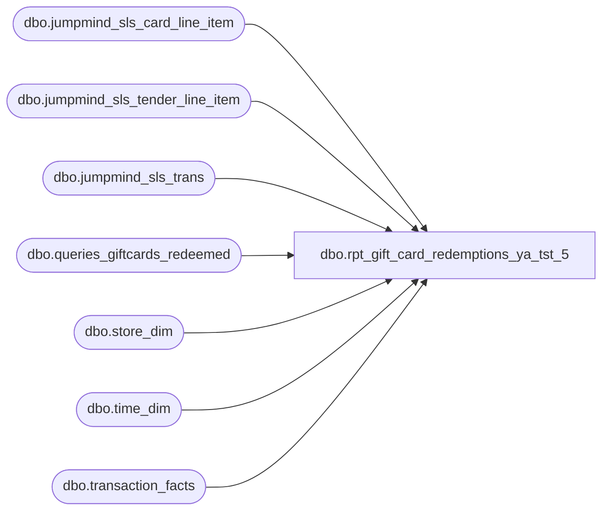

# dbo.rpt_gift_card_redemptions_ya_tst_5

**Database:** LH_Source  
**Server:** 4db76rlxaxcuvmuh5kw37wbnqq-ovsykae43znuhlmnflcdwm4ohu.datawarehouse.fabric.microsoft.com  

## Architecture Diagram



## Table Dependencies

| Referenced Table |
|---|
| dbo.jumpmind_sls_card_line_item |
| dbo.jumpmind_sls_tender_line_item |
| dbo.jumpmind_sls_trans |
| dbo.queries_giftcards_redeemed |
| dbo.store_dim |
| dbo.time_dim |
| dbo.transaction_facts |

## View Code

```sql
CREATE   VIEW dbo.rpt_gift_card_redemptions_ya_tst_5 AS WITH /* R1. Universe — every accounting transaction with non-zero gift-card        tender activity. One row per transaction. */ gc_txn AS (     SELECT         tf.transaction_id,         tf.transaction_no,         tf.register_no,         tf.cashier_key,         tf.date_key,         tf.time_key,         tf.currency_key,         tf.redemption_amount,         CASE             WHEN sd.store_id < 1000 THEN sd.store_id + 1000             ELSE sd.store_id         END AS store_no       FROM LH_Mart.dbo.transaction_facts tf       JOIN LH_Mart.dbo.store_dim sd ON sd.store_key = tf.store_key      WHERE tf.redemption_amount <> 0 ), /* R2. Per-card breakout, one row per (transaction, redeemed gift card).        Two sources are unioned:           (a) LH_Mart.dbo.queries_giftcards_redeemed: the primary source.              Carries one row per (transaction, gift card) for transactions              where the customer PAID with a gift card (negative              redemption_amount). This view is what BBW's analytics layer              persists, and it matches Linda's xlsx per-card grain at very              high fidelity (e.g. a 70-card paydown emits 70 qgcr rows at              -$10 each, matching Linda exactly).           (b) LH_Source.dbo.jumpmind_sls_tender_line_item joined to              jumpmind_sls_card_line_item via ref_line_sequence_number:              the supplementary source. Fills the gap where qgcr is silent,              which empirically is the refund-onto-gift-card direction              (positive redemption_amount). qgcr does not carry rows for              that case, so without (b) those transactions would emit one              row with NULL reference_no and the entire transaction-level              amount on it. The JM tables carry per-tender-line gift-card              references for both directions; -1 * tender_amount aligns the              sign with transaction_facts.redemption_amount.         The NOT EXISTS predicate on (b) ensures we only fall back to JM        when qgcr has nothing for the transaction; otherwise (a) and (b)        would double-count for transactions with coverage in both sources.         Verified empirically on 7 sample transactions:          - 4 paid-with-GC cases (qgcr-covered): qgcr emits the correct            per-card grain matching Linda.          - 3 refunded-to-GC cases (qgcr-silent): JM emits the correct            per-card grain matching Linda. */ gc_card AS (     SELECT         CAST(transaction_id AS int)                AS transaction_id,         CONVERT(varchar(64), giftcard_no)          AS giftcard_no,         CAST(gross_line_amount AS decimal(18,2))   AS gross_line_amount,         CAST(pos_discount_amount AS decimal(18,2)) AS pos_discount_amount       FROM LH_Mart.dbo.queries_giftcards_redeemed     UNION ALL     SELECT         CAST(tf.transaction_id AS int)                AS transaction_id,         CONVERT(varchar(64), tc.card_number)          AS giftcard_no,         CAST(-1 * tl.tender_amount AS decimal(18,2))  AS gross_line_amount,         CAST(0 AS decimal(18,2))                      AS pos_discount_amount       FROM LH_Mart.dbo.transaction_facts tf       JOIN LH_Mart.dbo.store_dim sd         ON sd.store_key = tf.store_key       JOIN LH_Source.dbo.jumpmind_sls_trans jt         ON  TRY_CONVERT(int, jt.business_unit_id) =               CASE WHEN sd.store_id < 1000 THEN sd.store_id + 1000 ELSE sd.store_id END         AND jt.business_date =               CONVERT(varchar(8), DATEADD(d, tf.date_key, '1997-01-04'), 112)         AND TRY_CONVERT(bigint, jt.sequence_number) = CAST(tf.transaction_no AS bigint)         AND TRY_CONVERT(int, SUBSTRING(jt.till_id, CHARINDEX('-', jt.till_id) + 1, 10))             = TRY_CONVERT(int, tf.register_no)       JOIN LH_Source.dbo.jumpmind_sls_tender_line_item tl         ON  tl.device_id       = jt.device_id         AND tl.business_date   = jt.business_date         AND tl.sequence_number = jt.sequence_number       JOIN LH_Source.dbo.jumpmind_sls_card_line_item tc         ON  tc.device_id       = tl.device_id         AND tc.business_date   = tl.business_date         AND tc.sequence_number = tl.sequence_number         AND tc.ref_line_sequence_number = tl.line_sequence_number      WHERE tf.redemption_amount <> 0        AND tl.tender_type_code = 'GIFT_CARD'        AND ISNULL(tl.voided, 0) = 0        AND jt.create_by = 'openpos-sls'        AND tl.create_by = 'openpos-sls'        AND tc.create_by = 'openpos-sls'        AND NOT EXISTS (            SELECT 1              FROM LH_Mart.dbo.queries_giftcards_redeemed q             WHERE q.transaction_id = tf.transaction_id        ) ), /* R2b. Per-card proportional weighting. With the JumpMind-sourced gc_card        CTE above, SUM(gross_line_amount) per transaction already equals        transaction_facts.redemption_amount in the vast majority of cases        (validated empirically on 7 sample transactions across stores 1085,        1016, 1367, including both paid-with-GC and refunded-to-GC        directions). The proportional-allocation step below is retained        as a defensive belt-and-suspenders: should any future ETL drift        cause the per-card sum to disagree with the transaction-level        redemption_amount (rounding, late-arriving rows, etc.), the final        per-card amounts will still sum to redemption_amount exactly. */ gc_card_weighted AS (     SELECT         transaction_id,         giftcard_no,         gross_line_amount,         pos_discount_amount,         SUM(ABS(gross_line_amount))             OVER (PARTITION BY transaction_id) AS sum_abs_card       FROM gc_card ) SELECT     gc_txn.store_no                                                AS [Store Number],     CAST(gc_txn.register_no AS varchar(50))                        AS [Register Number],     CAST(DATEADD(d, gc_txn.date_key, '1997-01-04') AS date)        AS [Transaction Date],     CAST(gc_txn.transaction_no AS bigint)                          AS [Transaction Number],     gc_txn.cashier_key                                             AS [Cashier Number],     gcw.giftcard_no                                                AS [Reference Number],     CASE         WHEN td.hour IS NOT NULL             THEN RIGHT('0' + CONVERT(varchar(2), td.hour),   2) + ':' +                  RIGHT('0' + CONVERT(varchar(2), td.minute), 2) + ':00'         ELSE '00:00:00'     END                                                            AS [Entry Time],     CAST(0 AS int)                                                 AS [Quantity],     /* Field_i — Redemption Amount (Native Currency).        Negative = customer paid with gift card; positive = customer        refunded back. Allocates transaction-level redemption_amount across        each per-card row by |gross_line_amount| weight; falls back to the        transaction total when no per-card row exists. */     CAST(COALESCE(             CASE WHEN gcw.sum_abs_card IS NULL OR gcw.sum_abs_card = 0                  THEN NULL                  ELSE gc_txn.redemption_amount                       * (ABS(gcw.gross_line_amount) / gcw.sum_abs_card)             END,             gc_txn.redemption_amount)          AS decimal(18,2))                                         AS [Redemption Amount (Native Currency)],     CAST(0 AS decimal(18,2))                                       AS [Reserved],     /* Field_k — Net Redemption Amount (Native Currency).        Same proportional-allocation pattern as Field_i. SmartLook's        original formula (gross - pos_discount) is structurally        inapplicable here because the per-card view's pos_discount_amount        reflects line-level discounts on the redeemed CARD purchase, not        on the redemption itself; both gross and net redemption amounts        collapse to the same redemption_amount in Fabric's accounting        layer. */     CAST(COALESCE(             CASE WHEN gcw.sum_abs_card IS NULL OR gcw.sum_abs_card = 0                  THEN NULL                  ELSE gc_txn.redemption_amount                       * (ABS(gcw.gross_line_amount) / gcw.sum_abs_card)             END,             gc_txn.redemption_amount)          AS decimal(18,2))                                         AS [Net Redemption Amount (Native Currency)],     CAST(0 AS decimal(18,2))                                       AS [Reserved 2],     CAST(0 AS decimal(18,2))                                       AS [Reserved 3],     CAST(633 AS int)                                               AS [Line Object Code]   FROM gc_txn   LEFT JOIN gc_card_weighted gcw  ON gcw.transaction_id = gc_txn.transaction_id   LEFT JOIN LH_Mart.dbo.time_dim td ON td.time_key      = gc_txn.time_key;
```

