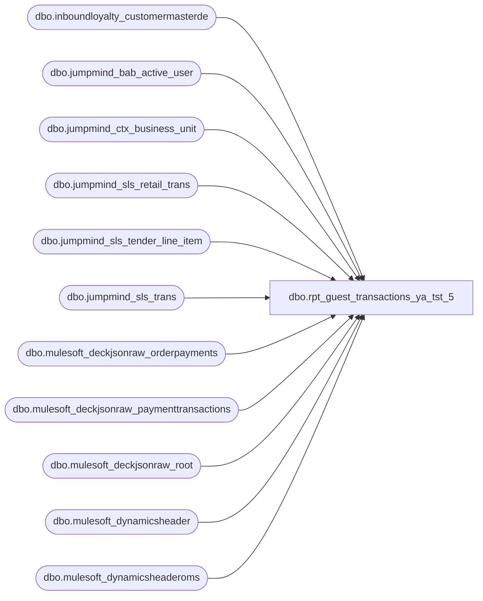

# dbo.rpt_guest_transactions_ya_tst_5

**Database:** LH_Source  
**Server:** 4db76rlxaxcuvmuh5kw37wbnqq-ovsykae43znuhlmnflcdwm4ohu.datawarehouse.fabric.microsoft.com  

## Architecture Diagram



## Table Dependencies

| Referenced Table |
|---|
| dbo.inboundloyalty_customermasterde |
| dbo.jumpmind_bab_active_user |
| dbo.jumpmind_ctx_business_unit |
| dbo.jumpmind_sls_retail_trans |
| dbo.jumpmind_sls_tender_line_item |
| dbo.jumpmind_sls_trans |
| dbo.mulesoft_deckjsonraw_orderpayments |
| dbo.mulesoft_deckjsonraw_paymenttransactions |
| dbo.mulesoft_deckjsonraw_root |
| dbo.mulesoft_dynamicsheader |
| dbo.mulesoft_dynamicsheaderoms |

## View Code

```sql
CREATE   VIEW dbo.rpt_guest_transactions_ya_tst_5 AS WITH /* ── POS path ─────────────────────────────────────────────────────────── */ pos_trans AS (     SELECT         CONCAT(t.device_id, '-', t.business_date, '-', t.sequence_number) AS transaction_key,         TRY_CONVERT(int, t.business_unit_id)                              AS store_no,         t.last_update_time                                                AS transaction_date,         CAST(t.username AS varchar(64))                                   AS cashier_no,         t.device_id, t.business_date, t.sequence_number,         CAST('POS' AS varchar(10))                                        AS source_system       FROM LH_Source.dbo.jumpmind_sls_trans t      WHERE t.trans_status = 'Completed'                                   /* BAB filter */ ), pos_tender AS (     /* tender_amount + currency from POS tender line items */     SELECT         CONCAT(tli.device_id, '-', tli.business_date, '-', tli.sequence_number) AS transaction_key,         CAST(tli.tender_amount AS decimal(18,6))                          AS tender_amount,         CAST(tli.iso_currency_code AS varchar(10))                        AS currency_code,         tli.tender_type_code,         ISNULL(tli.voided, 0)                                             AS voided       FROM LH_Source.dbo.jumpmind_sls_tender_line_item tli      WHERE tli.create_by = 'openpos-sls'        AND ISNULL(tli.voided, 0) = 0 ), pos_associate AS (     /* Associate (cashier) name lookup */     SELECT         u.business_unit_id,         u.username,         u.first_name,         u.last_name       FROM LH_Source.dbo.jumpmind_bab_active_user u ), pos_customer AS (     /* Loyalty / customer info from retail_trans */     SELECT         CONCAT(st.device_id, '-', st.business_date, '-', st.sequence_number) AS transaction_key,         st.loyalty_card_number,         NULLIF(st.customer_name, '')                                      AS guest_name       FROM LH_Source.dbo.jumpmind_sls_retail_trans st ), pos_address AS (     /* Address from loyalty master (table may not exist yet in sample) */     SELECT         c.customerNumber                                                  AS loyalty_card_number,         c.address_1, c.address_2,         c.address_3                                                       AS city,         c.address_4                                                       AS state,         c.post_code                                                       AS postal_code       FROM LH_Source.dbo.inboundloyalty_customermasterde c ), pos_unified AS (     SELECT         pt.transaction_key,         pt.store_no,         pt.transaction_date,         pt.cashier_no,         CONCAT(pa.first_name, ' ', pa.last_name)                          AS associate_name,         /* Transaction ID: prefer mulesoft_dynamicsheader RetailTransactionId            (when available); fall back to composite key. */         COALESCE(             (SELECT CAST(dh.RetailTransactionId AS varchar(64))                FROM LH_Source.dbo.mulesoft_dynamicsheader dh               WHERE dh.TransactionKey = pt.transaction_key),             pt.transaction_key         )                                                                 AS transaction_id,         ptn.tender_amount,         ptn.currency_code,         CASE WHEN ptn.tender_type_code = 'ROUNDING' THEN ptn.tender_amount ELSE 0 END AS currency_rounding_adj,         ptn.tender_amount - CASE WHEN ptn.tender_type_code = 'ROUNDING' THEN ptn.tender_amount ELSE 0 END AS tender_amount_w_rounding,         ptn.tender_amount                                                 AS tender_total_w_rounding,         pc.loyalty_card_number,         pc.guest_name,         pad.address_1, pad.address_2, pad.city, pad.state, pad.postal_code,         pt.source_system       FROM pos_trans pt       LEFT JOIN pos_tender    ptn  ON ptn.transaction_key = pt.transaction_key       LEFT JOIN pos_associate pa   ON pa.business_unit_id = CAST(pt.store_no AS varchar(64))                                    AND pa.username        = pt.cashier_no       LEFT JOIN pos_customer  pc   ON pc.transaction_key  = pt.transaction_key       LEFT JOIN pos_address   pad  ON pad.loyalty_card_number = pc.loyalty_card_number ), /* ── OMS path ─────────────────────────────────────────────────────────── */ oms_trans AS (     SELECT         r.OrderID,         r.OrderNumber,         r.SiteCode,         CASE             WHEN r.SiteCode = 'BAB'   THEN 1013             WHEN r.SiteCode = 'BABUK' THEN 2013             ELSE 9999         END                                                               AS store_no,         CASE             WHEN r.SiteCode = 'BAB'   THEN 'BABW Web Store (1013)'             WHEN r.SiteCode = 'BABUK' THEN 'Web Store (2013)'             ELSE 'Unknown OMS Store'         END                                                               AS business_unit_name,         CASE WHEN r.SiteCode = 'BABUK' THEN 'GBP' ELSE 'USD' END         AS currency_code,         r.Custom3                                                         AS loyalty_card_number,         TRIM(CONCAT(ISNULL(r.FirstName1,''), ' ', ISNULL(r.LastName1,''))) AS guest_name,         r.Address1, r.Address2,         r.City, r.Province, r.PostalCode,         CONCAT(             CASE WHEN r.SiteCode = 'BAB' THEN '1013' WHEN r.SiteCode = 'BABUK' THEN '2013' ELSE '9999' END,             '-052-',             CONVERT(varchar(8), CAST(COALESCE(r.OrderDateUTC, r.DateCreatedUTC) AS date), 112),             '-',             r.OrderID         )                                                                 AS transaction_key,         CAST('OMS' AS varchar(10))                                        AS source_system       FROM LH_Source.dbo.mulesoft_deckjsonraw_root r ), oms_tender AS (     /* Per BAB OMS SQL: aggregate tender from paymenttransactions + orderpayments        filtered by PaymentTransactionTypeId IN (10, 11) */     SELECT         TRY_CONVERT(int, op._ParentKeyField)                              AS ParentOrderID,         SUM(             COALESCE(                 CASE                     WHEN pt.Amount IS NULL OR pt.Amount = 0 THEN NULL                     WHEN pt.PaymentTransactionTypeId IN (3,4,11) THEN -ABS(pt.Amount)                     WHEN pt.PaymentTransactionTypeId IN (1,2,10,14) THEN  ABS(pt.Amount)                     ELSE pt.Amount                 END,                 NULLIF(op.CapturedAmount, 0),                 NULLIF(op.AuthorizedAmount, 0),                 -1 * NULLIF(op.CreditedAmount, 0),                 0             )         )                                                                 AS tender_amount,         SUM(ISNULL(op.EarlyCaptureAmount, 0))                             AS currency_rounding_adj       FROM LH_Source.dbo.mulesoft_deckjsonraw_orderpayments op       LEFT JOIN LH_Source.dbo.mulesoft_deckjsonraw_paymenttransactions pt         ON pt.OrderPaymentId = op.ID      WHERE pt.PaymentTransactionTypeId IN (10, 11)                        /* BAB filter */      GROUP BY TRY_CONVERT(int, op._ParentKeyField) ), oms_unified AS (     SELECT         ot.transaction_key,         ot.store_no,         COALESCE(             (SELECT CAST(dh.RetailTransactionId AS varchar(64))                FROM LH_Source.dbo.mulesoft_dynamicsheaderoms dh               WHERE dh.RetailReceiptId = ot.OrderNumber),             CAST(ot.OrderNumber AS varchar(64))         )                                                                 AS transaction_id,         /* OMS transaction_date with CST conversion per BAB OMS SQL.            Fabric-deploy patch 2026-05-15: original referenced            pt.last_update_time which does not exist on            mulesoft_deckjsonraw_paymenttransactions (verified against            docs/reference-data/LH_Source Table Inventory - Deck.csv lines            552-591). Switched to pt.TransactionDateUTC which is the            semantically correct "when did this payment transaction occur"            timestamp; UpdateDate would also work but TransactionDateUTC            matches the BAB OMS SQL convention used in rpt_credit_card_auth            and rpt_gift_card_redemptions. */         (SELECT CAST(TRY_CONVERT(datetime2(6), MAX(pt.TransactionDateUTC))                      AT TIME ZONE 'UTC' AT TIME ZONE 'Central Standard Time' AS datetime2(6))            FROM LH_Source.dbo.mulesoft_deckjsonraw_paymenttransactions pt           WHERE pt.OrderPaymentId IN (SELECT op.ID FROM LH_Source.dbo.mulesoft_deckjsonraw_orderpayments op                                        WHERE TRY_CONVERT(int, op._ParentKeyField) = ot.OrderID))                                                                           AS transaction_date,         CAST(0 AS varchar(64))                                            AS cashier_no,       /* BAB: hardcoded 0 for OMS */         CAST('0' AS varchar(100))                                         AS associate_name,   /* BAB: hardcoded 0 for OMS */         ot.business_unit_name,         otn.tender_amount,         ot.currency_code,         otn.currency_rounding_adj,         otn.tender_amount - ISNULL(otn.currency_rounding_adj, 0)          AS tender_amount_w_rounding,         otn.tender_amount                                                 AS tender_total_w_rounding,         ot.loyalty_card_number,         ot.guest_name,         ot.Address1                                                       AS address_1,         ot.Address2                                                       AS address_2,         ot.City                                                           AS city,         ot.Province                                                       AS state,         ot.PostalCode                                                     AS postal_code,         ot.source_system       FROM oms_trans  ot       LEFT JOIN oms_tender otn ON otn.ParentOrderID = ot.OrderID ) /* Final SELECT — 18 BAB fields per spec */ SELECT     u.store_no                          AS [Store Number],     bu.business_unit_name               AS [Business Unit Name],     u.transaction_date                  AS [Transaction Date],     u.cashier_no                        AS [Cashier Number],     u.associate_name                    AS [Associate Name],     u.transaction_key                   AS [Transaction Key],     u.transaction_id                    AS [Transaction ID],     u.tender_amount                     AS [Tender Amount (Native currency)],     u.currency_code                     AS [Currency],     u.currency_rounding_adj             AS [Currency Rounding Adjustment],     u.tender_amount_w_rounding          AS [Tender Amount with Currency Rounding],     u.tender_total_w_rounding           AS [Tender Total with Currency Rounding],     u.loyalty_card_number               AS [Loyalty Card number],     u.guest_name                        AS [Guest Name],     u.address_1                         AS [Address1],     u.address_2                         AS [Address2],     CONCAT(u.city, COALESCE(', ' + u.state, '')) AS [City, State],     u.postal_code                       AS [Postal Code]   FROM (         SELECT transaction_key, store_no, transaction_date, cashier_no, associate_name,                transaction_id, tender_amount, currency_code, currency_rounding_adj,                tender_amount_w_rounding, tender_total_w_rounding,                loyalty_card_number, guest_name, address_1, address_2, city, state, postal_code,                source_system           FROM pos_unified         UNION ALL         SELECT transaction_key, store_no, transaction_date, cashier_no, associate_name,                transaction_id, tender_amount, currency_code, currency_rounding_adj,                tender_amount_w_rounding, tender_total_w_rounding,                loyalty_card_number, guest_name, address_1, address_2, city, state, postal_code,                source_system           FROM oms_unified   ) u   LEFT JOIN LH_Source.dbo.jumpmind_ctx_business_unit bu     ON CAST(u.store_no AS varchar(64)) = bu.business_unit_id;
```

