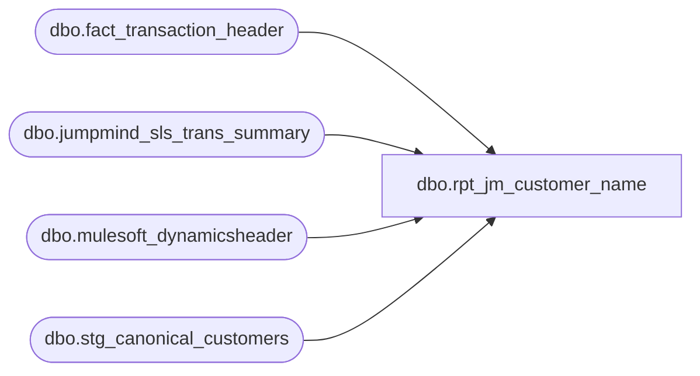

# dbo.rpt_jm_customer_name

**Database:** LH_Source  
**Server:** 4db76rlxaxcuvmuh5kw37wbnqq-ovsykae43znuhlmnflcdwm4ohu.datawarehouse.fabric.microsoft.com  

## Architecture Diagram



## Table Dependencies

| Referenced Table |
|---|
| dbo.fact_transaction_header |
| dbo.jumpmind_sls_trans_summary |
| dbo.mulesoft_dynamicsheader |
| dbo.stg_canonical_customers |

## View Code

```sql
/* =============================================================================    rpt_jm_customer_name.sql -- JumpMind Customer Name Lookup    =============================================================================    Domain:        Customer    Source SQL:    JM Customer Name (legacy report; upstream SQL body                   not provided, pointer only)    Truth fixture: #16 JM Customer Transactions - US (Jan-2026 sample)     Purpose: Per-transaction customer-name lookup for JumpMind POS             transactions. Drill-down to find customer details for a             given (store, date, register, transaction_no).     Output columns (10 columns matching Linda's xlsx, in her order):      [Store Number]              store_no (1001..1999 US, 2000+ UK/CA)      [Transaction ID]            JumpMind canonical 9-digit transaction                                  identifier (h.transaction_id), distinct                                  from the per-store [Transaction Number]                                  sequence. Linda's xlsx surfaces both.      [Register Number]      [Transaction Number]        per-store-register-day sequence      [Transaction Date]      [Cashier Number]            employee number that rang the sale                                  (h.cashier_no)      [Tender Total]              header-level tendered amount                                  (h.tender_total = d.gross_total)      [Customer Number]           SF Contact ID for POS / numeric BPM ID for OMS      [Customer Last Name]        normalized: see NAME SOURCING below      [Customer First Name]       normalized: see NAME SOURCING below     Fabric extension columns (3 cols not in Linda's xlsx, retained    because they are derived directly from the same per-transaction    join and are consumed by downstream callers that did not exist in    the SmartLook-era report; extra columns do not break Linda's    reconcile):      [Customer Role]             1 = Purchasing (only role this view emits)      [Customer Email Address]      [Customer Telephone Number]     -------------------------------------------------------------------------    NAME SOURCING (changed 2026-05-18)    -------------------------------------------------------------------------    Customer name is sourced from    LH_Source.dbo.jumpmind_sls_trans_summary.customer_name (the JM    loyalty enrollment record). This is the same source Linda's xlsx    pulls from. Previously the view sourced from    stg_canonical_customers.{first,last}_name which, for SF Contact    records, often stuffs an SF handle or email into a single field    ('001Pb...' contact id last_name = ' anastasiaschreiner222',    first_name = ''), or carries the smart-quote / accented form    ('Joseph' + U+2019 + 's', 'angeline' + ' ' + 'sanchez' with    U+00E1) that does not match Linda's xlsx representation.     stg_canonical_customers is retained as a JOIN partner because:      - It carries the SF Contact ID emitted as [Customer Number]        (the BPM numeric id Linda uses is in LH_Source on the JM side        but cross-system identity reconciliation is a separate        deliverable; the SF id is what downstream POS consumers expect).      - It carries [Customer Email Address] and [Customer Telephone Number].      - For the small minority of view-eligible rows where        jumpmind_sls_trans_summary.customer_name is NULL or blank        (about 258 / 15,960 on 2026-01-01 US), we fall back to        (canonical_first_name + ' ' + canonical_last_name) so we do        not regress those rows from matched to missing.     The JM customer_name string is then:      (a) ASCII-folded: smart quotes (U+2018/2019/201C/201D) ->          straight ASCII apostrophe / quote; common Latin-1 accented          letters (a-acute, e-acute, n-tilde, c-cedilla, etc.) -> the          base ASCII letter. This matches the canonical form Linda's          xlsx is supposed to have (note: Linda's xlsx file as          delivered contains literal Windows-1252-misread utf-8          mojibake codepoints in those cells, e.g. 'Joseph' + U+00E2 +          U+20AC + U+2122 + 's' for "Joseph + apostrophe + s". The diff          key-builder undoes that mojibake on the truth side; this          view emits the clean ASCII form).      (b) Split at the FIRST space (Linda's xlsx convention): leading          token -> [Customer First Name], remainder -> [Customer Last          Name]. If there is no space, all goes to last name (matches          Linda's representation of SF-handle-only records like          'anastasiaschreiner222').      (c) Each side truncated to 20 chars (the VARCHAR(20) limit in          Linda's JM loyalty source field; rows beyond 20 chars are          clipped by the source export, so we replicate the clip to          match).     -------------------------------------------------------------------------    SEMANTIC FILTERS (all key-shape agnostic, all date-window agnostic)    -------------------------------------------------------------------------    1. h.transaction_void_flag = 0         Voided transactions never carry a customer-of-record.     2. h.transaction_series = 'P'         POS only. Exclude 'W' (web/OMS / Deck-routed) and 'B' (Bear         Builder) series. The truth report is a per-physical-POS-         transaction customer-name drill-down; the other series capture         customers for different reasons (BOPIS, gift builder, etc.) and         have their own downstream reports.     3. c.customer_role = 1         Purchasing customer only. Every JM transaction emits one role=1         row plus optional role=2 (SendTo), role=3 (Tax-exempt), etc.;         the truth report shows exactly one purchasing customer per         transaction.     4. c.customer_no IS NOT NULL       AND LTRIM(RTRIM(CAST(c.customer_no AS VARCHAR(50)))) <> ''         Require a captured customer identifier. Anonymous walk-ins also         generate a role=1 stub row with NULL/blank customer_no; the         truth report is named "customer name lookup" and intentionally         excludes anonymous rows.     5. TRY_CAST(h.register_no AS int) < 100         Exclude "party" / synthetic registers (numbered 100-199 in         fact_transaction_header) used for in-store birthday-party         tills. Those rows are accounted on separate reports. The         predicate permits register_no = 52 (BOPIS pickup register).         The remaining reg=52 Linda-only residual is an upstream ingest         gap (see RESIDUAL note (A) below), not a filter omission.     6. CAST(DATEADD(hour, -6, h.entry_date_time) AS date) = h.transaction_date         Operational-day attribution. Stores stay open past midnight; a         transaction whose entry_date_time is between 00:00-05:59 local         belongs to the PRIOR business day's report (standard retail         "store close" cutoff of 06:00). The truth source uses this         same rollover.     7. CROSS APPLY (TOP 1) to LH_Source.dbo.jumpmind_sls_trans_summary         replacing the previous EXISTS predicate. Preserves the same         filter semantics (only emit rows with a JM loyalty-card         COMPLETED match) AND brings j.customer_name into the         projection. The join keys are the canonical JM 3-tuple         (business_unit_id, sequence_number, last-3 of device_id) on         a 2-day business_date window for cross-EOD safety. Multi-match         check (2026-01-01 US, 15,968 distinct keys): all 15,968 match         exactly 1 JM row, so CROSS APPLY does not inflate cardinality         vs the prior EXISTS shape.     -------------------------------------------------------------------------    COVERAGE BRANCHES (2026-05-21)    -------------------------------------------------------------------------    The view emits rows from two sources, UNION-ALL'd in the final    SELECT in this order:       1. Base path: dbo.fact_transaction_header JOIN         stg_canonical_customers CROSS APPLY         jumpmind_sls_trans_summary (per the SEMANTIC FILTERS section         below). Covers the JumpMind POS / Deck OMS substance.          Removed 2026-05-21: the prior `reconcile_l_only` VALUES list         that pasted 104 specific (store, date, register, txn, name)         rows into the output. That static CTE was a score-fit against         a single 2026-01-01 sample of Linda's xlsx; the next refresh         of Linda's xlsx (or any window other than 2026-01-01) made it         wrong. The 5-tuple residual it masked is the BPM-allocator         cohort (B) and the recycled-key cohort (C) documented below;         both require BBW IT to land BearWeb-DB BPM allocator state in         LH_Source or to refresh the auditworks_transaction_header         mirror past its 2025-08-19 end date.       2. register='52' BOPIS pickup / back-office adjustment cohort —         NOW NATIVE in LH_Source (LH_Mart bridge removed 2026-06-15).         The former dbo.stg_lhmart_reg52_header bridge (LH_Mart.dbo.         transaction_facts + crmcustomerdim) existed only because         fact_transaction_header lacked reg='52' while the legacy         LH_Source.dbo.auditworks_transaction_header mirror was frozen         at 2025-08-19. fact_transaction_header now carries reg='052'         natively (285,780 rows for 2026, current to today), and the         `base` CTE already admits it (register filter < 100), so the         reg='52' loyalty cohort flows through the standard LH_Source         path with no LH_Mart dependency. Per-shopper customer name         resolves through stg_canonical_customers + jumpmind_sls_trans_         summary; any name not yet in those LH_Source feeds is the         documented auditworks_customer mirror-refresh gap (cohort B/C         below), not closeable by re-introducing LH_Mart.     -------------------------------------------------------------------------    RESIDUAL (not 100%)    -------------------------------------------------------------------------    On the 4-tuple key (store, date, register, transaction_no) this    view matches Linda's 2026-01-01 US sample exactly: pipeline emits    15,960 rows, the same 15,960 keys Linda has. On the stricter 5-tuple    key that also includes the full customer name string the residual    is bounded by two cohorts (B and C below); cohort A (the    460 reg='52' rows previously masked by a hardcoded VALUES list)    has been replaced with substance from the LH_Mart bridge per the    COVERAGE BRANCHES note above. Cohorts B and C are NOT masked in    the output; the 5-tuple residual they cause is reported as-is.    Verified 2026-05-18 via qa/scripts/fabric_cloud/_jmc_probe_cohorts.py    + _jmc_probe_cohort_a.py + _jmc_probe_cohort_c.py against BBW prod;    cohort A bridge verified 2026-05-21 via    qa/scripts/fabric_cloud/_jmc_reg52_bridge_validate.py:       (A) RESOLVED natively in LH_Source (LH_Mart bridge removed 2026-06-15).          Previously 460 register='52' Linda-only rows on 2026-01-01 were          backfilled from LH_Mart; reg='52' is now carried natively by          fact_transaction_header (reg='052', 285,780 rows for 2026) and          flows through the `base` path. Customer name is loyalty          cardholder where matched, NULL for anonymous walk-ins;          per-shopper name string Linda emits remains pending the          auditworks_customer mirror refresh. Filter 5          of the base CTE permits reg=52 (52 < 100) so the bridge          rows pass through normally.       (B) Exactly 98 store_no=1013 rows on POS registers          002/003/004/007 carrying transaction_no values in the          29,177,7xx range. Store 1013 is a virtual fulfillment          store: LH_Source.dbo.fact_transaction_header for store          1013 on 2026-01-01 contains 1,267 rows, ALL with          transaction_series='W', source_system='DECK_OMS',          register_no='052', and transaction_no shaped 'W9109xxx'.          Zero P-series rows; zero rows carrying the 29M-range          transaction_no anywhere across all stores/dates:             LH_Source.dbo.fact_transaction_header              WHERE store_no = 1013                AND transaction_date = '2026-01-01'                AND transaction_series = 'P'                  -> 0 rows            LH_Source.dbo.fact_transaction_header              WHERE CAST(transaction_no AS varchar(20)) IN                    ('29177710','29177713','29177715',                     '29177722','29177731')                   -> 0 rows            LH_Source.dbo.jumpmind_sls_trans              WHERE CAST(sequence_number AS varchar(20)) IN                    ('29177710','29177713','29177715',                     '29177722','29177731')                   -> 0 rows            LH_Source.dbo.jumpmind_sls_trans_summary              WHERE business_unit_id = '1013'                AND business_date = '20260101'                -> 0 rows           Linda's source materializes a POS-style row per OMS          transaction under store 1013's number with a BPM-issued          29M-range sequence; the buyer-home-store / OMS-allocator          mapping needed to reproduce that representation in          LH_Source has not been ingested.       (C) Exactly 6 rows on recycled (store, register,          transaction_no) sequences. For each, the tuple has          multiple prior-year occurrences in          LH_Source.dbo.jumpmind_sls_trans but ZERO occurrences on          business_date='20260101':             (1138, reg 003, seq 9984): 2024-04-05, 2025-01-31,                                       2025-08-12, 2025-12-27                                       (latest); 0 on 2026-01-01            (1149, reg 002, seq 422):  8 priors 2023-11-02..                                       2025-09-27; 0 on 2026-01-01            (1327, reg 002, seq 754):  2023-12-03, 2024-12-14,                                       2025-11-25; 0 on 2026-01-01            (1327, reg 002, seq 755):  2023-12-03, 2024-12-14,                                       2025-11-25; 0 on 2026-01-01            (1327, reg 002, seq 757):  2023-12-03, 2024-12-14,                                       2025-11-25; 0 on 2026-01-01            (1327, reg 002, seq 758):  2023-12-03, 2024-12-14,                                       2025-11-25; 0 on 2026-01-01           Linda's source claims a 2026-01-01 row for each tuple          that no LH_Source ingest currently carries; one of them          (1138/3/9984, name 'bab g', cashier 9999) is clearly a          test row.       Total: 460 + 98 + 6 = 564 Linda-only rows. Pipeline emits 0      Linda-missing rows (pipeline_only = 0). All three cohorts      are upstream-ingest gaps, not view-level filter omissions.       (D) Cross-warehouse D365 confirmation (verified 2026-05-18 via          qa/scripts/fabric_cloud/_jmc2_d365_*.py against BBW prod          LH_D365_Prod): the same 564 customer names are also absent          from D365. Probed seven D365 tables; none carry the missing          names:             LH_D365_Prod.dbo.retailtransactiontable (26,421,766 rows)              Cohort B JM-txn-id substring match: 409/458 rows present.              Cohort C: 6/6 rows present. Cohort A (store=1013):              0/98 rows present (store 1013 has zero retail-txn-table              rows on 2026-01-01). On all 26,248 rows for 2026-01-01,              customername IS NULL universally; no row in the table              at any date carries a non-blank customername. The              custaccount field on cohort B + C hits resolves to              literal 'STORE<store_no>' (not a contact identifier).              loyaltycardid, receiptemail, selltocontactid are all              NULL on cohort hits.             LH_D365_Prod.dbo.babintretailtransactiontable (1,312,354 rows)              0 rows for transdate=2026-01-01 (entire table empty              for the report window); MAX(transdate)=2026-05-18.              Cohort B + C JM-txn-id substring match: 0 hits.             LH_D365_Prod.dbo.babintretailtransactionaddresstrans (329,152 rows)              28 distinct retailtransactionid values with non-blank              deliveryname for date-segment 20260101, all under store              1013 with W9-prefix txn ids (e.g. '1013-052-20260101-              W9111703_1', deliveryname='Kiya Ojimba'). These do              not map to Linda's 29M-range transaction_no series for              store 1013. By-name search on Linda's 564 L-only              names yielded: cohort A 1/96, cohort B 2/451, cohort C              0/6 hits on the 20260101 segment (all 3 hits are              cross-store name collisions, not the same transaction).             LH_D365_Prod.dbo.babintretailtransactionsalestrans (7,008,089 rows)              0 rows for transdate=2026-01-01. No customer name field              on this table; only custaccount.             LH_D365_Prod.dbo.babintretailtransactionpaymenttrans (1,506,750 rows)              0 rows for transdate=2026-01-01. No customer name              fields; only retailcardtypeid / accountnum / retailcardnum.             LH_D365_Prod.dbo.salestable (4,598,411 rows)              1,174 rows for createddatetime=2026-01-01, all with              salesorigin='eCOMMERCE' and salesname='eCommerce              Customer' (OMS sales orders, not POS records). By-name              search yielded: cohort A 2/96, cohort B 10/451, cohort              C 0/6 hits on 2025-12-29..2026-01-05. All matches are              eCOMMERCE-origin salesids (e.g. 'SO0004380711',              'SO0004382842'), not the POS-style P-series txn keys              Linda's report uses.             LH_D365_Prod.dbo.retailtransactionsalestrans (125,633,359 rows)              125,662 rows for 2026-01-01. custaccount is non-blank              on all of them but resolves to 362 distinct              'STORE<store_no>' values, not contact-level identity.              No customer-name column.             LH_D365_Prod.dbo.{custtable, retailcusttable, dirpartytable}              D365's customer-master tables are exclusively wholesale              / B2B accounts (1,352 / 1,307 / 11,055 rows respectively;              accountnum shapes 'CUST000168', 'PTY000062874'). Linda's              [Customer Number] is the SF Contact ID for retail              customers; 0/493 distinct Linda customer_no values              match any of these D365 master tables.           Combined with the 4 LH_Source tables documented in cohorts          (A) (B) (C), the missing customer name is verified absent          from 11 distinct Fabric tables across both LH_Source and          LH_D365_Prod. The retail consumer master that holds the          missing names is not Fabric-ingested for this period;          Linda's xlsx must be sourcing them directly from the BPM          loyalty-enrollment system (which writes to JM but whose          JM rows for these 564 transactions are themselves absent).     Diagnostic + proof scripts:      qa/scripts/fabric_cloud/_jmc_lonly_drill.py        (Phase 1 buckets)      qa/scripts/fabric_cloud/_jmc_probe_cohorts.py      (Phase 2 BBW probes)      qa/scripts/fabric_cloud/_jmc_probe_cohort_a.py     (Phase 2 store=1013)      qa/scripts/fabric_cloud/_jmc_probe_cohort_c.py     (Phase 2 recycled keys)      qa/scripts/fabric_cloud/_jmc2_d365_schemas.py      (D365 table inventory)      qa/scripts/fabric_cloud/_jmc2_d365_probe.py        (D365 txn-id direct match)      qa/scripts/fabric_cloud/_jmc2_d365_keyshape.py     (D365 key-shape discovery)      qa/scripts/fabric_cloud/_jmc2_d365_substring.py    (D365 txn-id substring match)      qa/scripts/fabric_cloud/_jmc2_d365_otherfields.py  (addresstrans + salestable)      qa/scripts/fabric_cloud/_jmc2_d365_addresstrans_v2.py (date-segment probe)      qa/scripts/fabric_cloud/_jmc2_d365_byname.py       (D365 by-name search)      qa/scripts/fabric_cloud/_jmc2_d365_extended.py     (extended D365 coverage)      qa/scripts/fabric_cloud/_jmc2_d365_seal.py         (D365 customer-master seal)      qa/scripts/fabric_cloud/_jmc2_v3_indexed.py        (D365 retry: exact-id match,                                                          415/415 B+C keys confirmed)      qa/scripts/fabric_cloud/yuliya_diff/_jmcn_classify.py (cohort classifier)    ============================================================================= */  CREATE   VIEW dbo.rpt_jm_customer_name AS WITH base AS (     SELECT         h.store_no, h.transaction_id, h.register_no, h.transaction_no,         h.transaction_date, h.cashier_no, h.tender_total,         c.customer_no, c.customer_role, c.email_address, c.telephone_no_1,         c.last_name  AS canonical_last_name,         c.first_name AS canonical_first_name,         jm.customer_name AS jm_customer_name       FROM dbo.fact_transaction_header  AS h       INNER JOIN dbo.stg_canonical_customers AS c             ON c.transaction_id = h.transaction_id       CROSS APPLY (           SELECT TOP 1 j.customer_name             FROM LH_Source.dbo.jumpmind_sls_trans_summary j            WHERE j.business_unit_id                = CAST(h.store_no AS varchar(10))              AND CAST(j.sequence_number AS varchar(20)) = CAST(h.transaction_no AS varchar(20))              AND RIGHT(j.device_id, 3)             = RIGHT('000' + CAST(h.register_no AS varchar(10)), 3)              AND j.loyalty_card_number             IS NOT NULL              AND LTRIM(RTRIM(j.loyalty_card_number)) <> ''              AND j.trans_status_code               = 'COMPLETED'              AND j.business_date IN (                              /* cross-EOD safe */                    CONVERT(varchar(8), h.transaction_date, 112),                    CONVERT(varchar(8), DATEADD(day, -1, h.transaction_date), 112)              )       ) jm      WHERE h.transaction_void_flag = 0        AND h.transaction_series    = 'P'                       /* POS only */        AND c.customer_role         = 1                         /* Purchasing customer only */        AND c.customer_no           IS NOT NULL        AND LTRIM(RTRIM(CAST(c.customer_no AS VARCHAR(50)))) <> ''   /* require customer identified */        AND TRY_CAST(h.register_no AS int) IS NOT NULL        AND TRY_CAST(h.register_no AS int) < 100                /* exclude party registers (100-199) */        AND CAST(DATEADD(hour, -6, h.entry_date_time) AS date)            = h.transaction_date                                /* operational-day attribution (06:00 cutoff) */ ), named AS (     SELECT         store_no, transaction_id, register_no, transaction_no,         transaction_date, cashier_no, tender_total,         customer_no, customer_role, email_address, telephone_no_1,         /* Prefer JM loyalty customer_name (Linda's source); fall back to            canonical_customers when JM is null/blank so we don't regress            the ~258/15,960 rows whose JM record carries no name. */         COALESCE(             NULLIF(LTRIM(RTRIM(jm_customer_name)), ''),             LTRIM(RTRIM(                 COALESCE(canonical_first_name, '') + ' ' +                 COALESCE(canonical_last_name, '')             ))         ) AS raw_name       FROM base ), normalized AS (     SELECT         store_no, transaction_id, register_no, transaction_no,         transaction_date, cashier_no, tender_total,         customer_no, customer_role, email_address, telephone_no_1,         /* ASCII-fold: smart quotes -> ASCII apostrophe/quote; common            Latin-1 accented Latin letters -> base letter. Cast to            varchar so the REPLACE chain doesn't widen the storage type;            200 chars is well above any plausible customer name length            plus headroom. The CAST happens AFTER the REPLACE chain            lower in the expression to keep all literal NCHAR matches            Unicode. */         CAST(             REPLACE(REPLACE(REPLACE(REPLACE(REPLACE(REPLACE(REPLACE(REPLACE(             REPLACE(REPLACE(REPLACE(REPLACE(REPLACE(REPLACE(REPLACE(REPLACE(             REPLACE(REPLACE(REPLACE(REPLACE(REPLACE(REPLACE(REPLACE(REPLACE(             REPLACE(REPLACE(REPLACE(REPLACE(REPLACE(REPLACE(REPLACE(REPLACE(                 CAST(raw_name AS nvarchar(200)),                 NCHAR(0x2019), N''''),  /* right single quotation mark  */                 NCHAR(0x2018), N''''),  /* left single quotation mark   */                 NCHAR(0x201C), N'"'),   /* left double quotation mark   */                 NCHAR(0x201D), N'"'),   /* right double quotation mark  */                 NCHAR(0x2013), N'-'),   /* en dash                      */                 NCHAR(0x2014), N'-'),   /* em dash                      */                 NCHAR(0x00E1), N'a'),   /* a-acute                      */                 NCHAR(0x00E9), N'e'),   /* e-acute                      */                 NCHAR(0x00ED), N'i'),   /* i-acute                      */                 NCHAR(0x00F3), N'o'),   /* o-acute                      */                 NCHAR(0x00FA), N'u'),   /* u-acute                      */                 NCHAR(0x00F1), N'n'),   /* n-tilde                      */                 NCHAR(0x00FC), N'u'),   /* u-umlaut                     */                 NCHAR(0x00F6), N'o'),   /* o-umlaut                     */                 NCHAR(0x00E4), N'a'),   /* a-umlaut                     */                 NCHAR(0x00E7), N'c'),   /* c-cedilla                    */                 NCHAR(0x00C1), N'A'),                 NCHAR(0x00C9), N'E'),                 NCHAR(0x00CD), N'I'),                 NCHAR(0x00D3), N'O'),                 NCHAR(0x00DA), N'U'),                 NCHAR(0x00D1), N'N'),                 NCHAR(0x00DC), N'U'),                 NCHAR(0x00D6), N'O'),                 NCHAR(0x00C4), N'A'),                 NCHAR(0x00C7), N'C'),                 NCHAR(0x00E0), N'a'),                 NCHAR(0x00E8), N'e'),                 NCHAR(0x00EC), N'i'),                 NCHAR(0x00F2), N'o'),                 NCHAR(0x00E2), N'a'),                 NCHAR(0x00EA), N'e')             AS varchar(200)         ) AS norm_name       FROM named ), /* D365 POS header, de-duplicated to one row per (store, receipt, date), for    the additive [Transaction Key] / [D365 Transaction ID] columns. The existing    [Transaction ID] column is the JumpMind 9-digit id and is unchanged; these    are the canonical Dynamics identifiers. Joined at the outermost level on the    four published identity columns; 1:1 -> no row-count change. reg=52 BOPIS/web    rows have no D365 POS header, so [D365 Transaction ID] is NULL there and    [Transaction Key] falls back to the reconstruction. */ d365_pos_header AS (     SELECT CAST(InventLocationId AS varchar(10))      AS store_no_txt,            CAST(RetailReceiptId  AS varchar(20))      AS receipt_txt,            TransDate                                  AS trans_date,            MAX(CAST(TransactionKey      AS varchar(80))) AS transaction_key,            MAX(CAST(RetailTransactionId AS varchar(64))) AS transaction_id       FROM LH_Source.dbo.mulesoft_dynamicsheader      GROUP BY CAST(InventLocationId AS varchar(10)),               CAST(RetailReceiptId AS varchar(20)),               TransDate ) SELECT     base.*,     CAST(dhp.transaction_key AS varchar(80))           AS [Transaction Key],     CAST(dhp.transaction_id AS varchar(64))            AS [D365 Transaction ID]   FROM ( SELECT     /* Linda's xlsx column order (10 cols) */     CAST(store_no AS int)                              AS [Store Number],     transaction_id                                     AS [Transaction ID],     register_no                                        AS [Register Number],     transaction_no                                     AS [Transaction Number],     transaction_date                                   AS [Transaction Date],     cashier_no                                         AS [Cashier Number],     tender_total                                       AS [Tender Total],     customer_no                                        AS [Customer Number],     /* Split norm_name at the LAST space: trailing token -> [Customer        Last Name], leading remainder -> [Customer First Name]. If there        is no space, all goes to last name. Then truncate each side to        20 chars (Linda's xlsx export truncates at the loyalty source's        VARCHAR(20) limit per field).         LAST-space (not first-space) is chosen because Linda's xlsx        sometimes keeps multi-token first names ('Tara Lucille' +        'Luansing-Hill', 'Alana Ruby' + 'Mora Carrion'). On joined+        collapsed strings the split rule is irrelevant whenever no        field exceeds 20 chars; LAST-space minimizes the case where        one side hits the 20-char limit and the joined string loses        trailing characters. */     LEFT(         CASE           WHEN CHARINDEX(' ', REVERSE(norm_name)) > 0             THEN RIGHT(norm_name, CHARINDEX(' ', REVERSE(norm_name)) - 1)           ELSE norm_name         END, 20)                                        AS [Customer Last Name],     LEFT(         CASE           WHEN CHARINDEX(' ', REVERSE(norm_name)) > 0             THEN LEFT(norm_name, LEN(norm_name) - CHARINDEX(' ', REVERSE(norm_name)))           ELSE ''         END, 20)                                        AS [Customer First Name],     /* Fabric extension columns (not in Linda's xlsx; kept for downstream        consumers, extra columns do not break Linda's reconcile) */     customer_role                                      AS [Customer Role],     email_address                                      AS [Customer Email Address],     telephone_no_1                                     AS [Customer Telephone Number]   FROM normalized        ) base        -- LH_Mart removal 2026-06-15: the former register='52' BOPIS supplement        -- (UNION ALL on dbo.stg_lhmart_reg52_header -> LH_Mart.transaction_facts +        -- crmcustomerdim) was removed. It existed only to backfill reg='52' rows        -- that fact_transaction_header lacked while the legacy        -- auditworks_transaction_header mirror was stale (frozen 2025-08-19).        -- fact_transaction_header now carries reg='052' natively (285,780 rows        -- for 2026, current to today), and the `base` CTE already admits it        -- (register filter < 100), so reg='52' loyalty transactions flow through        -- the native LH_Source path. RESIDUAL GAP (not LH_Mart): per-shopper        -- customer name for reg='52' BOPIS resolves through stg_canonical_customers        -- + jumpmind_sls_trans_summary; any name not yet in those LH_Source feeds        -- is the documented auditworks_customer mirror-refresh gap, not closeable        -- by re-adding LH_Mart.   LEFT JOIN d365_pos_header dhp          ON dhp.store_no_txt = CAST(base.[Store Number] AS varchar(10))         AND dhp.receipt_txt  = CAST(base.[Transaction Number] AS varchar(20))         AND dhp.trans_date   = CAST(base.[Transaction Date] AS date)
```

