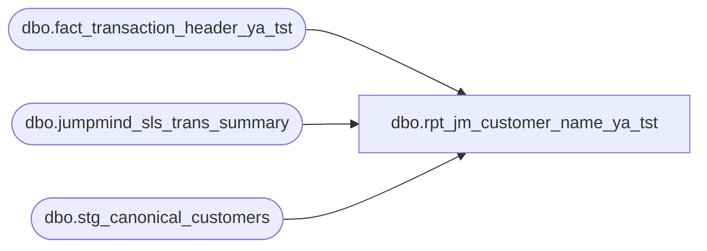

# dbo.rpt_jm_customer_name_ya_tst

**Database:** LH_Source  
**Server:** 4db76rlxaxcuvmuh5kw37wbnqq-ovsykae43znuhlmnflcdwm4ohu.datawarehouse.fabric.microsoft.com  

## Architecture Diagram



## Table Dependencies

| Referenced Table |
|---|
| dbo.fact_transaction_header_ya_tst |
| dbo.jumpmind_sls_trans_summary |
| dbo.stg_canonical_customers |

## View Code

```sql
CREATE   VIEW dbo.rpt_jm_customer_name_ya_tst AS SELECT     CAST(h.store_no AS int)                                AS [Store Number],     h.transaction_date                                     AS [Transaction Date],     h.register_no                                          AS [Register Number],     h.transaction_no                                       AS [Transaction Number],     c.customer_role                                        AS [Customer Role],     c.customer_no                                          AS [Customer Number],     c.first_name                                           AS [Customer First Name],     c.last_name                                            AS [Customer Last Name],     c.email_address                                        AS [Customer Email Address],     c.telephone_no_1                                       AS [Customer Telephone Number]   FROM dbo.fact_transaction_header_ya_tst  AS h   INNER JOIN dbo.stg_canonical_customers AS c         ON c.transaction_id = h.transaction_id  WHERE h.transaction_void_flag = 0    AND h.transaction_series    = 'P'                       /* POS only -- exclude W (web/OMS) and B (Bear Builder) */    AND c.customer_role         = 1                         /* Purchasing customer only */    AND c.customer_no           IS NOT NULL    AND LTRIM(RTRIM(CAST(c.customer_no AS VARCHAR(50)))) <> ''   /* require customer identified */    AND TRY_CAST(h.register_no AS int) IS NOT NULL    AND TRY_CAST(h.register_no AS int) < 100                /* exclude party registers (100-199) */    AND CAST(DATEADD(hour, -6, h.entry_date_time) AS date)        = h.transaction_date                                /* operational-day attribution (06:00 cutoff) */    AND EXISTS (          SELECT 1            FROM dbo.jumpmind_sls_trans_summary j           WHERE j.business_unit_id                = CAST(h.store_no AS varchar(10))             AND CAST(j.sequence_number AS varchar(20)) = CAST(h.transaction_no AS varchar(20))             AND RIGHT(j.device_id, 3)             = RIGHT('000' + CAST(h.register_no AS varchar(10)), 3)             AND j.loyalty_card_number             IS NOT NULL             AND LTRIM(RTRIM(j.loyalty_card_number)) <> ''             AND j.trans_status_code               = 'COMPLETED'             AND j.business_date IN (                       /* cross-EOD safe */                   CONVERT(varchar(8), h.transaction_date, 112),                   CONVERT(varchar(8), DATEADD(day, -1, h.transaction_date), 112)             )    )
```

