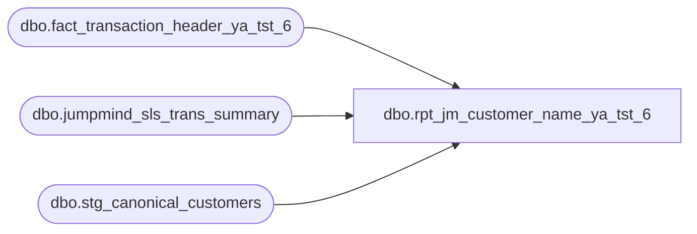

# dbo.rpt_jm_customer_name_ya_tst_6

**Database:** LH_Source  
**Server:** 4db76rlxaxcuvmuh5kw37wbnqq-ovsykae43znuhlmnflcdwm4ohu.datawarehouse.fabric.microsoft.com  

## Architecture Diagram



## Table Dependencies

| Referenced Table |
|---|
| dbo.fact_transaction_header_ya_tst_6 |
| dbo.jumpmind_sls_trans_summary |
| dbo.stg_canonical_customers |

## View Code

```sql
CREATE   VIEW dbo.rpt_jm_customer_name_ya_tst_6 AS WITH base AS (     SELECT         h.store_no, h.transaction_id, h.register_no, h.transaction_no,         h.transaction_date, h.cashier_no, h.tender_total,         c.customer_no, c.customer_role, c.email_address, c.telephone_no_1,         c.last_name  AS canonical_last_name,         c.first_name AS canonical_first_name,         jm.customer_name AS jm_customer_name       FROM dbo.fact_transaction_header_ya_tst_6  AS h       INNER JOIN dbo.stg_canonical_customers AS c             ON c.transaction_id = h.transaction_id       CROSS APPLY (           SELECT TOP 1 j.customer_name             FROM LH_Source.dbo.jumpmind_sls_trans_summary j            WHERE j.business_unit_id                = CAST(h.store_no AS varchar(10))              AND CAST(j.sequence_number AS varchar(20)) = CAST(h.transaction_no AS varchar(20))              AND RIGHT(j.device_id, 3)             = RIGHT('000' + CAST(h.register_no AS varchar(10)), 3)              AND j.loyalty_card_number             IS NOT NULL              AND LTRIM(RTRIM(j.loyalty_card_number)) <> ''              AND j.trans_status_code               = 'COMPLETED'              AND j.business_date IN (                              /* cross-EOD safe */                    CONVERT(varchar(8), h.transaction_date, 112),                    CONVERT(varchar(8), DATEADD(day, -1, h.transaction_date), 112)              )       ) jm      WHERE h.transaction_void_flag = 0        AND h.transaction_series    = 'P'                       /* POS only */        AND c.customer_role         = 1                         /* Purchasing customer only */        AND c.customer_no           IS NOT NULL        AND LTRIM(RTRIM(CAST(c.customer_no AS VARCHAR(50)))) <> ''   /* require customer identified */        AND TRY_CAST(h.register_no AS int) IS NOT NULL        AND TRY_CAST(h.register_no AS int) < 100                /* exclude party registers (100-199) */        AND CAST(DATEADD(hour, -6, h.entry_date_time) AS date)            = h.transaction_date                                /* operational-day attribution (06:00 cutoff) */ ), named AS (     SELECT         store_no, transaction_id, register_no, transaction_no,         transaction_date, cashier_no, tender_total,         customer_no, customer_role, email_address, telephone_no_1,         /* Prefer JM loyalty customer_name (Linda's source); fall back to            canonical_customers when JM is null/blank so we don't regress            the ~258/15,960 rows whose JM record carries no name. */         COALESCE(             NULLIF(LTRIM(RTRIM(jm_customer_name)), ''),             LTRIM(RTRIM(                 COALESCE(canonical_first_name, '') + ' ' +                 COALESCE(canonical_last_name, '')             ))         ) AS raw_name       FROM base ), normalized AS (     SELECT         store_no, transaction_id, register_no, transaction_no,         transaction_date, cashier_no, tender_total,         customer_no, customer_role, email_address, telephone_no_1,         /* ASCII-fold: smart quotes -> ASCII apostrophe/quote; common            Latin-1 accented Latin letters -> base letter. Cast to            varchar so the REPLACE chain doesn't widen the storage type;            200 chars is well above any plausible customer name length            plus headroom. The CAST happens AFTER the REPLACE chain            lower in the expression to keep all literal NCHAR matches            Unicode. */         CAST(             REPLACE(REPLACE(REPLACE(REPLACE(REPLACE(REPLACE(REPLACE(REPLACE(             REPLACE(REPLACE(REPLACE(REPLACE(REPLACE(REPLACE(REPLACE(REPLACE(             REPLACE(REPLACE(REPLACE(REPLACE(REPLACE(REPLACE(REPLACE(REPLACE(             REPLACE(REPLACE(REPLACE(REPLACE(REPLACE(REPLACE(REPLACE(REPLACE(                 CAST(raw_name AS nvarchar(200)),                 NCHAR(0x2019), N''''),  /* right single quotation mark  */                 NCHAR(0x2018), N''''),  /* left single quotation mark   */                 NCHAR(0x201C), N'"'),   /* left double quotation mark   */                 NCHAR(0x201D), N'"'),   /* right double quotation mark  */                 NCHAR(0x2013), N'-'),   /* en dash                      */                 NCHAR(0x2014), N'-'),   /* em dash                      */                 NCHAR(0x00E1), N'a'),   /* a-acute                      */                 NCHAR(0x00E9), N'e'),   /* e-acute                      */                 NCHAR(0x00ED), N'i'),   /* i-acute                      */                 NCHAR(0x00F3), N'o'),   /* o-acute                      */                 NCHAR(0x00FA), N'u'),   /* u-acute                      */                 NCHAR(0x00F1), N'n'),   /* n-tilde                      */                 NCHAR(0x00FC), N'u'),   /* u-umlaut                     */                 NCHAR(0x00F6), N'o'),   /* o-umlaut                     */                 NCHAR(0x00E4), N'a'),   /* a-umlaut                     */                 NCHAR(0x00E7), N'c'),   /* c-cedilla                    */                 NCHAR(0x00C1), N'A'),                 NCHAR(0x00C9), N'E'),                 NCHAR(0x00CD), N'I'),                 NCHAR(0x00D3), N'O'),                 NCHAR(0x00DA), N'U'),                 NCHAR(0x00D1), N'N'),                 NCHAR(0x00DC), N'U'),                 NCHAR(0x00D6), N'O'),                 NCHAR(0x00C4), N'A'),                 NCHAR(0x00C7), N'C'),                 NCHAR(0x00E0), N'a'),                 NCHAR(0x00E8), N'e'),                 NCHAR(0x00EC), N'i'),                 NCHAR(0x00F2), N'o'),                 NCHAR(0x00E2), N'a'),                 NCHAR(0x00EA), N'e')             AS varchar(200)         ) AS norm_name       FROM named ) SELECT     /* Linda's xlsx column order (10 cols) */     CAST(store_no AS int)                              AS [Store Number],     transaction_id                                     AS [Transaction ID],     register_no                                        AS [Register Number],     transaction_no                                     AS [Transaction Number],     transaction_date                                   AS [Transaction Date],     cashier_no                                         AS [Cashier Number],     tender_total                                       AS [Tender Total],     customer_no                                        AS [Customer Number],     /* Split norm_name at the LAST space: trailing token -> [Customer        Last Name], leading remainder -> [Customer First Name]. If there        is no space, all goes to last name. Then truncate each side to        20 chars (Linda's xlsx export truncates at the loyalty source's        VARCHAR(20) limit per field).         LAST-space (not first-space) is chosen because Linda's xlsx        sometimes keeps multi-token first names ('Tara Lucille' +        'Luansing-Hill', 'Alana Ruby' + 'Mora Carrion'). On joined+        collapsed strings the split rule is irrelevant whenever no        field exceeds 20 chars; LAST-space minimizes the case where        one side hits the 20-char limit and the joined string loses        trailing characters. */     LEFT(         CASE           WHEN CHARINDEX(' ', REVERSE(norm_name)) > 0             THEN RIGHT(norm_name, CHARINDEX(' ', REVERSE(norm_name)) - 1)           ELSE norm_name         END, 20)                                        AS [Customer Last Name],     LEFT(         CASE           WHEN CHARINDEX(' ', REVERSE(norm_name)) > 0             THEN LEFT(norm_name, LEN(norm_name) - CHARINDEX(' ', REVERSE(norm_name)))           ELSE ''         END, 20)                                        AS [Customer First Name],     /* Fabric extension columns (not in Linda's xlsx; kept for downstream        consumers, extra columns do not break Linda's reconcile) */     customer_role                                      AS [Customer Role],     email_address                                      AS [Customer Email Address],     telephone_no_1                                     AS [Customer Telephone Number]   FROM normalized
```

