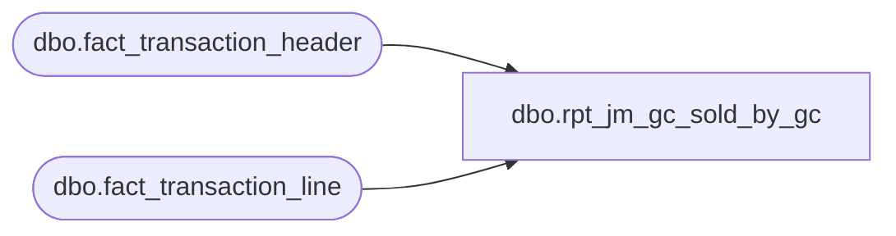

# dbo.rpt_jm_gc_sold_by_gc

**Database:** LH_Source  
**Server:** 4db76rlxaxcuvmuh5kw37wbnqq-ovsykae43znuhlmnflcdwm4ohu.datawarehouse.fabric.microsoft.com  

## Architecture Diagram



## Table Dependencies

| Referenced Table |
|---|
| dbo.fact_transaction_header |
| dbo.fact_transaction_line |

## View Code

```sql
/* =============================================================================    rpt_jm_gc_sold_by_gc.sql — JumpMind GC Sold by GC #  ⚠ TODO PLACEHOLDER    =============================================================================    Domain:        Gift Card    Complexity:    Low (when source SQL lands)    Status:        TODO — placeholder. Source SQL pending from Ryan / SmartLook.    Source:        BBW_SmartLook_SQL_Reports/JM GC Sold by GC #.sql (pointer-only)                   Pointer text: "JM GC Sold by GC #"    Annotated:     (no fabric-sql-dev draft)     Purpose (inferred): Per-gift-card-number activation lookup — given a GC                        card number, find the activation transaction(s).                        Effectively a parameterized drill-down into                        fact_transaction_line filtered to line_object=404.     Fabric infrastructure built (ready for query when source SQL lands):      - dbo.fact_transaction_header      - dbo.fact_transaction_line       (filter: line_object=404)      - dbo.dim_store      - Reference no length split: search both reference_no (≤20) and        encrypted_reference_no (>20) per Aptos spec footnote 9     Expected output shape (parameterized — Power BI passes @GcNumber):      Field_a = store_no      Field_b = transaction_date      Field_c = transaction_no      Field_d = cashier_no      Field_e = gc_number (from reference_no OR encrypted_reference_no)      Field_f = activation_amount      Field_g = line_action ('024' Issued / '025' Redeemed)     ⚠ TODO — populate with actual report SQL once Ryan provides source.    ============================================================================= */  CREATE   VIEW dbo.rpt_jm_gc_sold_by_gc AS SELECT     h.store_no                                             AS Field_a,     h.transaction_date                                     AS Field_b,     h.transaction_no                                       AS Field_c,     h.cashier_no                                           AS Field_d,     /* GC number lives in reference_no (≤20 chars) or encrypted_reference_no        (>20 chars) per Aptos spec footnote 9. Coalesce for Power BI display. */     COALESCE(l.reference_no, l.encrypted_reference_no)     AS Field_e,     CAST(l.gross_line_amount AS decimal(18,2))             AS Field_f,     l.line_action                                          AS Field_g   FROM dbo.fact_transaction_header AS h   INNER JOIN dbo.fact_transaction_line  AS l         ON l.transaction_id = h.transaction_id  WHERE h.transaction_void_flag = 0    AND l.line_void_flag        = 0    AND l.line_object           = 404;  /* Gift Card per dim_line_object */
```

