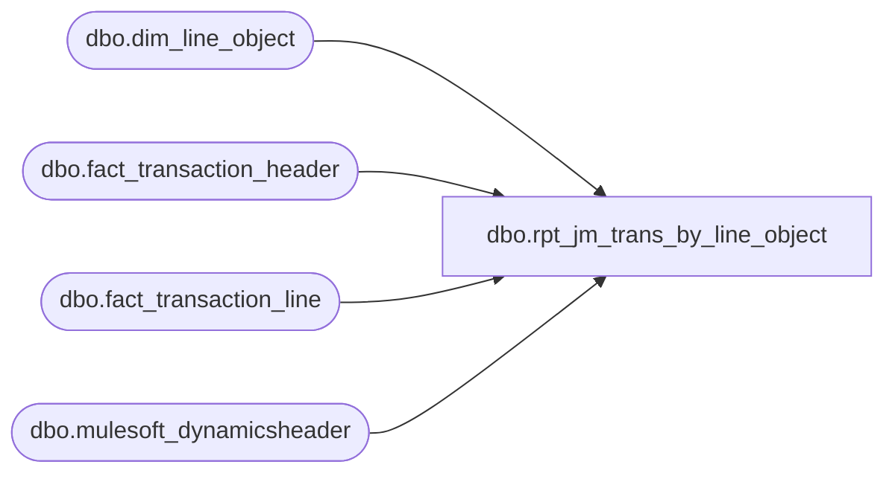

# dbo.rpt_jm_trans_by_line_object

**Database:** LH_Source  
**Server:** 4db76rlxaxcuvmuh5kw37wbnqq-ovsykae43znuhlmnflcdwm4ohu.datawarehouse.fabric.microsoft.com  

## Architecture Diagram



## Table Dependencies

| Referenced Table |
|---|
| dbo.dim_line_object |
| dbo.fact_transaction_header |
| dbo.fact_transaction_line |
| dbo.mulesoft_dynamicsheader |

## View Code

```sql
/* =============================================================================    rpt_jm_trans_by_line_object.sql — Transactions by Line Object    =============================================================================    Domain:    Customer (Sales Audit / Investigation tool)    Audience:  Accounting / Sales Audit team    Consumer:  Power BI page where the analyst picks a line_object code or               line_object_type to investigate.     Status:    Verbatim port of legacy SmartLook source SQL (17-col Field_a..q).    Source:    docs/reference-data/smartlook-source-sql/Corporate Events.sql               (file mislabeled as 'Corporate Events.sql' but the first               comment header inside reads `---JM Trans by Line Object`,               and the actual query body is the JM Trans by Line Object               detail report — confirmed via header comment and the               Step-1 BBW_Gap_and_Risk_Register Cat-2 #2.5 cross-reference)     Legacy SQL (verbatim):      SELECT a.store_no, a.transaction_date, a.register_no, a.transaction_no,             b.transaction_id, a.transaction_series, a.transaction_category,             b.line_object_type, d.object_type_system_descr, b.line_object,             c.line_object_description, a.tender_total,             SUM(b.gross_line_amount),             SUM(b.gross_line_amount * b.db_cr_none * b.voiding_reversal_flag),             SUM(b.gross_line_amount - b.pos_discount_amount),             SUM((b.gross_line_amount - b.pos_discount_amount) *                 b.db_cr_none * b.voiding_reversal_flag),             0        FROM auditworks.dbo.transaction_header a,             auditworks.dbo.transaction_line   b,             auditworks.dbo.line_object        c,             auditworks.dbo.line_object_type   d       WHERE a.transaction_id  = b.transaction_id         AND b.line_object     = c.line_object         AND b.line_object_type = d.line_object_type         AND a.transaction_void_flag = 0         AND b.line_void_flag        = 0         /* Default date window: yesterday-today (consumer overrides) */       GROUP BY a.store_no, a.transaction_date, a.register_no, a.transaction_no,                b.transaction_id, a.transaction_series, a.transaction_category,                b.line_object_type, d.object_type_system_descr, b.line_object,                c.line_object_description, a.tender_total;     Table name swaps (legacy → Fabric):      auditworks.dbo.transaction_header → dbo.fact_transaction_header      auditworks.dbo.transaction_line   → dbo.fact_transaction_line      auditworks.dbo.line_object        → dbo.dim_line_object  (line_object_desc)      auditworks.dbo.line_object_type   → dbo.dim_line_object  (line_object_type_desc)        Note: in Fabric the two legacy AW dims (`line_object` and        `line_object_type`) are colocated in a single `dim_line_object` view        with both `line_object_desc` and `line_object_type_desc` columns. We        join the dim once and project both descriptions.     Date window: legacy SmartLook applied a default 'yesterday → today'    filter inline. In Fabric this view is date-window agnostic; the consumer    (Power BI or harness) applies `transaction_date BETWEEN <from> AND <to>`    after the view, matching the same pattern used by every other rpt_*.     DEVIATION FROM CANONICAL: SmartLook source uses generic Field_a..Field_q    column aliases. This port renames them to BAB-style descriptive brackets    for Power BI consumer experience. Underlying logic, formulas, filters,    joins, and grouping are unchanged. Approved: James Suh, 2026-05-11.     Field outputs (17 cols, matching SmartLook Field_a..Field_q):      Field_a → [Store Number]      Field_b → [Transaction Date]      Field_c → [Register Number]      Field_d → [Transaction Number]      Field_e → [Transaction Id]      Field_f → [Transaction Series]      Field_g → [Transaction Category]      Field_h → [Line Object Type Code]      Field_i → [Line Object Type Description]   (object_type_system_descr)      Field_j → [Line Object Code]      Field_k → [Line Object Description]      Field_l → [Tender Total Amount (Native Currency)]      Field_m → [Gross Line Amount Sum]                    SUM(gross_line_amount)      Field_n → [Net Gross Line Amount (Native Currency)]  SUM(gross * dcn * vrf)      Field_o → [Gross Less Discount Amount]               SUM(gross - pos_disc)      Field_p → [Net Sales Amount (Native Currency)]       SUM((gross - pos_disc) * dcn * vrf)      Field_q → [Reserved]                                 0    ============================================================================= */  CREATE   VIEW dbo.rpt_jm_trans_by_line_object AS /* D365 POS header, de-duplicated to one row per (store, receipt, date), for    the additive [Transaction Key] / [D365 Transaction ID] columns below. The    existing [Transaction Id] column is the legacy AW transaction_id and is    unchanged; these are the canonical Dynamics identifiers. The LEFT JOIN is    1:1 on (store, transaction_no, date) -- a subset of this report's GROUP BY    key -- so it neither fans the pre-aggregation rows nor changes the grouped    row count, and MAX() collapses the single matched header per group. */ WITH d365_pos_header AS (     SELECT CAST(InventLocationId AS varchar(10))      AS store_no_txt,            CAST(RetailReceiptId  AS varchar(20))      AS receipt_txt,            TransDate                                  AS trans_date,            MAX(CAST(TransactionKey      AS varchar(80))) AS transaction_key,            MAX(CAST(RetailTransactionId AS varchar(64))) AS transaction_id       FROM LH_Source.dbo.mulesoft_dynamicsheader      GROUP BY CAST(InventLocationId AS varchar(10)),               CAST(RetailReceiptId AS varchar(20)),               TransDate ) SELECT     a.store_no                                                              AS [Store Number],     a.transaction_date                                                      AS [Transaction Date],     a.register_no                                                           AS [Register Number],     a.transaction_no                                                        AS [Transaction Number],     b.transaction_id                                                        AS [Transaction Id],     a.transaction_series                                                    AS [Transaction Series],     a.transaction_category                                                  AS [Transaction Category],     lo.line_object_type                                                     AS [Line Object Type Code],     lo.line_object_type_desc                                                AS [Line Object Type Description],     b.line_object                                                           AS [Line Object Code],     lo.line_object_desc                                                     AS [Line Object Description],     a.tender_total                                                          AS [Tender Total Amount (Native Currency)],     SUM(b.gross_line_amount)                                                AS [Gross Line Amount Sum],     SUM(b.gross_line_amount * b.db_cr_none * b.voiding_reversal_flag)       AS [Net Gross Line Amount (Native Currency)],     SUM(b.gross_line_amount - b.pos_discount_amount)                        AS [Gross Less Discount Amount],     SUM((b.gross_line_amount - b.pos_discount_amount)         * b.db_cr_none * b.voiding_reversal_flag)                           AS [Net Sales Amount (Native Currency)],     CAST(0 AS decimal(18,2))                                                AS [Reserved],     /* Canonical D365 Transaction Key (the POS header's TransactionKey), MAX()        over the 1:1 header. Left blank (NULL) where no D365 header exists. */     CAST(MAX(dhp.transaction_key) AS varchar(80))                           AS [Transaction Key],     CAST(MAX(dhp.transaction_id) AS varchar(64))                            AS [D365 Transaction ID]   FROM dbo.fact_transaction_header AS a   INNER JOIN dbo.fact_transaction_line AS b         ON b.transaction_id = a.transaction_id   LEFT  JOIN dbo.dim_line_object AS lo         ON lo.line_object_code = b.line_object   /* D365 POS header for Transaction Key/ID; 1:1 on a subset of the GROUP BY      key, so it does not fan the pre-aggregation rows. */   LEFT  JOIN d365_pos_header AS dhp         ON dhp.store_no_txt = CAST(a.store_no AS varchar(10))        AND dhp.receipt_txt  = CAST(a.transaction_no AS varchar(20))        AND dhp.trans_date   = CAST(a.transaction_date AS date)  WHERE a.transaction_void_flag = 0    AND b.line_void_flag        = 0  GROUP BY     a.store_no,     a.transaction_date,     a.register_no,     a.transaction_no,     b.transaction_id,     a.transaction_series,     a.transaction_category,     lo.line_object_type,     lo.line_object_type_desc,     b.line_object,     lo.line_object_desc,     a.tender_total;
```

