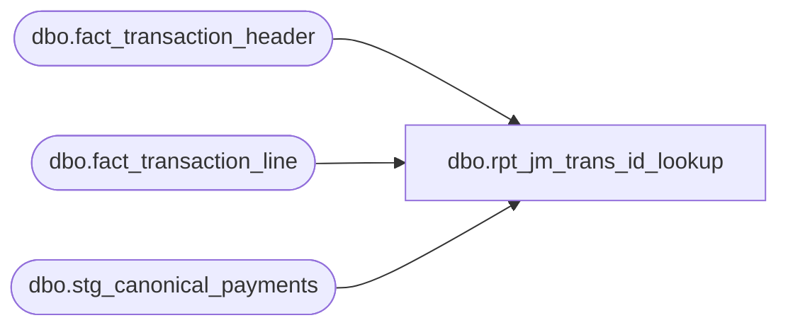

# dbo.rpt_jm_trans_id_lookup

**Database:** LH_Source  
**Server:** 4db76rlxaxcuvmuh5kw37wbnqq-ovsykae43znuhlmnflcdwm4ohu.datawarehouse.fabric.microsoft.com  

## Architecture Diagram



## Table Dependencies

| Referenced Table |
|---|
| dbo.fact_transaction_header |
| dbo.fact_transaction_line |
| dbo.stg_canonical_payments |

## View Code

```sql
/* =============================================================================    rpt_jm_trans_id_lookup.sql — JumpMind Transaction ID Lookup  ⚠ TODO PLACEHOLDER    =============================================================================    Domain:        Customer    Complexity:    Low (when source SQL lands)    Status:        TODO — placeholder. Source SQL pending from Ryan / SmartLook.    Source:        BBW_SmartLook_SQL_Reports/JM Trans ID Lookup.sql (pointer-only)                   Pointer text: "JM Trans ID Lookup"    Annotated:     (no fabric-sql-dev draft)     Purpose (inferred): Parameterized single-transaction drill-down. Useful                        as a Power BI drill-through page from any other                        report that lists transaction_no.     Fabric infrastructure built:      - dbo.fact_transaction_header      - dbo.fact_transaction_line      - dbo.stg_canonical_payments    (tender breakdown)      - dbo.fact_authorization_detail (auth detail)      - dbo.fact_return_detail        (if applicable)      - dbo.stg_canonical_customers   (customer attribution)      - dbo.dim_store     Expected output shape: comprehensive transaction display with header,                           line, tender, auth, customer all in one set of                           columns Field_a..Field_z.     ⚠ TODO — populate with actual report SQL once Ryan provides source.    ============================================================================= */  CREATE   VIEW dbo.rpt_jm_trans_id_lookup AS /* Comprehensive transaction drill-down. One row per transaction-line.    tender_amount LEFT JOIN'd from stg_canonical_payments aggregated to the    transaction so each line carries the same total. */ SELECT     h.store_no                                             AS Field_a,     h.transaction_date                                     AS Field_b,     h.transaction_no                                       AS Field_c,     h.register_no                                          AS Field_d,     h.cashier_no                                           AS Field_e,     l.line_id                                              AS Field_f,     l.line_object                                          AS Field_g,     l.line_action                                          AS Field_h,     COALESCE(l.reference_no, l.encrypted_reference_no)     AS Field_i,     CAST(l.gross_line_amount AS decimal(18,2))             AS Field_j,     CAST(t.tender_total AS decimal(18,2))                  AS Field_k   FROM dbo.fact_transaction_header AS h   INNER JOIN dbo.fact_transaction_line  AS l         ON l.transaction_id = h.transaction_id   LEFT  JOIN (       SELECT p.transaction_id,              SUM(p.tender_amount) AS tender_total         FROM dbo.stg_canonical_payments AS p        GROUP BY p.transaction_id   ) AS t         ON t.transaction_id = h.transaction_id  WHERE h.transaction_void_flag = 0    AND l.line_void_flag        = 0;
```

