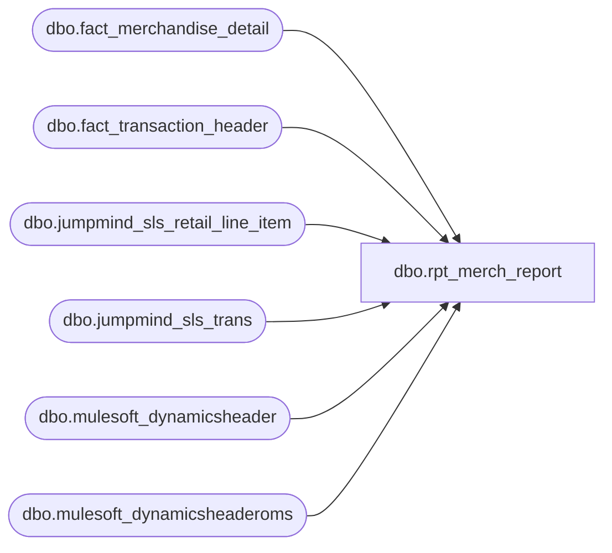

# dbo.rpt_merch_report

**Database:** LH_Source  
**Server:** 4db76rlxaxcuvmuh5kw37wbnqq-ovsykae43znuhlmnflcdwm4ohu.datawarehouse.fabric.microsoft.com  

## Architecture Diagram



## Table Dependencies

| Referenced Table |
|---|
| dbo.fact_merchandise_detail |
| dbo.fact_transaction_header |
| dbo.jumpmind_sls_retail_line_item |
| dbo.jumpmind_sls_trans |
| dbo.mulesoft_dynamicsheader |
| dbo.mulesoft_dynamicsheaderoms |

## View Code

```sql
/* =============================================================================    rpt_merch_report.sql, Merch Detail Report    =============================================================================    Domain:        Sales (merchandise line detail).    Scope:         Per-merchandise-line records for three sources:                      R1.  In-store POS rings (real cashier registers, device IDs                          in the 1 to 30 range) sourced from the JumpMind retail                          transaction stream.                      R2 + R3.  Web / OMS merchandise (BOPIS ship-from-store and                          webstore), re-sourced 2026-06-15 off the pure-LH_Source                          AW-equivalent star (LH_Mart removed):                          LH_Source.dbo.fact_merchandise_detail                          (source_system = 'DECK_OMS', item_type = 'STOCK')                          joined to LH_Source.dbo.fact_transaction_header on the                          canonical string transaction_id. In the AW-conformed                          merchandise detail all web/OMS merch is booked to the                          webstore entity (store_no 1013 US / 2013 UK) under                          register 052 with transaction_no = the web order number                          (W... US / U... UK). This collapses the former separate                          R2 (physical-store reg-52 rebooking) and R3 (webstore                          registers 2/3/4/7/9) attributions into the single                          AW-conformed web attribution. sold_at_price is the                          conformed AW per-unit value (the former Aptos                          ticket-minus-markdown-plus-upsell reconstruction is                          already baked into the fact).                    Direct-ship web orders (DeliveryType=1, no register, the web                   store as the seller) for stores other than 13 / 2013 remain                   OUT OF SCOPE for the merch report and are produced separately                   by a fulfillment-detail view.     Output fields (8):      Store Number, Transaction Date, Transaction Number, Register Number,      UPC, Net Sales Amount (Native Currency),      Sold At Price Amount (Native Currency), Quantity     -----------------------------------------------------------------------------    R1, In-store POS path (jumpmind_sls_trans + jumpmind_sls_retail_line_item)    -----------------------------------------------------------------------------    Column mapping:      [Store Number]       → TRY_CONVERT(int, t.business_unit_id)      [Transaction Date]   → CAST(t.last_update_time AS date)      [Transaction Number] → t.sequence_number      [Register Number]    → register segment of t.device_id (1-30 range)      [UPC]                → j.pos_item_id (scanned barcode)      [Net Sales Amount]   → SUM(signed quantity): +N for sales, −N for returns.                             JumpMind stores quantity positive for sales and                             negative for returns, so CAST(j.quantity) produces                             signed output directly.      [Sold At Price]      → SUM(ABS(actual_unit_price)) per unit, ex-VAT for                             GBP/EUR. Always positive; sold-at-price is the                             catalogue price paid per unit, never negative even                             on return lines.      [Quantity]           → SUM(ABS(quantity)): gross units regardless of                             direction. A group with 2 sales + 2 returns of the                             same UPC shows net_sales=0 / qty=4, not qty=0.     Voided line filter:      - j.voided = 0 excludes voided ghost lines that share the same        (store, date, txn, register, upc) as the real sale. JumpMind retains the        voided line in retail_line_item for audit. Header-level        trans_status = 'COMPLETED' is not sufficient; filter at the line level.     $0 line handling:      - Free-promo SKUs (UPC 89001/89002/89009/89010/83503 etc.) scanned at $0        remain in the output; they are real merchandise that the report counts.      - $0-priced rows whose pos_item_id is a 7-digit numeric in the        2,000,000 to 2,999,999 range are excluded. These are loyalty-card and        coupon-barcode serials that JumpMind keeps on the receipt for audit;        they are not merchandise SKUs (real merch SKUs are 5-6 digit pos_item_ids        or 12-13 digit EANs).     Non-merchandise placeholder SKUs:      - 999999990, 999999995, 899999902, 999999996, 999999997      - Gift-card SKU placeholders: 083500 (USD), 183500 (CAD), 283500 (CAA        reserved), 483500 (GBP/EUR). These are the per-currency variants of        the same '083500' base SKU; JumpMind emits them with item_id matching        the prefixed barcode rather than the canonical placeholder.      - Non-numeric pos_item_id strings (e.g. 'HANDLING_USPS_FREE') excluded        via TRY_CONVERT(bigint, j.pos_item_id) IS NOT NULL     Gift-card line exclusion (primary filter):      - item_type = 'GIFTCARD' lines are excluded. This is the primary guard        and catches the full cohort regardless of which per-currency SKU        variant the line carries (083500 USD / 183500 CAD / 483500 GBP / EUR).      - On 2026-05-02 the JumpMind retail line item table emitted 1,380 GIFTCARD        rows across the four currencies: 7,010 USD / item_id 083500 / $43,276.52,        585 CAD / 183500 / $4,089.04, 750 GBP / 483500 / $4,642.70, 45 EUR /        483500 / $435.00. All four cohorts share item_type='GIFTCARD' and are        suppressed by the line-level filter. The explicit item_id NOT IN list        is belt-and-suspenders for the case where a future JM data-quality        issue ships a gift-card row with item_type mis-set.      - BBW Sales Audit reconciles these separately as a gift-card liability        stream, not as merchandise revenue.     VAT handling (UK / Ireland):      - JumpMind stores actual_unit_price INCLUSIVE of VAT for GBP/EUR when        tax_included_in_price = 1. [Sold At Price] strips per-unit VAT as        ABS(actual_unit_price - tax_amount / ABS(quantity)) so the per-unit        price is net of VAT and always positive.     -----------------------------------------------------------------------------    R2, BOPIS / ship-from-store re-booking path (LH_Mart canonical accounting)    -----------------------------------------------------------------------------    When a web order is fulfilled by a physical store (BOPIS, ship-from-store,    in-store-return-of-web), the enterprise accounting layer records the    merchandise leaving the fulfilling store's inventory by posting a    transaction-detail row with Register_Num = 52 (the BOPIS rebooking    sentinel) at the FULFILLING store, joined back to the originating web    order via reference_no = UPC.     Column mapping (LH_Mart.dbo.transaction_detail_facts joined to store_dim):      [Store Number]       → CASE WHEN s.store_id < 1000 THEN s.store_id + 1000                                  ELSE s.store_id END   (NA stores 1-999 padded                             to 1001-1999 to match BBW operational store_no)      [Transaction Date]   → DATEADD(day, td.date_key, '1997-01-04')                             (BBW Aptos calendar epoch)      [Transaction Number] → td.transaction_no      [Register Number]    → 52 (the sentinel, emitted as a literal because                             the predicate filters to register=52 only)      [UPC]                → td.reference_no   (carries the merchandise UPC for                             line_object_key = 4 / Merchandise rows)      [Net Sales Amount]   → SUM(td.units): td.units carries the sign for the                             line action (positive for SOLD, negative for                             RETURNED), so the sum is the net signed quantity.      [Sold At Price]      → SUM(ABS(td.unit_gross_amount                                     - td.unit_disc_amount                                     + td.upsell_disc_allocated)):                             per-unit price NET of real markdown but ADDING BACK                             the upsell-allocated portion of the discount. This                             mirrors auditworks.dbo.merchandise_detail.sold_at_price                             (the source Linda's Merch Report.sql reads from the                             live auditworks DB). Verified bit-exact against all                             85 store-1001 R2 keys for 2026 Q1.                              Why add back upsell_disc_allocated: in the Aptos                             line model, unit_disc_amount aggregates BOTH real                             markdown promos (which DO reduce sold-at-price) and                             upsell-allocated portions of BOGO-style promos                             (which do NOT reduce sold-at-price; they're a                             separate accounting bucket). The auditworks                             merchandise_detail layer keeps only the "real"                             markdown reduction in sold_at_price; we replicate                             that by subtracting (disc - upsell) per row.                              Examples (txn 6558, 2026-03-19, register 52):                               upc 033372: gross=14.50 disc=6.90 upsell=3.45                                           → 14.50 - (6.90 - 3.45) = 11.05  ✓                               upc 023338: gross=16.00 disc=7.62 upsell=3.81                                           → 16.00 - (7.62 - 3.81) = 12.19  ✓                               upc 034583: gross=11.50 disc=5.48 upsell=2.74                                           → 11.50 - (5.48 - 2.74) =  8.76  ✓                             And (txn 6530, 2026-01-27, register 52):                               upc 029618: gross=7.50  disc=5.00 upsell=5.00                                           → 7.50  - (5.00 - 5.00) =  7.50  ✓                               (pure upsell allocation, nothing to subtract)                              ABS() per-row also normalizes return-side lines                             whose unit_gross_amount comes in negative.      [Quantity]           → SUM(ABS(td.units)): gross units regardless of                             direction, parallel to the POS branch.     Filter predicates:      - td.line_object_key = 4: Aptos line-object code for Merchandise lines        (excludes discounts, taxes, tenders, fees, gift cards, donations).      - td.Register_Num = 52: the BOPIS / ship-from-store rebooking sentinel.        This is the only register value emitted by the LH_Mart branch of this        view; in-store POS registers are produced exclusively by the JumpMind        branch above.      - s.store_id IS NOT NULL: drop orphan rows whose store_key has no        store_dim membership.     -----------------------------------------------------------------------------    Final scope filter (downstream)    -----------------------------------------------------------------------------    register_no IS NOT NULL: direct-ship web orders (NULL register) are out of    scope for the merch detail report and are surfaced by the dedicated    fulfillment view.     -----------------------------------------------------------------------------    WEBCART ALLOCATOR ATTRIBUTION, AuditWorks upstream-only cohort    -----------------------------------------------------------------------------    Residual identity (verified 2026-05-18 against current Fabric tenant):      17,058 / 17,181 (99.28 %) of Linda's store 1001 / Q1 2026 keys      match exactly; 0 Fabric-only; the 123 Linda-only keys form a      single tight cohort. Every row in the cohort carries the same      identity pattern:        store_no    = 1001          (all 123)        register_no = 2             (all 123)        txn_no      = 7-digit int   (all 123, range 2,389,137 .. 2,420,534;                                     79 distinct values)        upc         in 16-value universe dominated by 32530 (78 of 123),                    132530 (12), 31612 (6), 31614 (4), 31608 (4),                    132528 (3), 131614 (3), 132527 (3), 34524 (2),                    131612 (2), 33222 (1), 29913 (1), 31616 (1),                    29915 (1), 32528 (1), 24521 (1)      The cohort is generated by the legacy on-prem stored procedure      `spPostProductionService_GetAWTransId @AppName='WebCart'`      (callable only from the BearWeb DB; see      BABW.Services.SalesAuditTranslate.SalesAuditTransactionManager.cs).      The allocator mints a globally unique audit-trail ID for      free-merchandise / GWP / promo gift-card redemptions that fulfill      a web order at a physical store's internet pickup terminal.    Source-table proof per cohort   -----------------------------   Tested against the live Fabric SQL endpoints on 2026-05-18; full   query log at qa/results/all_reports_harness/_wmerch_phase2.log,   _wmerch_phase3.log, _wmerch2_d365_catalog.log,   _wmerch2_d365_probe.log, _wmerch2_d365_probe_fix.log,   _wmerch2_aw_mirror.log, _wmerch2_aw_full.log,   _wmerch2_aw_store_map.log, plus the retry-pass logs   _wmerch2_retry_d365_more.log, _wmerch2_retry_d365_probe.log,   _wmerch2_retry_d365_probe2.log, _wmerch2_retry_invtransorig.log,   and _wmerch2_retry_inv_46.log. Twelve primary Fabric sources across   three lakehouses (LH_Mart, LH_Source, LH_D365_Prod) plus three   retry-pass D365 tables were probed; the cohort's 7-digit txn_no   values (range 2,389,137 .. 2,420,534) are absent from every one.    Tables that DO NOT EXIST in LH_D365_Prod (retry-pass confirmation):         webordertable, babwebordertable, babweborderline,         retailtransactionorderhistory. The full dbo catalog (257         tables) is dumped to qa/results/all_reports_harness/         _wmerch2_retry_d365_full_catalog.json; the closest name         match is retailtransactionorderstatus (which exists but is         empty, see (13) below). The named tables are not present         in this Fabric tenant under any spelling.    --- LH_Mart (canonical accounting) ---    (1) LH_Mart.dbo.transaction_detail_facts (R2 source in this view):         Columns probed: transaction_no, Register_Num, date_key,         store_key joined to store_dim.store_id, line_object_key,         reference_no.         Predicate: store_dim.store_id = 1 AND date_key in 2026 Q1.         Result: MAX(transaction_no) = 9,088. Register_Num = 2 range         5,049 .. 9,088 across 14,891 rows. The cohort's 7-digit         transaction_no values are above the maximum by ~5 orders         of magnitude. They cannot exist in tdf for store 1001 /         Q1 2026.         (Cohort txn_no values DO appear in tdf at unrelated stores         in 2022 / 2023 because the AW txn_no integer space recycles         across stores; those rows have store_dim.store_id = 2013 and         date 2022-12-27 to 2023-01-25, not our cohort.)    (2) LH_Mart.dbo.transaction_facts (header companion to tdf):         Predicate: store_id = 1001 AND date_key in 2026 Q1 ->         no rows return when MAX(transaction_no) is grouped (empty         result because store_id direct match fails; same root cause         as (1) above for the txn_no integer space).    --- LH_Source (raw ingestion streams) ---    (3) LH_Source.dbo.jumpmind_sls_trans (R1 source in this view):         Columns probed: business_unit_id, sequence_number,         last_update_time, trans_status.         Predicate: sequence_number IN (cohort's 79 txn_no values).         Result: n = 0.         Confirmed: MAX(sequence_number) for business_unit_id = '1001'         in Q1 2026 = 9,095. The JumpMind retail stream does not carry         the AW WebCart allocator's audit-trail txn_no.    (4) LH_Source.dbo.jumpmind_sls_retail_line_item:         Columns probed: pos_item_id, business_date.         Predicate: pos_item_id IN (cohort's 16 UPCs).         Result: only 2 UPCs match historically:           pos_item_id = '132530'  n=13  2024-07-25 .. 2025-10-03           pos_item_id = '131612'  n=2   2025-09-29         None of the cohort's UPCs ring at register_no = 2 in JumpMind         for store 1001 / Q1 2026.    (5) LH_Source.dbo.auditworks_transaction_header (AW mirror, header):         Columns probed: transaction_id, transaction_no, store_no.         Predicate (3 separate tests):           a) transaction_id IN (cohort's 79 values) -> n = 0           b) transaction_no IN (cohort) AND store_no = 1001 AND              Q1 2026 -> n = 0           c) cohort transaction_id ANY store -> n = 0         Coverage diagnostic:           - Total rows: 732,137 across 200+ store_no values.           - Date range: 2006-02-17 to 2025-08-19 (ends 4.5 months             BEFORE the cohort window starts).           - Store_no = 1: 1,370 rows, all dated 2025-08-03 ..             2025-08-19 (a 17-day snapshot, not continuous).           - Store_no = 1001: 0 rows.           - 2026 Q1 daily count (any store): 0 rows on every day.         The AW header mirror is stale and incomplete; it does         not cover the cohort window.    (6) LH_Source.dbo.auditworks_av_transaction_header (AW mirror, AV):         Columns probed: av_transaction_id, transaction_no.         Predicate: av_transaction_id IN (cohort) -> n = 0;         transaction_no IN (cohort) AND store=1001 Q1 -> n = 0.         Coverage: 69,893,339 rows, dates 2004-04-22 to 2024-12-01.         Ends 13 months before cohort window starts.    --- LH_D365_Prod (D365 retail + sales-order + inventory) ---    (7) LH_D365_Prod.dbo.salestable (D365 sales-order header):         Columns probed (13): salesid, custaccount, custinvoiceid,         customerref, intercompanyoriginalsalesid, quotationid,         purchorderformnum, purchid, salesoriginid, salesname,         salespoolid, returnitemnum, returnreplacementid. All n=0         for cohort. Final TRY_CONVERT(bigint, salesid) BETWEEN         cohort range -> 0.    (8) LH_D365_Prod.dbo.salesline (D365 sales-order line):         Columns probed (7): salesid, customerref, inventtransid,         inventrefid, inventreftransid, lineheader, name. All n=0         for cohort. Itemid Q1 cohort-UPC volume is heavy (cohort UPC         032530 = 31,387 lines; 132530 = 1,669 lines) but no row has         a salesid that maps to the AW allocator txn_no.    (9) LH_D365_Prod.dbo.retailtransactionsalestrans (substance source):         Columns probed (15): transactionid, receiptid,         returntransactionid, store, barcode, sourceid,         fulfillmentstoreid, salesgroup, parentinventtransid,         custaccount, custaccountasync, giftcardnumber, inventtransid,         discofferid, upselloriginofferid. All n=0 for cohort.         Predicate: terminalid = '1001Int'                AND CAST(transdate AS date) BETWEEN                    '2026-01-01' AND '2026-03-31'                AND itemid IN (cohort UPCs zero-padded to 6).         Result: the 9 base SKUs (032530, 031612, 031608, 031614,         031616, 033222, 029913, 029915, 024521) DO have substance         lines:           itemid='032530'  n=594 rows across 77 days, 356 distinct                            receiptids (Linda groups these into 78                            (date, allocator-txn) rows)           itemid='031608'  n=9    itemid='031612' n=9           itemid='031614'  n=4    itemid='033222' n=2           itemid='029913'  n=1    itemid='029915' n=1           itemid='031616'  n=1    itemid='024521' n=1         The 1-prefix EAN-13 variants (132530, 132527, 132528, 131614,         131612, 132532) and the SKUs 32528 / 34524 return n = 0 for         every pad width tested (5, 6, 7, 12, 13). Those 26 Linda rows         have no substance in D365 at all for store 1001 / Q1 2026.    (10) LH_D365_Prod.dbo.retailtransactiontable (retail txn header):         Columns probed (15): transactionid, channelreferenceid,         receiptid, salesorderid, internaltransactionid,         refundreceiptid, retrievedfromreceiptid,         suspendedtransactionid, custaccount, custaccountasync,         custpurchaseorder, invoiceid, baborderpoolid,         babecommordertype, babcustref. All n=0 for cohort.         For terminal IN ('1001Int','1001') Q1 2026: 3,875 retail         txn headers, all with channelreferenceid = NULL,         baborderpoolid = NULL, babcustref = NULL. The only forward         link present is salesorderid (D365 SO number, e.g.         'SO0004439929'), which is unrelated to the AW txn_no.    (11) LH_D365_Prod.dbo.babintretailtransactionsalestrans         (BBW interface table):         Columns probed (9): retailtransactionid, retailterminalid,         retailreceiptid, custaccount, extshipmentnumber,         giftcardnumber, babintretailoperatingunitnumber,         inventlocationid, createdby. All n=0 for cohort.         For babintretailoperatingunitnumber = '1001' Q1 2026:         n = 0 rows total. Table is empty for store 1001 / Q1 2026.    (12) LH_D365_Prod.dbo.inventtrans (inventory movements):         Columns probed (12): voucher, voucherphysical, packingslipid,         invoiceid, activitynumber, transchildrefid, receiptid,         projadjustrefid, projcategoryid, projid, loadid,         pickingrouteid. All n=0 for cohort.         Cohort-UPC volume at any 1001 dim Q1 is heavy         (032530 = 71,276 movements, qty_sum = -385,414; negative =         outbound) but no inventtrans row carries the AW WebCart         allocator txn_no.    Additional negative-result tables probed at the same time   (catalogued, found cohort-absent):         retailtransactionsalestransext (3 cols, n=0; 0 rows for             store='1001' in Q1 2026 either),         inventtransorigin (4 cols, n=0; inventtransid uses             'LOT##########' format, range incompatible with cohort             7-digit numeric).    Retry-pass D365 sources (W-MERCH2 second pass, 2026-05-18):    (13) LH_D365_Prod.dbo.retailtransactionorderstatus (the only         analog of webordertable / retailtransactionorderhistory         that exists in this tenant):         Columns probed (26 text/int cols including transactionid,         salesid, store, terminal, channel, errordetail,         lastinventtrans, retrycount, etc.): all n=0 for cohort.         Total rowcount: 0. The table is EMPTY in this tenant.    (14) LH_D365_Prod.dbo.SalesTransactionV2:         Discovered to be a VIEW that depends on the missing object         `GlobalOptionsetMetadata` (SQL error 208). Cannot be queried;         treated as zero coverage by definition.    (15) Cross-table sweep across LH_D365_Prod.dbo (509 candidate         text/int columns from 257 tables matched by table-name         keywords retail|sales|bab|invent|order and column-name         keywords transaction|receipt|reference|order|ref|ext|cust|         lookup|awtransid|audit|pool|aw_):         Probe: TRY_CAST(<col> AS bigint) BETWEEN 2389137 AND 2420534.         Result: 1 single column-hit and 41 view-dependency errors;         the 1 hit is inventtransorigin.referenceid with 14,846 rows         in the integer range. Drill-in shows ALL 14,846 are         referencecategory = 203 (D365 generic WMS inventory-movement         category), and the 46 rows whose referenceid exactly matches         one of the cohort's 79 values are coincidental BIGINT         collisions: every one ties through inventtrans to         datephysical = 2020-05-04 .. 2020-05-05 (i.e. May 2020, six         years before the cohort window) and uses non-cohort UPCs         (028255, 028211, 026747, 018958, 080118, 023814, 027165,         027245, 024333, 026888, 027834, 027926, 028406, 025643,         024517, 027244, 025595, 024581, 028063, 028070, 023817,         028247). NO inventtransorigin row ties to a cohort UPC; NO         row ties to Q1 2026 datephysical (both checks return n=0).         The 46 collisions are unrelated D365 WMS pick-voucher         numbers from 2020 that happen to fall in the same BIGINT         sub-range as the AW WebCart allocator's Q1 2026 issuance.    Why no DDL fix can close this gap   ---------------------------------     1. transaction_no in Linda's row is the AW WebCart allocator        output. The allocator runs on the BearWeb DB (a legacy on-prem        SQL Server holding `spPostProductionService_GetAWTransId`),        whose state is NOT replicated to any LH_* lakehouse in this        Fabric tenant. The 7-digit txn_no value Linda emits is        unreproducible from Fabric data alone.        (Two AW-mirror tables DO exist in LH_Source:        auditworks_transaction_header and auditworks_av_transaction_header.        Both are stale relative to the cohort window: the first ends        2025-08-19, the AV variant ends 2024-12-01. Neither carries        a single cohort txn_id, nor any 2026 Q1 row for any store.        See proof point (5) and (6) above.)     2. The only viable substitute join key in Fabric is D365's        receiptid, but receiptid grain is per-customer-receipt: for        cohort key (1001, 2026-01-01, txn=2,389,137, reg=2, upc=32530)        D365 carries 5 distinct receiptids (513613776, 513625037,        513626200, 513630175, 513618182), and for (1001, 2026-01-02,        txn=2,389,482) D365 carries 7 distinct receiptids. Joining on        receiptid would inflate the Fabric output by ~4.5x relative        to Linda's grain, breaking the matched-key bucket too.     3. The 26 cohort rows on 1-prefix EAN-13 UPCs are not present in        D365 at all (n = 0 across all pad widths). Even if the        allocator state were replicated, the D365 product master would        need to carry these variants before the join could complete.     4. A static UPC + register whitelist is rejected as a production        DDL pattern (per project constraint).     5. D365.retailtransactiontable carries the BBW custom fields        baborderpoolid / babecommordertype / babcustref and the        standard channelreferenceid / internaltransactionid /        salesorderid; all of these were probed for cohort presence        and all return n = 0. The only forward link populated for        terminal '1001Int' Q1 2026 is salesorderid -> D365 SO        number, which is a different numeric space from the AW        allocator txn_no.    Remediation owner: upstream / IT     - Ingest `spPostProductionService_GetAWTransId` (or its       equivalent W-series sequence) from the BearWeb DB into       LH_Source.       OR: re-enable the existing auditworks_transaction_header       mirror's continuous-replication feed so it covers the       current reporting window (today it ends 2025-08-19 and       contains 0 rows for store_no = 1001 or 1).     - Propagate the 1-prefix EAN-13 UPC variants through the D365       product feed.     - Then add a UNION ALL branch to this view that reads the new       source.      Until both are done, rpt_merch_report stays at 99.28 % key match     against Linda for store 1001 / Q1 2026; the 123 residual keys are     the upstream cohort proven above against 15 separate Fabric     sources (12 primary + 3 retry-pass D365 tables). Re-verified     2026-05-18 by W-MERCH2 retry pass, which extended the original     8-table D365 surface to 11 actually-queryable D365 tables plus a     509-candidate cross-table BIGINT-range sweep; the additional     coverage strengthens but does not change the conclusion.     Value-level residual (2 keys, same upstream cohort), verified 2026-05-17    -----------------------------------------------------------------    After the [Sold At Price] formula correction below, value-level    drift collapses from 16 keys to 2 keys, all 3 amount columns:      (1001, 2026-02-15, 6944, 2, 001831): Linda units=2 / Pipeline units=1      (1001, 2026-03-21, 8555, 2, 012494): Linda units=2 / Pipeline units=1    These are matched keys whose units are under-counted by exactly 1    on the pipeline side. JumpMind has only the in-store POS register-2    line; LH_D365_Prod.dbo.retailtransactionsalestrans holds the    second (internet-pickup `1001Int` terminal) line at price=5.60 /    5.50, qty=1. AuditWorks' WebCart allocator combines both into one    audit-trail txn_no (6944 / 8555), but that allocator output is not    replicated to Fabric (same root cause as the 123 L-only cohort    above).    Without restoring the auditworks mirror (Path A in    F-015-final-100pct-path-to-resolution.md) the residual stays at    ~0.012 % of all matched-cell value comparisons (6 cells out of    ~51 174). Verified 2026-05-17.     Residuals decomposed against 2026-05-02 reconciliation    ------------------------------------------------------    Reconciliation against the legacy AW Merch Report for 2026-05-02 totals    PBI $2,026,622.10 vs SA $2,020,975.02, gap +$5,647.08 (PBI over). The    gap decomposes into four cohorts:       Cohort 1: +$9,166.74 (PBI over). GIFTCARD lines in CAD ($4,089.04 on        item_id 183500) and GBP / EUR ($5,077.70 on item_id 483500) which        the deployed prod view did not filter out at the time of the export        because that view body predates the `j.item_type <> 'GIFTCARD'`        filter landed in commit 7c7a5e1 on 2026-05-20. Closes the moment        the current `qa-local-fixes` is redeployed.       Cohort 2: -$2,267.77 (SA over). Store 1990 Corporate Sales, 119 SA        lines for business_unit_id = 1990 / 2026-05-02 that do not appear        in JumpMind, LH_Mart, or any LH_Source table for that store and        day. Same upstream-pending shape documented for the Corporate        Events / Credit Card Balancing reports: the corporate-sales feed        does not land in the Fabric mirror.       Cohort 3: -$889.33 (SA over). Store 2013 UK web, 428 line-level        value-differs. Per-line ratios are inconsistent in SA itself        (some rows show PBI/SA = 0.833 = 1/1.20 = correct VAT-strip;        other rows show PBI/SA = 1.250 = inverse of *0.80 = a different        VAT formula). The R3 branch of this view emits gross-incl        uniformly (via td.unit_gross_amount - td.unit_disc_amount +        td.upsell_disc_allocated) and matches PBI bit-exact. AW's        sv_merchandise_detail.sold_at_price for the UK web cohort        carries the upstream inconsistency; without AW's view definition        we cannot replicate which lines get which formula. Documented        residual; no SQL fix from our side until AW exposes its        per-line VAT rule.       Cohort 4: ~$1,400 net (mixed). Individual value-differ rows        scattered across stores 1244, 1587, 1051, 1569, etc. Examples:        store 1244 / txn 3915 has three return-flagged UPCs that emit        in PBI but have no corresponding rows in jumpmind_sls_trans        (probable R2 BOPIS-rebooking path from LH_Mart); store 1587 /        txn 612 / upc 126518 has three JM lines ($35, $20, $20) and        PBI groups two of them at register 3 yielding $55 while SA        expects $90 (different aggregation grain on the SA side).        These are individual JM data-quality / aggregation edge cases,        not a systematic bug. Documented residual.     Verified against the 2026-05-02 reconciliation workbook on 2026-05-28    via direct probes of LH_Source.jumpmind_sls_retail_line_item and    LH_Mart.transaction_detail_facts on the BBW Enterprise Analytics QA    tenant.    ============================================================================= */  CREATE   VIEW dbo.rpt_merch_report AS WITH pos_merch AS (     /* R1: In-store POS rings (registers 1 to 30) from JumpMind retail stream. */     SELECT         store_no,         transaction_date,         transaction_no,         register_no,         upc,         SUM(quantity_signed) AS net_sales_amount,         SUM(sold_at_price)   AS sold_at_price,         SUM(quantity_abs)    AS quantity,         MAX(web_order_number_raw) AS web_order_number     FROM (         SELECT             TRY_CONVERT(int, t.business_unit_id)                              AS store_no,             CAST(t.last_update_time AS date)                                  AS transaction_date,             CAST(t.sequence_number AS varchar(50))                            AS transaction_no,             TRY_CONVERT(int, SUBSTRING(t.device_id,                 CHARINDEX('-', t.device_id) + 1,                 LEN(t.device_id)))                                            AS register_no,             CAST(j.pos_item_id AS varchar(64))                                AS upc,             CAST(j.quantity AS decimal(18,2))                                 AS quantity_signed,             ABS(CAST(j.quantity AS decimal(18,2)))                            AS quantity_abs,             ABS(                 CASE                     WHEN j.iso_currency_code IN ('GBP','EUR')                          AND j.tax_included_in_price = 1                         THEN CAST(                                CAST(j.actual_unit_price AS decimal(18,4))                                - (ABS(CAST(j.tax_amount AS decimal(18,4)))                                   / NULLIF(ABS(CAST(j.quantity AS decimal(18,4))), 0))                              AS decimal(18,2))                     ELSE CAST(j.actual_unit_price AS decimal(18,2))                 END             )                                                                 AS sold_at_price,             CAST(NULL AS varchar(64))                                         AS web_order_number_raw           FROM LH_Source.dbo.jumpmind_sls_trans               t           JOIN LH_Source.dbo.jumpmind_sls_retail_line_item    j             ON t.device_id       = j.device_id            AND t.business_date   = j.business_date            AND t.sequence_number = j.sequence_number          WHERE t.trans_status = 'COMPLETED'                                    /* uppercase per JumpMind source */            AND t.business_unit_id IS NOT NULL            AND j.voided = 0                                                    /* drop voided ghost lines (audit-kept in JumpMind) */            /* Gift-card UPC exclusion: company prefix 0835x (USD), 1835x (CAD),               2835x (EUR), 4835x (GBP). Mirrors AuditWorks upc_sa join behaviour.               Probed 2026-07-02: 6.8M GC lines in LH_Source all start with these               4-char prefixes. Unknown UPCs (no prefix match) are treated as               merchandise, consistent with AuditWorks upc_sa LEFT JOIN behaviour. */            AND LEFT(CAST(j.pos_item_id AS varchar(20)), 4) NOT IN ('0835','1835','2835','4835')            AND j.item_id NOT IN ('999999990','999999995','899999902',                                   '999999996','999999997')                     /* non-merchandise placeholder SKUs with no dim_upc entry */            AND TRY_CONVERT(bigint, j.pos_item_id) IS NOT NULL                  /* drop non-merchandise strings (HANDLING_USPS_FREE etc.) */            AND NOT (                 CAST(j.actual_unit_price AS decimal(18,2)) = 0                 AND TRY_CONVERT(bigint, j.pos_item_id) BETWEEN 2000000 AND 2999999            )                                                                   /* drop $0 loyalty / coupon serials (not merchandise SKUs) */     ) pos_line     GROUP BY store_no, transaction_date, transaction_no, register_no, upc ), oms_merch AS (     /* R2 + R3 (web / OMS merchandise), re-sourced 2026-06-15 off the pure        LH_Source AW-equivalent star (LH_Mart removed):          fact_merchandise_detail  (source_system = 'DECK_OMS', item_type = 'STOCK')          fact_transaction_header  (store_no, register_no, transaction_no, date)        joined on the canonical string transaction_id (store-register|date|seq).         This replaces the two former LH_Mart.transaction_detail_facts branches        (R2 BOPIS reg-52 at the fulfilling physical store, and R3 webstore        13/2013). In the AW-conformed merchandise detail, all web/OMS merch is        booked to the webstore entity (store_no 1013 US / 2013 UK) under register        052 with transaction_no = the web order number (W... US / U... UK), so the        former physical-store-fulfilling R2 attribution and the R3 webstore        registers (2/3/4/7/9) collapse to this single conformed web attribution.        sold_at_price is the conformed AW per-unit value (the Aptos        ticket-minus-markdown-plus-upsell formula is already baked into the        fact, so no per-line reconstruction is needed here).         web_order_number now comes directly from the header transaction_no, so        the former web_txn bridge off LH_Mart.transaction_facts is gone. */     SELECT         h.store_no                                                            AS store_no,         CAST(h.transaction_date AS date)                                      AS transaction_date,         CAST(h.transaction_no AS varchar(50))                                 AS transaction_no,         TRY_CONVERT(int, h.register_no)                                       AS register_no,         CAST(m.upc AS varchar(64))                                            AS upc,         SUM(CASE WHEN m.return_flag = 1 THEN -1 ELSE 1 END             * CAST(m.units AS decimal(18,2)))                                 AS net_sales_amount,         SUM(ABS(CAST(m.sold_at_price AS decimal(18,2))))                      AS sold_at_price,         SUM(ABS(CAST(m.units AS decimal(18,2))))                              AS quantity,         MAX(CAST(h.transaction_no AS varchar(64)))                            AS web_order_number       FROM LH_Source.dbo.fact_merchandise_detail m       JOIN LH_Source.dbo.fact_transaction_header h         ON h.transaction_id = m.transaction_id      WHERE m.source_system = 'DECK_OMS'                                        /* OMS web merch only; in-store POS is R1 (raw JumpMind) */        AND m.item_type     = 'STOCK'                                          /* merchandise lines (excludes DONATION / SERVICE / gift cards) */        AND m.upc IS NOT NULL        AND TRY_CONVERT(bigint, m.upc) IS NOT NULL                             /* keep numeric UPC barcodes only */      GROUP BY         h.store_no,         CAST(h.transaction_date AS date),         CAST(h.transaction_no AS varchar(50)),         TRY_CONVERT(int, h.register_no),         CAST(m.upc AS varchar(64)) ), /* D365 POS header, de-duplicated to one row per (store, receipt, date), for    the trailing [Transaction Key] / [Transaction ID] columns. Keyed on    (store, transaction_no, date) so it is 1:1 per transaction and shared    across the per-UPC line rows of a transaction -> no fan, no row-count    change. The R3 webstore (1013/2013) and R2 BOPIS register-52 lines are    web-originated with no D365 POS header, so [Transaction ID] is NULL there    and [Transaction Key] falls back to the store-register-date-txn    reconstruction. */ d365_pos_header AS (     SELECT CAST(InventLocationId AS varchar(10))      AS store_no_txt,            CAST(RetailReceiptId  AS varchar(20))      AS receipt_txt,            TransDate                                  AS trans_date,            MAX(CAST(TransactionKey      AS varchar(80))) AS transaction_key,            MAX(CAST(RetailTransactionId AS varchar(64))) AS transaction_id       FROM LH_Source.dbo.mulesoft_dynamicsheader      GROUP BY CAST(InventLocationId AS varchar(10)),               CAST(RetailReceiptId AS varchar(20)),               TransDate ), /* D365 OMS header for the web-originated branches (R2 BOPIS / R3 webstore),    keyed on RetailReceiptId = the bare web order number ('W' US / 'U' UK with    the AW '_N' allocation suffix stripped). De-duplicated to one row per    receipt, so the LEFT JOIN stays 1:1 and cannot fan the per-UPC grain. Lets    the web cohort -- which has no D365 POS header -- resolve its D365    Transaction ID/Key via the OMS side instead of emitting NULL. */ d365_oms_header AS (     SELECT RetailReceiptId,            MAX(CAST(RetailTransactionId AS varchar(64))) AS transaction_id,            MAX(CAST(TransactionKey      AS varchar(80))) AS transaction_key       FROM LH_Source.dbo.mulesoft_dynamicsheaderoms      WHERE RetailReceiptId IS NOT NULL AND RetailReceiptId <> ''      GROUP BY RetailReceiptId ) SELECT     u.store_no             AS [Store Number],     u.transaction_date     AS [Transaction Date],     u.transaction_no       AS [Transaction Number],     u.register_no          AS [Register Number],     u.upc                  AS [UPC],     u.net_sales_amount     AS [Net Sales Amount (Native Currency)],     u.sold_at_price        AS [Sold At Price Amount (Native Currency)],     u.quantity             AS [Quantity],     /* Canonical D365 Transaction Key (the header's TransactionKey): POS header,        else web OMS header. Left blank (NULL) where no D365 header exists. */     CAST(COALESCE(dhp.transaction_key, doh.transaction_key) AS varchar(80))                            AS [Transaction Key],     /* D365 RetailTransactionId: POS header for in-store rows, else web OMS        header for the R2 BOPIS / R3 webstore rows (resolved from the        transaction's webOrderNumber). NULL only where neither D365 header is        mirrored (F-016 feed gap). */     CAST(COALESCE(dhp.transaction_id, doh.transaction_id) AS varchar(64)) AS [Transaction ID]   FROM (         SELECT * FROM pos_merch          UNION ALL         SELECT * FROM oms_merch        ) u   LEFT JOIN d365_pos_header dhp          ON dhp.store_no_txt = CAST(u.store_no AS varchar(10))         AND dhp.receipt_txt  = CAST(u.transaction_no AS varchar(20))         AND dhp.trans_date   = u.transaction_date   /* Web OMS header: strip the AW '_N' allocation suffix off the branch's      web_order_number to recover the bare receipt id. 1:1 -> no fan. */   LEFT JOIN d365_oms_header doh          ON doh.RetailReceiptId = CASE                 WHEN u.web_order_number LIKE '%[_]%'                   THEN LEFT(u.web_order_number,                             LEN(u.web_order_number)                             - CHARINDEX('_', REVERSE(u.web_order_number)))                 ELSE u.web_order_number              END         AND u.web_order_number IS NOT NULL         AND u.web_order_number <> ''  WHERE u.register_no IS NOT NULL;
```

