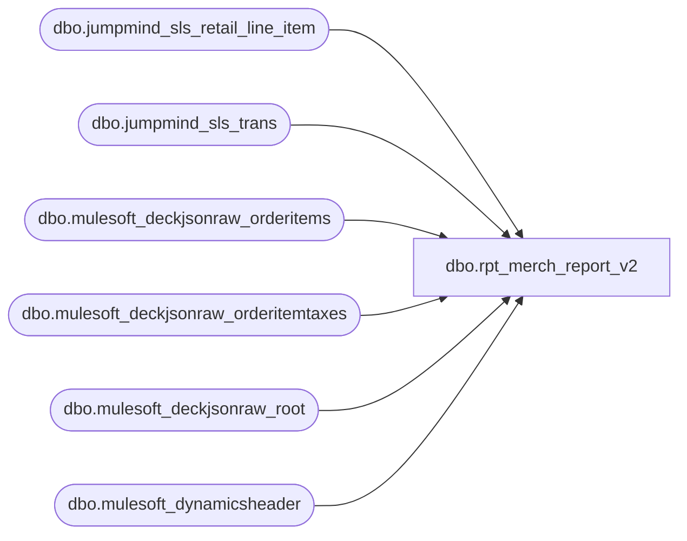

# dbo.rpt_merch_report_v2

**Database:** LH_Source  
**Server:** 4db76rlxaxcuvmuh5kw37wbnqq-ovsykae43znuhlmnflcdwm4ohu.datawarehouse.fabric.microsoft.com  

## Architecture Diagram



## Table Dependencies

| Referenced Table |
|---|
| dbo.jumpmind_sls_retail_line_item |
| dbo.jumpmind_sls_trans |
| dbo.mulesoft_deckjsonraw_orderitems |
| dbo.mulesoft_deckjsonraw_orderitemtaxes |
| dbo.mulesoft_deckjsonraw_root |
| dbo.mulesoft_dynamicsheader |

## View Code

```sql
/* =============================================================================    rpt_merch_report_v2.sql — Merch Report (BAB Requirements parallel)    =============================================================================    Domain:        Sales    Status:        Built from BAB Requirements (parallel to rpt_merch_report)    Source:        docs/reference-data/Requirement Docs/Requirements-Merch Report.xlsx     BAB Applied Filters:      - jumpmind_sls_trans.trans_status = 'COMPLETED' (POS)      - business_unit_id is not null      - SKU NOT IN (999999990, 999999995, 899999902, 999999996, 999999997, 083500)        (BBW non-merchandise placeholder SKUs)     Output fields (BAB names — 9 fields):      Store, Transaction Date, Transaction Key, Transaction ID, SKU, Units,      Unit Sale Price, Actual Sales Amount TE (Native Currency),      Actual Sales Amount TE (USD Converted)     USD-converted field uses currency conversion (placeholder — BBW currency    rate table not yet sourced; defaults to 1:1 for USD, hardcoded 1.27 for    GBP based on Q4-2025 BAB-published rate — refine when rate table lands).     VAT handling (UK / Ireland):      - POS path: JumpMind stores actual_unit_price INCLUSIVE of VAT for        GBP/EUR transactions (tax_included_in_price = 1). [Unit Sale Price]        strips VAT as (actual_unit_price - tax_amount/ABS(quantity)) so the        column is net of VAT, consistent with [Actual Sales Amount TE].      - OMS path: Deck's oi.NetPrice is already net of VAT (paired with        oi.GrossPrice incl-VAT; confirmed by orderitemtaxes.IsVAT flag).        No additional stripping needed.    ============================================================================= */  CREATE   VIEW dbo.rpt_merch_report_v2 AS WITH fx_rates AS (     /* Placeholder FX. ⚠ TODO: replace with LH_Mart.dbo.fx_rate or BBW config table */     SELECT * FROM (VALUES         ('USD', 1.00),         ('GBP', 1.27),         ('EUR', 1.08),         ('CAD', 0.73)     ) AS fx(iso_currency_code, usd_rate) ), pos_merch AS (     SELECT         store_no,         transaction_date,         transaction_key,         sku,         SUM(units)           AS units,         unit_sale_price,         SUM(actual_sales_te) AS actual_sales_te,         currency_code     FROM (         SELECT             TRY_CONVERT(int, t.business_unit_id)                              AS store_no,             CAST(t.last_update_time AS date)                                  AS transaction_date,             CONCAT(t.device_id,'-',t.business_date,'-',t.sequence_number)     AS transaction_key,             CAST(j.item_id AS varchar(64))                                    AS sku,             ABS(CAST(j.quantity AS decimal(18,2)))                            AS units,             /* Unit Sale Price net of VAT for UK/Ireland. JumpMind stores                actual_unit_price VAT-inclusive when tax_included_in_price = 1                (UK/IE retail convention). Strip per-unit VAT from line tax_amount. */             CASE                 WHEN j.iso_currency_code IN ('GBP','EUR')                      AND j.tax_included_in_price = 1                     THEN CAST(                            CAST(j.actual_unit_price AS decimal(18,4))                            - (ABS(CAST(j.tax_amount AS decimal(18,4)))                               / NULLIF(ABS(CAST(j.quantity AS decimal(18,4))), 0))                          AS decimal(18,2))                 ELSE CAST(j.actual_unit_price AS decimal(18,2))             END                                                               AS unit_sale_price,             /* TE per BBW GBP/EUR convention */             CASE                 WHEN j.iso_currency_code IN ('GBP','EUR')                     THEN (ABS(CAST(j.extended_discounted_amount AS decimal(18,2)))                           - ABS(CAST(j.tax_amount AS decimal(18,2)))) * SIGN(j.quantity)                 ELSE CAST(j.extended_discounted_amount AS decimal(18,2))             END                                                               AS actual_sales_te,             CAST(j.iso_currency_code AS varchar(8))                           AS currency_code           FROM LH_Source.dbo.jumpmind_sls_trans               t           JOIN LH_Source.dbo.jumpmind_sls_retail_line_item    j             ON t.device_id       = j.device_id            AND t.business_date   = j.business_date            AND t.sequence_number = j.sequence_number          WHERE t.trans_status = 'COMPLETED'                                    /* BAB filter — uppercase per JumpMind source */            AND t.business_unit_id IS NOT NULL                                  /* BAB filter */            AND j.item_id NOT IN ('999999990','999999995','899999902',                                   '999999996','999999997','083500')             /* BAB SKU exclusion */     ) pos_line     GROUP BY store_no, transaction_date, transaction_key, sku, unit_sale_price, currency_code ), oms_merch AS (     SELECT         store_no,         transaction_date,         transaction_key,         sku,         SUM(units)           AS units,         unit_sale_price,         SUM(actual_sales_te) AS actual_sales_te,         currency_code     FROM (         SELECT             CASE WHEN r.SiteCode = 'BAB' THEN 1013 WHEN r.SiteCode = 'BABUK' THEN 2013 ELSE 9999 END AS store_no,             CAST(COALESCE(r.OrderDateUTC, r.DateCreatedUTC) AS date)          AS transaction_date,             CAST(r.OrderID AS varchar(50))                                    AS transaction_key,             CAST(oi.StyleNumber AS varchar(64))                               AS sku,             CAST(1 AS decimal(18,2))                                          AS units,             /* Deck oi.NetPrice is already net of VAT (paired with GrossPrice incl-VAT).                Use as-is for both BAB (USD, no VAT) and BABUK (GBP, VAT already stripped). */             CAST(oi.NetPrice AS decimal(18,2))                                AS unit_sale_price,             CASE WHEN r.SiteCode = 'BABUK'                  THEN (ABS(CAST(oi.NetPrice AS decimal(18,2)))                        - ABS(CAST(ISNULL(oit.Amount,0) AS decimal(18,2))))                  ELSE CAST(oi.NetPrice AS decimal(18,2)) END                  AS actual_sales_te,             CASE WHEN r.SiteCode = 'BABUK' THEN 'GBP' ELSE 'USD' END         AS currency_code           FROM LH_Source.dbo.mulesoft_deckjsonraw_root        r           JOIN LH_Source.dbo.mulesoft_deckjsonraw_orderitems  oi             ON TRY_CONVERT(bigint, oi.OrderID) = TRY_CONVERT(bigint, r.OrderID)           /* Pre-aggregate tax to one row per orderitem.              Fix: prior version joined oi._ParentKeyField = oit._ParentKeyField — both              point at the order root, producing an N×N Cartesian fan-out (perfect-square              row counts). Correct join is oit._ParentKeyField → orderitems.ID, and a              single item may have multiple tax components (state/county/VAT), so SUM. */           LEFT JOIN (               SELECT _ParentKeyField,                      SUM(TRY_CONVERT(decimal(18,2), Amount)) AS Amount                 FROM LH_Source.dbo.mulesoft_deckjsonraw_orderitemtaxes                GROUP BY _ParentKeyField           ) oit             ON TRY_CONVERT(bigint, oi.ID) = TRY_CONVERT(bigint, oit._ParentKeyField)          WHERE oi.StyleNumber NOT IN ('999999990','999999995','899999902',                                       '999999996','999999997','083500')         /* BAB SKU exclusion */     ) oms_line     GROUP BY store_no, transaction_date, transaction_key, sku, unit_sale_price, currency_code ) SELECT     u.store_no                              AS [Store],     u.transaction_date                      AS [Transaction Date],     u.transaction_key                       AS [Transaction Key],     COALESCE(         (SELECT TOP 1 CAST(dh.RetailTransactionId AS varchar(64))            FROM LH_Source.dbo.mulesoft_dynamicsheader dh           WHERE dh.TransactionKey = u.transaction_key),         u.transaction_key     )                                       AS [Transaction ID],     u.sku                                   AS [SKU],     u.units                                 AS [Units],     u.unit_sale_price                       AS [Unit Sale Price],     u.actual_sales_te                       AS [Actual Sales Amount TE (Native Currency)],     CAST(u.actual_sales_te * fx.usd_rate AS decimal(18,4))                                             AS [Actual Sales Amount TE (USD Converted)]   FROM (SELECT * FROM pos_merch UNION ALL SELECT * FROM oms_merch) u   LEFT JOIN fx_rates fx ON fx.iso_currency_code = u.currency_code;
```

