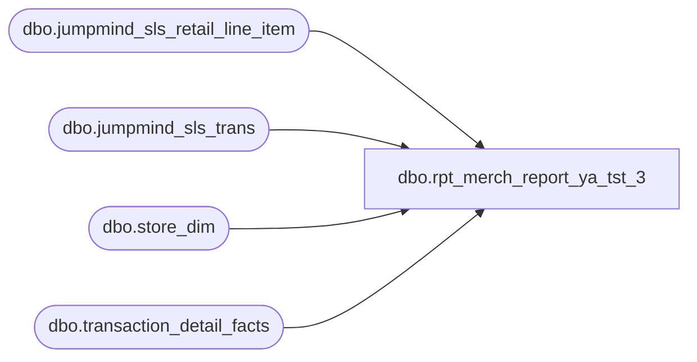

# dbo.rpt_merch_report_ya_tst_3

**Database:** LH_Source  
**Server:** 4db76rlxaxcuvmuh5kw37wbnqq-ovsykae43znuhlmnflcdwm4ohu.datawarehouse.fabric.microsoft.com  

## Architecture Diagram



## Table Dependencies

| Referenced Table |
|---|
| dbo.jumpmind_sls_retail_line_item |
| dbo.jumpmind_sls_trans |
| dbo.store_dim |
| dbo.transaction_detail_facts |

## View Code

```sql
CREATE   VIEW dbo.rpt_merch_report_ya_tst_3 AS WITH pos_merch AS (     /* R1 — In-store POS rings (registers 1–30) from JumpMind retail stream. */     SELECT         store_no,         transaction_date,         transaction_no,         register_no,         upc,         SUM(quantity_signed) AS net_sales_amount,         SUM(sold_at_price)   AS sold_at_price,         SUM(quantity_abs)    AS quantity     FROM (         SELECT             TRY_CONVERT(int, t.business_unit_id)                              AS store_no,             CAST(t.last_update_time AS date)                                  AS transaction_date,             CAST(t.sequence_number AS varchar(50))                            AS transaction_no,             TRY_CONVERT(int, SUBSTRING(t.device_id,                 CHARINDEX('-', t.device_id) + 1,                 LEN(t.device_id)))                                            AS register_no,             CAST(j.pos_item_id AS varchar(64))                                AS upc,             CAST(j.quantity AS decimal(18,2))                                 AS quantity_signed,             ABS(CAST(j.quantity AS decimal(18,2)))                            AS quantity_abs,             ABS(                 CASE                     WHEN j.iso_currency_code IN ('GBP','EUR')                          AND j.tax_included_in_price = 1                         THEN CAST(                                CAST(j.actual_unit_price AS decimal(18,4))                                - (ABS(CAST(j.tax_amount AS decimal(18,4)))                                   / NULLIF(ABS(CAST(j.quantity AS decimal(18,4))), 0))                              AS decimal(18,2))                     ELSE CAST(j.actual_unit_price AS decimal(18,2))                 END             )                                                                 AS sold_at_price           FROM LH_Source.dbo.jumpmind_sls_trans               t           JOIN LH_Source.dbo.jumpmind_sls_retail_line_item    j             ON t.device_id       = j.device_id            AND t.business_date   = j.business_date            AND t.sequence_number = j.sequence_number          WHERE t.trans_status = 'COMPLETED'                                    /* uppercase per JumpMind source */            AND t.business_unit_id IS NOT NULL            AND j.voided = 0                                                    /* drop voided ghost lines (audit-kept in JumpMind) */            AND j.item_id NOT IN ('999999990','999999995','899999902',                                   '999999996','999999997','083500')            AND TRY_CONVERT(bigint, j.pos_item_id) IS NOT NULL                  /* drop non-merchandise strings (HANDLING_USPS_FREE etc.) */            AND NOT (                 CAST(j.actual_unit_price AS decimal(18,2)) = 0                 AND TRY_CONVERT(bigint, j.pos_item_id) BETWEEN 2000000 AND 2999999            )                                                                   /* drop $0 loyalty / coupon serials (not merchandise SKUs) */     ) pos_line     GROUP BY store_no, transaction_date, transaction_no, register_no, upc ), lhm_rebook_merch AS (     /* R2 — BOPIS / ship-from-store re-booking lines posted to the fulfilling        physical store under Register_Num = 52 in the canonical accounting fact.        These are merchandise lines that leave the store's inventory because of        a web-originated order; the enterprise ledger books them at the        fulfilling store under the rebooking sentinel.         Filter predicates (each justified in the header):          - line_object_key = 4   → Aptos line-object code for Merchandise          - Register_Num    = 52  → BOPIS / ship-from-store rebooking sentinel          - store_id IS NOT NULL  → drop store_key rows with no dim membership     */     SELECT         store_no,         transaction_date,         transaction_no,         register_no,         upc,         SUM(quantity_signed) AS net_sales_amount,         SUM(sold_at_price)   AS sold_at_price,         SUM(quantity_abs)    AS quantity     FROM (         SELECT             CASE                 WHEN s.store_id < 1000 THEN s.store_id + 1000                 ELSE s.store_id             END                                                                AS store_no,             CAST(DATEADD(day, td.date_key, '1997-01-04') AS date)              AS transaction_date,             CAST(td.transaction_no AS varchar(50))                             AS transaction_no,             CAST(td.Register_Num AS int)                                       AS register_no,             CAST(td.reference_no AS varchar(64))                               AS upc,             CAST(td.units AS decimal(18,2))                                    AS quantity_signed,             ABS(CAST(td.units AS decimal(18,2)))                               AS quantity_abs,             ABS(  CAST(td.unit_gross_amount     AS decimal(18,2))                 - CAST(td.unit_disc_amount      AS decimal(18,2))                 + CAST(td.upsell_disc_allocated AS decimal(18,2)) )           AS sold_at_price  /* Aptos: ticket − real markdown only, addBack BOGO/upsell-allocated portion (matches auditworks merchandise_detail.sold_at_price) */           FROM LH_Mart.dbo.transaction_detail_facts td           JOIN LH_Mart.dbo.store_dim                s             ON s.store_key = td.store_key          WHERE td.line_object_key = 4                                          /* Aptos Merchandise line-object code */            AND td.Register_Num    = 52                                         /* BOPIS / ship-from-store rebooking sentinel */            AND s.store_id IS NOT NULL            AND td.reference_no IS NOT NULL            AND TRY_CONVERT(bigint, td.reference_no) IS NOT NULL                /* keep numeric UPC barcodes only */     ) lhm_line     GROUP BY store_no, transaction_date, transaction_no, register_no, upc ) SELECT     u.store_no             AS [Store Number],     u.transaction_date     AS [Transaction Date],     u.transaction_no       AS [Transaction Number],     u.register_no          AS [Register Number],     u.upc                  AS [UPC],     u.net_sales_amount     AS [Net Sales Amount (Native Currency)],     u.sold_at_price        AS [Sold At Price Amount (Native Currency)],     u.quantity             AS [Quantity]   FROM (         SELECT * FROM pos_merch          UNION ALL         SELECT * FROM lhm_rebook_merch        ) u  WHERE u.register_no IS NOT NULL;
```

