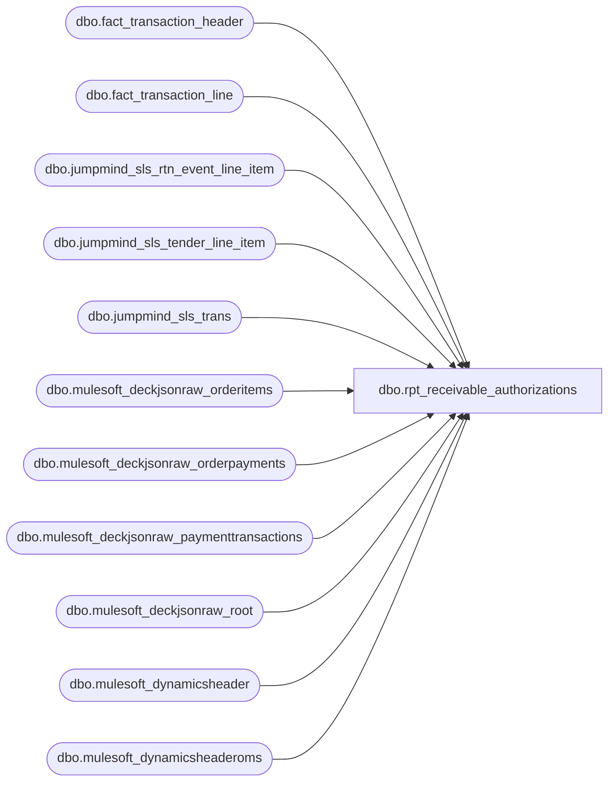

# dbo.rpt_receivable_authorizations

**Database:** LH_Source  
**Server:** 4db76rlxaxcuvmuh5kw37wbnqq-ovsykae43znuhlmnflcdwm4ohu.datawarehouse.fabric.microsoft.com  

## Architecture Diagram



## Table Dependencies

| Referenced Table |
|---|
| dbo.fact_transaction_header |
| dbo.fact_transaction_line |
| dbo.jumpmind_sls_rtn_event_line_item |
| dbo.jumpmind_sls_tender_line_item |
| dbo.jumpmind_sls_trans |
| dbo.mulesoft_deckjsonraw_orderitems |
| dbo.mulesoft_deckjsonraw_orderpayments |
| dbo.mulesoft_deckjsonraw_paymenttransactions |
| dbo.mulesoft_deckjsonraw_root |
| dbo.mulesoft_dynamicsheader |
| dbo.mulesoft_dynamicsheaderoms |

## View Code

```sql
/* =============================================================================    rpt_receivable_authorizations.sql -- Receivable Authorizations Report    =============================================================================    Domain:    Reconciliation (Receivables)    Audience:  Sales Audit, Accounts Receivable    Consumer:  Power BI dashboard "Daily Receivable Authorizations"     STATUS: Rebuilt on pure LH_Source 2026-06-17 (LH_Mart removed).            Sourced directly from DECK paymenttransactions per order, one row            per distinct Adyen settlement/refund reference (Generic1).            2026-06-26: Venue branch: store 1417 now emits as 1417 (not 417).            Transaction Id populated via mulesoft_dynamicsheader join for            all venue stores (1417, 2019, 2079, 2080, 2081, 2083).            2026-06-26: Added in-store event-invoice branch (line object 630).            EVENT_INVOICE tenders at all stores were entirely absent before;            reference = the event id carried on fact_transaction_header.     PURPOSE      Surface every authorisation against a Receivable tender so AR can      reconcile the authorised amount against the third-party receivable      statement (Klarna, Global-E, Amazon).     ELIGIBLE PAYMENT SUBTYPES      Adyen_Klarna  → line object 637 (Klarna Receivable)      Adyen_GlobalE / GlobalE → line object 638 (Global-E Receivable)      EVENT_INVOICE (in-store party/event balance) → line object 630 (BAB Charge Account)      Amazon (631) is excluded: not present in DECK paymenttransactions.     WHY DECK DIRECT (not stg_canonical_payments)      stg_canonical_payments emits ONE row per OMS order for Klarna/GlobalE      and uses MAX(Generic1) per order. Each Klarna order has two distinct      Generic1 values: one for the type-1 Authorization and one for the      type-2/10 Capture. Linda's AuditWorks includes the Capture ref, not      the Auth ref. MAX() picks the alphabetically larger of the two, which      is often the auth ref -- causing ~5,000 Capture refs to be dropped.      Sourcing from paymenttransactions directly and filtering to types      2, 3, 10, 11 (capture + refund, excluding type-1 auth) reproduces      Linda's population.     PAYMENT TRANSACTION TYPES (Klarna/GlobalE)      10 = Pending Capture   (capture initiated)      2  = Capture           (confirmed settlement; shares Generic1 with type 10)      11 = Pending Refund      3  = Refund      Types 2 and 10 always share the same Generic1 per orderpayment leg --      deduplicated by GROUP BY on (order, Generic1).      Type 1 (Authorization) has a different Generic1 and is excluded.     DATE      TransactionDateUTC → PST (Pacific Standard Time, UTC-8) for all stores.      PST matches Linda's AuditWorks date: AW date-stamps Klarna events in PST.      CST (UTC-6) was off by 1 day for ~250 settlements falling 06:00-07:59 UTC.     STORE      MIN(WarehouseCode) from mulesoft_deckjsonraw_orderitems per order,      '0' prefix → '1' prefix (e.g., 0013 → 1013).     VENUE STORES: House Charge 609      Venue (ShopInShop) stores route all in-store tenders through a house-account GL      (line_object 609). Data sourced from jumpmind_sls_tender_line_item via      LOCAL_TENDER tender_code. Stores: 1417 (FAO Schwarz), 2019, 2079, 2080, 2081,      2083 (Hamleys UK/IE). Transaction Id and Transaction Key joined from      mulesoft_dynamicsheader on (InventLocationId, RetailReceiptId).     Read-only and idempotent.    ============================================================================= */  CREATE   VIEW dbo.rpt_receivable_authorizations AS WITH klarna_settled AS (     /* One row per distinct Adyen settlement/refund reference per order.        Types 2 (Capture) and 10 (Pending Capture) share the same Generic1        and are deduplicated by the GROUP BY.  Type 1 (Authorization) has a        different Generic1 and is excluded via the type filter.        Amount signed negative for refund types (3/11). */     SELECT         djr.OrderNumber                                         AS order_no,         djr.OrderID,         CAST(pt.Generic1 AS varchar(100))                       AS reference_no,         CASE             WHEN op.PaymentSubType IN ('Adyen_GlobalE', 'GlobalE') THEN 638             ELSE 637         END                                                     AS recv_code,         MAX(             CASE WHEN pt.PaymentTransactionTypeId IN (3, 11)                  THEN -ABS(CAST(pt.Amount AS decimal(18,6)))                  ELSE  ABS(CAST(pt.Amount AS decimal(18,6)))             END         )                                                       AS auth_amount,         CAST(             MIN(CAST(pt.TransactionDateUTC AT TIME ZONE 'UTC'                      AT TIME ZONE 'Pacific Standard Time' AS datetime2(6)))         AS date)                                                AS settlement_date       FROM LH_Source.dbo.mulesoft_deckjsonraw_paymenttransactions pt       JOIN LH_Source.dbo.mulesoft_deckjsonraw_orderpayments       op            ON op.ID = pt.OrderPaymentId       JOIN LH_Source.dbo.mulesoft_deckjsonraw_root                djr            ON djr.OrderID = op._ParentKeyField      WHERE op.PaymentSubType IN ('Adyen_Klarna', 'Adyen_GlobalE', 'GlobalE')        AND pt.PaymentTransactionTypeId IN (2, 3, 10, 11)        AND pt.Generic1  IS NOT NULL AND pt.Generic1  <> ''        AND pt.Amount    IS NOT NULL AND pt.Amount    <> 0      GROUP BY djr.OrderNumber, djr.OrderID,               CAST(pt.Generic1 AS varchar(100)),               CASE WHEN op.PaymentSubType IN ('Adyen_GlobalE', 'GlobalE') THEN 638 ELSE 637 END ), warehouse_store AS (     SELECT         oi._ParentKeyField                                      AS OrderID,         MIN(             CASE WHEN oi.WarehouseCode LIKE '0%'                  THEN STUFF(oi.WarehouseCode, 1, 1, '1')                  ELSE oi.WarehouseCode             END         )                                                       AS store_code       FROM LH_Source.dbo.mulesoft_deckjsonraw_orderitems oi      WHERE oi.WarehouseCode IS NOT NULL AND oi.WarehouseCode <> ''      GROUP BY oi._ParentKeyField ), d365_oms_header AS (     SELECT CAST(RetailReceiptId AS varchar(64))          AS receipt_txt,            MAX(CAST(TransactionKey      AS varchar(80))) AS transaction_key,            MAX(CAST(RetailTransactionId AS varchar(64))) AS transaction_id       FROM LH_Source.dbo.mulesoft_dynamicsheaderoms      WHERE RetailReceiptId IS NOT NULL AND RetailReceiptId <> ''      GROUP BY CAST(RetailReceiptId AS varchar(64)) ), d365_pos_header AS (     /* POS (in-store) transaction header for venue/ShopInShop stores.        Keyed on InventLocationId (= business_unit_id) + RetailReceiptId (= sequence_number).        Used to populate Transaction Id and Transaction Key for the venue UNION branch. */     SELECT CAST(InventLocationId AS varchar(10))         AS store_id,            CAST(RetailReceiptId  AS varchar(64))         AS receipt_txt,            MAX(CAST(TransactionKey      AS varchar(80))) AS transaction_key,            MAX(CAST(RetailTransactionId AS varchar(64))) AS transaction_id       FROM LH_Source.dbo.mulesoft_dynamicsheader      WHERE InventLocationId IN ('1417','2019','2079','2080','2081','2083')        AND RetailReceiptId IS NOT NULL AND RetailReceiptId <> ''      GROUP BY CAST(InventLocationId AS varchar(10)),               CAST(RetailReceiptId  AS varchar(64)) ), d365_store_header AS (     /* In-store POS header for ALL stores, keyed on (store, receipt, date).        Receipt (sequence) numbers recur across dates, so the date is required        to disambiguate.  Used to populate Transaction Id / Key for the        event-invoice branch. */     SELECT CAST(InventLocationId AS varchar(10))         AS store_id,            CAST(RetailReceiptId  AS varchar(64))         AS receipt_txt,            CAST(TransDate        AS date)                AS trans_date,            MAX(CAST(TransactionKey      AS varchar(80))) AS transaction_key,            MAX(CAST(RetailTransactionId AS varchar(64))) AS transaction_id       FROM LH_Source.dbo.mulesoft_dynamicsheader      WHERE RetailReceiptId IS NOT NULL AND RetailReceiptId <> ''      GROUP BY CAST(InventLocationId AS varchar(10)),               CAST(RetailReceiptId  AS varchar(64)),               CAST(TransDate        AS date) ) SELECT     TRY_CONVERT(int, ws.store_code)                             AS [Store Number],     ks.settlement_date                                          AS [Transaction Date],     CAST(ks.order_no AS varchar(50))                            AS [Transaction Number],     CAST('052' AS varchar(10))                                  AS [Register Number],     CAST(h.tender_total AS decimal(18,6))                       AS [Tender Total Amount (Native Currency)],     ks.reference_no                                             AS [Reference Number],     ks.auth_amount                                              AS [Auth Amount (Native Currency)],     ks.recv_code                                                AS [Line Object Code],     CAST(dho.transaction_id  AS varchar(64))                    AS [Transaction Id],     CAST(dho.transaction_key AS varchar(80))                    AS [Transaction Key]    FROM klarna_settled ks   LEFT JOIN warehouse_store ws          ON ws.OrderID = ks.OrderID   LEFT JOIN LH_Source.dbo.fact_transaction_header h          ON CAST(h.transaction_no AS varchar(50)) = ks.order_no   LEFT JOIN d365_oms_header dho          ON dho.receipt_txt = ks.order_no  UNION ALL  /* Venue / ShopInShop stores (417 = FAO Schwarz, 2019 = Hamleys UK,    2079, 2080, 2081, 2083).  In-store tenders route through a house-account    GL (AuditWorks line_object 609) with no Adyen authorisation.  The tender    lives in jumpmind_sls_tender_line_item as tender_code = 'LOCAL_TENDER'    (tender_type_code = 'UNSUPPORTED_AUTHORIZATION').    JumpMind store IDs: FAO Schwarz = 1417 (reported as 417 by Linda),    UK/IE venues = 2019/2079/2080/2081/2083.    Date: business_date (already local -- venue stores do not apply a UTC    shift; AuditWorks uses business_date verbatim for these stores).    Reference: NULL (house-account tenders carry no external payment ref).    Added 2026-06-24 after Ben Barud confirmed data presence in    jumpmind_sls_trans. */ SELECT     TRY_CONVERT(int, t.business_unit_id)                        AS [Store Number],     /* Use DATEADD(MILLISECOND, local_offset, begin_time) to get the true local date.        JumpMind's business_date sometimes reflects the prior day when a terminal fails        to roll over at midnight (observed at stores 2079, 2080).  local_offset is in        milliseconds: -18000000 = EST (UTC-5), 0 = GMT, 3600000 = BST (UTC+1). */     CAST(DATEADD(MILLISECOND, t.local_offset, t.begin_time) AS date)                                                                 AS [Transaction Date],     CAST(t.sequence_number AS varchar(50))                      AS [Transaction Number],     TRY_CONVERT(int, RIGHT(t.device_id, 3))                     AS [Register Number],     SUM(CAST(tl.tender_amount AS decimal(18,6)))                AS [Tender Total Amount (Native Currency)],     CAST(NULL AS varchar(100))                                  AS [Reference Number],     SUM(CAST(tl.tender_amount AS decimal(18,6)))                AS [Auth Amount (Native Currency)],     609                                                         AS [Line Object Code],     CAST(dph.transaction_id AS varchar(64))                     AS [Transaction Id],     CAST(dph.transaction_key AS varchar(80))                    AS [Transaction Key]   FROM LH_Source.dbo.jumpmind_sls_trans t   JOIN LH_Source.dbo.jumpmind_sls_tender_line_item tl        ON tl.device_id       = t.device_id       AND tl.business_date   = t.business_date       AND tl.sequence_number = t.sequence_number   LEFT JOIN d365_pos_header dph          ON dph.store_id    = t.business_unit_id         AND dph.receipt_txt = CAST(t.sequence_number AS varchar(64))  WHERE t.business_unit_id IN ('1417','2019','2079','2080','2081','2083')    AND tl.tender_code = 'LOCAL_TENDER'    AND ISNULL(tl.post_void, 0) = 0    AND ISNULL(tl.voided,    0) = 0  GROUP BY     t.business_unit_id,     t.sequence_number,     t.device_id,     t.local_offset,     t.begin_time,     dph.transaction_id,     dph.transaction_key  UNION ALL  /* In-store event / party invoice receivables (AuditWorks line_object 630,    "BAB Charge Account").    When a guest pays a party / event balance in store, the POS records an    EVENT_INVOICE tender.  AuditWorks books it against receivable line_object    630 with reference_no = the event id, and Linda's Receivable Authorizations    report includes line_object 630.  Our AuditWorks-equivalent pipeline codes    the same tender as line_object 690 on fact_transaction_line and carries the    event id on fact_transaction_header.event_id; this branch surfaces those    rows under 630 so the report matches Linda.  Reference may be NULL for    events with no id.  Amount = SUM(gross_line_amount * db_cr_none *    voiding_reversal_flag), the same expression Linda's SmartLook SQL uses.    Added 2026-06-26 after Kai Cheng flagged missing in-store receivables for    2026-04-19 to 2026-05-02 (stores 1106, 1109, 1089, 1039 and 16 others).     VOID SUPPRESSION (added 2026-06-29):    When the Corporate Sales team voids an EVENT_INVOICE sale and re-issues    a corrected invoice, JumpMind records a separate RETURN transaction that    carries no event_id -- it does NOT flip transaction_void_flag on the    original SALE row. The ETL therefore lands the original in    fact_transaction_header with void_flag = 0, causing it to appear in this    view alongside the replacement. The net effect is the original invoice    amount is double-counted (e.g. Store 1417 Event 10658 on 2026-04-28: the    voided $4,350 sale and the replacement $3,975 sale both appear; SA only    records the replacement).    Fix: suppress any EVENT_INVOICE transaction for which a receipted return    exists in jumpmind_sls_rtn_event_line_item pointing back to it.    The match uses the device_id extracted from fact_transaction_header    .transaction_id (format: '<device_id>|<yyyymmdd>|<seq>'), the business_date    cast to int (20260428), and the sequence_number = transaction_no. */ SELECT     TRY_CONVERT(int, h.store_no)                                AS [Store Number],     CAST(h.transaction_date AS date)                            AS [Transaction Date],     CAST(h.transaction_no AS varchar(50))                       AS [Transaction Number],     CAST(TRY_CONVERT(int, h.register_no) AS varchar(10))        AS [Register Number],     CAST(h.tender_total AS decimal(18,6))                       AS [Tender Total Amount (Native Currency)],     CAST(h.event_id AS varchar(100))                            AS [Reference Number],     SUM(CAST(l.gross_line_amount AS decimal(18,6))         * l.db_cr_none * l.voiding_reversal_flag)               AS [Auth Amount (Native Currency)],     630                                                         AS [Line Object Code],     CAST(deh.transaction_id  AS varchar(64))                    AS [Transaction Id],     CAST(deh.transaction_key AS varchar(80))                    AS [Transaction Key]   FROM LH_Source.dbo.fact_transaction_header h   JOIN LH_Source.dbo.fact_transaction_line  l        ON l.transaction_id = h.transaction_id       AND l.line_object = 690   LEFT JOIN d365_store_header deh          ON deh.store_id    = h.store_no         AND deh.receipt_txt = CAST(h.transaction_no AS varchar(64))         AND deh.trans_date  = CAST(h.transaction_date AS date)  WHERE ISNULL(h.transaction_void_flag, 0) = 0    AND ISNULL(l.line_void_flag, 0) = 0    -- Suppress voided originals: exclude any transaction for which a    -- receipted return in rtn_event_line_item points back to it.    AND NOT EXISTS (        SELECT 1          FROM LH_Source.dbo.jumpmind_sls_rtn_event_line_item rel         WHERE rel.voided              = 0           AND rel.orig_device_id      = SUBSTRING(h.transaction_id, 1,                                             CHARINDEX('|', h.transaction_id) - 1)           AND rel.orig_business_date  = CONVERT(int, CONVERT(varchar(8), h.transaction_date, 112))           AND rel.orig_sequence_number = CAST(h.transaction_no AS int)    )  GROUP BY     h.store_no,     h.transaction_date,     h.transaction_no,     h.register_no,     h.tender_total,     h.event_id,     deh.transaction_id,     deh.transaction_key  UNION ALL  /* Global-E international e-commerce receivables (AuditWorks line_object 638).    Global-E orders routed through the OMS/JumpMind pipeline (store 1013, reg 052)    are not present in DECK (mulesoft_deckjsonraw_orderpayments has no    Adyen_GlobalE rows for this store). The AuditWorks-equivalent ETL codes these    tenders as line_object 638 on fact_transaction_line. This branch surfaces them    under LO 638 to match Linda's report.    Reference_no is blank in JumpMind; AuditWorks stores a placeholder -1    for blank references. We emit '-1' to match AuditWorks presentation.    Changed from NULL to '-1' on 2026-07-02 (was emitting NULL, causing 50    Linda-only / P-only mismatches in the harness).    Added 2026-06-29. */ SELECT     TRY_CONVERT(int, h.store_no)                                AS [Store Number],     CAST(h.transaction_date AS date)                            AS [Transaction Date],     CAST(h.transaction_no AS varchar(50))                       AS [Transaction Number],     CAST(TRY_CONVERT(int, h.register_no) AS varchar(10))        AS [Register Number],     CAST(h.tender_total AS decimal(18,6))                       AS [Tender Total Amount (Native Currency)],     CAST('-1' AS varchar(100))                                  AS [Reference Number],     SUM(CAST(l.gross_line_amount AS decimal(18,6))         * l.db_cr_none * l.voiding_reversal_flag)               AS [Auth Amount (Native Currency)],     638                                                         AS [Line Object Code],     CAST(deh.transaction_id  AS varchar(64))                    AS [Transaction Id],     CAST(deh.transaction_key AS varchar(80))                    AS [Transaction Key]   FROM LH_Source.dbo.fact_transaction_header h   JOIN LH_Source.dbo.fact_transaction_line  l        ON l.transaction_id = h.transaction_id       AND l.line_object = 638   LEFT JOIN d365_store_header deh          ON deh.store_id    = h.store_no         AND deh.receipt_txt = CAST(h.transaction_no AS varchar(64))         AND deh.trans_date  = CAST(h.transaction_date AS date)  WHERE ISNULL(h.transaction_void_flag, 0) = 0    AND ISNULL(l.line_void_flag, 0) = 0  GROUP BY     h.store_no,     h.transaction_date,     h.transaction_no,     h.register_no,     h.tender_total,     h.event_id,     deh.transaction_id,     deh.transaction_key;
```

