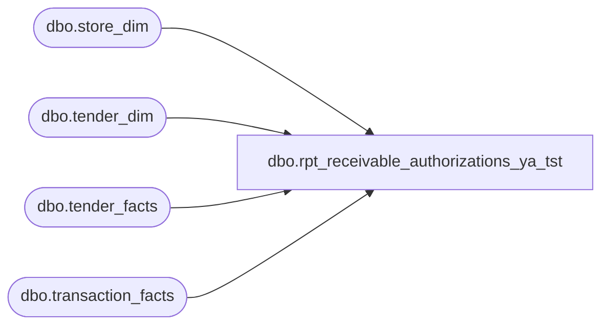

# dbo.rpt_receivable_authorizations_ya_tst

**Database:** LH_Source  
**Server:** 4db76rlxaxcuvmuh5kw37wbnqq-ovsykae43znuhlmnflcdwm4ohu.datawarehouse.fabric.microsoft.com  

## Architecture Diagram



## Table Dependencies

| Referenced Table |
|---|
| dbo.store_dim |
| dbo.tender_dim |
| dbo.tender_facts |
| dbo.transaction_facts |

## View Code

```sql
CREATE   VIEW dbo.rpt_receivable_authorizations_ya_tst AS SELECT     CASE WHEN s.store_id < 1000 THEN s.store_id + 1000 ELSE s.store_id END         AS [Store Number],     CAST(DATEADD(day, m.date_key, '1997-01-04') AS date)  AS [Transaction Date],     CAST(m.transaction_no AS varchar(50))                 AS [Transaction Number],     CAST(m.register_no    AS varchar(10))                 AS [Register Number],     m.receipt_total_amount                                AS [Tender Total Amount (Native Currency)],     CAST(NULL AS varchar(80))                             AS [Reference Number],     SUM(tf.tender_amt)                                    AS [Auth Amount (Native Currency)],     TRY_CONVERT(int, td.tender_code)                      AS [Line Object Code]   FROM LH_Mart.dbo.transaction_facts m   JOIN LH_Mart.dbo.store_dim    s  ON s.store_key  = m.store_key   JOIN LH_Mart.dbo.tender_facts tf ON tf.transaction_id = m.transaction_id   JOIN LH_Mart.dbo.tender_dim   td ON td.tender_key = tf.tender_key  WHERE TRY_CONVERT(int, td.tender_code) IN        (609,630,631,634,635,636,637,638)              -- R1    AND TRY_CONVERT(int, m.register_no) IS NOT NULL    AND TRY_CONVERT(int, m.register_no) < 100          -- R2  GROUP BY s.store_id,           m.date_key, m.transaction_no, m.register_no, m.receipt_total_amount,           td.tender_code;
```

