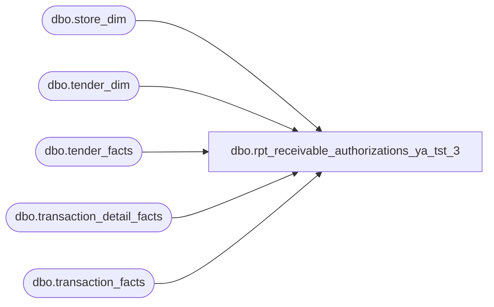

# dbo.rpt_receivable_authorizations_ya_tst_3

**Database:** LH_Source  
**Server:** 4db76rlxaxcuvmuh5kw37wbnqq-ovsykae43znuhlmnflcdwm4ohu.datawarehouse.fabric.microsoft.com  

## Architecture Diagram



## Table Dependencies

| Referenced Table |
|---|
| dbo.store_dim |
| dbo.tender_dim |
| dbo.tender_facts |
| dbo.transaction_detail_facts |
| dbo.transaction_facts |

## View Code

```sql
CREATE   VIEW dbo.rpt_receivable_authorizations_ya_tst_3 AS WITH txn_gross_receipt AS (     SELECT tf.transaction_id,            SUM(CASE WHEN TRY_CONVERT(int, td.tender_code) = -1 THEN 0                     ELSE tf.tender_amt END) AS non_tax_tender_sum       FROM LH_Mart.dbo.tender_facts tf       JOIN LH_Mart.dbo.tender_dim   td ON td.tender_key = tf.tender_key      GROUP BY tf.transaction_id ), /* Per-installment row multiplier — see PER-LEG ROW MULTIPLIER block in    header. One row per (transaction_id, leg_no) where leg_no enumerates    the matching transaction_detail_facts rows under    (line_object_key=221, line_action_key=12). Used to fan out the    tender_facts grain into Linda's per-leg grain on the    Klarna / Global-E installment-refund cohort while preserving Auth    Amount sum fidelity via the tender_amt / leg_count distribution. */ receivable_leg_multiplier AS (     SELECT         d.transaction_id,         ROW_NUMBER() OVER (             PARTITION BY d.transaction_id             ORDER BY d.transaction_line_seq         )                                                 AS leg_no,         COUNT(*) OVER (PARTITION BY d.transaction_id)     AS leg_count       FROM LH_Mart.dbo.transaction_detail_facts d      WHERE d.line_object_key = 221    -- LO 296 'Customer Service'        AND d.line_action_key = 12     -- refunded ) SELECT     CASE WHEN s.store_id < 1000 THEN s.store_id + 1000 ELSE s.store_id END         AS [Store Number],     CAST(DATEADD(day, m.date_key, '1997-01-04') AS date)  AS [Transaction Date],     CAST(m.transaction_no AS varchar(50))                 AS [Transaction Number],     CAST(m.register_no    AS varchar(10))                 AS [Register Number],     CAST(CASE             WHEN ISNULL(g.non_tax_tender_sum, 0) = 0                THEN m.receipt_total_amount - ISNULL(m.redemption_amount, 0)             ELSE g.non_tax_tender_sum - 2 * ISNULL(m.redemption_amount, 0)          END AS decimal(18,6))                            AS [Tender Total Amount (Native Currency)],     CAST(NULL AS varchar(80))                             AS [Reference Number], -- see REFERENCE NUMBER COLUMN block in header     CAST(tf.tender_amt          / NULLIF(ISNULL(rlm.leg_count, 1), 0)          AS decimal(18,6))                                AS [Auth Amount (Native Currency)],     TRY_CONVERT(int, td.tender_code)                      AS [Line Object Code]   FROM LH_Mart.dbo.transaction_facts m   JOIN LH_Mart.dbo.store_dim    s  ON s.store_key  = m.store_key   JOIN LH_Mart.dbo.tender_facts tf ON tf.transaction_id = m.transaction_id   JOIN LH_Mart.dbo.tender_dim   td ON td.tender_key = tf.tender_key   LEFT JOIN txn_gross_receipt   g  ON g.transaction_id = m.transaction_id   /* Fan-out: only Klarna (637) and Global-E (638) installment refunds      have matching (296, 12) detail rows in Q1 2026 (see header), so      the LEFT JOIN multiplies rows only on that cohort. House Charge      (609) / BAB Charge (630) etc. fall through to a single emitted      row carrying the full tf.tender_amt as Auth Amount. */   LEFT JOIN receivable_leg_multiplier rlm          ON rlm.transaction_id = m.transaction_id         AND TRY_CONVERT(int, td.tender_code) IN (637, 638)  WHERE TRY_CONVERT(int, td.tender_code) IN (609,630,631,634,635,636,637,638)    AND TRY_CONVERT(int, m.register_no) IS NOT NULL    AND TRY_CONVERT(int, m.register_no) < 100;
```

